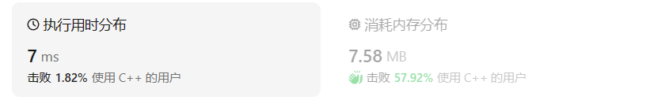
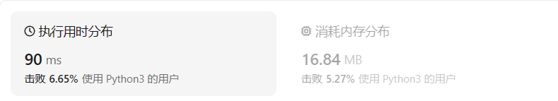

# 59螺旋矩阵II

## 题目描述

给你一个正整数 `n` ，生成一个包含 `1` 到 `n2` 所有元素，且元素按顺时针顺序螺旋排列的 `n x n` 正方形矩阵 `matrix` 。

 

**示例 1：**


```
输入：n = 3
输出：[[1,2,3],[8,9,4],[7,6,5]]
```

**示例 2：**

```
输入：n = 1
输出：[[1]]
```

 

**提示：**

- `1 <= n <= 20`

## 我的C++解法

```cpp
class Solution {
public:
    bool insert(int val,int& position_1,int& position_2,int n,int& op,vector<vector<int>>& visited,vector<vector<int>>& result){
        result[position_1][position_2]=val;
        cout<<"result["<<position_1<<"]["<<position_2<<"]="<<val<<endl;
        visited[position_1][position_2]=1;
        cout<<"visited["<<position_1<<"]["<<position_2<<"]="<<visited[position_1][position_2]<<endl;
        //OP:0右 1下 2左 3上
        if(n==1) return true;
        flag:
        if(op==0 && position_2<n-1 && visited[position_1][position_2+1]==0){//向右移动的逻辑
        //位置2没有顶头且当前元素的下一个元素未被访问
            position_2++;
            op=0;
            cout<<"向右移动，目标坐标为："<<position_1<<" "<<position_2<<endl;
            return true;
        }
        op=1;
        if(op==1 && position_1<n-1 && visited[position_1+1][position_2]==0){
            //向下移动
            position_1++;
            op=1;
            cout<<"向下移动，目标坐标为："<<position_1<<" "<<position_2<<endl;
            return true;
        }
        op=2;
        if(position_2>0 && visited[position_1][position_2-1]==0){
            position_2--;
            op=2;
            cout<<"向左移动，目标坐标为："<<position_1<<" "<<position_2<<endl;
            return true;
        }
        op=3;
        if(position_1>0 && visited[position_1-1][position_2]==0){
            position_1--;
            op=3;
            cout<<"向上移动，目标坐标为："<<position_1<<" "<<position_2<<endl;
            return true;
        }
        op=0;
        goto flag;
        return false;
    }
    
    vector<vector<int>> generateMatrix(int n) {
        //问题的关键就是矩阵的下标的计算 从数学角度入手
        vector<vector<int>> result(n,vector<int>(n,0));//初始化二维容器，值全为0
        //关键在于对下一个元素箭头的移动 优先级：右下左上 需要visited数组的辅助
        vector<vector<int>> visited=result;
        int position_1=0;
        int position_2=0;//初始位置0，0
        int op=0;//0右 1下 2左 3上
        for(int i=1;i<=n*n;i++){
            insert(i,position_1,position_2,n,op,visited,result);
        }
        return result;
    }
};
```

不得不说写的一坨屎，连n=3都能超时。

第一次写是没有op，也没goto，得出来的结果在n>=4时就不行了。因为最下层写完，下一个向上，再下一个是向右而不是继续向上了，因此我才考虑使用op来辅助记忆，但是超时了。

修改后也是做出来了：

```C++
class Solution {
public:
    bool insert(int val,int& position_1,int& position_2,int n,int& op,vector<vector<int>>& visited,vector<vector<int>>& result){
        result[position_1][position_2]=val;
        //cout<<"result["<<position_1<<"]["<<position_2<<"]="<<val<<endl;
        visited[position_1][position_2]=1;
        //cout<<"visited["<<position_1<<"]["<<position_2<<"]="<<visited[position_1][position_2]<<endl;
        //OP:0右 1下 2左 3上
        if(n==1) return true;
        if(op==0 && position_2<n-1 && visited[position_1][position_2+1]==0){//向右移动的逻辑
        //位置2没有顶头且当前元素的下一个元素未被访问
            position_2++;
            op=0;
            //cout<<"向右移动，目标坐标为："<<position_1<<" "<<position_2<<endl;
            return true;
        }
        op=1;
        if(op==1 && position_1<n-1 && visited[position_1+1][position_2]==0){
            //向下移动
            position_1++;
            op=1;
            //cout<<"向下移动，目标坐标为："<<position_1<<" "<<position_2<<endl;
            return true;
        }
        op=2;
        if(position_2>0 && visited[position_1][position_2-1]==0){
            position_2--;
            op=2;
            //cout<<"向左移动，目标坐标为："<<position_1<<" "<<position_2<<endl;
            return true;
        }
        op=3;
        if(position_1>0 && visited[position_1-1][position_2]==0){
            position_1--;
            op=3;
            //cout<<"向上移动，目标坐标为："<<position_1<<" "<<position_2<<endl;
            return true;
        }
        op=0;
        return false;
    }

    vector<vector<int>> generateMatrix(int n) {
        //问题的关键就是矩阵的下标的计算 从数学角度入手
        vector<vector<int>> result(n,vector<int>(n,0));//初始化二维容器，值全为0
        //关键在于对下一个元素箭头的移动 优先级：右下左上 需要visited数组的辅助
        vector<vector<int>> visited=result;
        int position_1=0;
        int position_2=0;//初始位置0，0
        int op=0;//0右 1下 2左 3上
        for(int i=1;i<=n*n;i++){
            if(!insert(i,position_1,position_2,n,op,visited,result) && result[position_1][position_2]==i){
                if(result[position_1][position_2]==n*n) return result;
                i--;
            }
        }
        return result;
    }
};
```

结果：

时间复杂度很高，但是也是a出来了中等题。这是一种思路：存储上一步的操作方式，下一步尝试沿用上一步的操作；初始优先级：右下左上

## C++参考答案

整体原则：循环不变量原则

模拟顺时针画矩阵的过程:

- 填充上行从左到右
- 填充右列从上到下
- 填充下行从右到左
- 填充左列从下到上

由外向内一圈一圈这么画下去。

这里一圈下来，我们要画每四条边，这四条边怎么画，每画一条边都要坚持一致的左闭右开，或者左开右闭的原则，这样这一圈才能按照统一的规则画下来。

按照左闭右开的原则：

这里每一种颜色，代表一条边，我们遍历的长度，可以看出每一个拐角处的处理规则，拐角处让给新的一条边来继续画。

这也是坚持了每条边左闭右开的原则。因此，对于每一条边，都要保证同样的访问方式，这样才不会乱。

```cpp
class Solution {
public:
    vector<vector<int>> generateMatrix(int n) {
        vector<vector<int>> res(n, vector<int>(n, 0)); // 使用vector定义一个二维数组
        int startx = 0, starty = 0; // 定义每循环一个圈的起始位置
        int loop = n / 2; // 每个圈循环几次，例如n为奇数3，那么loop = 1 只是循环一圈，矩阵中间的值需要单独处理
        int mid = n / 2; // 矩阵中间的位置，例如：n为3， 中间的位置就是(1，1)，n为5，中间位置为(2, 2)
        int count = 1; // 用来给矩阵中每一个空格赋值
        int offset = 1; // 需要控制每一条边遍历的长度，每次循环右边界收缩一位
        int i,j;
        while (loop --) {
            i = startx;
            j = starty;

            // 下面开始的四个for就是模拟转了一圈
            // 模拟填充上行从左到右(左闭右开)
            for (j; j < n - offset; j++) {
                res[i][j] = count++;
            }
            // 模拟填充右列从上到下(左闭右开)
            for (i; i < n - offset; i++) {
                res[i][j] = count++;
            }
            // 模拟填充下行从右到左(左闭右开)
            for (; j > starty; j--) {
                res[i][j] = count++;
            }
            // 模拟填充左列从下到上(左闭右开)
            for (; i > startx; i--) {
                res[i][j] = count++;
            }

            // 第二圈开始的时候，起始位置要各自加1， 例如：第一圈起始位置是(0, 0)，第二圈起始位置是(1, 1)
            startx++;
            starty++;

            // offset 控制每一圈里每一条边遍历的长度
            offset += 1;
        }

        // 如果n为奇数的话，需要单独给矩阵最中间的位置赋值
        if (n % 2) {
            res[mid][mid] = count;
        }
        return res;
    }
};
```

这个答案思路很清晰，从外到内逐层循环。

其他解法：

```cpp
class Solution {
public:
    vector<vector<int>> generateMatrix(int n) {
        int t = 0;      // top
        int b = n-1;    // bottom
        int l = 0;      // left
        int r = n-1;    // right
        vector<vector<int>> ans(n,vector<int>(n));
        int k=1;
        while(k<=n*n){
            for(int i=l;i<=r;++i,++k) ans[t][i] = k;
            ++t;
            for(int i=t;i<=b;++i,++k) ans[i][r] = k;
            --r;
            for(int i=r;i>=l;--i,++k) ans[b][i] = k;
            --b;
            for(int i=b;i>=t;--i,++k) ans[i][l] = k;
            ++l;
        }
        return ans;
    }
};
```

这个答案也很清晰，从外到内。

由此可见问题的关键在于每一条边，一定要选定一个基准。要左闭右开就都要左闭右开。

第三种解法：结束右下左上的顺序循环（我也是有这个思路但是不会实现）

```cpp
class Solution {
public:
    vector<vector<int>> generateMatrix(int n) {
        int maxNum = n * n;
        int curNum = 1;
        vector<vector<int>> matrix(n, vector<int>(n));
        int row = 0, column = 0;
        vector<vector<int>> directions = {{0, 1}, {1, 0}, {0, -1}, {-1, 0}};  // 右下左上
        int directionIndex = 0;
        while (curNum <= maxNum) {
            matrix[row][column] = curNum;
            curNum++;
            int nextRow = row + directions[directionIndex][0], nextColumn = column + directions[directionIndex][1];
            if (nextRow < 0 || nextRow >= n || nextColumn < 0 || nextColumn >= n || matrix[nextRow][nextColumn] != 0) {
                directionIndex = (directionIndex + 1) % 4;  // 顺时针旋转至下一个方向
            }
            row = row + directions[directionIndex][0];
            column = column + directions[directionIndex][1];
        }
        return matrix;
    }
};
```

这个解法里面的判断语句就是我的提升点

## C++收获

### 用vector定义多维数组

`vector<vector<int>>result(n,vector<int>(n,0))`生成n*n的二维数组矩阵，初始元素均置为0

vector中的`size`函数用于查询动态数组vector中有多少个有效数据（大范围的）；而`capacity`函数用于查询它的容量大小（最多可以存放多少数据）

例如，`result.size()`返回的结果是n，代表result中有多少行；`result[0].size()`返回的结果是n，代表列数

二维数组添加一行：`vector<int> in_row(n,2)`先初始化一个数组，包含n个元素且全为2，`result.insert(result.begin()+2,in_row);`在第二行和第三行中间插入一行元素全为2.

二维数组添加一列：`for(int i=0;i<result.size();i++){result[i].insert(result.begin()+2,9);}`实现在第二列和第三列之间插入一列全为9的元素。

二维数组删除一行：`result.erase(result.begin()+2,result.begin()+3);`用于删除第三行元素（0，1，2->被删除）

二维数组删除一列：`for (int i =0; i<result.size() ; i++){result[i].erase(a[i].begin()+2,a[i].begin()+3);}`用于删除第三列元素。

### 多维数组问题一定要搞清边界的判断

### 常见报错

`heap-buffer-overflow on address`报错是由于边界的设置有误，访问数组时发生了越界错误

` runtime error: reference binding to misaligned address`报错原因是数组越界，需要加入判断数组是否为空或者堆栈是否为空的语句。例如当二维数组为空，而访问`matrix[0].size()`就会这样报错

### goto语句

设置标签值和冒号，goto选择标签。

例如：

```cpp
cout<<c;
flag:
cout<<a;
cout<<b;
goto flag;
```

goto语句慎用。良好的goto语句可以用于从深层的嵌套循环中跳出程序。

## 我的python解答

```python
class Solution:
    def generateMatrix(self, n: int) -> List[List[int]]:
        #存储顺序：一直右，右不通了一直下，下不通了一直左；左不通了一直上，上不通了一直右。如此循环
        operation_list=['right']*(n**2)
        print(operation_list)
        result = list(map(lambda _: [0]*n, range(n)))
        result[0][0]=1
        po1=0
        po2=0
        if n==1: return result
        boundry_po1_right=n
        boundry_po2_right=n
        boundry_po1_left=0
        boundry_po2_left=0
        for i in range(1,n**2):
            val=i+1
            # if operation_list[i-1]=='right':
            #     try:
            #         check_boundry(po2+1,boundry_po2_left,boundry_po2_right)
            #     except:
            #         po1+=1
            #         boundry_po2_right-=1
            #         operation_list[i]='down'
            #     else:
            #         po2+=1
            #         operation_list[i]='right'     
            if operation_list[i-1]=='right':
                if boundry_po2_left<=po2+1<boundry_po2_right:#可以右走
                    po2+=1
                    operation_list[i]='right'                 
                else:#往下
                    po1+=1
                    boundry_po1_left+=1
                    operation_list[i]='down'
            
            if operation_list[i-1]=='down':
                if boundry_po1_left<=po1+1<boundry_po1_right:
                    po1+=1
                    operation_list[i]='down'                 
                else:
                    po2-=1
                    boundry_po2_right-=1
                    operation_list[i]='left'                

            if operation_list[i-1]=='left':
                if boundry_po2_left<=po2-1<boundry_po2_right:
                    po2-=1
                    operation_list[i]='left'                 
                else:
                    po1-=1
                    boundry_po1_right-=1
                    operation_list[i]='up'

            if operation_list[i-1]=='up':
                if boundry_po1_left<=po1-1<boundry_po1_right:
                    po1-=1
                    operation_list[i]='up'                 
                else:
                    po2+=1
                    boundry_po2_left+=1
                    operation_list[i]='right'
            result[po1][po2]=val
            print(result)
            print(operation_list)
        return result
```

这个答案修修改改花了一个多小时，也是勉勉强强弄出来了。在创建result的时候被坑了一把，用的语句是`result=[[0]*n]*n`，最后修改一个元素其他行也会同样变化。其次是不知道try和except的用法，声明了一个函数来判断是否越界也被一直报错说没有定义。到目前为止我也只能做这么多了，看看答案有没有什么妙解。

结果：

## python参考答案

```python
class Solution:
    def generateMatrix(self, n: int) -> [[int]]:
        l, r, t, b = 0, n - 1, 0, n - 1
        mat = [[0 for _ in range(n)] for _ in range(n)]
        num, tar = 1, n * n
        while num <= tar:
            for i in range(l, r + 1): # left to right
                mat[t][i] = num
                num += 1
            t += 1
            for i in range(t, b + 1): # top to bottom
                mat[i][r] = num
                num += 1
            r -= 1
            for i in range(r, l - 1, -1): # right to left
                mat[b][i] = num
                num += 1
            b -= 1
            for i in range(b, t - 1, -1): # bottom to top
                mat[i][l] = num
                num += 1
            l += 1
        return mat
```

其实我们的思路都是一致的，但是我借助了辅助数组来存储上一步的操作方式，并借助操作访问来作为判断条件之一来决策本次操作方式。

这个答案则是直接把边界存储到单一变量中，无需记录相应操作序列，只需要按照上右下左的顺序逐个填充边界即可。外层while循环，内层多个for循环对应不同的边界，这个想法值得学习。

## python收获

### py初始化二维数组

`result=[[]*n]*m`得到一个m行n列的二维数组。比如创建`result=[[0]*4]*4`实际上创建了一个包含4个对同一个列表引用的列表。这意味着当你修改 `result[0][0]` 的值时，所有其他行的第一个元素也会被修改，因为它们都是同一个对象的引用。这就是为什么你不会得到预期的结果 `[[2, 0, 0, 0], [0, 0, 0, 0], [0, 0, 0, 0], [0, 0, 0, 0]]`。

对二维数组的修改和访问直接调用下标即可。

初始化真正独立的二维数组的方式：

方法一：使用列表推导式和map：

`result=list(map(lambda _: [0]*n,range(n)))`这里的map函数把一个匿名函数`lambda _:[0]*n`应用到`range(n)`生成的序列上，创建了四个独立的列表。

方法二：使用两层循环

```python
result=[]
for _ in range(n):
    result.append([0]*n)
```

参考答案生成的result二维数组实际上是使用双层for：`result=[[0 for _ in range(n)] for _ in range(n)]`先生成内层列表，再生成外层

### try和except

在Python中，`try` 和 `except` 是异常处理的关键组成部分，它们允许程序在遇到错误时以更可控的方式响应，而不是直接崩溃。异常处理是一种结构化的方法，用于捕获程序执行中出现的异常（错误）。

#### try 语句

`try` 语句使程序员能够标记一个代码块，在该代码块中，可能会发生异常。`try` 块让你可以测试代码以查找错误，而不会立即让程序崩溃。

#### except 语句

`except` 语句用于捕获 `try` 块中发生的异常。你可以为 `except` 指定一个或多个异常类型，以确定应该处理哪些类型的异常。

#### 基本用法

```python
try:
    # 尝试执行的代码
    pass
except ExceptionType:
    # 当特定类型的异常发生时执行的代码
    pass
```

#### 详细解释

1. **try 块**：`try` 关键字后面跟着一个代码块，这个代码块包含了可能会引发异常的代码。

2. **except 块**：如果 `try` 块中的代码抛出了一个异常，程序的执行将立即跳转到 `except` 块。`except` 块可以捕获并处理特定的异常类型。

3. **异常类型**：在 `except` 后面，你可以指定一个异常类型，以捕获特定类型的异常。你也可以捕获所有类型的异常，使用 `except Exception`（其中 `Exception` 是所有非系统退出类异常的基类）。

4. **多个 except 块**：你可以有多个 `except` 块来处理不同类型的异常。

5. **finally 块**：`finally` 块用于执行无论是否发生异常都要执行的代码，比如清理资源。

6. **else 块**：`else` 块用于当 `try` 块中没有异常发生时执行的代码。

#### 示例

```python
try:
    # 尝试读取文件
    with open('file.txt', 'r') as f:
        data = f.read()
except FileNotFoundError:
    # 如果文件不存在，打印错误信息
    print("文件未找到。")
except Exception as e:
    # 捕获其他类型的异常
    print(f"发生了一个错误：{e}")
else:
    # 如果没有异常发生，处理数据
    print("文件读取成功，数据为：", data)
finally:
    # 无论是否发生异常，都会执行
    print("这是 finally 块。")
```

在这个例子中，如果 `file.txt` 文件不存在，将引发 `FileNotFoundError` 并被第一个 `except` 块捕获。如果发生了其他类型的异常，它将被第二个 `except` 块捕获。无论是否发生异常，`finally` 块中的代码都将执行。

通过使用 `try` 和 `except`，你可以创建更加健壮和用户友好的程序，因为它允许你优雅地处理错误情况。