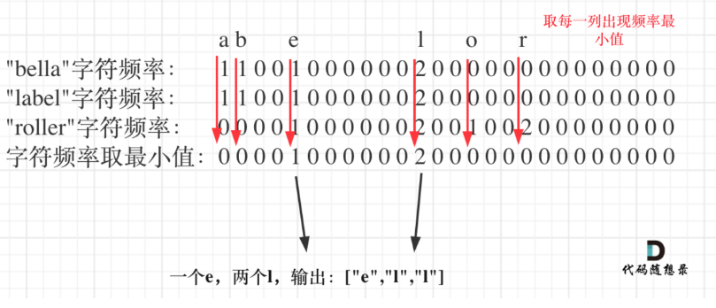
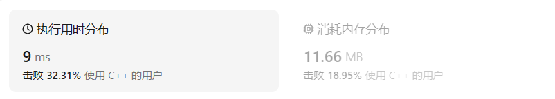
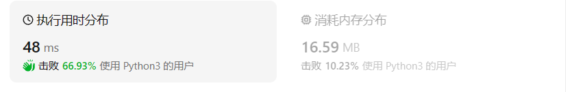

# 1002.查找共用字符

## 题目描述

给你一个字符串数组 `words` ，请你找出所有在 `words` 的每个字符串中都出现的共用字符（ **包括重复字符**），并以数组形式返回。你可以按 **任意顺序** 返回答案。

 

**示例 1：**

```
输入：words = ["bella","label","roller"]
输出：["e","l","l"]
```

**示例 2：**

```
输入：words = ["cool","lock","cook"]
输出：["c","o"]
```

 

**提示：**

- `1 <= words.length <= 100`
- `1 <= words[i].length <= 100`
- `words[i]` 由小写英文字母组成

## 我的C++解法

```CPP
class Solution {
public:
    vector<string> commonChars(vector<string>& words) {
        //关键函数set_intersection(init.begin(),init.end(),words[j].begin(),words[j].end(),back_inserter(result));
        int nums=words.size();
        if(nums<=1){
            return {};
        }
        vector<string> final_result;
        string result;
        for(int i=0;i<nums;i++){
            sort(words[i].begin(),words[i].end());
        }
        result.clear();
        
        set_intersection(words[0].begin(),words[0].end(),words[1].begin(),words[1].end(),back_inserter(result));
        if(nums==2){
            for (char c : result) {
                // 将每个字符作为字符串元素添加到 vector 中
                final_result.push_back(std::string(1, c)); // 使用 string(1, c) 将字符转换为字符串
            }
            return final_result;
        }
        for(int j=2;j<nums;j++){
            // vector<string> tmp=(result.begin(),result.end());
            string tmp=result;
            // cout<<tmp;
            result="";
            // result.clear();
            set_intersection(tmp.begin(),tmp.end(),words[j].begin(),words[j].end(),back_inserter(result));

        }
        // cout<<result;
        for (char c : result) {
            // 将每个字符作为字符串元素添加到 vector 中
            final_result.push_back(std::string(1, c)); // 使用 string(1, c) 将字符转换为字符串
        }
        return final_result;
        // return {result};

    }
};
```

现在是11点03分，终于通过查阅各种资料把这个题写出来了，耗时很长原因在于：

1. 对vector类型的数据很不熟悉，不知道普通类型的string如何转化为`vector<string>`，最后还是去问kimi才得到解答
2. 知道是求交集，但是不知道C++中求交集的函数是什么
3. 不会把字符串类型数据中的元素逐个输出到`vector<string>`类型中去的方法，也是询问了AI才得到解答
4. 不知道如何清空VECTOR类型的数据
5. 不知道如何清空string类型的数据


## C++参考答案

### 官方解答

```cpp
class Solution {
public:
    vector<string> commonChars(vector<string>& words) {
        vector<int> minfreq(26, INT_MAX);
        vector<int> freq(26);
        for (const string& word: words) {
            fill(freq.begin(), freq.end(), 0);
            for (char ch: word) {
                ++freq[ch - 'a'];
            }
            for (int i = 0; i < 26; ++i) {
                minfreq[i] = min(minfreq[i], freq[i]);
            }
        }

        vector<string> ans;
        for (int i = 0; i < 26; ++i) {
            for (int j = 0; j < minfreq[i]; ++j) {
                ans.emplace_back(1, i + 'a');
            }
        }
        return ans;
    }
};
```

答案的思路：

在每次遍历string元素的时候，都去记忆该元素对应字母的最小频次，存储在`freq[26]`数组中，从a到z被记录在内。

使用`minfreq[c]`存储字符c在所有的字符串中出现的最小次数。

最后逐个返回`minfreq[c]`中对应位置代表的字母，数组中的值表示返回当前字母个数，存入ans中，返回ans

简单题不简单。

### 哈希表解法

整体思路：

```cpp
class Solution {
public:
    vector<string> commonChars(vector<string>& A) {
        vector<string> result;
        if (A.size() == 0) return result;
        int hash[26] = {0}; // 用来统计所有字符串里字符出现的最小频率
        for (int i = 0; i < A[0].size(); i++) { // 用第一个字符串给hash初始化
            hash[A[0][i] - 'a']++;
        }

        int hashOtherStr[26] = {0}; // 统计除第一个字符串外字符的出现频率
        for (int i = 1; i < A.size(); i++) {
            memset(hashOtherStr, 0, 26 * sizeof(int));
            for (int j = 0; j < A[i].size(); j++) {
                hashOtherStr[A[i][j] - 'a']++;
            }
            // 更新hash，保证hash里统计26个字符在所有字符串里出现的最小次数
            for (int k = 0; k < 26; k++) {
                hash[k] = min(hash[k], hashOtherStr[k]);
            }
        }
        // 将hash统计的字符次数，转成输出形式
        for (int i = 0; i < 26; i++) {
            while (hash[i] != 0) { // 注意这里是while，多个重复的字符
                string s(1, i + 'a'); // char -> string
                result.push_back(s);
                hash[i]--;
            }
        }

        return result;
    }
};
```

## C++收获

### break和continue

`break;`用于跳出并结束当前的循环（同一个循环体中，后面的循环不用做了）
`continue;`本次循环后续内容跳过，继续执行下一次循环。

### string的赋值

#### 直接使用等号

对已经声明并赋值的string类型元素进行赋空值：正确做法`str="";`错误做法：`str='';`这样理解：string是char的复数形式，对char类型赋值通常使用单引号，则对string类型赋值应该采用双引号

#### 使用clear

`str.clear()`完成把str清空操作。

#### 使用erase

`str.erase(str.begin(),str.end());`也可实现清除字符串内容。且此做法更灵活，是对字符串从传入参数的初始到末尾之间的数据进行抹除

#### 赋值空字符

`str='\0';`虽然可以清空字符串，但是会存在一个空字符，长度不为0

#### 使用assign方法

`str.assign("");`该方法可以用来重新赋值字符串。

### 对vector类型的操作

#### 构造和初始化

- **默认构造**：创建一个空的 vector。

  ```cpp
  std::vector<int> vec;
  ```

- **指定大小构造**：创建一个具有指定大小的 vector，所有元素都会被默认初始化。

  ```cpp
  std::vector<int> vec(10); // 10 个 int 类型的元素，都被初始化为 0
  ```

- **带初始值的构造**：创建一个具有指定大小的 vector，所有元素都被初始化为某个特定的值。

  ```cpp
  std::vector<int> vec(10, 1); // 10 个 int 类型的元素，都被初始化为 1
  ```

- **复制构造**：创建一个 vector，它是另一个 vector 的副本。

  ```cpp
  std::vector<int> vec1 = {1, 2, 3};
  std::vector<int> vec2 = vec1; // vec2 是 vec1 的副本
  ```

- **移动构造**：创建一个 vector，它接管另一个 vector 的资源，不进行复制。

  ```cpp
  std::vector<int> vec1 = {1, 2, 3};
  std::vector<int> vec2 = std::move(vec1); // vec2 接管了 vec1 的资源
  ```

- **通过迭代器范围构造**：通过已有范围内的元素构造 vector。

  ```cpp
  复制int arr[] = {1, 2, 3};
  std::vector<int> vec(std::begin(arr), std::end(arr));
  ```

#### 赋值操作

- **赋值运算符**：将一个 vector 的内容赋值给另一个 vector。

  ```cpp
  vec = anotherVec;
  ```

- **移动赋值**：使用移动语义将一个 vector 的内容赋值给另一个，不进行复制。

  ```cpp
  复制
  vec = std::move(anotherVec);
  ```

#### 大小和容量操作

- **size()**：返回 vector 中的元素数量。

  ```cpp
  size_t size = vec.size();
  ```

- **resize()**：改变 vector 的大小，可以增大也可以减小，新元素将被默认初始化。

  ```cpp
  vec.resize(20);
  ```

- **capacity()**：返回 vector 目前分配的内存大小，即 vector 能容纳的元素数量而不重新分配内存。

  ```cpp
  size_t cap = vec.capacity();
  ```

- **reserve()**：改变 vector 分配的内存大小，使其至少能容纳指定数量的元素。

  ```cpp
  vec.reserve(100);
  ```

#### 元素访问

- **operator[]**：通过下标访问或修改元素。

  ```cpp
  int elem = vec[5]; // 获取下标为 5 的元素
  vec[5] = 10;      // 设置下标为 5 的元素为 10
  ```

- **at()**：通过下标访问元素，如果下标越界，会抛出异常。

  ```cpp
  int elem = vec.at(5);
  ```

- **front()**：访问第一个元素。

  ```cpp
  int frontElem = vec.front();
  ```

- **back()**：访问最后一个元素。

  ```cpp
  复制
  int backElem = vec.back();
  ```

#### 修改操作

- **push_back()**：在 vector 的末尾添加一个元素。

  ```cpp
  vec.push_back(20);
  ```

- **pop_back()**：移除 vector 最后一个元素。

  ```cpp
  vec.pop_back();
  ```

- **insert()**：在指定位置插入一个或多个元素。

  ```cpp
  vec.insert(vec.begin() + 1, 10); // 在下标为 1 的位置插入元素 10
  ```

- **erase()**：删除一个或多个元素。

  ```cpp
  vec.erase(vec.begin() + 1); // 删除下标为 1 的元素
  ```

- **clear()**：移除所有元素，使 vector 变为空。

  ```cpp
  vec.clear();
  ```

- **swap()**：交换两个 vector 的内容。

  ```cpp
  复制std::vector<int> anotherVec;
  vec.swap(anotherVec);
  ```

#### 特殊操作

- **emplace_back()**：在 vector 末尾构造并插入一个元素。

  ```cpp
  vec.emplace_back(20);
  ```

- **begin()/end()**：返回指向 vector 开始和结束的迭代器。

  ```cpp
  复制auto itBegin = vec.begin();
  auto itEnd = vec.end();
  ```

#### 排序和搜索

- **sort()**：对 vector 中的元素进行排序。

  ```cpp
  vec.sort(); // 默认按升序排序
  ```

- **binary_search()**：在有序 vector 中进行二分查找。

  ```cpp
  bool found = std::binary_search(vec.begin(), vec.end(), value);
  ```

### 从string到对应的vector\<string>

#### string中的元素依次存入vector\<string>

```cpp
string str="shdfhasdf";
vector<string> new_vector;
for(char c: str){
    new_vector.push_back(string(1,c))
}
```

#### string中的元素依次存入vector\<char>

```cpp
vector<char>char_vec;
for(char c: char_vec){
    char_vec.push_back(c);
}
```

### 求集合的交集

`set_intersection(a.begin(),a.end(),b.begin(),b.end(),back_inserter(result));`

上面的语句实现了求字符串a和b的交集，最终结果插入到字符串result中去，元素可以重复。使用此函数之前要保证a和b有序，因此在调用前应`sort(a.begin(),a.end());`b同理

经查阅资料，该函数返回类型可以是迭代器，`set_intersection(a.begin(),a.end(),b.begin(),b.end(),insert_iterator<vector<type>>(result,result.begin()));`

基于此重新改写我的答案：

```cpp
class Solution {
public:
    vector<string> commonChars(vector<string>& words) {
        //关键函数set_intersection(init.begin(),init.end(),words[j].begin(),words[j].end(),back_inserter(result));
        int nums=words.size();
        if(nums<=1){
            return {};
        }
        vector<char>result;
        for(int i=0;i<nums;i++){
            sort(words[i].begin(),words[i].end());
        }
        set_intersection(words[0].begin(),words[0].end(),words[1].begin(),words[1].end(),insert_iterator<vector<char>>(result,result.begin()));
        for(int j=2;j<nums;j++){
            vector<char>tmp=result;
            result.clear();
            set_intersection(tmp.begin(),tmp.end(),words[j].begin(),words[j].end(),insert_iterator<vector<char>>(result,result.begin()));
        }
        vector<string>str_result;
        for(char c : result){
            str_result.push_back(string(1,c));
        }
        return str_result;
    }
};
```

但是结果更差了点



### 查询字符串中是否包含某字符

`if(str.find(val) != string::npos)`表示能够在字符串中找到val；而find()函数本身的返回值是val在str中的索引

### 思路拓展

以后遇到像只包含字母的情况，可以往开辟大小为26的数组空间来记录每个字母出现的频率。

## 我的python解答

```python
class Solution:
    def commonChars(self, words: List[str]) -> List[str]:
        # for index,word in enumerate(words):
        #     # print(index,word)
        n=len(words)
        result=list(set(sorted(words[0])).intersection(set(sorted(words[1]))))
        print(result)
        for i in range(2,n):
            result=list(set(result).intersection(set(words[i])))
            print(result)
        return result
```

实际上**没有A出来**，因为重复元素只返回了一个，而我不知道如何处理，看答案吧

时空警察回来了，在4.24的#704中整理得到，set集合类型数据会自动去掉重复元素。所以只返回了一个

使用了字典，方法比较笨，但是a出来了

```python
class Solution:
    def commonChars(self, words: List[str]) -> List[str]:
        dic={char: 0 for char in string.ascii_lowercase}
        # print(dic)
        length=len(words)
        if length<=1: return[]
        result=[]
        for ch in words[0]:
            # dic['ch']+=1
            dic[ch]+=1
        for i in range(1,length):
            for key in dic:
                dic[key]=min(dic[key],words[i].count(key))
        for key,val in dic.items():
            while val!=0:
                result.append(key)
                val-=1


        return result
```

结果：

## python参考答案

### 官方解法

```python
class Solution:
    def commonChars(self, words: List[str]) -> List[str]:
        minfreq = [float("inf")] * 26
        for word in words:
            freq = [0] * 26
            for ch in word:
                freq[ord(ch) - ord("a")] += 1
            for i in range(26):
                minfreq[i] = min(minfreq[i], freq[i])
        
        ans = list()
        for i in range(26):
            ans.extend([chr(i + ord("a"))] * minfreq[i])
        return ans
```


### 哈希表法

```python
class Solution:
    def commonChars(self, words: List[str]) -> List[str]:
        tmp = collections.Counter(words[0])
        l = []
        for i in range(1,len(words)):
            # 使用 & 取交集
            tmp = tmp & collections.Counter(words[i])

        # 剩下的就是每个单词都出现的字符（键），个数（值）
        for j in tmp:
            v = tmp[j]
            while(v):
                l.append(j)
                v -= 1
        return l
```

### 解法三

```python
class Solution:
    def commonChars(self, A: List[str]) -> List[str]:
        from functools import reduce
        return list(reduce(lambda x, y: x & y, map(collections.Counter, A)).elements())
```

展开后等价于

```python
class Solution:
    def commonChars(self, A: List[str]) -> List[str]:
        from collections import Counter
        ans = Counter(A[0])
        for i in A[1:]:
            ans &= Counter(i)
        return list(ans.elements())
```

代码6-3的解析：

这段代码定义了一个名为 `Solution` 的类，其中包含一个方法 `commonChars`，该方法用于找出一个字符串列表 `A` 中所有字符串共有的字符。这个方法使用了 Python 的 `functools.reduce` 函数和 `collections.Counter` 类来实现。

下面是对代码的逐行解释：

1. `class Solution:`：定义了一个名为 `Solution` 的类。

2. `def commonChars(self, A: List[str]) -> List[str]:`：定义了 `Solution` 类的一个方法 `commonChars`，它接受一个字符串列表 `A` 作为参数，并返回一个包含共有字符的字符串列表。

3. `from functools import reduce`：从 `functools` 模块导入 `reduce` 函数。

4. `return list(reduce(lambda x, y: x & y, map(collections.Counter, A)).elements())`：这是方法的主要逻辑，详细解释如下：

   - `map(collections.Counter, A)`：`map` 函数将 `collections.Counter` 应用于列表 `A` 中的每个字符串。`collections.Counter` 是一个容器，它可以统计字符串中每个字符的出现次数。这个表达式的结果是一个包含 `Counter` 对象的列表，每个 `Counter` 对象对应 `A` 中的一个字符串。

   - `reduce(lambda x, y: x & y, ...)`：`reduce` 函数将一个函数应用于序列的元素，以便将它们**累积成一个单一的输出值**。这里的 `lambda` 函数接受两个参数 `x` 和 `y`，并返回它们的按位与（`&`）操作的结果。按位与操作在这里用于找出两个 `Counter` 对象共有的字符。

   - `reduce(lambda x, y: x & y, map(collections.Counter, A))`：这个表达式将按位与操作应用于 `A` 中所有字符串的 `Counter` 对象，从而找出所有字符串共有的字符。

   - `.elements()`：`Counter` 对象有一个 `.elements()` 方法，它返回一个迭代器，包含计数器中所有元素的值，每个值重复其计数次数。

   - `list(...)`：最后，将 `.elements()` 方法返回的迭代器转换为一个列表，这个列表包含了所有字符串共有的字符。

这个方法返回的是一个包含共有字符的字符串列表，每个字符只出现一次，即使它在原始字符串中出现了多次。

**示例**

假设我们有以下调用：

```python
solution = Solution()
result = solution.commonChars(["bella", "label", "roller"])
print(result)  # 输出: ['l', 'e', 'l']
```

在这个例子中，`commonChars` 方法将返回列表 `['l', 'e', 'l']`，它包含了所有输入字符串共有的字符。

## python收获

脑子有点昏了，暂时就这样吧

4.24补充

### 字典相关

#### 创建字典

1. 直接指定key和value：
   `dic={'name':'try2love','date':'2024_4_24'}`键值对之间用逗号隔开
2. 字典推导式
   `dic={f'key{i}': i**2 for i in range(1,4)}`
   得到结果：`{'key1': 1, 'key2': 4, 'key3': 9}`
   `dic = {char: 0 for char in string.asii_lowercase}`对应的输出结果：`{'a': 0, 'b': 0, 'c': 0, ..., 'z': 0}`.其中，`string.ascii_lowercase` 是一个字符串常量，包含了所有小写字母。
3. 内置函数
   `dic=dict(name='try2love',date='2024_4_24')`或者使用元组`dic=dict([('name','try2love'),('date','2024_4_24')])`
4. 使用`dict.fromkeys()`
   `keys=['a','b','c']``dic=dict.fromkeys(keys,'try2love')`前者规定了键，后者初始会对应的值均为'try2love'
5. 修改
   `my_dict['new_key'] = 'new_value'  *# 添加键值对* ` 
   `my_dict['new_key'] = 'updated_value'  *# 更新键的值*`
   当一次性修改多个键值对时，使用update(): `dic.update({'b':2,'c':3})`把对应键值对进行了修改。也可以直接使用关键字参数：`dic.update(a=4,d=5)`直接修改已存在的键值对的值并生成不存在的键值对
6. 访问
   直接通过键来访问值`dic['new_key'] #输出updated_value`
7. 删除键值对
   使用del语句或者pop语句：`del dic['new_key']#删除键new_key`  `value=dic.pop('new_key',None)#返回键new_key的值并删除。若键不存在则返回默认的none`
8. 遍历字典
   遍历键：`for key in dic:`
   遍历值：`for val in dic.values():`
   遍历键值对：`for key,val in dic.items():` 

### 统计字符串中字符的出现次数

1. 使用内置的 `count()` 方法

字符串对象有一个 `count()` 方法，可以用来统计指定字符出现的次数：

```
text = "example string"
char = "e"
count = text.count(char)
print(f"字符 '{char}' 出现了 {count} 次。")
```

2. 使用字典

可以遍历字符串中的每个字符，并使用字典来计数：

```
text = "example string"
char_count = {}

for char in text:
    if char in char_count:
        char_count[char] += 1
    else:
        char_count[char] = 1

print(char_count)
```

3. 使用 `collections.Counter`

`collections` 模块的 `Counter` 类是一个专门的工具，用于快速计数：

```
from collections import Counter

text = "example string"
counter = Counter(text)

print(counter)
```

`Counter` 对象返回的是一个字典，其中键是字符，值是该字符出现的次数。

4. 使用列表推导式和 `sum()`

列表推导式可以与 `sum()` 函数结合使用来统计字符出现的次数：

```
text = "example string"
char = "e"
count = sum(char == current_char for current_char in text)
print(f"字符 '{char}' 出现了 {count} 次。")
```

5. 使用 `numpy` 或 `pandas`

如果你已经安装了 `numpy` 或 `pandas`，这些库提供了更高效的计数方法：

```
import numpy as np

text = np.array("example string")
unique, counts = np.unique(text, return_counts=True)
char_count = dict(zip(unique, counts))

print(char_count)
```

或者使用 `pandas`：

```
import pandas as pd

text = pd.Series(list("example string"))
char_count = text.value_counts()

print(char_count)
```

选择哪种方法？

- 如果你只需要统计一个字符，使用 `count()` 方法就足够了。
- 如果需要统计整个字符串中所有唯一字符的出现次数，`collections.Counter` 是一个非常方便的选择。
- 如果你处理的是非常大的数据集，并且需要更高效的计数，可以考虑使用 `numpy` 或 `pandas`。

