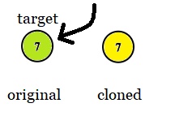
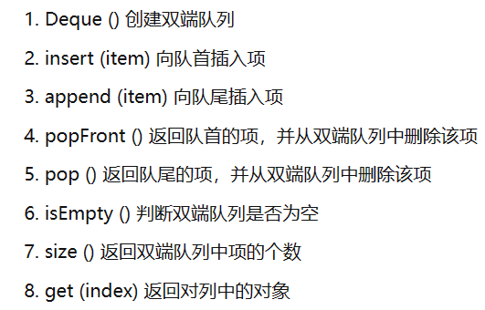

# 2057.值相等的最小索引

## 题目描述：

给你一个下标从 0 开始的整数数组 `nums` ，返回 `nums` 中满足 `i mod 10 == nums[i]` 的最小下标 `i` ；如果不存在这样的下标，返回 `-1` 。

`x mod y` 表示 `x` 除以 `y` 的 **余数** 。

 

**示例 1：**

```
输入：nums = [0,1,2]
输出：0
解释：
i=0: 0 mod 10 = 0 == nums[0].
i=1: 1 mod 10 = 1 == nums[1].
i=2: 2 mod 10 = 2 == nums[2].
所有下标都满足 i mod 10 == nums[i] ，所以返回最小下标 0
```

**示例 2：**

```
输入：nums = [4,3,2,1]
输出：2
解释：
i=0: 0 mod 10 = 0 != nums[0].
i=1: 1 mod 10 = 1 != nums[1].
i=2: 2 mod 10 = 2 == nums[2].
i=3: 3 mod 10 = 3 != nums[3].
2 唯一一个满足 i mod 10 == nums[i] 的下标
```

**示例 3：**

```
输入：nums = [1,2,3,4,5,6,7,8,9,0]
输出：-1
解释：不存在满足 i mod 10 == nums[i] 的下标
```

**示例 4：**

```
输入：nums = [2,1,3,5,2]
输出：1
解释：1 是唯一一个满足 i mod 10 == nums[i] 的下标
```

## 我的C++解法

能想到的是很常规的遍历数组，逐位判断。时间o(n)空间o(1)

```c++
class Solution {
public:
    int smallestEqual(vector<int>& nums) {
        //从结果上来看，如果数组不是0~9直接返回-1 每十位一次循环
        //即前10位中第i位应满足其值为i-1
        for(int i=0;i<nums.size();i++){
            if(i%10==nums[i]){
                return i;
            }
        }
        return -1;
    }
};
```

结果：


我也一直在想如何降低时间复杂度？若o(logn)那就是折半查找了

好吧，大伙都是o(n)

## C++参考答案

```c++
class Solution {
public:
    int smallestEqual(vector<int>& nums) {
        int n = nums.size();
        for (int i = 0; i < n; ++i){
            if (i % 10 == nums[i]){
                return i;
            }
        }
        return -1;
    }
};
```

没什么出众的点

## C++收获

无非就是巩固了获取数组长度的方法`nums.size()`

## 我的python解法

和C++思路一样，遍历数组

```python
class Solution:
    def smallestEqual(self, nums: List[int]) -> int:
        for i in range(0,len(nums)):
            if i%10 == nums[i]:
                return i
        return -1
```

结果：


## python参考答案

```python
class Solution:
    def smallestEqual(self, nums: List[int]) -> int:
        n = len(nums)
        for i in range(n):
            if i % 10 == nums[i]:
                return i
        return -1
```

也很普通

## python收获

无

最简单的每日一题

09点39分结束

# 1379.找出克隆二叉树中的相同节点

## 题目描述：

给你两棵二叉树，原始树 `original` 和克隆树 `cloned`，以及一个位于原始树 `original` 中的目标节点 `target`。

其中，克隆树 `cloned` 是原始树 `original` 的一个 **副本** 。

请找出在树 `cloned` 中，与 `target` **相同** 的节点，并返回对该节点的引用（在 C/C++ 等有指针的语言中返回 节点指针，其他语言返回节点本身）。

 

**注意：**你 **不能** 对两棵二叉树，以及 `target` 节点进行更改。**只能** 返回对克隆树 `cloned` 中已有的节点的引用。

 

**示例 1:**


```
输入: tree = [7,4,3,null,null,6,19], target = 3
输出: 3
解释: 上图画出了树 original 和 cloned。target 节点在树 original 中，用绿色标记。答案是树 cloned 中的黄颜色的节点（其他示例类似）。
```

**示例 2:**



```
输入: tree = [7], target =  7
输出: 7
```

**示例 3:**


```
输入: tree = [8,null,6,null,5,null,4,null,3,null,2,null,1], target = 4
输出: 4
```

**提示：**

- 树中节点的数量范围为 `[1, 104]` 。
- 同一棵树中，没有值相同的节点。
- `target` 节点是树 `original` 中的一个节点，并且不会是 `null` 。

 

**进阶：**如果树中允许出现值相同的节点，将如何解答？

## 我的C++解法

```c++
/**
 * Definition for a binary tree node.
 * struct TreeNode {
 *     int val;
 *     TreeNode *left;
 *     TreeNode *right;
 *     TreeNode(int x) : val(x), left(NULL), right(NULL) {}
 * };
 */

class Solution {
public:
    //根据输入情况看，对二叉树的访问应该是先序遍历
    TreeNode* visit(TreeNode* tree){
        return tree;
    }
    TreeNode* result;
    int flag=0;
    void root_first(TreeNode* tree,TreeNode* target){
        if(tree!=NULL&&flag==0){
            if(tree->val==target->val){
                result=visit(tree);
                flag=1;
            }
            root_first(tree->left,target);
            root_first(tree->right,target);
        }
    }
    TreeNode* getTargetCopy(TreeNode* original, TreeNode* cloned, TreeNode* target) {
        //基本思路：遍历二叉树，直到键值相同
        root_first(cloned,target);
        return result;
    }
};
```

结果：

但是总感觉怪怪的，original二叉树并没有用到。

看了解析才知道，original主要作用是在进阶中考虑，进阶情况下允许出现相同值的节点。

## C++参考答案

### 方法一：先序遍历

同时对二叉树 original 与 cloned 进行深度优先搜索，如果 original 当前搜索的节点的引用等于target 节点的引用，那么对应地返回 cloned 当前搜索的节点，否则继续对各自的左右节点同时进行搜索。

时间o(n)空间o(n)

```c++
class Solution {
public:
    TreeNode *getTargetCopy(TreeNode *original, TreeNode *cloned, TreeNode *target) {
        if (original == nullptr) {
            return nullptr;
        }
        if (original == target) {
            return cloned;
        }
        TreeNode *left = getTargetCopy(original->left, cloned->left, target);
        if (left != nullptr) {
            return left;
        }
        return getTargetCopy(original->right, cloned->right, target);
    }
};
```

简洁写法：

```C++
class Solution {
public:
    TreeNode *getTargetCopy(TreeNode *original, TreeNode *cloned, TreeNode *target) {
        if (original == nullptr || original == target) {
            return cloned;
        }
        auto left_res = getTargetCopy(original->left, cloned->left, target);
        if (left_res) {
            return left_res; // 已经找到 target，无需递归右子树
        }
        return getTargetCopy(original->right, cloned->right, target);
    }
};
```


### 方法二：层次遍历

使用队列同时对二叉树original和cloned进行广度优先搜索，初始时分别将根节点original 和cloned压入队列 q1和q2。假设当前搜索的节点分别为 node1与node2，将 node1与 node2分别弹出队列，如果 node1节点的引用等于 target 节点的引用那么返回 node2，否则将分别将 node1和 node2的非空子节点压入队列 q1和 q2，继续搜索过程。

```c++
class Solution {
public:
    TreeNode *getTargetCopy(TreeNode *original, TreeNode *cloned, TreeNode *target) {
        queue<TreeNode *> q1, q2;
        q1.push(original);
        q2.push(cloned);
        while (!q1.empty()) {
            TreeNode *node1 = q1.front(), *node2 = q2.front();
            q1.pop();
            q2.pop();
            if (node1 == target) {
                return node2;
            }
            if (node1->left != nullptr) {
                q1.push(node1->left);
                q2.push(node2->left);
            }
            if (node1->right != nullptr) {
                q1.push(node1->right);
                q2.push(node2->right);
            }
        }
        return nullptr; // impossible case
    }
};
```

## C++收获

1. 复习了数据结构中对二叉树的遍历，重新翻看了自己的408笔记
2. 对返回值的界定有了更深的理解
3. 复习了递归算法的实现，尤其是最后的`return getTargetCopy(original->right,cloned->right,target);`这个函数最后返回仍为函数本身，但是初始节点发生了变化，实现了递归操作。
4. 先序遍历方法中简洁写法的`if(left_res)`确实很简洁，因为`left_res`要么是null要么是一个确定节点，可以直接return。
5. C++中队列的初始化：`queue<type> name`
6. 队列获取队首元素：`name.front()`
7. 队列输入：`name.push(element)`  队列输出：`name.pop()`

## 我的python解法

思路来源于C++参考答案中的1.2解法

```python
# Definition for a binary tree node.
# class TreeNode:
#     def __init__(self, x):
#         self.val = x
#         self.left = None
#         self.right = None

class Solution:
    def getTargetCopy(self, original: TreeNode, cloned: TreeNode, target: TreeNode) -> TreeNode:
        if original==target or original==None:
            return cloned
        left_tmp=self.getTargetCopy(original.left,cloned.left,target)
        if left_tmp:
            return left_tmp
        return self.getTargetCopy(original.right,cloned.right,target)
```


## python参考答案

### 方法一：先序遍历


```python
class Solution:
    def getTargetCopy(self, original: TreeNode, cloned: TreeNode, target: TreeNode) -> TreeNode:
        if original is None or original is target:
            return cloned
        return self.getTargetCopy(original.left, cloned.left, target) or \
               self.getTargetCopy(original.right, cloned.right, target)
```

### 方法二：层次遍历

```python
# Definition for a binary tree node.
# class TreeNode:
#     def __init__(self, x):
#         self.val = x
#         self.left = None
#         self.right = None

class Solution:
    def getTargetCopy(self, original: TreeNode, cloned: TreeNode, target: TreeNode) -> TreeNode:
        q = deque([(original, cloned)])
        while q:
            # print(p)
            o, c = q.popleft()
            if o == target:
                return c
            if o.left:
                q.append((o.left, c.left))
            if o.right:
                q.append((o.right, c.right))
```

代码6-2中，输入`[8,null,6,null,5,null,4,null,3,null,2,null,1]`，若每次循环都输出p，则结果：

```python
deque([(TreeNode{val: 8, left: None, right: TreeNode{val: 6, left: None, right: TreeNode{val: 5, left: None, right: TreeNode{val: 4, left: None, right: TreeNode{val: 3, left: None, right: TreeNode{val: 2, left: None, right: TreeNode{val: 1, left: None, right: None}}}}}}}, TreeNode{val: 8, left: None, right: TreeNode{val: 6, left: None, right: TreeNode{val: 5, left: None, right: TreeNode{val: 4, left: None, right: TreeNode{val: 3, left: None, right: TreeNode{val: 2, left: None, right: TreeNode{val: 1, left: None, right: None}}}}}}})])
deque([(TreeNode{val: 6, left: None, right: TreeNode{val: 5, left: None, right: TreeNode{val: 4, left: None, right: TreeNode{val: 3, left: None, right: TreeNode{val: 2, left: None, right: TreeNode{val: 1, left: None, right: None}}}}}}, TreeNode{val: 6, left: None, right: TreeNode{val: 5, left: None, right: TreeNode{val: 4, left: None, right: TreeNode{val: 3, left: None, right: TreeNode{val: 2, left: None, right: TreeNode{val: 1, left: None, right: None}}}}}})])
deque([(TreeNode{val: 5, left: None, right: TreeNode{val: 4, left: None, right: TreeNode{val: 3, left: None, right: TreeNode{val: 2, left: None, right: TreeNode{val: 1, left: None, right: None}}}}}, TreeNode{val: 5, left: None, right: TreeNode{val: 4, left: None, right: TreeNode{val: 3, left: None, right: TreeNode{val: 2, left: None, right: TreeNode{val: 1, left: None, right: None}}}}})])
deque([(TreeNode{val: 4, left: None, right: TreeNode{val: 3, left: None, right: TreeNode{val: 2, left: None, right: TreeNode{val: 1, left: None, right: None}}}}, TreeNode{val: 4, left: None, right: TreeNode{val: 3, left: None, right: TreeNode{val: 2, left: None, right: TreeNode{val: 1, left: None, right: None}}}})])
```

若每次循环得到o和c直接输出，得到结果：

```python
TreeNode{val: 8, left: None, right: TreeNode{val: 6, left: None, right: TreeNode{val: 5, left: None, right: TreeNode{val: 4, left: None, right: TreeNode{val: 3, left: None, right: TreeNode{val: 2, left: None, right: TreeNode{val: 1, left: None, right: None}}}}}}}
TreeNode{val: 8, left: None, right: TreeNode{val: 6, left: None, right: TreeNode{val: 5, left: None, right: TreeNode{val: 4, left: None, right: TreeNode{val: 3, left: None, right: TreeNode{val: 2, left: None, right: TreeNode{val: 1, left: None, right: None}}}}}}}
TreeNode{val: 6, left: None, right: TreeNode{val: 5, left: None, right: TreeNode{val: 4, left: None, right: TreeNode{val: 3, left: None, right: TreeNode{val: 2, left: None, right: TreeNode{val: 1, left: None, right: None}}}}}}
TreeNode{val: 6, left: None, right: TreeNode{val: 5, left: None, right: TreeNode{val: 4, left: None, right: TreeNode{val: 3, left: None, right: TreeNode{val: 2, left: None, right: TreeNode{val: 1, left: None, right: None}}}}}}
TreeNode{val: 5, left: None, right: TreeNode{val: 4, left: None, right: TreeNode{val: 3, left: None, right: TreeNode{val: 2, left: None, right: TreeNode{val: 1, left: None, right: None}}}}}
TreeNode{val: 5, left: None, right: TreeNode{val: 4, left: None, right: TreeNode{val: 3, left: None, right: TreeNode{val: 2, left: None, right: TreeNode{val: 1, left: None, right: None}}}}}
TreeNode{val: 4, left: None, right: TreeNode{val: 3, left: None, right: TreeNode{val: 2, left: None, right: TreeNode{val: 1, left: None, right: None}}}}
TreeNode{val: 4, left: None, right: TreeNode{val: 3, left: None, right: TreeNode{val: 2, left: None, right: TreeNode{val: 1, left: None, right: None}}}}
```

这说明在py中每一个二叉节点存储的都是以该节点为根的整棵树的结构。

初始时`q = deque([(original, cloned)])`实际上只是把两个二叉树的根节点存入队列中，队列里面实际上只有一个元素，这一个元素是由两个根节点的详细数据结构拼凑得到的。

## python收获

1. py中函数递归自我调用需要用到关键词self
2. 定义函数时括号内： `名称：类型名称`  返回值是在def的最后`->返回类型`
3. py中判别同类型元素是否完全一致可以使用关键词`is`
4. py的return语句可以包含逻辑判断关键词如and，or等；and关键词二者全为真时才返回；or关键词返回第一个为真的语句的结果
5. py中使用`deque(em1,em2)`创建双线队列即双端队列，输入输出无限制的队列。
   


14点58-16点27分
