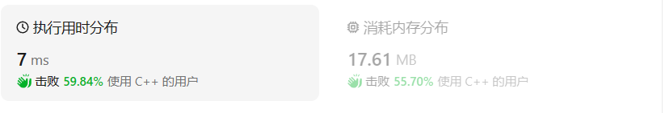
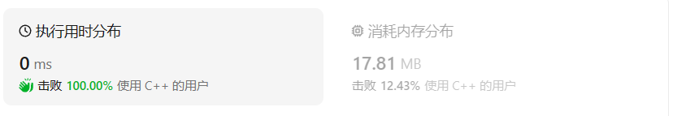

# 1528.重新排列字符串

## 题目描述

给你一个字符串 `s` 和一个 **长度相同** 的整数数组 `indices` 。

请你重新排列字符串 `s` ，其中第 `i` 个字符需要移动到 `indices[i]` 指示的位置。

返回重新排列后的字符串。

 

**示例 1：**


```
输入：s = "codeleet", indices = [4,5,6,7,0,2,1,3]
输出："leetcode"
解释：如图所示，"codeleet" 重新排列后变为 "leetcode" 。
```

**示例 2：**

```
输入：s = "abc", indices = [0,1,2]
输出："abc"
解释：重新排列后，每个字符都还留在原来的位置上。
```

 

**提示：**

- `s.length == indices.length == n`
- `1 <= n <= 100`
- `s` 仅包含小写英文字母
- `0 <= indices[i] < n`
- `indices` 的所有的值都是 **唯一** 的

## 我的C++解答

```c++
class Solution {
public:
    void QuickSort(vector<int>& indices, int low, int high,vector<int>*& index){
        if(low<high){
            int pivot_pos=Partition(indices,low,high);
            index[pivot_pos]=indices[low];
            QuickSort(indices,low,pivot_pos-1,index);
            QuickSort(indices,pivot_pos+1,high,index);
        }
    }
    int Partition(vector<int> indices,int low, int high){
        int pivot=indices[low];
        while(low<high){
            while(low<high && indices[high]>=pivot) --high;
            indices[low]=indices[high];
            while(low<high && indices[low]<=pivot) ++low;
            indices[high]=indices[low];
        }
        indices[low]=pivot;
        return low;
    }

    string restoreString(string s, vector<int>& indices) {
        //说白了这更像是字典型数据的重排列
        //对索引值排序，使用排序算法
        //平方简插泡 nlog快归堆
        //快速排序,目标是返回排序后每个值的索引
        //按示例1，应返回（4，6，5，7，0，1，2，3）
        // cout<<indices.size();
        int* index=new int[indices.size()];
        QuickSort(indices,0,indices.size(),index);
        string result;
        for(int i=0;i<indices.size();i++){
            result[i]=s[index[i]];
        }
        return result;
    }
};
```

第一次看到这个题的想法是排序，然后想到快速排序的时间o(nlogn)，就把王道书上面的快排代码拿过来用了，但是一直报错，经查阅好像是数组边界的问题。

思路有，但是代码一坨，一直报错。尝试更换方法。

```c++
class Solution {
public:
    void QuickSort(vector<int>& indices, int low, int high,int index[]){
        if(low<high){
            int pivot_pos=Partition(indices,low,high);
            cout<<indices[low];
            index[pivot_pos] = indices[low];
            QuickSort(indices,low,pivot_pos-1,index);
            QuickSort(indices,pivot_pos+1,high,index);
        }
    }
    int Partition(vector<int> indices,int low, int high){
        int pivot=indices[low];
        while(low<high){
            while(low<high && indices[high]>=pivot) --high;
            indices[low]=indices[high];
            while(low<high && indices[low]<=pivot) ++low;
            indices[high]=indices[low];
        }
        indices[low]=pivot;
        return low;
    }

    string restoreString(string s, vector<int>& indices) {
        //说白了这更像是字典型数据的重排列
        //对索引值排序，使用排序算法
        //平方简插泡 nlog快归堆
        //快速排序,目标是返回排序后每个值的索引
        //按示例1，应返回（4，6，5，7，0，1，2，3）
        // cout<<indices.size();
        int index[indices.size()];
        QuickSort(indices,0,indices.size(),index);
        string result;
        for(int i=0;i<indices.size();i++){
            result[i]=s[index[i]];
        }
        return result;
    }
};
```

改来改去最后tm溢出了，真搞不明白。是快排有啥问题吗？

查了一下，`AddressSanitizer: heap-buffer-overflow on address 0x5030000000f0 at pc 0x55fe582ad595 bp 0x7ffe6a130ab0 sp 0x7ffe6a130aa8`是数组越界的报错。


tm的我把问题想的太复杂了，两个for循环就解决的问题真没必要搞快排

```C++
class Solution {
public:
    string restoreString(string s, vector<int>& indices) {
        int n= indices.size();
        string result=s;
        for(int i=0;i<n;i++){
            for(int j=0;j<n;j++){
                if(indices[j]==i){
                    // result[i]=indices[j];
                    // cout<<s[j];
                    // result.insert(i,'s[j]');
                    result[i]=s[j];
                    break;
                }
            }
        }
        return result;
    }
};
```



下午的新解法：

```cpp
class Solution {
public:
    bool swap(auto& a,auto& b){
        auto tmp=a;
        a=b;
        b=tmp;
        return true;
    }
    bool all_1(int certain[],int len){
        for(int i=0;i<len;i++){
            if(certain[i]==0){
                return false;
            }
        }
        return true;
    }
    string sequence(string s,vector<int>& indices,int len,int certain[]){
        while(!all_1(certain,len)){//certain有非0元就继续循环
            for(int i=0;i<len;i++){
                if(indices[i]==i||certain[i]==1){
                    certain[i]=1;
                    continue;
                }
                certain[indices[i]]=1;
                swap(s[i],s[indices[i]]);
                swap(indices[i],indices[indices[i]]);
            }
        }
        return s;//从前向后过
    }
    string restoreString(string s, vector<int>& indices) {
        int len=s.size();
        int certain[len];
        for(int i=0;i<len;i++){
            certain[i]=0;
        }
        s=sequence(s,indices,len,certain);
        return s;
    }
};
```

结果：



内存还是大

## C++参考答案

### 方法一：新建字符串

```c++
class Solution {
public:
    string restoreString(string s, vector<int>& indices) {
        int length = s.length();
        string result(length, 0);

        for(int i = 0; i < length; i++) {
            result[indices[i]] = s[i];
        }
        return result;
    }
};
```

### 方法二：原地修改

```c++
class Solution {
public:
    string restoreString(string s, vector<int>& indices) {
        int length = s.length();
        for (int i = 0; i < length; i++) {
            if (indices[i] != i) {
                char ch = s[i]; // 当前需要被移动的字符
                int idx = indices[i]; // 该字符需要被移动的目标位置
                while (idx != i) {
                    swap(s[idx], ch); // 使用 swap 函数，在覆写 s[idx] 之前，先将其原始值赋给变量 ch
                    swap(indices[idx], idx); // 将封闭路径中的 indices 数组的值设置成下标自身
                }
                // 退出循环后，还要再覆写起点处的字符
                s[i] = ch;
                indices[i] = i;
            }
        }
        return s;
    }
};
```

### 方法三：map函数

```c++
class Solution {
public:
    string restoreString(string s, vector<int>& indices) {
        unordered_map<int, char> mp;
        int n = s.size();
        string res;
        for (int i = 0; i < n; i++) {
            mp[indices[i]] = s[i];
        }
        for (int i = 0; i < n; i++)
            res.push_back(mp[i]);
        return res;
    }
};
```

这段代码是一个C++函数，它的作用是根据给定的字符串 `s` 和一个索引数组 `indices` 来恢复原始字符串。下面是这段代码的逐行解释：

1. `class Solution`：定义了一个名为 `Solution` 的类。

2. `public:`：声明了 `Solution` 类的公共访问权限部分，这意味着类中的成员可以被外部访问。

3. `string restoreString(string s, vector<int>& indices)`：这是 `Solution` 类中的一个公共成员函数，它接受两个参数：一个字符串 `s` 和一个整数向量 `indices`。函数的返回类型是 `string`。

4. `unordered_map<int, char> mp;`：定义了一个哈希表 `mp`，用于存储索引和字符之间的映射关系。键是整数类型，值是字符类型。

5. `int n = s.size();`：获取字符串 `s` 的长度，并将其存储在变量 `n` 中。

6. `string res;`：声明了一个空字符串 `res`，用于存储最终恢复的字符串。

7. `for (int i = 0; i < n; i++) {`：开始一个循环，遍历字符串 `s` 的每个字符。

8. `mp[indices[i]] = s[i];`：在哈希表 `mp` 中，使用当前索引 `indices[i]` 作为键，将当前字符 `s[i]` 作为值存入。

9. `}`：循环结束。

10. `for (int i = 0; i < n; i++)`：开始另一个循环，再次遍历字符串的长度。

11. `res.push_back(mp[i]);`：在字符串 `res` 的末尾追加哈希表 `mp` 中索引为 `i` 的字符。

12. `}`：循环结束。

13. `return res;`：返回恢复后的字符串 `res`。

然而，这段代码存在一个逻辑错误。在第二个循环中，它尝试通过索引 `i` 直接从 `mp` 中获取字符，但 `mp` 的键是 `indices` 数组中的值，而不是简单的从 0 开始的整数。因此，这个函数不会正确地恢复原始字符串。

正确的逻辑应该是在第二个循环中使用 `indices` 数组中的值作为索引来获取字符，如下所示：

```cpp
for (int i = 0; i < n; i++)
    res.push_back(mp[indices[i]]);
```

这样，`res` 字符串将按照 `indices` 数组指定的顺序正确地构建原始字符串。


在第十一行代码中：

```cpp
res.push_back(mp[i]);
```

这里使用了 `push_back` 方法来向字符串 `res` 的末尾添加一个字符。`push_back` 是 C++ STL（标准模板库）中容器类的一个常用方法，它的作用是将一个元素添加到容器的末尾。

让我们详细解释一下这一行代码的各个部分：

1. `res`：这是一个 `std::string` 对象的实例，它是一个可变容器，用于存储字符序列。

2. `push_back`：这是 `std::string` 类的一个成员函数，用于在字符串的末尾添加一个字符。

3. `mp[i]`：这是对 `unordered_map` 容器 `mp` 的索引操作，尝试获取键为 `i` 的元素的值。由于 `mp` 是一个 `unordered_map<int, char>` 类型，它的键是整数，值是字符。然而，这里的逻辑是错误的，因为 `mp` 存储的是 `indices` 数组中的索引对应的字符，而不是简单的从 0 到 `n-1` 的整数。

正确的逻辑应该是使用 `indices` 数组中的索引来从 `mp` 中获取字符，然后添加到 `res` 中。正确的代码应该是：

```cpp
for (int i = 0; i < n; i++)
    res.push_back(mp[indices[i]]);
```

这样，`res.push_back(mp[indices[i]]);` 会获取 `indices[i]` 索引对应的字符（这个字符是原始字符串 `s` 中的第 `indices[i]` 个字符），然后将其添加到结果字符串 `res` 的末尾。循环结束后，`res` 将包含按照 `indices` 数组指定的新顺序排列的字符，从而恢复原始字符串。

## C++收获

### 在C/C++中可以使用下标来直接对字符串类型数据进行修改

### C++创建map对象：

`map<类型,类型,...>名称={{对应类型的值，对应类型的值，...}...}`
不进行赋值则去掉等号和后面数据
依据map中其中一个关键字写入对应位置的数据：`map[关键字]=数据`

### C++中 `string result(length, 0);`可以直接定义定长的字符串类型，其中元素都用0进行填充

### 在C++中，`std::vector<int>` 

是一种容器，用于存储相同类型元素的动态数组。这里的 `std::` 表示这个类型是标准命名空间的一部分，`vector` 是容器的名称，而 `<int>` 指定了这个容器存储的元素类型是 `int`（整数）。

下面是 `std::vector<int>` 的一些关键特性的详细解释：

**特性**

1. **动态数组**：`std::vector` 可以根据需要自动调整大小，这使得它比传统的数组更灵活。
2. **随机访问**：`std::vector` 提供了随机访问迭代器，这意味着可以快速地访问容器中的任何元素。
3. **模板类**：`vector` 是一个模板类，可以使用任何类型的对象，不仅仅是 `int`。
4. **异常安全性**：标准库的 `vector` 实现通常保证了良好的异常安全性。
5. **成对迭代器**：使用 `begin()` 和 `end()` 成员函数可以获取指向 vector 开始和结束的迭代器

### 在 C++ 中，`std::` 前的双冒号 `::` 

是作用域解析运算符，也称为范围解析运算符。它用于明确指出某个实体（如类型、函数、对象等）属于特定的命名空间或作用域。

当你看到 `std::vector` 或 `std::sort` 这样的表达式时，这里的 `std::` 表示 `vector` 和 `sort` 属于 `std`（标准）命名空间。在 C++ 中，为了避免命名冲突，许多标准库的组件都被放置在 `std` 这个命名空间下。

**使用场景**

1. **明确命名空间**：当你需要明确指出某个实体属于哪个命名空间时，可以使用 `::` 运算符。

   ```cpp
   std::vector<int> v; // 使用 std 命名空间下的 vector 模板类
   ```

2. **访问全局命名空间**：当局部作用域或类中有一个与全局命名空间中的名字相同的实体时，可以使用 `::` 来访问全局实体。

   ```cpp
   void myFunction() {
       int myVar = 10;
       std::cout << ::myVar; // 访问全局命名空间中的 myVar
   }
   ```

3. **多级命名空间**：当实体位于多级命名空间中时，可以通过连续使用 `::` 来访问。

   ```cpp
   namespace Outer {
       namespace Inner {
           void myFunction() {}
       }
   }
   
   int main() {
       Outer::Inner::myFunction(); // 调用 Outer 命名空间下的 Inner 命名空间中的 myFunction
   }
   ```

**注意事项**

- 如果没有使用 `std::`，编译器会尝试在程序的当前命名空间中查找 `vector` 或 `sort`，如果找不到，会导致编译错误。
- 使用 `using namespace std;` 可以避免每次都需要写 `std::`，但这通常不推荐在大型项目或头文件中使用，因为它可能导致命名冲突。

在 C++ 中，正确使用作用域解析运算符 `::` 是非常重要的，它有助于编写清晰、易于理解的代码，并避免潜在的命名冲突。

### C++中有个很方便的数据类型叫auto

在下午的解法中返回值设为auto，形参也为auto类型，可以有效避免代码重复，只要传入实参是相同的数据类型就可以完成交换操作

### 数组类型做形参时，可以书写为`类型 类型名[]`,`类型* 类型名`,`类型 类型名[个数]`最终都可以使用。

### 数组形参的辨析

在C++中，函数参数可以以多种方式声明，以适应不同的使用场景：

1. `vector<int>& array`
   - 这表示 `array` 是一个 `std::vector<int>` 类型对象的引用。使用引用（`&`）意味着函数**不会复制**整个 `vector` 对象，而是**直接操作传入的 `vector`**。这适用于当你想要修改传入的 `vector` 对象，或者避免不必要的复制以提高效率时。

   使用场景：
   - 需要在函数内部修改外部 `vector` 对象。
   - 希望避免复制大型容器，以提高性能。

   ```cpp
   void printVector(const vector<int>& array) {
       for (int num : array) {
           cout << num << " ";
       }
       cout << endl;
   }
   ```

2. `int array[]`
   - 这表示 `array` 是一个整数数组。这种形式通常用于函数参数，以便函数可以接收一个数组作为输入。然而，使用这种方式声明的数组参数在函数内部是按值传递的，这意味着会**复制整个数组**，这可能对性能不利。

   使用场景：
   - 当需要函数内部使用数组，并且不需要修改原始数组时。

   ```cpp
   void printArray(int array[], int size) {
       for (int i = 0; i < size; ++i) {
           cout << array[i] << " ";
       }
       cout << endl;
   }
   ```

3. `int *array`
   - 这表示 `array` 是一个指向整型的指针。指针参数允许函数**操作数组的第一个元素的地址**，但它不会自动传递整个数组。使用指针时，通常需要额外传递一个表示数组大小的参数，因为指针本身不包含它所指向的数组的大小信息。

   使用场景：
   - 当需要操作数组，但**不希望复制整个数组**以节省内存和提高效率时。
   - 当需要**处理大小可变或者多维数组**时。

   ```cpp
   void printPointerArray(int *array, int size) {
       for (int i = 0; i < size; ++i) {
           cout << array[i] << " ";
       }
       cout << endl;
   }
   ```

4. `int& array[]`
   - 这种声明是不合法的，因为引用必须绑定到一个对象上，而不能是数组。当你**想要通过引用修改数组时**，通常会使用 `vector` 或者传递数组的指针 `int*`。

在C++中，选择哪种方式取决于具体的应用场景和性能要求。例如，当你需要修改数组或避免复制时，可能会选择使用引用或指针。而当你不需要修改数组，并且不需要处理数组的边界时，可能会选择使用数组参数。

### C++中的`&`运算符在引用中的详解

在C++中，`&` 符号有两个主要含义：引用和位运算符。在函数形参中，`&` 通常用作引用运算符，表示参数按引用传递，而不是按值传递。

**引用运算符**（&）

1. **按引用传递**：当 `&` 用作函数参数类型前的修饰符时，它告诉编译器该参数是一个引用。这意味着函数接收的是变量的别名，而不是变量的副本。对引用参数的任何修改都会反映到传递给函数的实际变量上。

   ```cpp
   void modifyValue(int& ref) {
       ref += 10; // 修改引用的原始变量
   }
   ```

2. **使用场景**：
   - 当你想要函数修改传入的参数值时。
   - 当你想要避免复制大型对象或数组以提高效率时。

3. **注意事项**：
   - 引用必须在创建时就被初始化，即它们必须绑定到另一个对象。
   - 引用不同于指针，它们不允许 `NULL` 值，并且引用的生命周期通常与被引用的对象相同。

**引用的常见用途**

1. **函数参数**：允许函数修改传入的对象。

   ```cpp
   void increase(Student& student) {
       student.age++; // 直接修改传入对象的年龄
   }
   ```

2. **返回多个值**：允许函数通过引用返回多个值。

   ```cpp
   void getDimensions(const vector<int>& vec, int& size, int& capacity) {
       size = vec.size();
       capacity = vec.capacity();
   }
   ```

3. **大型对象或数组**：避免复制大型对象或数组，提高性能。

   ```cpp
   void processArray(const vector<int>& array) {
       // 处理数组，无需复制整个数组
   }
   ```

4. **指针参数的替代**：在某些情况下，引用可以作为指针的替代，提供更清晰的代码。

   ```cpp
   bool isValid(const string& str) {
       // 检查字符串是否有效，无需处理指针可能的空值问题
   }
   ```

在函数形参中使用 `&` 符号时，通常是为了创建引用，而不是按值传递参数。这在需要函数修改参数或提高性能时非常有用。

### `const`关键字在形参中的用法

在C++中，`const` 关键字用于指定一个变量或对象的状态不能被修改。当你在函数参数中使用 `const` 时，你告诉编译器这个参数在函数内部**不能被修改**。

#### `const` 在形参中的作用

1. **防止修改**：在函数参数中使用 `const` 可以防止函数内部修改传递给它的参数。这在你想要保持参数的原始状态不被函数改变时非常有用。

2. **明确意图**：使用 `const` 可以向阅读代码的其他开发者明确你的意图，即这个参数不应该被函数修改。

3. **编译时检查**：如果函数内部不小心尝试修改了 `const` 参数，编译器将会报错，这提供了一种编译时的安全性。

#### `const` 在 `getDimensions` 函数中的例子

```cpp
void getDimensions(const vector<int>& vec, int& size, int& capacity) {
    size = vec.size();
    capacity = vec.capacity();
}
```

在这个例子中：

- `const vector<int>& vec`：这里 `vec` 是一个 `std::vector<int>` 的引用，并且是 `const` 的。这意味着 `getDimensions` 函数**不能修改 `vec` 中的任何元素，也不能调用任何会修改 `vec` 大小或容量的成员函数**。`vec` 作为 `const` 引用传递，确保了传入的 `vector` 不会被函数修改。

- `int& size` 和 `int& capacity`：这两个参数是对整数的非 `const` 引用，意味着函数可以修改它们。这允许函数将 `vector` 的 `size` 和 `capacity` 赋值给调用者提供的变量。

#### 何时使用 `const` 在形参中

- **当你想返回多个值时**：使用 `const` 引用参数可以避免复制大型对象，同时还可以修改并返回多个值。

- **当你需要传递大型对象时**：为了避免昂贵的复制操作，你可以将大型对象作为 `const` 引用传递。

- **当你需要传递的对象不应被修改时**：如果你只想在函数中读取对象的内容，而不改变它，使用 `const` 引用是合适的。

- **当你需要提高代码的清晰度和安全性时**：使用 `const` 可以避免不小心修改参数，增加代码的可读性，并在编译时提供额外的检查。

#### 注意事项

- 使用 `const` 引用时，必须确保传递的对象在函数的整个生命周期内都是有效的。

- 如果你需要在函数内部修改参数的值，那么就不能使用 `const`。

- 如果你传递的是基本数据类型的引用（如 `int&`），`const` 不适用，因为基本数据类型的引用本身不能是 `const`。

- 有时候，即使参数在函数内部不需要修改，也会使用 `const`，这有助于传达函数的设计意图，即不会更改传入的参数。

### 数组作为形参引用的形式

 在C++中，数组作为函数参数传递时，通常会**退化为指向数组首元素的指针**。因此，如果你想要通过引用来操作整个数组，你需要采取特定的方法来确保数组被按引用传递，而不仅仅是数组的指针。

#### 使用引用传递整个数组

为了按引用传递整个数组，你可以使用数组的引用作为函数参数。但是，需要注意的是，**数组的大小信息不会随着引用传递**，所以如果你需要知道数组的大小，你必须以某种方式将其传递给函数。

```cpp
template <size_t N>
void processArray(const int (&array)[N]) {
    // 在这里操作数组元素，例如：
    for (int i = 0; i < N; ++i) {
        // do something with array[i]
    }
}

int main() {
    int myArray[] = {1, 2, 3, 4, 5};
    processArray(myArray); // 使用模板明确数组大小
    return 0;
}
```

在这个例子中，`processArray` 函数接受一个整数数组的引用，并且通过模板参数 `N` 明确了数组的大小。这样，函数就可以安全地访问数组的每个元素，而不需要担心越界。

#### 使用指针和大小

如果你不能或不想使用模板，你可以将数组作为指针传递，并额外传递一个表示数组大小的参数。

```cpp
void processArray(const int* array, size_t size) {
    // 在这里操作数组元素，例如：
    for (size_t i = 0; i < size; ++i) {
        // do something with array[i]
    }
}

int main() {
    int myArray[] = {1, 2, 3, 4, 5};
    processArray(myArray, sizeof(myArray) / sizeof(myArray[0])); // 传递数组和大小
    return 0;
}
```

在这个例子中，`processArray` 函数接受一个指向整数的指针和数组的大小。这样，函数就可以根据传递的大小安全地访问数组的每个元素。

#### 使用容器类

另一种常见的做法是使用标准库容器，如 `std::vector` 或 `std::array`，它们可以直接按引用传递，且不需要担心数组退化的问题。

```cpp
void processArray(const std::vector<int>& vec) {
    // 在这里操作 vector 的元素
    for (int value : vec) {
        // do something with value
    }
}

int main() {
    std::vector<int> vec = {1, 2, 3, 4, 5};
    processArray(vec); // 使用 vector 按引用传递
    return 0;
}
```

使用 `std::vector` 或其他容器类不仅可以避免数组退化的问题，还可以利用容器类的成员函数进行更复杂的操作。

#### 总结

在C++中，直接按引用传递数组并不常见，因为数组退化为指针，且没有大小信息。通常，你会使用模板、指针和额外的大小参数，或者使用标准库容器来按引用传递数组。选择哪种方法取决于具体的使用场景和个人偏好。

### 基于范围的for循环

这段代码中的 `for` 循环使用了 C++11 标准引入的一种新的循环语法，称为**基于范围的 for 循环**（range-based for loop）。这种语法是在 C++11 中引入的，旨在简化对容器和数组的遍历。

#### 基于范围的 for 循环语法

```cpp
for (declaration : expression) statement
```

- `declaration`：这是一个声明，通常是一个变量，用于**在每次循环迭代中存储序列中的当前元素**。
- `expression`：这是一个表达式，它**产生一个序列**，可以是一个数组、向量（vector）、列表（list）等容器，或者任何其他提供迭代器的序列。
- `statement`：这是一个语句，通常是一个块（由花括号 `{}` 包围），在每次迭代中执行。

#### 示例代码解释

```cpp
void printVector(const vector<int>& array) {
    for (int num : array) {
        cout << num << " ";
    }
    cout << endl;
}
```

在这个例子中：

- `int num`：这是循环变量的声明，它在每次迭代中被初始化为序列中的下一个元素。
- `array`：这是 `vector<int>` 类型的容器，它被用作基于范围的 for 循环的表达式。由于 `vector` 提供了迭代器，所以它适合在这种循环中使用。
- `cout << num << " ";`：这是循环体，它打印出当前迭代中的元素 `num`，后面跟着一个空格。

#### 工作原理

基于范围的 for 循环背后的工作原理是利用了容器（如 `vector`）的开始和结束迭代器。在循环开始时，循环变量 `num` 被初始化为序列的第一个元素（通过 `array.begin()` 获取）。在每次迭代中，循环变量会自动更新为序列的下一个元素，直到达到序列的末尾（通过 `array.end()` 表示）。由于 `array` 是一个 `const vector<int>&` 类型，这意味着函数不能修改传入的 `vector`，并且迭代器也是 `const` 的，不能用于修改元素。

#### 使用场景

基于范围的 for 循环非常适合用于遍历容器中的元素，特别是当不需要显式处理迭代器或计数器时。它提供了一种简洁、可读性强的方式来访问序列中的每个元素。

#### 注意事项

- 确保使用的序列（如容器或数组）提供了有效的迭代器。
- 循环变量在每次迭代中都会被重新初始化，因此不要在循环外部使用相同的名字，以避免潜在的冲突。

基于范围的 for 循环是现代 C++ 编程中广泛使用的一种语法，它提高了代码的可读性和简洁性。

### 传递数组给函数并保存操作结果

在C++中，当你想要将数组传递给函数并允许函数修改数组中的元素时，你可以**直接传递数组的名称**，因为数组的名称在大多数表达式中会被解释为指向数组首元素的指针。但是，如果你想要明确指出你传递的是数组的引用（以避免数组退化为指针），你可以**使用数组的引用**作为函数参数。

下面是一个示例，演示如何声明一个函数，该函数接受一个整数数组的引用，并在函数体内操作数组元素：

```cpp
void operateArray(int (&array)[8]) {
    for (int i = 0; i < 8; ++i) {
        // 对 array 的每个元素进行操作
        array[i] += 10;  // 这里假设我们给每个元素加10
    }
}

int main() {
    int myArray[8] = {1, 2, 3, 4, 5, 6, 7, 8};
    operateArray(myArray);
    // 此时 myArray 中的每个元素都增加了10
    return 0;
}
```

在这个例子中，`operateArray` 函数的参数 `int (&array)[8]` 明确指出 `array` 是一个包含8个整数的数组的引用。这意味着函数可以直接修改传递给它的数组的元素。

### 声明并使用 vector 类型

`std::vector` 是C++标准模板库（STL）中的一个容器类，它提供了动态数组的功能。以下是如何声明和使用 `std::vector` 的基本步骤：

1. **包含头文件**：首先，你需要包含 `<vector>` 头文件以使用 `std::vector`。

2. **声明 vector**：声明一个 `std::vector` 时，你需要指定存储在向量中的元素类型。

3. **构造 vector**：你可以在声明时初始化 `std::vector`，或者之后添加元素。

4. **访问和修改元素**：使用下标 `[]` 运算符来访问和修改 `std::vector` 中的元素。

5. **迭代器**：可以使用迭代器来遍历 `std::vector` 中的元素。

下面是使用 `std::vector` 的一个示例：

```cpp
#include <iostream>
#include <vector>

int main() {
    // 声明并初始化一个 vector，类型为 int
    std::vector<int> vec = {1, 2, 3, 4, 5};

    // 使用下标操作符修改元素
    vec[2] = 30;  // 将第三个元素修改为30

    // 使用范围基于的for循环遍历 vector
    for (int num : vec) {
        std::cout << num << " ";
    }
    std::cout << std::endl;

    // 添加元素到 vector 的末尾
    vec.push_back(6);

    // 使用迭代器遍历 vector
    for (std::vector<int>::iterator it = vec.begin(); it != vec.end(); ++it) {
        std::cout << *it << " ";
    }
    std::cout << std::endl;

    return 0;
}
```

在这个例子中，我们首先声明了一个 `std::vector<int>` 类型的变量 `vec`，并初始化了一些整数值。然后我们修改了 `vec` 中的一个元素，使用基于范围的for循环和迭代器遍历了 `vec`，并且使用 `push_back` 方法在 `vec` 的末尾添加了一个新的元素。

`std::vector` 是一个非常灵活和强大的容器，它支持许多有用的操作，如 `size()`、`empty()`、`clear()`、`insert()`、`erase()` 等。

## 我的python解法

```python
class Solution:
    def restoreString(self, s: str, indices: List[int]) -> str:
        result=''
#         for _ in zip(enumerate(s),list(indices)):
#             print(_)
# ((0, 'c'), 4)
# ((1, 'o'), 5)
# ((2, 'd'), 6)
# ((3, 'e'), 7)
# ((4, 'l'), 0)
# ((5, 'e'), 2)
# ((6, 'e'), 1)
# ((7, 't'), 3)
# 4,6,5,7,0,1,2,3 这是+s的顺序
# 0,1,2,3,4,5,6,7 这是ind的顺序
        # for (i,val),j in zip(enumerate(s),list(indices)):
        #     # result=result+s[indices[i]]
        #     # result[i]=s[j]错在py中字符串不可变,只可拆卸和拼接
        #     result=result[i]+s[j]
        # return result
        n=0
        while n!=len(s):
            for (i,val),j in zip(enumerate(s),list(indices)):
                if j==n: 
                    result=result+s[i]
            n+=1
        return result
```

不知道为什么写py的时候感觉很怪


## python参考答案

### 解法一

```python
class Solution:
    def restoreString(self, s: str, indices: List[int]) -> str:
        return ''.join(list(zip(*sorted(zip(indices, s), key = lambda x : x[0])))[1])
```

这段代码是一个 Python 类中的函数，用于恢复一个字符串。它使用了 Python 的高级特性，如列表推导、zip 和 sorted 函数。下面是对这段代码的详细解释：

1. `class Solution:`：定义了一个名为 `Solution` 的类。

2. `def restoreString(self, s: str, indices: List[int]) -> str:`：这是 `Solution` 类中的一个方法，名为 `restoreString`。它接收两个参数：一个字符串 `s` 和一个整数列表 `indices`。这个方法返回一个字符串。

3. `''.join(list(zip(*sorted(zip(indices, s), key = lambda x : x[0])))[1])`：这是 `restoreString` 方法的实现，使用了 Python 的内置函数和高阶函数来实现字符串的恢复。

4. `zip(indices, s)`：`zip` 函数接受两个可迭代对象作为参数，并返回一个元组列表，其中每个元组包含来自两个可迭代对象的元素。在这个例子中，`zip(indices, s)` 将产生一个元组列表，其中每个元组包含 `indices` 中的一个索引和 `s` 中对应的字符。

5. `sorted(zip(indices, s), key = lambda x : x[0])`：`sorted` 函数对 `zip` 函数返回的元组列表进行排序。`key` 参数指定了一个函数，该函数用于从每个元组中提取排序的依据。在这个例子中，`lambda x : x[0]` 表示使用元组的第一个元素（即 `indices` 中的索引）作为排序的依据。

6. `list(zip(*sorted(zip(indices, s), key = lambda x : x[0])))`：由于 `sorted` 返回的是一个元组列表，而 `zip` 函数可以接受任意数量的可迭代对象，所以这里使用 `*` 操作符将 `sorted` 的结果解包为 `zip` 的多个参数。`zip` 函数在这里的作用是将排序后的元组列表重新组合成两个列表，一个是索引列表，另一个是字符列表。

7. `[1]`：这个索引操作提取了 `zip` 函数返回的第二个列表，即排序后的字符列表。

8. `''.join(...)`：最后，`join` 方法将字符列表中的所有字符连接成一个字符串，并返回这个字符串。

总的来说，这段代码通过将索引和字符配对，然后根据索引排序，最后将排序后的字符连接起来，从而恢复了原始的字符串。这是一种非常 Pythonic 的写法，充分利用了 Python 的内置函数和简洁的语法。

### 解法二

```python
class Solution:
    def restoreString(self, s: str, indices: List[int]) -> str:
        return "".join([i[1] for i in sorted([(indices[i], s[i]) for i in range(len(s))])])
```

这段代码是 Python 中的 `Solution` 类的一个方法，用于根据给定的字符串 `s` 和索引列表 `indices` 来恢复原始的字符串。下面是对这段代码的逐行解释：

1. `class Solution:`：定义了一个名为 `Solution` 的类。

2. `def restoreString(self, s: str, indices: List[int]) -> str:`：这是 `Solution` 类中的一个方法，名为 `restoreString`。它接收两个参数：一个字符串 `s` 和一个整数列表 `indices`。这个方法返回一个字符串。

3. `''.join([...])`：这是构建最终字符串的方法。`join` 函数将可迭代对象中的每个元素连接成一个字符串，这里使用的是空字符串 `''` 作为连接字符。

4. `[...]`：这是一个列表推导式，它将为列表中的每个元素创建一个元组。

5. `for i in range(len(s))`：这是一个循环，遍历字符串 `s` 的每个索引。

6. `(indices[i], s[i])`：创建一个元组，其中包含 `indices` 列表中的索引和对应索引 `i` 在字符串 `s` 中的字符。

7. `sorted([...])`：对创建的元组列表进行排序。由于没有指定排序的 `key` 函数，默认情况下，Python 会按照元组的第一个元素（即 `indices[i]`）进行排序。

8. `[...]`：这是另一个列表推导式，用于从排序后的元组列表中提取每个元组的第二个元素，即 `s[i]` 对应的字符。

9. `''.join([...])`：最后，使用 `join` 函数将提取出的字符列表连接成一个字符串，并返回这个字符串。

整体来看，这个方法的逻辑是：

- 使用列表推导式遍历字符串 `s` 的每个索引 `i`。
- 对每个索引 `i`，创建一个包含 `(indices[i], s[i])` 的元组。
- 使用 `sorted` 函数对这些元组进行排序，排序依据是元组中的第一个元素，即 `indices` 列表中的索引。
- 再次使用列表推导式，从排序后的元组列表中提取每个元组的第二个元素，即原始字符串 `s` 中的字符。
- 最后，使用 `join` 函数将这些字符连接成一个字符串，并返回。

这种方法利用了 Python 的列表推导式和内置函数，以一种简洁的方式解决了问题。

### 解法三：列表类型

```python
class Solution:
    def restoreString(self, s: str, indices: List[int]) -> str:
        res = ["" for i in range(len(s))]
        for i in range(len(s)):
            res[indices[i]] = s[i]
        return "".join(res)
```

这段代码是 Python 中 `Solution` 类的一个方法，用于根据给定的字符串 `s` 和索引列表 `indices` 来恢复原始的字符串。下面是对这段代码的逐行解释：

1. `class Solution:`：定义了一个名为 `Solution` 的类。

2. `def restoreString(self, s: str, indices: List[int]) -> str:`：这是 `Solution` 类中的一个方法，名为 `restoreString`。它接收两个参数：一个字符串 `s` 和一个整数列表 `indices`。这个方法返回一个字符串。

3. `res = ["" for i in range(len(s))]`：初始化一个列表 `res`，它的长度与字符串 `s` 的长度相同，每个元素都是空字符串 `""`。这一步是为了创建一个字符串列表，用于存储最终恢复的字符串。

4. `for i in range(len(s)):`：开始一个循环，遍历字符串 `s` 的每个索引。

5. `res[indices[i]] = s[i]`：将字符串 `s` 中索引为 `i` 的字符（即 `s[i]`）放到 `res` 列表中索引为 `indices[i]` 的位置上。这样，每个字符都会根据 `indices` 列表中的索引被放置到正确的位置。

6. `return "".join(res)`：最后，使用 `join` 方法将 `res` 列表中的所有元素（即单个字符）连接成一个字符串，并返回这个字符串。

整体来看，这个方法的逻辑是：

- 创建一个长度与输入字符串 `s` 相同的列表 `res`，初始时所有元素都是空字符串。
- 遍历字符串 `s`，将每个字符放到 `res` 列表中 `indices` 指定的索引位置。
- 使用 `join` 函数将 `res` 列表中的字符连接成一个字符串，并返回。

这种方法利用了 Python 的列表和字符串操作，以一种直接的方式解决了问题。

## python收获

1. py中字符串和数字都是不可变对象，无法通过下标形式修改对应元素。对字符串的操作可以是split切割、+拼接、.join等

2. 若想用下标来存储或修改元素，则类型应该是字典或者列表，最后返回结果则用`.join(列表)`来获取字符串

3. `enumerate()`函数会返回从零开始的索引值和对应元素的值

4. `list()`函数直接返回每一个元素的值

5. `zip()`函数接收两个可迭代对象作为参数，返回一个元组列表。对元组列表的列进行访问可以是`[列序号]`。

6. py自带的排序函数是`sorted()`而不是想当然的`sort`。参数中先要传入被排序元组/列表，然后可以用key关键字确定排序依据

7. `lambda` 是创建匿名函数的一种简洁方式。匿名函数是一种无需定义标识符（函数名）的函数或子程序。它们通常用于编写简单的函数，这些函数不会被重复调用。

   下面是对 `lambda x : x[0]` 的详细解释：

   1. `lambda` 关键字：这告诉 Python 解释器，接下来的代码将是一个匿名函数。
   2. `x`：这是传递给匿名函数的参数。在这个上下文中，`x` 是一个元组。
   3. `:`：冒号后面是匿名函数的主体，即函数要执行的表达式。
   4. `x[0]`：这是匿名函数的返回值，即参数 `x` 中的第一个元素。在这个上下文中，`x` 是通过 `zip(indices, s)` 创建的元组，其中 `x[0]` 就是 `indices` 中的元素。

8. 初始化列表需要中括号关键符号`[]`

这一个所谓的简单题着实让人汗流浃背，从早上9:30到现在的12点24分，也只是勉勉强强搞完