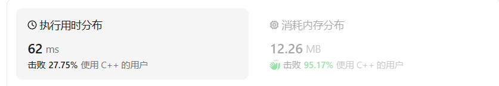
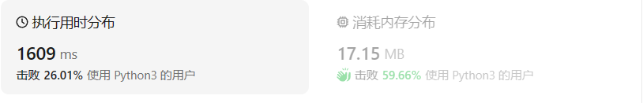
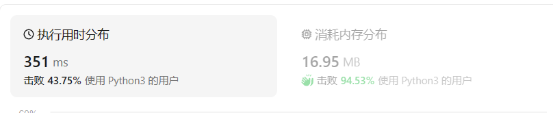

# 1.两数之和

## 题目描述

给定一个整数数组 `nums` 和一个整数目标值 `target`，请你在该数组中找出 **和为目标值** *`target`* 的那 **两个** 整数，并返回它们的数组下标。

你可以假设每种输入只会对应一个答案。但是，数组中同一个元素在答案里不能重复出现。

你可以按任意顺序返回答案。


**示例 1：**

```
输入：nums = [2,7,11,15], target = 9
输出：[0,1]
解释：因为 nums[0] + nums[1] == 9 ，返回 [0, 1] 。
```

**示例 2：**

```
输入：nums = [3,2,4], target = 6
输出：[1,2]
```

**示例 3：**

```
输入：nums = [3,3], target = 6
输出：[0,1]
```


**提示：**

- `2 <= nums.length <= 104`
- `-109 <= nums[i] <= 109`
- `-109 <= target <= 109`
- **只会存在一个有效答案**


**进阶：**你可以想出一个时间复杂度小于 `O(n2)` 的算法吗？

## 我的C++解法

```cpp
class Solution {
public:
    vector<int> twoSum(vector<int>& nums, int target) {
        //常规暴力解法：双for循环
        vector<int> result={0,0};
        for(int i=0;i<nums.size();i++){
            for(int j=i+1;j<nums.size();j++){
                if(nums[i]+nums[j]==target){
                    result[0]=i;
                    result[1]=j;
                    return result;
                }
            }
        }
        return result;
    }
};
```

结果：



但是存在一个问题：

若我的代码是这样的：

```cpp
vector<int> result[2];
result[0]=i;
result[1]=j;
```

那么会报错：`no viable overloaded '='`

目前未查阅资料，初步判断是声明和初始化result迭代器的方式不同，对对象的引用也不同

## C++参考答案

### 方法一：暴力破解

```cpp
class Solution {
public:
    vector<int> twoSum(vector<int>& nums, int target) {
        int n = nums.size();
        for (int i = 0; i < n; ++i) {
            for (int j = i + 1; j < n; ++j) {
                if (nums[i] + nums[j] == target) {
                    return {i, j};
                }
            }
        }
        return {};
    }
};
```

### 方法二：哈希表

获取当前值x，在哈希表中查找target-x是否存在。哈希查找时间o(1)

```cpp
class Solution {
public:
    vector<int> twoSum(vector<int>& nums, int target) {
        unordered_map<int, int> hashtable;
        for (int i = 0; i < nums.size(); ++i) {
            auto it = hashtable.find(target - nums[i]);
            if (it != hashtable.end()) {
                return {it->second, i};
            }
            hashtable[nums[i]] = i;
        }
        return {};
    }
};
```

解析：

1. `vector<int> twoSum(vector<int>& nums, int target)`：这是 `twoSum` 函数的声明。它接受两个参数：一个整数数组 `nums` 的引用（`vector<int>&`），以及一个目标整数 `target`。函数返回一个整数 `vector`。

2. `unordered_map<int, int> hashtable`：声明一个哈希表 `hashtable`，用于存储数组 `nums` 中的每个数字及其对应的索引。键是数组中的数字，值是该数字在数组中的索引。

3. `for (int i = 0; i < nums.size(); ++i)`：开始一个循环，遍历数组 `nums` 的每个元素。

4. `auto it = hashtable.find(target - nums[i])`：尝试在哈希表中查找 `target - nums[i]`。如果 `nums[i]` 之前的某个数字能够与当前数字 `nums[i]` 相加得到 `target`，则这个差值应该在哈希表中存在。

5. `if (it != hashtable.end())`：检查是否在哈希表中找到了元素。如果找到了（`it` 不等于 `hashtable.end()`），这意味着我们已经找到了两个数，它们的和等于 `target`。

6. `return {it->second, i}`：返回一个包含这两个数索引的 `vector`。`it->second` 是与 `target - nums[i]` 相匹配的数字在数组中的索引，而 `i` 是当前数字 `nums[i]` 的索引。

7. `hashtable[nums[i]] = i`：在哈希表中插入或更新当前数字 `nums[i]` 及其索引 `i`。

8. `return {};`：如果循环完成后没有找到匹配的数字对，返回一个空的 `vector`。

这个算法的关键在于使用哈希表来存储已经遍历过的数字及其索引，这样可以在常数时间内检查一个数字是否存在于哈希表中，从而大大提高了查找效率。这个解决方案的时间复杂度是 O(n)，其中 n 是数组 `nums` 的长度。

实际上是先创建一个空的哈希表，边遍历边存入数据，最后实际上是从后向前扫的。

## C++收获

1. 在本题中不用创建临时变量result，只用返回值设置为数组类型的实例即可。本题中`return {i,j};`就是最好的说明。

2. 哈希表的**声明**：`unordered_map<类型,类型>表名;`
   哈希表的**初始化**实例：`unordered_map<int,int>hashmap{{1,10},{2,12},{3,13}};`也可以这样：`unordered_map<int,int>hash_map{{{1,10},{2,13},{3,13}},3}`
   上面两个语句等价，后者是给定一个确定的值3表示哈希表中有三个键值对，而前者是自动识别，也有三个键值对
   哈希表**添加键值对**：`hash_map.insert({key,value});`
   **复制构造**（初始化新的表）:`unordered_map<int,int>hmap(hash_map);`

3. **find()函数**：
   以key作为参数寻找哈希表中的元素，如果哈希表中存在该key值则返回该位置上的迭代器，否则返回哈希表最后一个元素下一位置上的迭代器。
   举例：

   ```cpp
   unordered_map<int, int> hmap{ {1,10},{2,12},{3,13} };
   unordered_map<int, int>::iterator iter;
   iter = hmap.find(2); //返回key==2的迭代器，可以通过iter->second访问该key对应的元素
   if(iter != hmap.end())  cout << iter->second;
   ```

4. 对迭代器vector类型的初始化：
   1.默认初始化：`vector<int> vec`没有被只能怪大小或者元素，被默认初始化为一个空向量
   2.通过大小初始化：`vector<int> vec(10[,val]);`指定向量的大小来初始化，所有元素被默认初始化，若不指定val值，默认全为0；指定val，每个元素都是val
   3.通过数组或者另一个容器初始化：

   ```cpp
   int arr[] = {1, 2, 3, 4, 5};
   std::vector<int> vec(arr, arr + sizeof(arr) / sizeof(arr[0]));
   // 或者更简单的写法
   std::vector<int> vec{1, 2, 3, 4, 5};
   ```

   4.使用花括号初始化：`vector<int> vec[ = ]{1,2,3,4,5};`等号可选（花括号内容为空，创建空向量）
   5.使用vector的构造函数：
   `std::vector<int, std::allocator<int>> vec(10); // 显式指定了容器类型和分配器类型`
   5.vector的成员函数：
   `vec.resize(10 [,val]);`向量大小调整为10，新元素默认val
   6.使用std::mov来动态内存优化：
   `vector<int> tmp=std::move(vec);`


## 我的python答案

```python
class Solution:
    def twoSum(self, nums: List[int], target: int) -> List[int]:
        result=[0,0]
        for i in range(len(nums)):
            for j in range(i+1,len(nums)):
                if nums[i]+nums[j]==target:
                    result[0]=i
                    result[1]=j
                    return result
        return result
```

结果：



有一个问题就是在py中如何声明一个类型的变量？在此例中我是直接对result进行初始赋值操作。那如果result的长度不定呢？

## python参考答案

### 方法一：

```python
class Solution(object):
    def twoSum(self, nums, target):
        """
        :type nums: List[int]
        :type target: int
        :rtype: List[int]
        """
        # 遍历列表
        for i in range(len(nums)):
            # 计算需要找到的下一个目标数字
            res = target-nums[i]
                # 遍历剩下的元素，查找是否存在该数字
            if res in nums[i+1:]:
                # 若存在，返回答案。这里由于是两数之和，可采用.index()方法
                # 获得目标元素在nums[i+1:]这个子数组中的索引后，还需加上i+1才是该元素在nums中的索引
                return [i, nums[i+1:].index(res)+i+1]
```



### 方法二：哈希表

```python
def twoSum(nums, target):
    hashmap={}
    for ind,num in enumerate(nums):
        hashmap[num] = ind
    for i,num in enumerate(nums):
        j = hashmap.get(target - num)
        if j is not None and i!=j:
            return [i,j]
```

### 方法三：哈希表上的优化

```python
def twoSum(nums, target):
    hashmap={}
    for i,num in enumerate(nums):
        if hashmap.get(target - num) is not None:
            return [i,hashmap.get(target - num)]
        hashmap[num] = i #这句不能放在if语句之前，解决list中有重复值或target-num=num的情况
```


## python收获

1. 哈希表实际上是一个字典，内容都是键值对：`key:val` 但是在python中键值对之间是靠冒号链接的，C++中则是大括号里面用逗号分隔
2. `dict.get(key, default=None)`函数返回返回指定键的值，如果值不在字典中返回default值。因此方法三中都是把num的val映射到对应的索引上去，可以直接依赖key来等效查找val
3. 在对数组生成哈希表时，可以使用`enumerate`枚举函数把index和nums都映射到表中。`hashmap[num]=index`
4. 在py中不需要声明一个类型的变量，编译器会根据数据类型自动确认类型。本题中也不需要result的创建，因为可以直接返回一个用中括号包起来的整数对来表示list类型的结果。