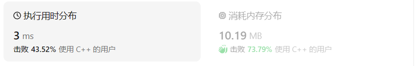
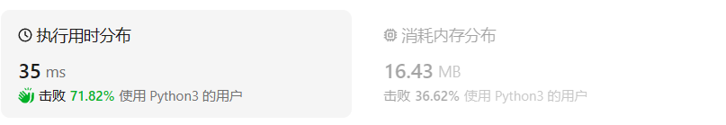

# 27.移除元素

## 题目描述

给你一个数组 `nums` 和一个值 `val`，你需要 **[原地](https://baike.baidu.com/item/原地算法)** 移除所有数值等于 `val` 的元素，并返回移除后数组的新长度。

不要使用额外的数组空间，你必须仅使用 `O(1)` 额外空间并 **[原地 ](https://baike.baidu.com/item/原地算法)修改输入数组**。

元素的顺序可以改变。你不需要考虑数组中超出新长度后面的元素。

 

**说明:**

为什么返回数值是整数，但输出的答案是数组呢?

请注意，输入数组是以**「引用」**方式传递的，这意味着在函数里修改输入数组对于调用者是可见的。

你可以想象内部操作如下:

```
// nums 是以“引用”方式传递的。也就是说，不对实参作任何拷贝
int len = removeElement(nums, val);

// 在函数里修改输入数组对于调用者是可见的。
// 根据你的函数返回的长度, 它会打印出数组中 该长度范围内 的所有元素。
for (int i = 0; i < len; i++) {
    print(nums[i]);
}
```

 

**示例 1：**

```
输入：nums = [3,2,2,3], val = 3
输出：2, nums = [2,2]
解释：函数应该返回新的长度 2, 并且 nums 中的前两个元素均为 2。你不需要考虑数组中超出新长度后面的元素。例如，函数返回的新长度为 2 ，而 nums = [2,2,3,3] 或 nums = [2,2,0,0]，也会被视作正确答案。
```

**示例 2：**

```
输入：nums = [0,1,2,2,3,0,4,2], val = 2
输出：5, nums = [0,1,3,0,4]
解释：函数应该返回新的长度 5, 并且 nums 中的前五个元素为 0, 1, 3, 0, 4。注意这五个元素可为任意顺序。你不需要考虑数组中超出新长度后面的元素。
```

 

**提示：**

- `0 <= nums.length <= 100`
- `0 <= nums[i] <= 50`
- `0 <= val <= 100`

## 我的C++解法

会想起在4.23的题目#1002中整理过有关C++vector类型操作的方法，其中erase()函数可以删去指定索引值上的数据，而不是根据具体数值来删除

```cpp
class Solution {
public:
    int removeElement(vector<int>& nums, int val) {
        //在4.23的题目1002中整理过关于vector的操作
        // nums.erase()
        nums.erase(remove(nums.begin(),nums.end(),val),nums.end());
        return nums.size();
    }
};
```

这里用到了remove函数，在收获里面细讲，来源是在CSDN上面查询vector的erase操作细则时博主给出的例子(帖子地址：[【C++】vector中erase用法](https://blog.csdn.net/Vcrossover/article/details/106243627))

结果：

下面是暴力解法，不适用remove函数：

```cpp
class Solution {
public:
    int removeElement(vector<int>& nums, int val) {
        //假设我不知道remove函数，那么思路就是找到val在nums中的索引，使用erase进行删除
        sort(nums.begin(),nums.end());
        for(int i=0;i<nums.size();i++){
            if(nums[i]==val){
                nums.erase(nums.begin()+i);
                i-=1;
            }
        }
        return nums.size();
    }
};
```

结果：

其实不进行排序也是可以的。在这个答案之前我的想法是借助之前收获得到的对vector类型进行二分查找binary_search()操作，因为我想当然地认为二分查找返回的是索引值，但是其实这个函数返回bool值，并不返回索引，这一点是在逐步输出推导得出的，然后去搜索相关资料证明了这一点。

## C++参考答案

参考答案都是使用指针来移动数组，而不是调用erase函数。

双循环暴力法：

```cpp
// 时间复杂度：O(n^2)
// 空间复杂度：O(1)
class Solution {
public:
    int removeElement(vector<int>& nums, int val) {
        int size = nums.size();
        for (int i = 0; i < size; i++) {
            if (nums[i] == val) { // 发现需要移除的元素，就将数组集体向前移动一位
                for (int j = i + 1; j < size; j++) {
                    nums[j - 1] = nums[j];
                }
                i--; // 因为下标i以后的数值都向前移动了一位，所以i也向前移动一位
                size--; // 此时数组的大小-1
            }
        }
        return size;

    }
};
```

过程：

双指针一次遍历法：

```cpp
// 时间复杂度：O(n)
// 空间复杂度：O(1)
class Solution {
public:
    int removeElement(vector<int>& nums, int val) {
        int slowIndex = 0;
        for (int fastIndex = 0; fastIndex < nums.size(); fastIndex++) {
            if (val != nums[fastIndex]) {
                nums[slowIndex++] = nums[fastIndex];
            }
        }
        return slowIndex;
    }
};
```

实现过程：

双指针的另一种写法：

```cpp
class Solution {
public:
    int removeElement(vector<int>& nums, int val) {
        int j = nums.size() - 1;
        for (int i = 0; i <= j; i++) {
            if (nums[i] == val) {
                swap(nums[i--], nums[j--]);
            }
        }
        return j + 1;
    }
};
```

其中的交换语句中的i--和我的第二种做法有异曲同工之妙，这样做即使最后一个元素也是要被删除的元素，下次循环中仍能被交换到后面去。

## C++收获

1. 对有序vector进行binary_search操作，返回的值是一个bool类型，而不是想当然的索引值。因此在尝试暴力的时候出错了。
2. vector中的remove函数得到的结果和双循环暴力破解得到的最后结果一样，都是把val移动到vect的末尾处而不是真正的删除，再结合erase函数删除尾部元素即可。这其中的逻辑是每一次使用了remove都会相应调用一次erase函数，因此不需要外部设置依据val个数的循环。
3. 如果已经获取要被删除的元素的索引值index，使用erase函数时的参数不能直接是index，而是`vec.begin()+index`。
4. 在对数组元素进行插入和删除操作时要记住插入/删除位点之后的所有元素都要一起移动，因此顺序表的性能差于链表，牵一发而动全身是很有可能的
5. C++中可以直接调用swap函数而不用重新定义
6. 感觉如果我没有学过/整理过C++vector类型的操作的化，我大概率会按照408数据结构编程题一样，进行双for循环暴力破解了

## 我的python解答

回想起昨天整理的对list类型的操作里面有删除指定元素，考虑使用：

```python
class Solution:
    def removeElement(self, nums: List[int], val: int) -> int:
        # nums.remove(val)#只会删除一个元素
        nums.sort()
        count=nums.count(val)
        for i in range(count):
            nums.remove(val)
        return len(nums)
```

在实际使用中发现删除指定元素只能删除从头到尾找到的第一个，因此尝试n次循环，通过调用count函数获取val在nums中的个数，重复进行删除（其实不用排序也可以）

结果：


## python参考答案

```python
while 1: try: nums.remove(val) except: break return len(nums)
```

一行流秒了。既然remove操作每次只会删除一个元素，那就套个循环

双指针：

```python
class Solution:
    def removeElement(self, nums: List[int], val: int) -> int:
        a = 0
        b = 0

        while a < len(nums):
            if nums[a] != val:
                nums[b] = nums[a]
                b += 1
            a += 1

        return b
```

这种写法nums[b:]是脏数据，只有nums[:b]是需要的数据

## python收获

巩固了对list类型数据操作的记忆，学了双指针的操作