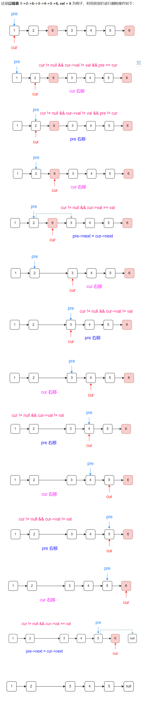
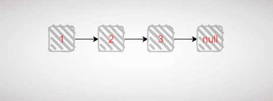

# 203移除链表元素

## 题目描述

给你一个链表的头节点 `head` 和一个整数 `val` ，请你删除链表中所有满足 `Node.val == val` 的节点，并返回 **新的头节点** 。

 

**示例 1：**


```
输入：head = [1,2,6,3,4,5,6], val = 6
输出：[1,2,3,4,5]
```

**示例 2：**

```
输入：head = [], val = 1
输出：[]
```

**示例 3：**

```
输入：head = [7,7,7,7], val = 7
输出：[]
```

 

**提示：**

- 列表中的节点数目在范围 `[0, 104]` 内
- `1 <= Node.val <= 50`
- `0 <= val <= 50`

## 我的C++解法

```cpp
/**
 * Definition for singly-linked list.
 * struct ListNode {
 *     int val;
 *     ListNode *next;
 *     ListNode() : val(0), next(nullptr) {}
 *     ListNode(int x) : val(x), next(nullptr) {}
 *     ListNode(int x, ListNode *next) : val(x), next(next) {}
 * };
 */
class Solution {
public:
    ListNode* removeElements(ListNode* head, int val) {
        if (head==nullptr)  return head;
        // cout<<head->val;//head有定义，不是无值的空节点
        ListNode* virtue_node=new ListNode(0);
        virtue_node->next=head;
        ListNode* p=head;//p指向head第一个节点
        ListNode* pre=virtue_node;
        // while(p!=nullptr){
        //     cout<<p->val<<"  ";
        //     p=p->next;
        // }可以正常输出，没有报错
        while(p->next!=nullptr){//循环到倒数第二个节点
            // cout<<p->val<<endl;
            if(p->val==val){//首届点为被删节点
                ListNode* tmp=p->next;
                p->next=nullptr;
                // delete(p);
                p=tmp;
                // delete(tmp);
                virtue_node->next=p;
            }
            else if(p->next->val==val){
                ListNode* tmp=p->next;
                p->next=tmp->next;
                tmp->next=nullptr;
                // delete(tmp);
            }
            else{p=p->next;pre=pre->next;}
        }
        if(p->val==val){
            pre->next=nullptr;
            // delete(p);
        }
        
        head=virtue_node->next;
        return head;
    }
};
```

结果：

这个结果我知道有问题，就是没有把多余的要被删除的元素给释放掉内存。但是如果把注释的所有delete语句不注释，那就会报错`ERROR: AddressSanitizer: heap-use-after-free on address 0x502000000278 at pc 0x558e2f2d2103 bp 0x7ffdc1baf5e0 sp 0x7ffdc1baf5d8`这个问题有待解决。

## C++参考答案

### 方法一：就地解决

```cpp
class Solution {
public:
    ListNode* removeElements(ListNode* head, int val) {
        // 删除头结点
        while (head != NULL && head->val == val) { // 注意这里不是if
            ListNode* tmp = head;
            head = head->next;
            delete tmp;
        }

        // 删除非头结点
        ListNode* cur = head;
        while (cur != NULL && cur->next!= NULL) {
            if (cur->next->val == val) {
                ListNode* tmp = cur->next;
                cur->next = cur->next->next;
                delete tmp;
            } else {
                cur = cur->next;
            }
        }
        return head;
    }
};
```

此方法是在原链表上直接进行修改的，首先需要对头节点进行判断，需要单独写一个循环。如果头节点是需要被删除的节点，则定义一个tmp指向原始头，新头在原始头的基础上后移一位，然后释放tmp节点即可。重复此操作就可以找到头节点的最终位置。

另一种写法：

```cpp
class Solution {
public:
    ListNode* removeElements(ListNode* head, int val) {
        while (head && head->val == val) {
            head = head->next;
        }

        if (!head) {
            return head;
        }

        ListNode* pre = head;
        while (pre->next) {
            if (pre->next->val == val) {
                pre->next = pre->next->next;
            } else {
                pre = pre->next;
            }
        }
        return head;
    }
};
```

双指针写法：

```cpp
class Solution {
public:
    ListNode* removeElements(ListNode* head, int val) {
        while (head && head->val == val) {
            head = head->next;
        }
        
        ListNode* cur = head;
        ListNode* pre = head;
        while (cur) {
            if (cur->val == val) {
                pre->next = cur->next;
            } else {
                pre = cur;
            }
            cur = cur->next;
        }
        return head;
    }
};
```

原理：

### 方法二：设置虚拟空头节点

```cpp
class Solution {
public:
    ListNode* removeElements(ListNode* head, int val) {
        ListNode* dummyHead = new ListNode(0); // 设置一个虚拟头结点
        dummyHead->next = head; // 将虚拟头结点指向head，这样方便后面做删除操作
        ListNode* cur = dummyHead;
        while (cur->next != NULL) {
            if(cur->next->val == val) {
                ListNode* tmp = cur->next;
                cur->next = cur->next->next;
                delete tmp;
            } else {
                cur = cur->next;
            }
        }
        head = dummyHead->next;
        delete dummyHead;
        return head;
    }
};
```

把我的做法中的前两个if合并就得到了这个版本的答案。现在看来我的做法还是太笨了，把不需要拆分出的操作给拆分出来，徒增工作量

### 方法三：递归

```cpp
class Solution {
public:
    ListNode* removeElements(ListNode* head, int val) {
        if(!head) {
            return head;
        }

        head->next = removeElements(head->next,val);
        return head->val == val ? head->next : head;
    }
};
```

以链表 **1->2->3-null** 为例子，删除值为 3 的节点，递归的具体过程如下动图示：



递归的代码容易理解但是不容易写出来

## C++收获

### 链表的定义和初始化

定义：

```cpp
// 单链表
struct ListNode {
    int val;  // 节点上存储的元素
    ListNode *next;  // 指向下一个节点的指针
    ListNode(int x) : val(x), next(NULL) {}  // 节点的构造函数
};
```

其中第五行是节点的构造函数。可以写可以不写，因为C++默认生成一个构造函数。但是默认的构造函数不能再初始化的时候给变量赋值。

```cpp
ListNode* head = new ListNode(5);
//第一行代码如果自己定义了构造函数的话是可行的
ListNode* head = new ListNode();
head->val = 5;
//这两行代码用于没有定义构造函数，执行先定义再赋值
```

### 链表相关报错

`runtime error: member access within null pointer of type 'ListNode' (solution.cpp)`报错是因为试图访问ListNode空指针类型的成员。问题在于当移除的元素位于链表最后一个时，此时cur指向最后一个结点，cur->next为空，而访问cur->nex->next就是访问空指针的成员变量了。

`ERROR: AddressSanitizer: alloc-dealloc-mismatch (operator new vs free) on 0x502000000090`则是因为new和delete或者malloc和free没有成对使用

`ERROR: AddressSanitizer: heap-use-after-free on address 0x502000000278 at pc 0x558e2f2d2103 bp 0x7ffdc1baf5e0 sp 0x7ffdc1baf5d8`内存错误"heap-use-after-free"，这是因为在C++中，当使用delete关键字释放对象的内存后，该对象仍然会保留指向已经被释放内存的指针。这个指针称为悬挂指针（Dangling Pointer）。如果我们试图访问已经被释放的内存，就会触发"heap-use-after-free"错误。

### 链表中NULL和Nullptr的区别

用Null表示空指针是C语言中遗留下来的传统，但在C++中可能会引起问题，因此在C++11中引入了nullptr表示空指针，如果要在C++中表示空指针，那么使用nullptr而不是Null.。

### 链表中的new和delete操作对

在C++中，`new` 和 `delete` 操作符是对动态内存分配和管理的基本工具。它们允许程序员在堆上分配和释放内存，这是一块在程序运行时可以动态增长和缩小的内存区域。链表是展示 `new` 和 `delete` 如何工作的一个很好的例子，因为链表的每个节点通常都是动态分配的。

#### new 操作符

`new` 是一个运算符，用于在堆上分配一块内存。当你使用 `new` 分配内存时，它会：

1. 找到足够大的内存块来存储你的数据。
2. 初始化这块内存（通常填充为零）。
3. 返回一个指向这块内存的指针。

对于构造对象，`new` 还会调用对象的构造函数来初始化对象。

#### delete 操作符

`delete` 用于释放之前使用 `new` 分配的内存。当你使用 `delete` 时，它会：

1. 调用对象的析构函数（如果指针是指向一个对象的）。
2. 释放指向的内存块，使其可以被未来的 `new` 调用重新使用。

#### 使用 new 和 delete 的示例

假设我们有一个简单的链表节点类 `ListNode`：

```cpp
class ListNode {
public:
    int value;
    ListNode* next;

    ListNode(int val) : value(val), next(nullptr) {}
    ~ListNode() {
        // 清洁工作，比如删除指向下一个节点的指针
        next = nullptr;
    }
};
```

我们可以使用 `new` 和 `delete` 来创建和销毁链表：

```cpp
int main() {
    // 使用 new 分配并构造一个链表节点
    ListNode* head = new ListNode(1);

    // 创建更多的节点并构建链表
    head->next = new ListNode(2);
    head->next->next = new ListNode(3);

    // ... 链表操作 ...

    // 使用 delete 释放链表节点
    delete head->next->next; // 删除第三个节点
    head->next = nullptr;    // 断开链接，防止访问已删除的内存
    delete head->next;       // 删除第二个节点
    delete head;              // 删除第一个节点

    return 0;
}
```

#### 注意事项

- **成对使用**：每次使用 `new` 分配内存后，都应该有相应的 `delete` 来释放内存，以避免内存泄漏。
- **析构函数**：如果对象有析构函数，`delete` 会调用它。这对于管理资源（如文件句柄、套接字等）非常重要。
- **悬挂指针**：释放内存后，原始指针应设置为 `nullptr`，以避免悬挂指针问题。
- **new 异常**：如果内存分配失败，`new` 会抛出一个 `std::bad_alloc` 异常。你应该总是在使用 `new` 的地方考虑异常安全性。
- **delete[] 和 new[]**：如果你使用 `new[]` 分配了一个数组，应该使用 `delete[]` 来释放它，以确保正确调用析构函数。

正确使用 `new` 和 `delete` 对于避免内存泄漏和其他动态内存管理问题至关重要。在现代C++编程中，智能指针（如 `std::unique_ptr` 和 `std::shared_ptr`）被推荐用于自动管理动态分配的内存，减少内存管理错误。

### 链表中的malloc和free操作对

在C++中，`malloc` 和 `free` 是C语言标准库中的函数，它们用于动态内存分配和管理。虽然C++提供了自己的 `new` 和 `delete` 操作符来分配和释放动态内存，但 `malloc` 和 `free` 仍然可以在C++程序中使用，尤其是当与C语言代码交互或者在一些特定的、需要 `malloc` 和 `free` 的上下文中。

#### malloc 函数

`malloc` 函数是C标准库中的一个函数，它用于在堆上分配一块指定大小的内存。它的原型定义在 `<cstdlib>` 头文件中：

```cpp
void* malloc(size_t size);
```

- `size_t size`：要分配的内存大小，单位是字节。
- 返回值：如果分配成功，返回一个指向分配内存的起始地址的空指针；如果失败，返回 `nullptr`。

#### free 函数

`free` 函数用于释放之前使用 `malloc` 或 `calloc` 分配的内存。它的原型也定义在 `<cstdlib>` 头文件中：

```cpp
void free(void* ptr);
```

- `void* ptr`：指向要释放内存的指针。
- 无返回值。

#### 使用 malloc 和 free 的示例

```cpp
#include <cstdlib> // 包含 malloc 和 free 的定义
#include <iostream>

int main() {
    // 分配内存来存储一个整数
    int* p = static_cast<int*>(malloc(sizeof(int)));

    if (p == nullptr) {
        std::cerr << "Memory allocation failed." << std::endl;
        return 1;
    }

    // 使用分配的内存
    *p = 10;
    std::cout << "Value at p: " << *p << std::endl;

    // 释放内存
    free(p);
    p = nullptr; // 将指针设置为 nullptr，避免悬挂指针

    return 0;
}
```

#### 注意事项

- **类型转换**：`malloc` 返回 `void*` 类型，使用前需要转换为适当的指针类型。
- **构造函数和析构函数**：与 `new` 和 `delete` 不同，`malloc` 不会自动调用对象的构造函数或析构函数。如果分配的是对象的内存，需要手动调用构造函数和析构函数。
- **内存泄漏**：使用 `malloc` 分配的内存必须匹配地使用 `free` 来释放，否则会导致内存泄漏。
- **错误处理**：`malloc` 在内存分配失败时返回 `nullptr`，使用前应检查返回值。
- **跨语言交互**：`malloc` 和 `free` 常用于C和C++代码的交互，因为它们是C语言标准的一部分，而C++的 `new` 和 `delete` 不是。

#### 与 new 和 delete 的比较

- **构造和析构**：`new` 和 `delete` 会自动处理对象的构造和析构，而 `malloc` 和 `free` 不会。
- **类型安全**：`new` 和 `delete` 是类型安全的，它们确保指针类型与分配的内存类型匹配；`malloc` 和 `free` 需要显式转换指针类型。
- **异常安全性**：`new` 在分配失败时会抛出异常，而 `malloc` 只会返回 `nullptr`。

**在C++中，推荐使用 `new` 和 `delete` 来分配和释放对象的内存**，因为它们与C++的异常处理和类型系统更加集成。然而，在某些特殊的、需要与C代码交互或者需要手动管理内存大小的情况下，`malloc` 和 `free` 仍然是有用的工具。

## 我的python解答

```python
# Definition for singly-linked list.
# class ListNode:
#     def __init__(self, val=0, next=None):
#         self.val = val
#         self.next = next
class Solution:
    def removeElements(self, head: Optional[ListNode], val: int) -> Optional[ListNode]:
        virtur_node=ListNode(0,head)
        pre=virtur_node
        p=head
        while p!=None:
            if p.val==val:
                pre.next=p.next
                # tmp=p
                p=p.next
                # free(tmp)
            else:
                pre=pre.next
                p=p.next
        head=virtur_node.next
        return head
```

结果：

相较于C++，python更加容易写出来

有一个点没有注意到就是如果使用java或者python则不需要手动管理内存

## python参考答案

### 方法一：递归

```python
class Solution:
    def removeElements(self, head: ListNode, val: int) -> ListNode:
        if not head: return 
        head.next = self.removeElements(head.next, val)
        return head.next if head.val == val else head
```

### 方法二：原地修改——单指针迭代

```python
class Solution:
    def removeElements(self, head: ListNode, val: int) -> ListNode:
        while head and head.val == val:
            head = head.next
        if not head: return
        pre = head
        while pre.next:
            if pre.next.val == val:
                pre.next = pre.next.next
            else:
                pre = pre.next
        return head
```

### 方法三：原地修改——双指针

```python
class Solution:
    def removeElements(self, head: ListNode, val: int) -> ListNode:
        while head and head.val == val:
            head = head.next
        pre, cur = head, head
        while cur:
            if cur.val == val:
                pre.next = cur.next
            else:
                pre = cur
            cur = cur.next         
        return head
```

### 方法四：虚拟头节点

```python
# Definition for singly-linked list.
# class ListNode:
#     def __init__(self, val=0, next=None):
#         self.val = val
#         self.next = next
class Solution:
    def removeElements(self, head: Optional[ListNode], val: int) -> Optional[ListNode]:
        # 创建虚拟头部节点以简化删除过程
        dummy_head = ListNode(next = head)
        
        # 遍历列表并删除值为val的节点
        current = dummy_head
        while current.next:
            if current.next.val == val:
                current.next = current.next.next
            else:
                current = current.next
        
        return dummy_head.next
```


## python收获

###  py定义链表

```python
class ListNode:
    def __init__(self, val, next=None):
        self.val = val
        self.next = next
```

py判断节点是否为空不用 `p!=none`这样的写法，直接`if !p`即可，这样就完成了对p节点是否为空的判断。

py无需手动删除不需要节点的内存空间，它会自动删除。因此和C++不同，有节点pre和后继p，删除p：`pre.next=p.next;p=p.next`就可以了，不用像C++那样定义一个tmp在对其进行delete操作。

### 创建和释放链表的节点

在Python中，创建和释放链表节点通常涉及到类的定义和引用计数的管理。Python本身并没有内置的链表数据结构，但可以通过类来模拟链表的行为。下面是一个简单的单链表节点类的定义，以及如何创建和释放节点的示例。

#### 单链表节点类的定义

```python
class ListNode:
    def __init__(self, value=0, next=None):
        self.value = value  # 节点存储的值
        self.next = next    # 指向下一个节点的指针
```

在这个类中，每个节点包含一个值（`value`）和一个指向下一个节点的指针（`next`）。`next` 默认为 `None`，表示链表的末尾。

#### 创建链表节点

创建链表节点非常简单，只需要实例化 `ListNode` 类：

```python
# 创建头节点（可以不存储实际数据）
head = ListNode()

# 创建其他节点
node1 = ListNode(1)
node2 = ListNode(2)
node3 = ListNode(3)

# 构建链表
head.next = node1
node1.next = node2
node2.next = node3
```

#### 释放链表节点

在Python中，内存管理是自动的，使用了引用计数和垃圾回收机制。当一个对象的引用计数降到0时，Python解释器会自动调用对象的 `__del__` 方法并释放内存。但是，对于链表这种包含多个对象引用的场景，我们需要手动将不再使用的节点的引用设置为 `None`，以避免循环引用导致的内存泄漏。

```python
# 假设我们要释放 node2
node2.next = None  # 断开对下一个节点的引用

# 由于 node2 没有其他引用指向它，它的引用计数变为0，Python会自动垃圾回收
node3 = None  # 同样，释放 node3
```

#### 注意事项

- **循环引用**：在链表中，如果不注意，可能会形成循环引用，导致引用计数永远不会降到0，从而造成内存泄漏。因此，当链表节点不再需要时，应手动将相关引用设置为 `None`。
- ** `__del__` 方法**：虽然Python会自动管理内存，但如果你想要自定义销毁链表节点时的行为（比如释放外部资源），可以为 `ListNode` 类定义一个 `__del__` 方法。
- **内存管理**：在Python中，通常不需要手动管理内存，但是对于复杂的数据结构，如链表，了解引用计数和垃圾回收的原理是有益的。

#### 使用上下文管理器

为了更安全地管理链表节点的生命周期，可以使用Python的上下文管理器：

```python
class ListNode:
    def __init__(self, value=0):
        self.value = value
        self.next = None

    def __del__(self, value=None):
        print(f"ListNode({self.value}) has been deleted.")

# 使用 with 语句
with ListNode(1) as node:
    print(node.value)
# 输出: ListNode(1) has been deleted.
```

使用 `with` 语句和上下文管理器可以确保即使发生异常，链表节点也能被正确地清理。这是一种编写更安全代码的方法，尤其是在涉及到资源管理时。

