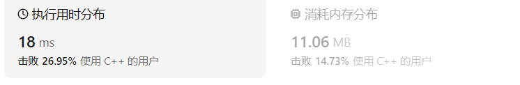
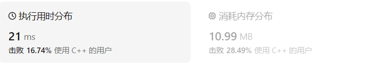

# 383赎金信

[383. 赎金信 ](https://leetcode.cn/problems/ransom-note/description/)

最无助的一集，本来这个文件已经写好了，内容很全面了，按ctrl+4换标题等级的时候不小心按了crtl+w，突然就少了一堆东西。然后脑子一抽，又按了一次，这次整个文件一个字也没了，然后继续脑残，又按了一次，文件直接关闭了，tm我还没保存数据。重新打开，内容完全变成模板了，辛苦写的思路全没了。

## 题目描述

给你两个字符串：`ransomNote` 和 `magazine` ，判断 `ransomNote` 能不能由 `magazine` 里面的字符构成。

如果可以，返回 `true` ；否则返回 `false` 。

`magazine` 中的每个字符只能在 `ransomNote` 中使用一次。

 

**示例 1：**

```
输入：ransomNote = "a", magazine = "b"
输出：false
```

**示例 2：**

```
输入：ransomNote = "aa", magazine = "ab"
输出：false
```

**示例 3：**

```
输入：ransomNote = "aa", magazine = "aab"
输出：true
```

 

**提示：**

- `1 <= ransomNote.length, magazine.length <= 105`
- `ransomNote` 和 `magazine` 由小写英文字母组成

## 我的C++解法

```cpp
class Solution {
public:
    bool canConstruct(string ransomNote, string magazine) {
        //基本思想就是统计出现次数，调用哈希表
        unordered_map<char,int> hash_map;
        for(char x:magazine){
            hash_map[x]+=1;
        }
        for(char x:ransomNote){
            hash_map[x]-=1;
        }
        //如果哈希表中有小于0的val，返回false
        for(auto it = hash_map.begin();it!=hash_map.end();++it){
            if(it->second<0) return false;
        }
        return true;
    }
};
```

结果：



创建哈希表并进行循环。

可优化的点在与对结果哈希表的遍历，可以直接在做减法的时候就判断是否小于0。

```cpp
class Solution {
public:
    bool canConstruct(string ransomNote, string magazine) {
        //基本思想就是统计出现次数，调用哈希表
        unordered_map<char,int> hash_map;
        for(char x:magazine){
            hash_map[x]+=1;
        }
        for(char x:ransomNote){
            hash_map[x]-=1;
            if(hash_map[x]<0)   return false;
        }
    return true;
    }
};
```

结果：



比上一个结果要好一点。

然后又瞥了一眼题目描述里面的提示，字符串都是由小写字母组成，那么可以继续优化：把哈希表用静态数组的方式创建，需要的开销更小：

```cpp
class Solution {
public:
    bool canConstruct(string ransomNote, string magazine) {
        int map[26];
        for(char x:magazine){
            map[x-'a']+=1;
        }
        for(char x:ransomNote){
            map[x-'a']-=1;
            if(map[x-'a']<0)    return false;
        }
        return true;
    }
};
```

结果：


这下结果更好了。

现阶段我只能想到这三种效率递进的方案。

## C++参考答案

### 暴力枚举

```cpp
class Solution {
public:
    bool canConstruct(string ransomNote, string magazine) {
        for (int i = 0; i < magazine.length(); i++) {
            for (int j = 0; j < ransomNote.length(); j++) {
                // 在ransomNote中找到和magazine相同的字符
                if (magazine[i] == ransomNote[j]) {
                    ransomNote.erase(ransomNote.begin() + j); // ransomNote删除这个字符
                    break;
                }
            }
        }
        // 如果ransomNote为空，则说明magazine的字符可以组成ransomNote
        if (ransomNote.length() == 0) {
            return true;
        }
        return false;
    }
};
```

这个暴力枚举我可能还写不出来，因为不知道如果删除字符串中的指定元素。印象里面有erase的身影，但是不会用。

### 静态数组哈希表

一些同学可能想，用数组干啥，都用map完事了，**其实在本题的情况下，使用map的空间消耗要比数组大一些的，因为map要维护红黑树或者哈希表，而且还要做哈希函数，是费时的！数据量大的话就能体现出来差别了。 所以数组更加简单直接有效！**

```cpp
class Solution {
public:
    bool canConstruct(string ransomNote, string magazine) {
        int record[26] = {0};
        //add
        if (ransomNote.size() > magazine.size()) {
            return false;
        }
        for (int i = 0; i < magazine.length(); i++) {
            // 通过record数据记录 magazine里各个字符出现次数
            record[magazine[i]-'a'] ++;
        }
        for (int j = 0; j < ransomNote.length(); j++) {
            // 遍历ransomNote，在record里对应的字符个数做--操作
            record[ransomNote[j]-'a']--;
            // 如果小于零说明ransomNote里出现的字符，magazine没有
            if(record[ransomNote[j]-'a'] < 0) {
                return false;
            }
        }
        return true;
    }
};
```

```cpp
class Solution {
public:
    bool canConstruct(string ransomNote, string magazine) {
        int cnt[26]{};
        for (char& c : magazine) {
            ++cnt[c - 'a'];
        }
        for (char& c : ransomNote) {
            if (--cnt[c - 'a'] < 0) {
                return false;
            }
        }
        return true;
    }
};
```

```cpp
class Solution {
public:
    bool canConstruct(string ransomNote, string magazine) {
        if (ransomNote.size() > magazine.size()) {
            return false;
        }
        vector<int> cnt(26);
        for (auto & c : magazine) {
            cnt[c - 'a']++;
        }
        for (auto & c : ransomNote) {
            cnt[c - 'a']--;
            if (cnt[c - 'a'] < 0) {
                return false;
            }
        }
        return true;
    }
};
```

### 删除字符串元素

```cpp
class Solution {
public:
    bool canConstruct(string ransomNote, string magazine) {
        for(int i = 0; i < ransomNote.size(); i++){
            int a = magazine.find(ransomNote[i]);
            if(a != -1){
                magazine[a] = '0';
            }else{
                return false;
            }
        }
        return true;
    }
};
```

## C++收获

### C++中的静态数组

#### 声明和初始化

声明静态数组时，必须指定数组的大小。数组可以在声明时初始化，也可以稍后在程序中初始化。

```cpp
// 声明并初始化一个静态数组
int myArray[5] = {1, 2, 3, 4, 5};

// 仅声明一个静态数组（未初始化的数组元素将自动初始化为0）
double otherArray[4];
int arr[26]={0};
int arr[26]{};
int arr[26];
//上面做法都生成并初始化固定大小的数组，初始元素均设置为0

std::string staticStringArray[3]; // 所有字符串元素都被默认构造为空字符串

//使用 std::fill 或 std::fill_n 函数来初始化数组的元素。
int staticArray[5];
std::fill(staticArray, staticArray + 5, -1); // 将所有元素初始化为-1
int value = 10;
std::fill_n(staticArray, 5, value); // 将所有元素初始化为10
```

#### 大小固定

静态数组的大小是固定的，一旦声明，就不能改变。这意味着你不能在程序运行过程中添加或删除数组中的元素。

#### 存储位置

静态数组在栈上分配内存，这是因为它们的整个生命周期与程序的整个运行时间相同，且大小在编译时已知。

#### 访问数组元素

可以通过索引来访问静态数组的元素，索引从0开始。

```cpp
int value = myArray[2]; // 获取数组第三个元素的值，结果是3
```

#### 使用范围for循环

C++11标准引入了基于范围的for循环，它可以用来方便地遍历数组。

```cpp
for (int num : myArray) {
    std::cout << num << " ";
}
```

#### 函数外部数组

如果静态数组在函数外部声明，它具有全局生命周期，即它从程序开始运行时存在，直到程序结束。

```cpp
static int globalArray[10]; // 全局静态数组
```

这里的 `static` 关键字不是类型的一部分，而是指示编译器该数组具有静态存储期，即使用静态内存分配。

#### 函数内部数组

如果静态数组在函数内部声明，它具有静态存储期，这意味着它在程序的整个运行时间内都存在，而不是仅仅在函数调用期间。

```cpp
void someFunction() {
    static int staticArray[10]; // 函数内部的静态数组
    // ...
}
```

在这种情况下，`staticArray` 在第一次函数调用时被初始化，并且在后续的函数调用中保持其值。

#### 注意事项

- 静态数组的大小必须在编译时已知，不能使用变量或运行时计算的表达式来指定大小。
- 静态数组的元素在声明时未显式初始化的，将自动初始化为0（对于基本数据类型）。
- 静态数组不能使用 `new` 或 `delete` 操作符进行动态内存分配。

### C++删除字符串中的某个元素

#### 使用 `std::string` 的 `erase` 方法

如果你使用的是 `std::string` 类型，可以直接使用它的 `erase` 方法来删除指定位置的字符。

```cpp
#include <string>

std::string str = "Hello, World!";
str.erase(5, 1); // 删除索引为5的字符，参数为删除的起始位置和数量
```

#### 使用 `std::remove` 和 `std::string` 的 `erase`

`std::remove` 是一个标准库算法，它可以用来**移除满足特定条件的元素**。通常与 `std::string` 的 `erase` 方法结合使用。

```cpp
#include <algorithm> // for std::remove
#include <string>

std::string str = "Hello, World!";
auto new_end = std::remove(str.begin(), str.end(), 'o'); // 移除所有 'o' 字符
str.erase(new_end, str.end());
```

#### 使用循环和 `std::string` 的 `clear`

如果你需要基于某种条件删除字符，可以使用循环来手动删除它们。

```cpp
#include <string>

std::string str = "Hello, World!";
str.clear(); // 清空字符串
for (char c : "Hello, World!") {
    if (c != 'o') {
        str.push_back(c); // 只添加不是 'o' 的字符
    }
}
```

#### 注意事项

- `std::string` 是一个可变容器，这意味着你可以修改它的大小和内容。
- `erase` 方法会移除字符串中的一个或多个字符，并返回一个新的字符串结尾的迭代器。
- `std::remove` 不会修改原始字符串，但它会返回一个新的迭代器，指向满足条件的最后一个元素之后的位置。你需要使用 `erase` 方法来实际删除这些元素。

选择哪种方法取决于你的具体需求，例如你要删除特定的字符、基于条件删除字符，或者删除特定位置的字符。在处理字符串时，`std::string` 提供了灵活的方法来修改和操作字符串内容。

### C++中for循环中`&`的差异

在C++中，`for` 循环的遍历方式对变量的引用和复制有重要影响。以下是 `for (char& c : magazine)` 和 `for (char c : magazine)` 两种形式的区别：

#### 1. `for (char& c : magazine)`

这种形式使用引用来遍历 `magazine` 中的元素。在这种情形下，`c` 是对 `magazine` 中每个字符的引用，而不是字符的副本。这意味着你对 `c` 所做的任何修改都会直接反映在 `magazine` 字符串中。

```cpp
for (char& c : magazine) {
    c = 'X'; // 直接修改magazine中的字符
}
```

#### 2. `for (char c : magazine)`

这种形式通过值来遍历 `magazine` 中的元素。这里，`c` 是 `magazine` 中每个字符的副本。因此，任何对 `c` 的修改都不会影响原始的 `magazine` 字符串。

```cpp
for (char c : magazine) {
    c = 'X'; // 修改的是c的副本，不会影响magazine
}
```

#### 区别和用途

- **引用（`char& c`）**：当你需要修改容器中的元素时使用。它允许你在循环内部直接修改 `magazine` 中的字符。
- **值（`char c`）**：当你只需要读取容器中的元素，不需要修改它们时使用。它为每个遍历的元素创建了一个临时副本。

#### 注意事项

- 当你使用引用遍历时（`char& c`），需要确保容器中的元素不是 `const` 类型的，否则你会得到一个编译错误，因为尝试修改一个 `const` 元素是不允许的。
- 使用引用遍历通常更高效，因为它避免了不必要的复制。但是，如果你的循环逻辑不需要修改元素，使用值遍历（`char c`）可以避免潜在的错误，并使代码的意图更加明确。

在处理字符串时，选择哪种形式取决于你是否需要修改字符串中的字符。如果需要修改，使用引用；如果不需要，使用值。

## 我的python解答

一看到这个题就想起了Counter函数：

```python
class Solution:
    def canConstruct(self, ransomNote: str, magazine: str) -> bool:
        count = collections.Counter([elem for elem in magazine])
        for x in ransomNote:
            count[x]-=1
            if count[x]<0:  return False
        return True
```

结果：


优化点在用数组代替字典：

```python
class Solution:
    def canConstruct(self, ransomNote: str, magazine: str) -> bool:
        # 尝试使用数组
        arr = [0]*26
        char = 'a'
        for x in magazine:
            # arr[x-'a']+=1
            # 原来py不能直接用字符串相减得到ASCII
            arr[ord(x)-ord(char)]+=1
        for x in ransomNote:
            # arr[x-'a']-=1
            arr[ord(x)-ord(char)]-=1
            if arr[ord(x)-ord(char)]<0:    return False
        return True
```

结果：


好了很多啊这效果。

## python参考答案

### Counter函数一行流

```python
class Solution:
    def canConstruct(self, ransomNote: str, magazine: str) -> bool:
        return Counter(ransomNote) <= Counter(magazine)
```

我想到了用Counter函数，但是没有想到可以使用两个counter函数，更没想到两个counter还可以进行比较。

### 移除字母

for 循环遍历 magazine 的列表 m ，如果 m 中有字母在 ransomNote 的列表 r 中，代表 ransomNote 中该字符能由 magazine 里面的字符构成，则将列表r中的该字母去除。最后判断 ransomNote 列表的长度，如果为 0，代表里面所有字符可以由 magazine 里的字符构成，返回 True，反之不行，返回 False。

```python
class Solution:
    def canConstruct(self, ransomNote: str, magazine: str) -> bool:
        m = list(magazine)
        r = list(ransomNote)
        for i in range(0, len(m)):
            if m[i] in r:
                r.remove(m[i])
        if len(r) == 0:
            return True
        else:
            return False
```

## python收获

### py获取字符的ASCII

因为在py中无法像C++一样两个字符做差得到相对位置，在py中无法实现两个str类型数据的减法操作，因此需要借助ascii转化

获取字符的ascii使用函数：`ord()`

ASCII转字符使用函数：`chr()`

```python
>>> ch = 'g'
>>> ord(ch)
103
>>> chr(103)
'g'
```

