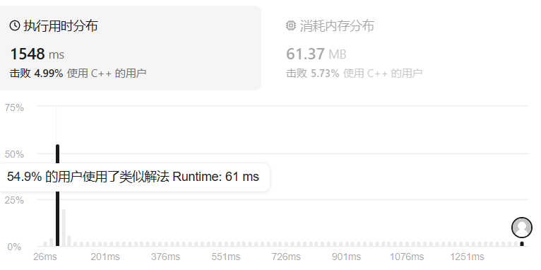
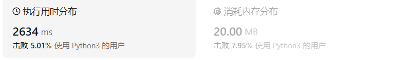

# 15三数之和（中等）

[15. 三数之和 ](https://leetcode.cn/problems/3sum/description/)

## 题目描述

给你一个整数数组 `nums` ，判断是否存在三元组 `[nums[i], nums[j], nums[k]]` 满足 `i != j`、`i != k` 且 `j != k` ，同时还满足 `nums[i] + nums[j] + nums[k] == 0` 。请

你返回所有和为 `0` 且不重复的三元组。

**注意：**答案中不可以包含重复的三元组。

 

**示例 1：**

```
输入：nums = [-1,0,1,2,-1,-4]
输出：[[-1,-1,2],[-1,0,1]]
解释：
nums[0] + nums[1] + nums[2] = (-1) + 0 + 1 = 0 。
nums[1] + nums[2] + nums[4] = 0 + 1 + (-1) = 0 。
nums[0] + nums[3] + nums[4] = (-1) + 2 + (-1) = 0 。
不同的三元组是 [-1,0,1] 和 [-1,-1,2] 。
注意，输出的顺序和三元组的顺序并不重要。
```

**示例 2：**

```
输入：nums = [0,1,1]
输出：[]
解释：唯一可能的三元组和不为 0 。
```

**示例 3：**

```
输入：nums = [0,0,0]
输出：[[0,0,0]]
解释：唯一可能的三元组和为 0 。
```

 

**提示：**

- `3 <= nums.length <= 3000`
- `-105 <= nums[i] <= 105`

## 我的C++解法

不得不说，这个题确实有难度，先尝试了暴力的三个for循环都出现了不少错误

```cpp
class Solution {
public:
    vector<vector<int>> threeSum(vector<int>& nums) {
        //时间复杂度o(n^3)的暴力
        vector<vector<int>> result;
        int n = nums.size();
        for(int i=0;i<n-2;i++){
            for(int j=i+1;j<n-1;j++){
                for(int k=j+1;k<n;k++){
                    if(nums[i]+nums[j]+nums[k]==0){
                        vector<int> tmp;
                        tmp.push_back(nums[i]);
                        tmp.push_back(nums[j]);
                        tmp.push_back(nums[k]);
                        sort(tmp.begin(),tmp.end());
                        if(find(result.begin(),result.end(),tmp)==result.end()){
                            result.push_back(tmp);
                        }
                    }
                }
            }
        }
        return result;
    }
};
```

不出意外地超时了。出现的问题在于没有保证数组不会重复出现；不会使用期望的`[].append()`操作（类python）；不知道`result.push_back([].push_back(nums[i],...))`对不对以及到底应该怎么写；在vector中查找元素的方法又忘了，调用的是`result.find(tmp)`，这个写法是错误的。

尝试优化：降低时间复杂度为o(n^2)

```cpp
class Solution {
public:
    vector<vector<int>> threeSum(vector<int>& nums) {
        //要不创建一个二维数组，存储nums的二维加和 实际上只需要上三角或者下三角即可
        int n = nums.size();
        vector<vector<int>> result;
        // int sum2[n-1][n];
        for(int i=0;i<n-1;i++){
            for(int j=i+1;j<n;j++){
                // sum2[i][j]=nums[i]+nums[j];
                int cur = nums[i]+nums[j];
                if(find(nums.begin()+j,nums.end(),0-cur)!=nums.end()){
                    //如果能在nums中找到需要的元素
                    int k=int(find(nums.begin()+j,nums.end(),0-cur)-nums.begin());
                    if(k!=i && k!=j){
                        vector<int> tmp;
                        tmp.push_back(nums[i]);
                        tmp.push_back(nums[j]);
                        tmp.push_back(nums[k]);
                        sort(tmp.begin(),tmp.end());
                        result.push_back(tmp);
                    }
                }
            }
        }
        return result;
    }
};
```

仍然超时。超时的原因在于我想当然地把find操作认为时间复杂度o(1)了，实际上时间复杂度还是o(n)，仍然需要遍历。因此该解法的实际上时间复杂度还是三次方。那么就要上真正的哈希表了。

要求保证数据的有序性和重复性，那就要用到`multiset`或者`multimap`了，但是数据是有序的，因此需要存储位置和val两个量，用map。它们的查找时间复杂度降为o(logn)

这个方法行不通，下楼下转了一圈想到了一个解法：外层俩循环照样跑着，新创建一个哈希表map类型的即可，key就是数组中出现的数，val就存储对应元素的出现次数。每次循环i和j都把对应元素的val减1，再去哈希表找能加和为1的val不为0的数，即可。

在这期间改来改去，最终得到了正确的输出。该的地方在于：对nums按序排列了，对外村换限制数据小于0了，对查找需要元素的判断额外添加了要不小于内层循环的值，使得三个数天然地满足小于等于的递进关系；添加了遇到重复元素的跳步方法：自增哈希值而不是1。把for循环最后的`i/j++`修改成为了空，只在最后借助哈希值的判断来决定自增大小，不然的话还是会出错。

```CPP
class Solution {
public:
    vector<vector<int>> threeSum(vector<int>& nums) {
        int n = nums.size();
        vector<vector<int>> result;
        unordered_map<int,int> hash_map;
        for(int i=0;i<n;++i){
            hash_map[nums[i]]++;
        }//生成哈希表
        sort(nums.begin(),nums.end());//排序,i和j均指向小元素
        for(int i=0;i<n-2;){
            if(nums[i]>0)   break;
            hash_map[nums[i]]--;
            for(int j=i+1;j<n-1;){
                // sum2[i][j]=nums[i]+nums[j];
                int cur = nums[i]+nums[j];
                hash_map[nums[j]]--;
                if(hash_map[0-cur]!=0 && 0-cur>=nums[j]){
                    //如果能在nums中找到需要的元素
                    vector<int> tmp;
                    tmp.push_back(nums[i]);
                    tmp.push_back(nums[j]);
                    tmp.push_back(0-cur);
                    // sort(tmp.begin(),tmp.end());
                    // if(find(result.begin(),result.end(),tmp)==result.end()){
                    //     result.push_back(tmp);
                    // }
                    result.push_back(tmp);
                }
                hash_map[nums[j]]++;
                if(hash_map[nums[j]]!=1)  j+=hash_map[nums[j]];//j跳跃到重复元素的下一个
                else    j++;
            }
            hash_map[nums[i]]++;
            // if(nums[i]==nums[j])    i+=hash_map[nums[i]+1];//i跳跃到重复元素的下一个元素
            if(hash_map[nums[i]]!=0)    i+=hash_map[nums[i]];
            else    i++;
            
        }
        return result;
    }
};
```

自知写的一坨屎，真的很期待答案的优质解法。目前以我的能力只能做到这一步了。

结果：tm大部分人的空间消耗26+MB，时间消耗61ms，真不知道他们用的什么高端的思想。



## C++参考答案

### 解法一：哈希

两层for循环就可以确定 a 和b 的数值了，可以使用哈希法来确定 0-(a+b) 是否在 数组里出现过，其实这个思路是正确的，但是我们有一个非常棘手的问题，就是题目中说的不可以包含重复的三元组。

把符合条件的三元组放进vector中，然后再去重，这样是非常费时的，很容易超时，也是这道题目通过率如此之低的根源所在。

去重的过程不好处理，有很多小细节，如果在面试中很难想到位。

时间复杂度可以做到O(n^2)，但还是比较费时的，因为不好做剪枝操作。

```cpp
class Solution {
public:
    vector<vector<int>> threeSum(vector<int>& nums) {
        vector<vector<int>> result;
        sort(nums.begin(), nums.end());
        // 找出a + b + c = 0
        // a = nums[i], b = nums[j], c = -(a + b)
        for (int i = 0; i < nums.size(); i++) {
            // 排序之后如果第一个元素已经大于零，那么不可能凑成三元组
            if (nums[i] > 0) {
                break;
            }
            if (i > 0 && nums[i] == nums[i - 1]) { //三元组元素a去重
                continue;
            }
            unordered_set<int> set;
            for (int j = i + 1; j < nums.size(); j++) {
                if (j > i + 2
                        && nums[j] == nums[j-1]
                        && nums[j-1] == nums[j-2]) { // 三元组元素b去重
                    continue;
                }
                int c = 0 - (nums[i] + nums[j]);
                if (set.find(c) != set.end()) {
                    result.push_back({nums[i], nums[j], c});
                    set.erase(c);// 三元组元素c去重
                } else {
                    set.insert(nums[j]);
                }
            }
        }
        return result;
    }
};
```

整体思路和我的一样，学习点在于不是分次push_back

### 解法二：双指针

**一定要反思为什么自己想不到这个做法，以及一定要记住这个做法，同一个坑不再跳入两次，这就是学习。**

**其实这道题目使用哈希法并不十分合适**，因为在去重的操作中有很多细节需要注意，在面试中很难直接写出没有bug的代码。

而且使用哈希法 在使用两层for循环的时候，能做的剪枝操作很有限，虽然时间复杂度是O(n^2)，也是可以在leetcode上通过，但是程序的执行时间依然比较长 。

接下来我来介绍另一个解法：双指针法，**这道题目使用双指针法 要比哈希法高效一些**，那么来讲解一下具体实现的思路。


拿这个nums数组来举例，首先将数组排序，然后有一层for循环，i从下标0的地方开始，同时定一个下标left 定义在i+1的位置上，定义下标right 在数组结尾的位置上。

依然还是在数组中找到 abc 使得a + b +c =0，我们这里相当于 a = nums[i]，b = nums[left]，c = nums[right]。

接下来如何移动left 和right呢， 如果nums[i] + nums[left] + nums[right] > 0 就说明 此时三数之和大了，因为数组是排序后了，所以right下标就应该向左移动，这样才能让三数之和小一些。

如果 nums[i] + nums[left] + nums[right] < 0 说明 此时 三数之和小了，left 就向右移动，才能让三数之和大一些，直到left与right相遇为止。

时间复杂度：O(n^2)。

```cpp
class Solution {
public:
    vector<vector<int>> threeSum(vector<int>& nums) {
        vector<vector<int>> result;
        sort(nums.begin(), nums.end());
        // 找出a + b + c = 0
        // a = nums[i], b = nums[left], c = nums[right]
        for (int i = 0; i < nums.size(); i++) {
            // 排序之后如果第一个元素已经大于零，那么无论如何组合都不可能凑成三元组，直接返回结果就可以了
            if (nums[i] > 0) {
                return result;
            }
            // 错误去重a方法，将会漏掉-1,-1,2 这种情况
            /*
            if (nums[i] == nums[i + 1]) {
                continue;
            }
            */
            // 正确去重a方法
            if (i > 0 && nums[i] == nums[i - 1]) {
                continue;
            }
            int left = i + 1;
            int right = nums.size() - 1;
            while (right > left) {
                // 去重复逻辑如果放在这里，0，0，0 的情况，可能直接导致 right<=left 了，从而漏掉了 0,0,0 这种三元组
                /*
                while (right > left && nums[right] == nums[right - 1]) right--;
                while (right > left && nums[left] == nums[left + 1]) left++;
                */
                if (nums[i] + nums[left] + nums[right] > 0) right--;
                else if (nums[i] + nums[left] + nums[right] < 0) left++;
                else {
                    result.push_back(vector<int>{nums[i], nums[left], nums[right]});
                    // 去重逻辑应该放在找到一个三元组之后，对b 和 c去重
                    while (right > left && nums[right] == nums[right - 1]) right--;
                    while (right > left && nums[left] == nums[left + 1]) left++;

                    // 找到答案时，双指针同时收缩
                    right--;
                    left++;
                }
            }

        }
        return result;
    }
};
```

#### 去重逻辑的思考

##### a的去重

说到去重，其实主要考虑三个数的去重。 a, b ,c, 对应的就是 nums[i]，nums[left]，nums[right]

a 如果重复了怎么办，a是nums里遍历的元素，那么应该直接跳过去。

但这里有一个问题，是判断 nums[i] 与 nums[i + 1]是否相同，还是判断 nums[i] 与 nums[i-1] 是否相同。

有同学可能想，这不都一样吗。

其实不一样！

都是和 nums[i]进行比较，是比较它的前一个，还是比较它的后一个。

如果我们的写法是 这样：

```cpp
if (nums[i] == nums[i + 1]) { // 去重操作
    continue;
}
```

那我们就把 三元组中出现重复元素的情况直接pass掉了。 例如{-1, -1 ,2} 这组数据，当遍历到第一个-1 的时候，判断 下一个也是-1，那这组数据就pass了。

**我们要做的是 不能有重复的三元组，但三元组内的元素是可以重复的！**

所以这里是有两个重复的维度。

那么应该这么写：

```cpp
if (i > 0 && nums[i] == nums[i - 1]) {
    continue;
}
```

这么写就是当前使用 nums[i]，我们判断前一位是不是一样的元素，在看 {-1, -1 ,2} 这组数据，当遍历到 第一个 -1 的时候，只要前一位没有-1，那么 {-1, -1 ,2} 这组数据一样可以收录到 结果集里。

这是一个非常细节的思考过程。

##### b与c的去重

很多同学写本题的时候，去重的逻辑多加了 对right 和left 的去重：（代码中注释部分）

```cpp
while (right > left) {
    if (nums[i] + nums[left] + nums[right] > 0) {
        right--;
        // 去重 right
        while (left < right && nums[right] == nums[right + 1]) right--;
    } else if (nums[i] + nums[left] + nums[right] < 0) {
        left++;
        // 去重 left
        while (left < right && nums[left] == nums[left - 1]) left++;
    } else {
    }
}
```

但细想一下，这种去重其实对提升程序运行效率是没有帮助的。

拿right去重为例，即使不加这个去重逻辑，依然根据 `while (right > left)` 和 `if (nums[i] + nums[left] + nums[right] > 0)` 去完成right-- 的操作。

多加了 `while (left < right && nums[right] == nums[right + 1]) right--;` 这一行代码，其实就是把 需要执行的逻辑提前执行了，但并没有减少判断的逻辑。

最直白的思考过程，就是right还是一个数一个数的减下去的，所以在哪里减的都是一样的。

所以这种去重 是可以不加的。 仅仅是 把去重的逻辑提前了而已。

```cpp
class Solution {
public:
    vector<vector<int>> threeSum(vector<int> &nums) {
        sort(nums.begin(), nums.end());
        vector<vector<int>> ans;
        int n = nums.size();
        for (int i = 0; i < n - 2; ++i) {
            int x = nums[i];
            if (i && x == nums[i - 1]) continue; // 跳过重复数字
            if (x + nums[i + 1] + nums[i + 2] > 0) break; // 优化一
            if (x + nums[n - 2] + nums[n - 1] < 0) continue; // 优化二
            int j = i + 1, k = n - 1;
            while (j < k) {
                int s = x + nums[j] + nums[k];
                if (s > 0) --k;
                else if (s < 0) ++j;
                else {
                    ans.push_back({x, nums[j], nums[k]});
                    for (++j; j < k && nums[j] == nums[j - 1]; ++j); // 跳过重复数字
                    for (--k; k > j && nums[k] == nums[k + 1]; --k); // 跳过重复数字
                }
            }
        }
        return ans;
    }
};
```

```cpp
class Solution {
public:
    vector<vector<int>> threeSum(vector<int>& nums) {
        int n = nums.size();
        sort(nums.begin(), nums.end());
        vector<vector<int>> ans;
        // 枚举 a
        for (int first = 0; first < n; ++first) {
            // 需要和上一次枚举的数不相同
            if (first > 0 && nums[first] == nums[first - 1]) {
                continue;
            }
            // c 对应的指针初始指向数组的最右端
            int third = n - 1;
            int target = -nums[first];
            // 枚举 b
            for (int second = first + 1; second < n; ++second) {
                // 需要和上一次枚举的数不相同
                if (second > first + 1 && nums[second] == nums[second - 1]) {
                    continue;
                }
                // 需要保证 b 的指针在 c 的指针的左侧
                while (second < third && nums[second] + nums[third] > target) {
                    --third;
                }
                // 如果指针重合，随着 b 后续的增加
                // 就不会有满足 a+b+c=0 并且 b<c 的 c 了，可以退出循环
                if (second == third) {
                    break;
                }
                if (nums[second] + nums[third] == target) {
                    ans.push_back({nums[first], nums[second], nums[third]});
                }
            }
        }
        return ans;
    }
};
```

## C++收获

### vector中的find操作

在C++中，`std::vector` 是一种序列容器，用于存储相同类型的元素。`std::vector` 提供了 `find` 方法，它是 `<algorithm>` 头文件中 `std::find` 算法的特化版本，用于在 `vector` 中查找与给定值相等的第一个元素。

#### `find` 方法的基本用法

`find` 方法的基本语法如下：

```cpp
vector<T>::iterator find(const T& value);
```

这里，`T` 是 `vector` 存储的元素类型。`find` 方法接受一个参数，即要查找的值，然后返回一个迭代器，指向 `vector` 中第一个与该值相等的元素。如果 `vector` 中没有这样的元素，`find` 方法将返回 `vector` 的结束迭代器（`end()`）。

#### 示例

```cpp
#include <iostream>
#include <vector>
#include <algorithm> // 用于 std::find

int main() {
    std::vector<int> vec = {1, 2, 3, 4, 5};

    // 查找值 3
    auto it = vec.find(3);
    auto it = find(vec.begin(),vec.end(),3);

    if (it != vec.end()) {
        std::cout << "Found " << *it << " at position " << it - vec.begin() << std::endl;
    } else {
        std::cout << "Value not found in the vector." << std::endl;
    }

    return 0;
}
```

在这个例子中，我们创建了一个存储整数的 `vector`，然后使用 `find` 方法查找值 `3`。如果找到了，我们打印出找到的元素和它在 `vector` 中的位置；如果没有找到，我们打印出一个消息。

#### 注意事项

- `find` 方法的**时间复杂度是 O(n)**，其中 n 是 `vector` 中的元素数量。这是因为在最坏的情况下，`find` 可能需要遍历整个 `vector`。
- `find` 方法不会修改 `vector` 的内容或状态。
- 如果你需要在查找后继续遍历 `vector`，你应该记住 `find` 方法返回的迭代器，因为它指向找到的元素。
- 如果 `find` 返回的是 `end()`，这意味着元素不在 `vector` 中，你应该避免尝试解引用 `end()` 迭代器。

`find` 方法是 `std::vector` 的成员函数，它是查找操作的简单实现，适用于需要在 `vector` 中搜索特定值的场景。

### C++统计数组元素出现的次数（类似py中的counter）

在C++中，要统计数组中每个元素出现的次数并生成一张哈希表，可以使用 `std::unordered_map`，它是一种基于哈希表的关联容器，类似于Python中的字典。下面是一个示例代码，展示如何实现这一功能：

```cpp
#include <iostream>
#include <unordered_map>

int main() {
    int arr[] = {1, 2, 3, 2, 1, 4, 3, 2, 1};
    int n = sizeof(arr) / sizeof(arr[0]); // 计算数组元素的个数

    // 使用 std::unordered_map 作为哈希表
    std::unordered_map<int, int> hashTable;

    // 遍历数组，统计每个元素的出现次数
    for (int i = 0; i < n; ++i) {
        // 将元素出现的次数加1，如果元素不在表中，则会插入新的键值对
        hashTable[arr[i]]++;
    }

    // 输出结果
    for (const auto& pair : hashTable) {
        std::cout << "Element " << pair.first << " appears " << pair.second << " times" << std::endl;
    }

    return 0;
}
```

在这个示例中，我们首先定义了一个整数数组 `arr`，然后使用 `std::unordered_map` 来创建哈希表 `hashTable`。数组中的每个元素作为键，其出现次数作为值。

我们遍历数组，使用 `hashTable` 中的元素作为键来更新其值。如果元素已经在 `hashTable` 中，我们将其对应的值加一；如果不在，`std::unordered_map` 会自动将其插入为新的键值对，其中键是数组中的元素，值初始化为1。

最后，我们遍历 `hashTable` 并输出每个元素及其出现的次数。

这种方法的时间复杂度是 O(n)，其中 n 是数组中的元素数量，因为我们只遍历数组一次。使用 `std::unordered_map` 的空间复杂度是 O(m)，其中 m 是数组中不重复元素的数量，这是因为我们需要存储每个唯一元素及其出现的次数。

### C++一次push_back一个数组

比如有一个二维数组`vector<vector<int>> result`，要往这个二维数组中插入一行元素，可以创建临时一维数组，对一维数组逐个插入，再result插入tmp；另一种更好的方法是在result中直接插入数组：`result.push_back({nums[i],nums[j],nums[k]})`，括号里面的需要的是大括号括起来的数据组，因为定义数组的时候就是使用大括号来初始化数据的。

## 我的python解答

类似C++的思路

```python
class Solution:
    def threeSum(self, nums: List[int]) -> List[List[int]]:
        nums = sorted(nums)
        counter = collections.Counter(nums)
        n = len(nums)
        result = []
        i=0
        while i<n-2:
            if nums[i]>0:   break
            counter[nums[i]]-=1
            j=i+1
            while j<n-1:
                counter[nums[j]]-=1
                want = 0-nums[i]-nums[j]
                # print('期望得到：',want)
                if counter[want]!=0 and want>=nums[j]:
                    tmp=[]
                    tmp.append(nums[i])
                    tmp.append(nums[j])
                    tmp.append(want)
                    # print("临时list：",tmp)
                    result.append(tmp)
                counter[nums[j]]+=1
                j+=counter[nums[j]]
            counter[nums[i]]+=1
            i+=counter[nums[i]]
        return result
```

期间出错是因为在`nums = sorted(nums)`中我没有添加`nums=`，因为想当然地认为了和C++一样，自动返回排序后的结果

结果：



## python参考答案

双指针：

```python
class Solution:
    def threeSum(self, nums: List[int]) -> List[List[int]]:
        nums.sort()
        ans = []
        n = len(nums)
        for i in range(n - 2):
            x = nums[i]
            if i > 0 and x == nums[i - 1]:  # 跳过重复数字
                continue
            if x + nums[i + 1] + nums[i + 2] > 0:  # 优化一
                break
            if x + nums[-2] + nums[-1] < 0:  # 优化二
                continue
            j = i + 1
            k = n - 1
            while j < k:
                s = x + nums[j] + nums[k]
                if s > 0:
                    k -= 1
                elif s < 0:
                    j += 1
                else:
                    ans.append([x, nums[j], nums[k]])
                    j += 1
                    while j < k and nums[j] == nums[j - 1]:  # 跳过重复数字
                        j += 1
                    k -= 1
                    while k > j and nums[k] == nums[k + 1]:  # 跳过重复数字
                        k -= 1
        return ans
```

```python
class Solution:
    def threeSum(self, nums: List[int]) -> List[List[int]]:
        n = len(nums)
        nums.sort()
        ans = list()
        
        # 枚举 a
        for first in range(n):
            # 需要和上一次枚举的数不相同
            if first > 0 and nums[first] == nums[first - 1]:
                continue
            # c 对应的指针初始指向数组的最右端
            third = n - 1
            target = -nums[first]
            # 枚举 b
            for second in range(first + 1, n):
                # 需要和上一次枚举的数不相同
                if second > first + 1 and nums[second] == nums[second - 1]:
                    continue
                # 需要保证 b 的指针在 c 的指针的左侧
                while second < third and nums[second] + nums[third] > target:
                    third -= 1
                # 如果指针重合，随着 b 后续的增加
                # 就不会有满足 a+b+c=0 并且 b<c 的 c 了，可以退出循环
                if second == third:
                    break
                if nums[second] + nums[third] == target:
                    ans.append([nums[first], nums[second], nums[third]])
        
        return ans
```

## python收获

### 数组的排序

可以使用`nums.sort()`直接完成排序，也可以`nums = sorted(nums)`完成排序

### 二维数组中插入一个一维数组

第一种是定义一个临时一维数组tmp，元素分别append到一维数组里面，然后再把tmp给append到二维数组里面。

第二种方法是直接对二维数组append一个维数组：`nums.append([1,2,3])`，因为list类型定义的时候就是用中括号，在这里用中括号括起来数据就相当于定义了一个临时一维数组。