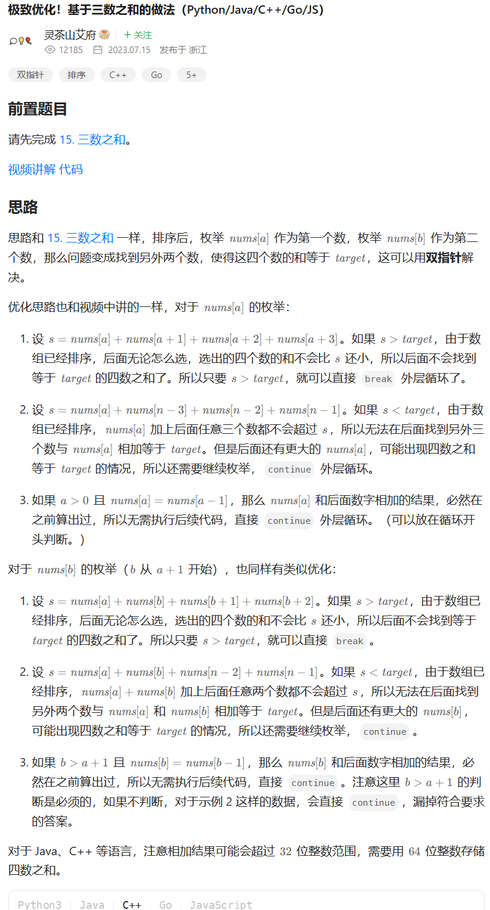
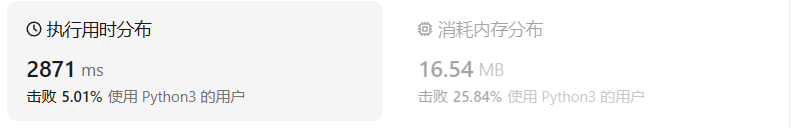

# 18四数之和（中等）

[18. 四数之和 ](https://leetcode.cn/problems/4sum/description/)

## 题目描述

给你一个由 `n` 个整数组成的数组 `nums` ，和一个目标值 `target` 。请你找出并返回满足下述全部条件且**不重复**的四元组 `[nums[a], nums[b], nums[c], nums[d]]` （若两个四元组元素一一对应，则认为两个四元组重复）：

- `0 <= a, b, c, d < n`
- `a`、`b`、`c` 和 `d` **互不相同**
- `nums[a] + nums[b] + nums[c] + nums[d] == target`

你可以按 **任意顺序** 返回答案 。

 

**示例 1：**

```
输入：nums = [1,0,-1,0,-2,2], target = 0
输出：[[-2,-1,1,2],[-2,0,0,2],[-1,0,0,1]]
```

**示例 2：**

```
输入：nums = [2,2,2,2,2], target = 8
输出：[[2,2,2,2]]
```

 

**提示：**

- `1 <= nums.length <= 200`
- `-10^9 <= nums[i] <= 10^9`
- `-10^9 <= target <= 10^9`

## 我的C++解法

现在的思想就是三数之和的推广。需要四个指针，初始状态a指向首，b指向a下一个，c指向d前一个，d指向最后一个。划分为三个区间。其中对最外侧两个指针a和d的判断是分别不大于和不小于target

理论存在

在编写期间出现了不少问题

最常见的错误是数组越界，因为没有对abcd分别做出限制。修改方案是在for循环中保证a和d之间数字个数能够大于等于4

又一个错误是当初始几个元素相等时，b修改会越过一些数字，因为没有减去a这个哈希值。修改方案是和昨天我的三数之和一样，for循环开头哈希值自减一，结尾哈希值自增1，保证b和c的变化不跳步。

现在又出现了一个错误：输入`nums=[1,-2,-5,-4,-3,3,3,5]`,`target=-11`，这样的话我在a的for中的判断`nums[a]<=target`就毫无作用了。解决方法：删除对nums【a】的限制。这样改的话，不出意外地超时了。需要再次增加target和初始元素、末尾元素的判断，让a或者d缩小范围

真tm无语啊`nums =[0,0,0,1000000000,1000000000,1000000000,1000000000]`，然后`runtime error: signed integer overflow: 1000000000 * 4 cannot be represented in type 'int' (solution.cpp)`

真tm无语了，这个题真是司马了，不是这里出错就是那里出错

nmb真恶心，我投降了，真写不出来，nm考虑的东西太多了。

```cpp
class Solution {
public:
    vector<vector<int>> fourSum(vector<int>& nums, int target) {
        //和三数之和的思路类似
        //我现在（刚看到这个题）的想法是排序后头尾各一个指针，区间内两个指针
        // 要不头指针最远指到0，尾指针最近指到0 不行啊，这个问题不是求和为0，而是传入target，不知道首指针的最远
        int n = nums.size();
        vector<vector<int>> result;
        if(n<4) return result;
        sort(nums.begin(),nums.end());
        if(nums[0]==nums[n-1]){
            //只有一种元素
            if(target>=0 && nums[0]>target) return result;
            if(target<0 && nums[0]<=target) return result;
            if(nums[0]*4==target){
                result.push_back({nums[0],nums[0],nums[0],nums[0]});
            }
            return result;
        }
        if(nums[0]*4>target)    return result;
        // if(long(nums[n-1]*4)<target)  return result;
        //去重操作感觉还是哈希好用
        unordered_map<int,int> hash_map;
        for(int i =0;i<n;i++){
            hash_map[nums[i]]++;
        }
        int d = n-1;
        // cout<<d<<endl;
        for(int a=0 ; a<n && a<d-2;a+=hash_map[nums[a]]){
            hash_map[nums[a]]--;
            // cout<<"当前的a："<<a<<endl;
            // cout<<"对a循环中的d值:"<<d<<endl;
            // int d = n-1;d>=0 && nums[d]>=target;d-=hash_map[nums[d]]
            for(;d>a+2;d-=hash_map[nums[d]]){
                hash_map[nums[d]]--;
                // cout<<"对d循环，d："<<d<<endl;
                int b = a+1;
                int c = d-1;
                while(b<c && b<d && c>a){
                    while(nums[a]+nums[b]+nums[c]+nums[d]>target && b<c)   
                        {c-=hash_map[nums[c]];
                        // cout<<"本次修改了c为："<<c<<endl;
                    }
                    while(nums[a]+nums[b]+nums[c]+nums[d]<target && b<c)   
                        {b+=hash_map[nums[b]];
                        // cout<<"本次修改了b为："<<b<<endl;
                    }
                    if(nums[a]+nums[b]+nums[c]+nums[d]==target && b<c){
                        result.push_back({nums[a],nums[b],nums[c],nums[d]});
                        c-=hash_map[nums[c]];
                        b+=hash_map[nums[b]];
                    }
                }
                hash_map[nums[d]]++;
            }
            // cout<<"内部循环结束d :"<<d;
            d=n-1;
            hash_map[nums[a]]++;
        }
        return result;
    }
};
```

我草泥马

哪个傻逼出的这题，nm使用例真是一坨狗屎，非要搞点溢出

```cpp
class Solution {
public:
    vector<vector<int>> fourSum(vector<int>& nums, int target) {
        //和三数之和的思路类似
        //我现在（刚看到这个题）的想法是排序后头尾各一个指针，区间内两个指针
        // 要不头指针最远指到0，尾指针最近指到0 不行啊，这个问题不是求和为0，而是传入target，不知道首指针的最远
        int n = nums.size();
        vector<vector<int>> result;
        if(n<4) return result;
        sort(nums.begin(),nums.end());
        // if(target==1000000000)  return {{0,0,0,1000000000}};
        // if(target==-1000000000)  return {{0,0,0,-1000000000}};
        // if(target==-294967296)  return result;
        // if(target==294967296)  return result;
        if(nums[0]==nums[n-1]){
            //只有一种元素
            if(target>=0 && nums[0]>target) return result;
            if(target<0 && nums[0]<=target) return result;
            if(long(nums[0])*4==target){
                result.push_back({nums[0],nums[0],nums[0],nums[0]});
            }
            return result;
        }
        // if(nums[0]*4>target)    return result;
        // if(long(nums[n-1]*4)<target)  return result;
        //去重操作感觉还是哈希好用
        unordered_map<int,int> hash_map;
        for(int i =0;i<n;i++){
            hash_map[nums[i]]++;
        }
        int d = n-1;
        // cout<<d<<endl;
        for(int a=0 ; a<n && a<d-2;a+=hash_map[nums[a]]){
            hash_map[nums[a]]--;
            // cout<<"当前的a："<<a<<endl;
            // cout<<"对a循环中的d值:"<<d<<endl;
            // int d = n-1;d>=0 && nums[d]>=target;d-=hash_map[nums[d]]
            for(;d>a+2;d-=hash_map[nums[d]]){
                hash_map[nums[d]]--;
                // cout<<"对d循环，d："<<d<<endl;
                int b = a+1;
                int c = d-1;
                while(b<c && b<d && c>a){
                    while(long(nums[a])+long(nums[b])+long(nums[c])+long(nums[d])>target && b<c)   
                        {c-=hash_map[nums[c]];
                        // cout<<"本次修改了c为："<<c<<endl;
                    }
                    while(long(nums[a])+long(nums[b])+long(nums[c])+long(nums[d])<target && b<c)   
                        {b+=hash_map[nums[b]];
                        // cout<<"本次修改了b为："<<b<<endl;
                    }
                    if(long(nums[a])+long(nums[b])+long(nums[c])+long(nums[d])==target && b<c){
                        result.push_back({nums[a],nums[b],nums[c],nums[d]});
                        c-=hash_map[nums[c]];
                        b+=hash_map[nums[b]];
                    }
                }
                hash_map[nums[d]]++;
            }
            // cout<<"内部循环结束d :"<<d;
            d=n-1;
            hash_map[nums[a]]++;
        }
        return result;
    }
};
```

结果：


nm其他a出来的是什么神人啊😅

## C++参考答案

本题的坑有很多：

1. 不能沿用三数之和的`num[a]>target`判断来返回了，因为target是传入的数据，不一定是非负数。比如`[-4,-1,0,0]`然后`target=-5`，如果判断-4>-5然后直接返回的话是错误的。
2. 数组的长度没有限制，需要判断长度大于等于四
3. 当数组只有同一种元素的时候，可以直接比较target和四倍的值即可
4. 元素的范围很大，int型数据有可能会溢出
5. 如果使用哈希表来剪枝，一定要理清楚思路，在什么时候对应哈希减一，什么时候对应的哈希加一
6. 实际上对两个快指针来说，外层的一个while循环即可，如果内层像我上面那样也是while循环，则需要额外添加很多的判断、初始化等操作。

代码随想录的做法：我并不认为他的做法的剪枝操作很好，这个做法反而很乱

```cpp
class Solution {
public:
    vector<vector<int>> fourSum(vector<int>& nums, int target) {
        vector<vector<int>> result;
        sort(nums.begin(), nums.end());
        for (int k = 0; k < nums.size(); k++) {
            // 剪枝处理
            if (nums[k] > target && nums[k] >= 0) {
            	break; // 这里使用break，统一通过最后的return返回
            }
            // 对nums[k]去重
            if (k > 0 && nums[k] == nums[k - 1]) {
                continue;
            }
            for (int i = k + 1; i < nums.size(); i++) {
                // 2级剪枝处理
                if (nums[k] + nums[i] > target && nums[k] + nums[i] >= 0) {
                    break;
                }

                // 对nums[i]去重
                if (i > k + 1 && nums[i] == nums[i - 1]) {
                    continue;
                }
                int left = i + 1;
                int right = nums.size() - 1;
                while (right > left) {
                    // nums[k] + nums[i] + nums[left] + nums[right] > target 会溢出
                    if ((long) nums[k] + nums[i] + nums[left] + nums[right] > target) {
                        right--;
                    // nums[k] + nums[i] + nums[left] + nums[right] < target 会溢出
                    } else if ((long) nums[k] + nums[i] + nums[left] + nums[right]  < target) {
                        left++;
                    } else {
                        result.push_back(vector<int>{nums[k], nums[i], nums[left], nums[right]});
                        // 对nums[left]和nums[right]去重
                        while (right > left && nums[right] == nums[right - 1]) right--;
                        while (right > left && nums[left] == nums[left + 1]) left++;

                        // 找到答案时，双指针同时收缩
                        right--;
                        left++;
                    }
                }

            }
        }
        return result;
    }
};
```



```cpp
class Solution {
public:
    vector<vector<int>> fourSum(vector<int> &nums, int target) {
        sort(nums.begin(), nums.end());
        vector<vector<int>> ans;
        int n = nums.size();
        for (int a = 0; a < n - 3; a++) { // 枚举第一个数
            long long x = nums[a]; // 使用 long long 避免溢出
            if (a > 0 && x == nums[a - 1]) continue; // 跳过重复数字
            if (x + nums[a + 1] + nums[a + 2] + nums[a + 3] > target) break; // 优化一
            if (x + nums[n - 3] + nums[n - 2] + nums[n - 1] < target) continue; // 优化二
            for (int b = a + 1; b < n - 2; b++) { // 枚举第二个数
                long long y = nums[b];
                if (b > a + 1 && y == nums[b - 1]) continue; // 跳过重复数字
                if (x + y + nums[b + 1] + nums[b + 2] > target) break; // 优化一
                if (x + y + nums[n - 2] + nums[n - 1] < target) continue; // 优化二
                int c = b + 1, d = n - 1;
                while (c < d) { // 双指针枚举第三个数和第四个数
                    long long s = x + y + nums[c] + nums[d]; // 四数之和
                    if (s > target) d--;
                    else if (s < target) c++;
                    else { // s == target
                        ans.push_back({(int) x, (int) y, nums[c], nums[d]});
                        for (c++; c < d && nums[c] == nums[c - 1]; c++); // 跳过重复数字
                        for (d--; d > c && nums[d] == nums[d + 1]; d--); // 跳过重复数字
                    }
                }
            }
        }
        return ans;
    }
};
```

```cpp
class Solution {
public:
    vector<vector<int>> fourSum(vector<int>& nums, int target) {
        vector<vector<int>> quadruplets;
        if (nums.size() < 4) {
            return quadruplets;
        }
        sort(nums.begin(), nums.end());
        int length = nums.size();
        for (int i = 0; i < length - 3; i++) {
            if (i > 0 && nums[i] == nums[i - 1]) {
                continue;
            }
            if ((long) nums[i] + nums[i + 1] + nums[i + 2] + nums[i + 3] > target) {
                break;
            }
            if ((long) nums[i] + nums[length - 3] + nums[length - 2] + nums[length - 1] < target) {
                continue;
            }
            for (int j = i + 1; j < length - 2; j++) {
                if (j > i + 1 && nums[j] == nums[j - 1]) {
                    continue;
                }
                if ((long) nums[i] + nums[j] + nums[j + 1] + nums[j + 2] > target) {
                    break;
                }
                if ((long) nums[i] + nums[j] + nums[length - 2] + nums[length - 1] < target) {
                    continue;
                }
                int left = j + 1, right = length - 1;
                while (left < right) {
                    long sum = (long) nums[i] + nums[j] + nums[left] + nums[right];
                    if (sum == target) {
                        quadruplets.push_back({nums[i], nums[j], nums[left], nums[right]});
                        while (left < right && nums[left] == nums[left + 1]) {
                            left++;
                        }
                        left++;
                        while (left < right && nums[right] == nums[right - 1]) {
                            right--;
                        }
                        right--;
                    } else if (sum < target) {
                        left++;
                    } else {
                        right--;
                    }
                }
            }
        }
        return quadruplets;
    }
};
//作者：力扣官方题解
```

## C++收获

### 判断两个vector数组是否元素一致

在C++中，判断两个 `std::vector` 数组（向量）的元素是否完全一致，即它们包含相同的元素且顺序也相同，可以通过几种不同的方法实现。以下是两种常见的方法：

#### 方法1：直接比较操作符

C++标准库提供了直接比较两个 `std::vector` 的操作符 `==`。当且仅当两个向量的每个对应位置上的元素都相等时，比较结果为 `true`。

```cpp
#include <vector>
#include <iostream>

bool areVectorsEqual(const std::vector<int>& vec1, const std::vector<int>& vec2) {
    return vec1 == vec2;
}

int main() {
    std::vector<int> v1 = {1, 2, 3};
    std::vector<int> v2 = {1, 2, 3};
    std::vector<int> v3 = {3, 2, 1};

    std::cout << std::boolalpha << areVectorsEqual(v1, v2) << std::endl; // 输出: true
    std::cout << std::boolalpha << areVectorsEqual(v1, v3) << std::endl; // 输出: false
    return 0;
}
```

#### 方法2：遍历比较

如果你需要更细粒度的控制或者想要避免潜在的递归比较（当 `std::vector` 包含自身作为元素时），可以手动遍历两个向量并比较它们的元素。

```cpp
bool areVectorsEqual(const std::vector<int>& vec1, const std::vector<int>& vec2) {
    if (vec1.size() != vec2.size()) {
        return false; // 如果大小不同，则直接返回false
    }
    for (std::size_t i = 0; i < vec1.size(); ++i) {
        if (vec1[i] != vec2[i]) {
            return false; // 发现不匹配的元素，返回false
        }
    }
    return true; // 所有元素都匹配，返回true
}
```

这种方法首先检查两个向量的大小是否相同，如果不同，则它们不可能相等。然后，它遍历向量的每个元素并逐一比较。如果发现任何不匹配的元素，函数将返回 `false`。如果遍历完成后没有发现不匹配的元素，函数返回 `true`。

#### 注意事项

- 两种方法都适用于比较包含基本数据类型（如 `int`、`double` 等）的向量。
- 如果向量包含自定义类型的对象，那么这些类型必须定义了相等运算符（`operator==`），以便进行比较。
- 直接比较操作符可能更简洁，但在某些情况下，如向量元素是复杂类型或自定义类型时，可能需要手动实现比较逻辑。

选择哪种方法取决于你的具体需求和偏好。直接比较操作符通常更简洁且易于阅读，而手动遍历比较提供了更多的控制。

## 我的python解答

不断修改，不断修改，从下午三点到16点30分

总算A出来了。

有没有一种可能，用哈希来剪枝操作有些繁琐了。

```python
class Solution:
    def fourSum(self, nums: List[int], target: int) -> List[List[int]]:
        nums.sort()
        n = len(nums)
        if n < 4:    return []
        result=[]
        counter = collections.Counter(nums)
        a=0
        b=a+1
        while a<n-3:
            counter[nums[a]]-=1 # 哈希减少1
            b=a+1
            while b<n-2:
                counter[nums[b]]-=1
                c=b+1
                d=n-1
                while c<d:
                    counter[nums[c]]-=1
                    counter[nums[d]]-=1
                    if nums[a]+nums[b]+nums[c]+nums[d]<target:
                        counter[nums[c]]+=1
                        c+=counter[nums[c]]
                        counter[nums[d]]+=1
                        continue
                    if nums[a]+nums[b]+nums[c]+nums[d]>target:
                        counter[nums[d]]+=1
                        d-=counter[nums[d]]
                        counter[nums[c]]+=1
                        continue
                    if nums[a]+nums[b]+nums[c]+nums[d]==target:
                        result.append([nums[a],nums[b],nums[c],nums[d]])
                        counter[nums[c]]+=1
                        c+=counter[nums[c]]
                        counter[nums[d]]+=1
                        d-=counter[nums[d]]
                        
                counter[nums[b]]+=1
                b+=counter[nums[b]]
            counter[nums[a]]+=1
            a+=counter[nums[a]]
        return result
```

结果：



## python参考答案

```python
class Solution:
    def fourSum(self, nums: List[int], target: int) -> List[List[int]]:
        nums.sort()
        ans = []
        n = len(nums)
        for a in range(n - 3):  # 枚举第一个数
            x = nums[a]
            if a and x == nums[a - 1]:  # 跳过重复数字
                continue
            if x + nums[a + 1] + nums[a + 2] + nums[a + 3] > target:  # 优化一
                break
            if x + nums[-3] + nums[-2] + nums[-1] < target:  # 优化二
                continue
            for b in range(a + 1, n - 2):  # 枚举第二个数
                y = nums[b]
                if b > a + 1 and y == nums[b - 1]:  # 跳过重复数字
                    continue
                if x + y + nums[b + 1] + nums[b + 2] > target:  # 优化一
                    break
                if x + y + nums[-2] + nums[-1] < target:  # 优化二
                    continue
                # 双指针枚举第三个数和第四个数
                c = b + 1
                d = n - 1
                while c < d:
                    s = x + y + nums[c] + nums[d]  # 四数之和
                    if s > target:
                        d -= 1
                    elif s < target:
                        c += 1
                    else:  # s == target
                        ans.append([x, y, nums[c], nums[d]])
                        c += 1
                        while c < d and nums[c] == nums[c - 1]:  # 跳过重复数字
                            c += 1
                        d -= 1
                        while d > c and nums[d] == nums[d + 1]:  # 跳过重复数字
                            d -= 1
        return ans
```

```python
class Solution:
    def fourSum(self, nums: List[int], target: int) -> List[List[int]]:
        quadruplets = list()
        if not nums or len(nums) < 4:
            return quadruplets
        
        nums.sort()
        length = len(nums)
        for i in range(length - 3):
            if i > 0 and nums[i] == nums[i - 1]:
                continue
            if nums[i] + nums[i + 1] + nums[i + 2] + nums[i + 3] > target:
                break
            if nums[i] + nums[length - 3] + nums[length - 2] + nums[length - 1] < target:
                continue
            for j in range(i + 1, length - 2):
                if j > i + 1 and nums[j] == nums[j - 1]:
                    continue
                if nums[i] + nums[j] + nums[j + 1] + nums[j + 2] > target:
                    break
                if nums[i] + nums[j] + nums[length - 2] + nums[length - 1] < target:
                    continue
                left, right = j + 1, length - 1
                while left < right:
                    total = nums[i] + nums[j] + nums[left] + nums[right]
                    if total == target:
                        quadruplets.append([nums[i], nums[j], nums[left], nums[right]])
                        while left < right and nums[left] == nums[left + 1]:
                            left += 1
                        left += 1
                        while left < right and nums[right] == nums[right - 1]:
                            right -= 1
                        right -= 1
                    elif total < target:
                        left += 1
                    else:
                        right -= 1
        
        return quadruplets
#作者：力扣官方题解
```

## python收获

### 统计数组中每个数字出现的次数并可以根据数字访问出现的频次

在Python中，统计数组中每个数字出现的次数并允许根据数字访问出现的频次，可以使用内置的`collections.Counter`类，它是一个专门的字典子类，用于计数可哈希对象。以下是如何使用`Counter`的示例：

```python
from collections import Counter

# 假设这是我们的数组
array = [1, 2, 2, 3, 3, 3, 4, 4, 4, 4]

# 使用 Counter 统计每个数字出现的次数
counter = Counter(array)

# 输出每个数字及其出现的次数
print(counter)

# 根据数字访问出现的频次
number = 3
count = counter[number]  # 获取数字3出现的次数
print(f"Number {number} appears {count} times in the array.")
```

在这个例子中，`Counter(array)` 创建了一个计数器对象，其中键是数组中的数字，值是这些数字出现的次数。然后，你可以通过数字作为键来访问它的频次。

如果你想要手动实现这个功能，而不是使用`Counter`，可以使用字典来存储每个数字的计数：

```python
array = [1, 2, 2, 3, 3, 3, 4, 4, 4, 4]

# 创建一个空字典来存储计数
count_dict = {}

# 遍历数组并更新计数
for num in array:
    if num in count_dict:
        count_dict[num] += 1
    else:
        count_dict[num] = 1

# 输出每个数字及其出现的次数
print(count_dict)

# 根据数字访问出现的频次
number = 3
count = count_dict.get(number, 0)  # 使用 get 方法，如果数字不在字典中则返回0
print(f"Number {number} appears {count} times in the array.")
```

在这个手动实现中，我们首先创建了一个空字典`count_dict`，然后遍历数组，对于数组中的每个数字，如果它已经在字典中，就将其计数加一，如果不在字典中，就将其添加到字典中并设置计数为1。最后，我们使用`dict.get()`方法来访问特定数字的计数，如果该数字不在字典中，`get`方法将返回默认值0。