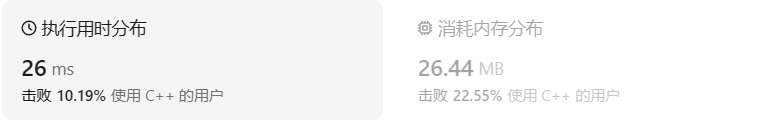
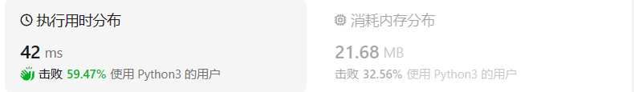
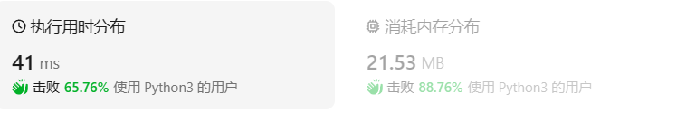

# 344反转字符串

[344. 反转字符串 ](https://leetcode.cn/problems/reverse-string/description/)

## 题目描述

编写一个函数，其作用是将输入的字符串反转过来。输入字符串以字符数组 `s` 的形式给出。

不要给另外的数组分配额外的空间，你必须**[原地](https://baike.baidu.com/item/原地算法)修改输入数组**、使用 O(1) 的额外空间解决这一问题。

**示例 1：**

```
输入：s = ["h","e","l","l","o"]
输出：["o","l","l","e","h"]
```

**示例 2：**

```
输入：s = ["H","a","n","n","a","h"]
输出：["h","a","n","n","a","H"]
```

**提示：**

- `1 <= s.length <= 105`
- `s[i]` 都是 [ASCII](https://baike.baidu.com/item/ASCII) 码表中的可打印字符

## 我的C++解法

第一种想法的话就是双指针循环进行换位

```cpp
class Solution {
public:
    void reverseString(vector<char>& s) {
        //双指针交换
        int n = s.size();
        int left =0;
        int right = n-1;
        while(left<right){
            swap(s[left],s[right]);
            left++;
            right--;
        }
    }
};
```

结果：



时空都比较高啊好像

还可以借助栈，但是这样的话空间复杂度就不是o(1)了。

C++按理来说也应该有reverse函数，但是具体是什么，怎么用我就不得而知了。

## C++参考答案

### 双指针

```cpp
void reverseString(vector<char>& s) {
    for (int i = 0, j = s.size() - 1; i < s.size()/2; i++, j--) {
        swap(s[i],s[j]);
    }
}
```

### reverse函数

```cpp
class Solution {
public:
    void reverseString(vector<char>& s) {
        reverse(s.begin(), s.end());
    }
};
```

## C++收获

### C++中的reverse函数

在C++中，`std::reverse` 是一个标准库算法函数，用于反转序列容器中的元素顺序。这个函数定义在 `<algorithm>` 头文件中，可以应用于如 `std::vector`、`std::array`、`std::deque` 等序列容器。

#### 函数原型

```cpp
void reverse(BidirectionalIterator first, BidirectionalIterator last);
```

这里的 `BidirectionalIterator` 是一个双向迭代器，它指向了要反转序列的起始位置和结束位置（不包括 `last`）。

#### 使用示例

```cpp
#include <algorithm> // for std::reverse
#include <vector>
#include <iostream>

int main() {
    std::vector<int> vec = {1, 2, 3, 4, 5};

    // 反转整个向量
    std::reverse(vec.begin(), vec.end());

    // 输出反转后的向量
    for (int num : vec) {
        std::cout << num << " ";
    }
    std::cout << std::endl;

    return 0;
}
```

在这个例子中，`std::reverse` 被用来反转 `vec` 中的所有元素。函数接受 `vec.begin()` 作为序列的开始迭代器，`vec.end()` 作为序列的结束迭代器。

#### 注意事项

- `std::reverse` 不会返回任何值，它直接修改传入的序列。
- 如果序列是空的或者只有一个元素，`std::reverse` 不会执行任何操作。
- 反转操作的时间复杂度是 O(N)，其中 N 是序列中的元素数量。

#### 反转部分序列

`std::reverse` 也可以用于反转序列中的一部分元素：

```cpp
std::vector<int> vec = {1, 2, 3, 4, 5};
std::reverse(vec.begin() + 1, vec.begin() + 3);
```

这将只反转从索引 1 开始到索引 3 结束的元素（不包括索引 3 的元素）的部分序列。

#### 反转算法与逆序迭代器

除了 `std::reverse`，C++ 标准库还提供了 `std::reverse_copy`，它与 `std::reverse` 类似，但会将结果复制到另一个序列中，而不是原地修改。此外，还可以使用逆序迭代器（reverse iterator）来遍历序列的元素逆序：

```cpp
for (auto it = vec.rbegin(); it != vec.rend(); ++it) {
    std::cout << *it << " ";
}
```

这将输出 `vec` 中元素的逆序，而不需要改变 `vec` 本身。逆序迭代器在 `std::vector`、`std::deque` 和 `std::array` 等容器中可用。

## 我的python解答

双指针完成交换操作

```python
class Solution:
    def reverseString(self, s: List[str]) -> None:
        """
        Do not return anything, modify s in-place instead.
        """
        n = len(s)
        left = 0
        right = n-1
        while left<right:
            tmp = s[left]
            s[left] = s[right]
            s[right] = tmp
            left+=1
            right-=1
```

结果：



一行流：

```python
class Solution:
    def reverseString(self, s: List[str]) -> None:
        """
        Do not return anything, modify s in-place instead.
        """
        s.reverse()
```

结果：



我py伟大，无需多言，一个reverse函数就搞定了一切。

## python参考答案

### 双指针

```python
class Solution:
    def reverseString(self, s: List[str]) -> None:
        """
        Do not return anything, modify s in-place instead.
        """
        left, right = 0, len(s) - 1
        
        # 该方法已经不需要判断奇偶数，经测试后时间空间复杂度比用 for i in range(len(s)//2)更低
        # 因为while每次循环需要进行条件判断，而range函数不需要，直接生成数字，因此时间复杂度更低。推荐使用range
        while left < right:
            s[left], s[right] = s[right], s[left]
            left += 1
            right -= 1
```

学到一个点就是py的交换不需要像C++那样需要临时变量，直接`a,b =  b,a`即可完成交换元素的操作。确实方便

### 栈

```python
class Solution:
    def reverseString(self, s: List[str]) -> None:
        """
        Do not return anything, modify s in-place instead.
        """
        stack = []
        for char in s:
            stack.append(char)
        for i in range(len(s)):
            s[i] = stack.pop()
```

### range推导

```python
class Solution:
    def reverseString(self, s: List[str]) -> None:
        """
        Do not return anything, modify s in-place instead.
        """
        n = len(s)
        for i in range(n // 2):
            s[i], s[n - i - 1] = s[n - i - 1], s[i]
```

### reversed函数

```python
class Solution:
    def reverseString(self, s: List[str]) -> None:
        """
        Do not return anything, modify s in-place instead.
        """
        s[:] = reversed(s)
```

### 切片操作

```python
class Solution:
    def reverseString(self, s: List[str]) -> None:
        """
        Do not return anything, modify s in-place instead.
        """
        s[:] = s[::-1]
```

### 列表推导

```python
class Solution:
    def reverseString(self, s: List[str]) -> None:
        """
        Do not return anything, modify s in-place instead.
        """
        s[:] = [s[i] for i in range(len(s) - 1, -1, -1)]
```

## python收获

### py中的栈

在Python中，栈（Stack）是一种遵循后进先出（LIFO，Last In First Out）原则的线性数据结构。在栈中，元素的添加（push）和删除（pop）操作都发生在栈的同一侧，称为栈顶。

以下是栈的一些基本操作和特性：

#### 初始化栈

在Python中，可以使用列表（list）来模拟栈的操作，因为列表具有动态数组的特性，可以方便地进行元素的添加和删除。

```python
stack = []
```

#### 元素添加（Push）

在栈顶添加一个新元素，可以使用列表的`append()`方法。

```python
stack.append(element)
```

#### 元素删除（Pop）

从栈顶删除一个元素，并返回该元素，可以使用列表的`pop()`方法。如果栈为空，`pop()`方法会抛出一个`IndexError`异常。

```python
element = stack.pop()
```

#### 查看栈顶元素

查看栈顶元素，但不删除它，可以使用列表的索引操作。

```python
top_element = stack[-1]
```

#### 栈的大小

获取栈中元素的数量，可以使用列表的`len()`函数。

```python
size = len(stack)
```

#### 判断栈是否为空

判断栈是否为空，可以使用列表的`len()`函数或直接使用`not`操作符。

```python
is_empty = len(stack) == 0  # 或者 is_empty = not stack
```

#### 清空栈

清空栈中的所有元素，可以使用列表的`clear()`方法。

```python
stack.clear()
```

#### 示例

下面是一个使用Python列表实现栈的简单示例：

```python
stack = []

# 元素添加
stack.append(1)
stack.append(2)
stack.append(3)

# 查看栈顶元素
print(stack[-1])  # 输出: 3

# 元素删除
print(stack.pop())  # 输出: 3
print(stack.pop())  # 输出: 2

# 栈的大小
print(len(stack))  # 输出: 1

# 判断栈是否为空
print(len(stack) == 0)  # 输出: False

# 清空栈
stack.clear()
print(len(stack))  # 输出: 0
```

#### 注意事项

- Python本身没有内置的栈数据结构，但可以使用列表、元组或集合等其他数据结构来模拟栈的行为。
- 在模拟栈操作时，要注意Python列表的`pop()`方法默认从右侧删除并返回元素，这与栈的LIFO原则相反。因此，通常使用`pop()`方法的索引参数`stack.pop(0)`来模拟栈的pop操作。
- 栈的应用场景包括函数调用的逆序执行（调用栈）、表达式求值、回溯算法等。

栈是一种基础且重要的数据结构，在很多算法和程序设计中都有广泛应用。在Python中，通过合理利用列表等内置数据结构，可以方便地实现栈的各种操作。

### py中的reverse函数和reversed函数

在Python中，`reverse` 和 `reversed` 都与反转序列相关，但它们在用法和行为上有所不同。

#### `reverse()` 方法

`reverse()` 是列表（list）的一个方法，用于原地反转列表中的元素顺序。这意味着它直接修改调用该方法的列表，而不返回一个新的列表或原列表的副本。

```python
my_list = [1, 2, 3, 4, 5]
my_list.reverse()
print(my_list)  # 输出: [5, 4, 3, 2, 1]
```

`reverse()` 方法没有返回值，即使它修改了列表本身。因此，如果你尝试打印 `my_list.reverse()` 的结果，你将得到 `None`。

#### `reversed()` 函数

`reversed()` 是一个内置函数，它接受一个序列（如列表、元组或字符串），并返回一个迭代器，该迭代器按逆序提供序列中的元素。

```python
my_list = [1, 2, 3, 4, 5]
reversed_iterator = reversed(my_list)
print(list(reversed_iterator))  # 输出: [5, 4, 3, 2, 1]
```

`reversed()` 函数返回的是一个迭代器，不是列表。如果你需要一个列表形式的反转序列，可以使用 `list()` 函数将迭代器转换为列表。

#### 字符串反转

对于字符串，由于它们是不可变的，`reversed()` 函数可以用来创建一个逆序的字符串迭代器，但不能用 `reverse()` 方法，因为字符串没有这个方法。

```python
my_string = "hello"
reversed_string_iterator = reversed(my_string)
print(''.join(reversed_string_iterator))  # 输出: "olleh"
```

#### 总结

- `reverse()` 是列表的实例方法，原地反转列表，没有返回值。
- `reversed()` 是一个内置函数，返回一个迭代器，可以用于任何可迭代对象的逆序访问。

根据你的需求，你可以选择使用 `reverse()` 方法或 `reversed()` 函数。如果你需要修改现有列表，使用 `reverse()`。如果你需要保留原始序列并创建一个新的反转序列，使用 `reversed()`。

### list类型数据逆置/反转的可行方法

1. 双指针交换前后元素
2. 借助栈，输入：append；输出：pop
3. 数学推导，使用range函数：`for i in range(n//2):  s[i],s[n-1-i] = s[n-1-i],s[i]`
4. 使用reverse函数，直接`s.reverse()`
5. 使用reversed函数，该函数返回迭代对象，需要`s[:] = reversed(s)`
6. 使用list的切片操作：`s[:]=s[::-1]`
7. 列表的推导：`s[:] = [s[i] for i in range(len(s)-1, -1, -1)]`