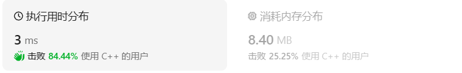
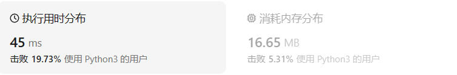

# 541反转字符串II

[541. 反转字符串 II ](https://leetcode.cn/problems/reverse-string-ii/description/)

## 题目描述

给定一个字符串 `s` 和一个整数 `k`，从字符串开头算起，每计数至 `2k` 个字符，就反转这 `2k` 字符中的前 `k` 个字符。

- 如果剩余字符少于 `k` 个，则将剩余字符全部反转。
- 如果剩余字符小于 `2k` 但大于或等于 `k` 个，则反转前 `k` 个字符，其余字符保持原样。

 

**示例 1：**

```
输入：s = "abcdefg", k = 2
输出："bacdfeg"
```

**示例 2：**

```
输入：s = "abcd", k = 2
输出："bacd"
```

 

**提示：**

- `1 <= s.length <= 104`
- `s` 仅由小写英文组成
- `1 <= k <= 104`

## 我的C++解法

依据数学推理和reverse函数来确定逆置的起始和末尾位置。

```cpp
class Solution {
public:
    string reverseStr(string s, int k) {
        //说白了就是找指针
        int n = s.size();
        int times = n/(2*k);//大组的个数
        int last = n - 2*k*times;//最后一组的个数
        for(int i =0;i<times;i++){
            //在第i个大组内：
            //起始元素位置：2*k*i 末尾元素位置：2*k*(i+1)-1
            reverse(s.begin()+2*k*i,s.begin()+k*(2*i+1));
        }
        if(last<k){
            reverse(s.begin()+2*k*times,s.end());
        }
        else{
            reverse(s.begin()+2*k*times,s.begin()+(2*times+1)*k);
        }
        return s;
    }
};
```

结果：



## C++参考答案

```cpp
class Solution {
public:
    string reverseStr(string s, int k) {
        for (int i = 0; i < s.size(); i += (2 * k)) {
            // 1. 每隔 2k 个字符的前 k 个字符进行反转
            // 2. 剩余字符小于 2k 但大于或等于 k 个，则反转前 k 个字符
            if (i + k <= s.size()) {
                reverse(s.begin() + i, s.begin() + i + k );
            } else {
                // 3. 剩余字符少于 k 个，则将剩余字符全部反转。
                reverse(s.begin() + i, s.end());
            }
        }
        return s;
    }
};
```

确实，都用reverse函数了，不妨直接i+=2k

```cpp
class Solution {
public:
    void reverse(string& s, int start, int end) {
        for (int i = start, j = end; i < j; i++, j--) {
            swap(s[i], s[j]);
        }
    }
    string reverseStr(string s, int k) {
        for (int i = 0; i < s.size(); i += (2 * k)) {
            // 1. 每隔 2k 个字符的前 k 个字符进行反转
            // 2. 剩余字符小于 2k 但大于或等于 k 个，则反转前 k 个字符
            if (i + k <= s.size()) {
                reverse(s, i, i + k - 1);
                continue;
            }
            // 3. 剩余字符少于 k 个，则将剩余字符全部反转。
            reverse(s, i, s.size() - 1);
        }
        return s;
    }
};
```

```cpp
class Solution {
public:
    string reverseStr(string s, int k) {
        int n = s.size(),pos = 0;
        while(pos < n){
            //剩余字符串大于等于k的情况
            if(pos + k < n) reverse(s.begin() + pos, s.begin() + pos + k);
            //剩余字符串不足k的情况 
            else reverse(s.begin() + pos,s.end());
            pos += 2 * k;
        }
        return s;
    }
};
```

```cpp
class Solution {
public:
    string reverseStr(string s, int k) {
        int n = s.length();
        for (int i = 0; i < n; i += 2 * k) {
            reverse(s.begin() + i, s.begin() + min(i + k, n));
        }
        return s;
    }
};
```


## C++收获

null

## 我的python解答

str转list再操作：

```python
class Solution:
    def reverseStr(self, s: str, k: int) -> str:
        s = list(s)
        n = len(s)
        times = n//(2*k)
        left = n - 2*k*times
        for i in range(times):
            le = 2*k*i
            ri = 2*k*i+k-1
            while le<ri:
                s[le],s[ri] = s[ri],s[le]
                le+=1
                ri-=1
            # s[2*k*i:2*k*i+k-1] = s[2*k*i:2*k*i+k-1:-1]
            # print(s)
        if left<k:
            le = 2*k*times
            ri = n-1
            while le<ri:
                s[le],s[ri] = s[ri],s[le]
                le+=1
                ri-=1
            # s[2*k*times-1:] = s[2*k*times-1::-1]

        else:
            le = 2*k*times
            ri = le+k-1
            while le<ri:
                s[le],s[ri] = s[ri],s[le]
                le+=1
                ri-=1
            # s[2*k*times-1:2*k*times+k-1] = s[2*k*times-1:2*k*times+k-1:-1]
        # print(s)
        result = ''
        for ch in s:
            result = result + ch
        return result
```

但是写的时候总感觉怪怪的

结果：



## python参考答案

```python
class Solution:
    def reverseStr(self, s: str, k: int) -> str:
        t = list(s)
        for i in range(0, len(t), 2 * k):
            t[i: i + k] = reversed(t[i: i + k])
        return "".join(t)
```

官方的这个解法很妙，很美。


```python
class Solution:
    def reverseStr(self, s: str, k: int) -> str:
        return ''.join([s[k*i:k*i+k][::-(-1)**(i%2)] for i in range(len(s)//k+1)])
```

1. `s` 是一个字符串参数，`k` 是一个整数参数。
2. 列表推导式 `[s[k*i:k*i+k][::-(-1)**(i%2)] for i in range(len(s)//k+1)]` 构建了一个列表，其中的每个元素都是根据以下规则生成的子串：
   - `k*i` 确定了子串的起始索引。
   - `k*i+k` 确定了子串的结束索引。
   - `[::-(-1)**(i%2)]` 是一个切片操作，它根据 `i` 的奇偶性来决定子串是反转还是保持原样。这里使用了求幂操作 `(-1)**(i%2)` 来决定步长（奇数为 -1，偶数为 1），从而实现反转或保持原样。
3. `for i in range(len(s)//k+1)` 确保了即使最后一个子串的字符数少于 `k`，也会被包含在内。
4. `''.join([...])` 将列表推导式生成的子串列表连接成一个单一的字符串，并返回。

```python
class Solution:
    def reverseStr(self, s: str, k: int) -> str:
        res, flag = "", True
        for i in range(0, len(s), k):
            res += s[i:i + k][::-1] if flag else s[i:i+k]
            flag = not flag
        return res 
```

## python收获

### py改变字符串

在Python中，字符串是可迭代的数据类型，你可以通过下标（索引）来访问和修改字符串中的单个字符。字符串的索引也是基于0的，即第一个字符的索引是0。

#### 访问字符串中的字符

要访问字符串中的特定字符，你可以使用方括号`[]`，后面跟上你想要的字符的索引。

```python
my_string = "Hello, World!"
char_at_index_7 = my_string[7]  # 'W'
```

#### 修改字符串中的字符

Python中的**字符串是不可变的**，这意味着你不能直接修改字符串中的单个字符。但是，你可以通过创建一个新的字符串来实现“修改”字符的目的。

例如，如果你想将字符串中的某个字符替换为另一个字符，可以这样做：

```python
my_string = "Hello, World!"
index_to_modify = 7  # 假设我们要修改索引为7的字符

# 创建一个新的字符串，其中包含了原始字符串，除了修改的字符
new_string = my_string[:index_to_modify] + 'A' + my_string[index_to_modify + 1:]

print(new_string)  # "Hello, World!" 中的 'W' 被替换为 'A'，结果为 "Hello, Aorld!"
```

在这个例子中，我们创建了一个新的字符串 `new_string`，它由三部分组成：

1. 原始字符串 `my_string` 从开始到索引 `index_to_modify`（不包括该索引）的部分。
2. 我们想要的新字符 `'A'`。
3. 原始字符串 `my_string` 从索引 `index_to_modify + 1` 到末尾的部分。

#### 使用字符串推导式

你也可以使用字符串推导式来创建修改后的字符串：

```python
new_string = ''.join([my_string[:7], 'A', my_string[8:]])
```

这行代码使用了相同的逻辑，但是更加简洁。

#### 注意

由于字符串是不可变的，所以当你“修改”一个字符串时，实际上是在创建一个新的字符串对象。原来的字符串保持不变。这种特性使得字符串操作在多线程环境中是安全的。如果你需要频繁修改字符串内容，可能需要考虑使用列表（`list`），列表中的元素是可变的。

### py从list到str

有一个修改后的list型数据，要转化为str类型：

`return ''.join(listType)`

### py中的for循环

for和in相连用，range可以设置步长，比如说`for i in range(0,n,2*k)`的使用