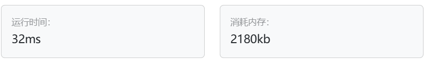
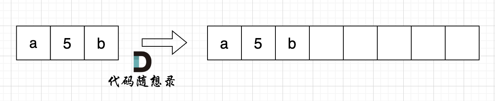
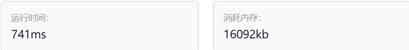

# 54.替换数字（第八期模拟笔试）

[54. 替换数字（第八期模拟笔试） (kamacoder.com)](https://kamacoder.com/problempage.php?pid=1064)

## 题目描述

###### 题目描述

给定一个字符串 s，它包含小写字母和数字字符，请编写一个函数，将字符串中的字母字符保持不变，而将每个数字字符替换为number。 例如，对于输入字符串 "a1b2c3"，函数应该将其转换为 "anumberbnumbercnumber"。

###### 输入描述

输入一个字符串 s,s 仅包含小写字母和数字字符。

###### 输出描述

打印一个新的字符串，其中每个数字字符都被替换为了number

###### 输入示例

```
a1b2c3
```

###### 输出示例

```
anumberbnumbercnumber
```

###### 提示信息

数据范围：
1 <= s.length < 10000。

## 我的C++解法

卡玛和力扣不一样，卡码需要把头文件引用，主函数都写出来，只是输入值不一样，相当于完整编写一个cpp文件而不是力扣那样写个函数就行

```cpp
#include<iostream>
#include<string>
using namespace std;

string replace_numbers(string &s){
    // for(char ch :s){
    //     if(ch == '0' ||ch == '1'||ch == '2'||ch == '3'||ch == '4'||ch == '5'||ch == '6'||ch == '7'||ch == '8'||ch == '9'){
    //         // ch.replace('number');
    //         ch = 'number'
    //     }
    // }
    int n = s.size();
    for(int i =0;i<n;){
        if(s[i] == '0' ||s[i] == '1'||s[i] == '2'||s[i] == '3'||s[i] == '4'||s[i] == '5'||s[i] == '6'||s[i] == '7'||s[i] == '8'||s[i] == '9'){
            s[i] = 'n';
            s.insert(i+1,"umber");
            i+=5;
            n+=5;
        }
        else    i++;
    }
    
    return s;
}

int main(){
    string s;
    cin>>s;
    s = replace_numbers(s);
    cout<<s;
    return 0;
}
```

结果：



## C++参考答案

首先扩充数组到每个数字字符替换成 "number" 之后的大小。



然后从后向前替换数字字符，也就是双指针法，过程如下：i指向新长度的末尾，j指向旧长度的末尾。


这么做有两个好处：

1. 不用申请新数组。
2. 从后向前填充元素，避免了从前向后填充元素时，每次添加元素都要将添加元素之后的所有元素向后移动的问题。

```cpp
#include <iostream>
using namespace std;
int main() {
    string s;
    while (cin >> s) {
        int sOldIndex = s.size() - 1;
        int count = 0; // 统计数字的个数
        for (int i = 0; i < s.size(); i++) {
            if (s[i] >= '0' && s[i] <= '9') {
                count++;
            }
        }
        // 扩充字符串s的大小，也就是将每个数字替换成"number"之后的大小
        s.resize(s.size() + count * 5);
        int sNewIndex = s.size() - 1;
        // 从后往前将数字替换为"number"
        while (sOldIndex >= 0) {
            if (s[sOldIndex] >= '0' && s[sOldIndex] <= '9') {
                s[sNewIndex--] = 'r';
                s[sNewIndex--] = 'e';
                s[sNewIndex--] = 'b';
                s[sNewIndex--] = 'm';
                s[sNewIndex--] = 'u';
                s[sNewIndex--] = 'n';
            } else {
                s[sNewIndex--] = s[sOldIndex];
            }
            sOldIndex--;
        }
        cout << s << endl;       
    }
}
```

```cpp
#include <bits/stdc++.h>
using namespace std;

int main(){
    string s;
    cin>>s;
    for(int i = 0; i < s.size() ; i++){
        if(s[i]<='9'&&s[i]>='0'){
            s[i] = 'n';
            s.insert(i+1,"umber");
        }
    }
    cout<<s;
    
    return 0;
}
```


## C++收获

### C++中对string字符串的修改操作

在C++中，`std::string` 是一个非常强大的字符串类，提供了多种方法来修改字符串。以下是一些常用的字符串修改操作：

#### 1. 赋值和追加

- **赋值**：使用 `=` 运算符可以将一个字符串赋值给另一个字符串。
- **追加**：使用 `+=` 运算符可以将一个字符串追加到另一个字符串。

```cpp
std::string str1 = "Hello";
std::string str2;
str2 = str1; // 赋值
str1 += " World"; // 追加
```

#### 2. `append` 方法

`append` 方法可以在字符串的末尾添加更多的字符或另一个字符串。

```cpp
str1.append(" and Goodbye");
```

#### 3. `push_back` 方法

`push_back` 方法可以在字符串的末尾添加一个字符。

```cpp
str1.push_back('!');
```

#### 4. `insert` 方法

`insert` 方法可以在指定位置插入一个字符或另一个字符串。

```cpp
str1.insert(5, " ");
```

#### 5. `erase` 方法

`erase` 方法可以删除字符串中的字符或字符串序列。

```cpp
str1.erase(5, 6); // 删除从位置5开始的6个字符
```

#### 6. `replace` 方法

`replace` 方法可以替换字符串中的部分内容。

```cpp
str1.replace(5, 6, "XXX"); // 从位置5开始，替换6个字符为"XXX"
```

#### 7. `clear` 方法

`clear` 方法可以清除字符串的所有内容。

```cpp
str1.clear(); // str1 变为空字符串
```

#### 8. `resize` 方法

`resize` 方法可以改变字符串的大小，如果增大，则在末尾添加填充字符。

```cpp
str1.resize(10, 'x'); // 将 str1 调整为10个字符长，不足的用 'x' 填充
```

#### 9. `assign` 方法

`assign` 方法可以替换字符串的内容为一个新的字符串或字符序列。

```cpp
str1.assign("New Content");
```

#### 10. 直接通过索引修改

`std::string` 提供了通过索引访问字符的能力，允许你直接修改特定位置的字符。

```cpp
str1[0] = 'S'; // 将字符串开头的字符从 'H' 改为 'S'
```

#### 注意事项

- `std::string` 是可变的，这意味着一旦创建，其内容可以被改变。
- 字符串是包含字符的数组，所以你可以像操作数组一样操作字符串，但请确保不要越界。
- 字符串的索引操作（通过 `[]`）未定义行为的区间检查，所以应该小心使用，避免越界访问。
- 在C++中，字符串字面量（如 `"Hello"`）是 `const char` 类型的数组，因此它们的内容在运行时是不可修改的。

通过上述方法，你可以灵活地修改C++中的字符串，以满足不同的编程需求。

### 字符串中某字符时候属于数字或者字母

在字符串中 ，每一个字符都是char类型的数据，每一个字符都有对应的ASCII值。因此不用把10个数字全部列出来，直接使用一个界值判断语句即可：`if(s[i]>='0' && s[i]<='9')`这样就完成了对当前字符是否是数字的判断。同理，对大写或者小写字母的判断也是这样，直接使用界值判断语句即可。

## 我的python解答

字符串转list，然后对list进行元素的修改操作

```python
import string
def remove_numbers(s : str)->str:
    s = list(s)
    n = len(s)
    for i in range(n):
        if s[i] not in list(string.ascii_lowercase):
            # print(" 当前要被修改的是：",s[i])
            del s[i]
            s.insert(i,'number')
    return "".join(s)
    
s = input()
s = remove_numbers(s)
print(s)
```

结果：



## python参考答案

```python
class Solution:
    def change(self, s):
        lst = list(s) # Python里面的string也是不可改的，所以也是需要额外空间的。空间复杂度：O(n)。
        for i in range(len(lst)):
            if lst[i].isdigit():
                lst[i] = "number"
        return ''.join(lst)
```

```python
str1 = input()
ans = ""
for ss in str1:
    if ord("0") <= ord(ss) <= ord("9"):
        ans += "number"
    else:
        ans += ss
print(ans)
```

```python
s = input()
res = ''
for x in s:
    if '0'<= x <='9':
        res+="number"
    else :
        res+=x
print(res)
```


## python收获

### py中判断某一字符的类型

在Python中，如果你想要判断一个字符的类型，通常是指检查它是否是字母、数字、空白字符等。Python提供了一些内置的函数和模块来帮助进行这些判断。以下是一些常用的方法：

#### 使用内置函数

1. `str.isalpha()`：检查字符串中的所有字符是否都是字母。

2. `str.isdigit()`：检查字符串中的所有字符是否都是数字。

3. `str.isnumeric()`：类似于 `isdigit()`，但还包括数字字符（如罗马数字）。

4. `str.isspace()`：检查字符串是否只包含空白字符。

5. `str.islower()`：检查字符串中的所有字母字符是否都是小写。

6. `str.isupper()`：检查字符串中的所有字母字符是否都是大写。

#### 示例

```python
char = 'A'

if char.isalpha():
    print(f"'{char}' 是字母。")
elif char.isdigit():
    print(f"'{char}' 是数字。")
elif char.isspace():
    print(f"'{char}' 是空白字符。")
else:
    print(f"'{char}' 不是字母、数字或空白字符。")
```

#### 使用正则表达式

你还可以使用正则表达式来检查字符的类型。Python的 `re` 模块提供了正则表达式的功能。

```python
import re

char = 'A'

if re.match('^[a-zA-Z]$', char):
    print(f"'{char}' 是字母。")
elif re.match('^[0-9]$', char):
    print(f"'{char}' 是数字。")
# 正则表达式可以编写更复杂的规则来匹配特定的字符类型
```

#### 注意事项

- 内置的字符串方法适用于检查整个字符串，如果你只想检查单个字符的类型，可以对单个字符使用这些方法。
- 正则表达式提供了更灵活的字符类型检查方式，但可能需要更复杂的规则。
- 如果你只是想检查变量是否是字符串类型，可以使用 `isinstance()` 函数：

  ```python
  char = 'A'
  if isinstance(char, str):
      print(f"'{char}' 是一个字符串。")
  ```

使用这些方法，你可以在Python中判断字符的类型，并根据需要进行相应的处理。