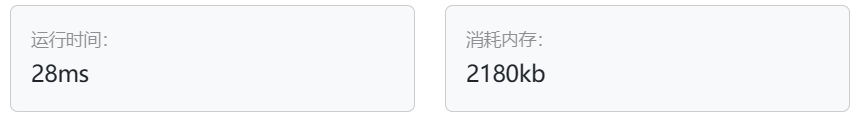
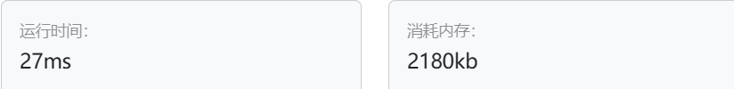
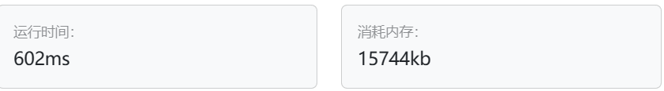

# 55.右旋字符串（第八期模拟笔试）

[55. 右旋字符串（第八期模拟笔试） (kamacoder.com)](https://kamacoder.com/problempage.php?pid=1065)

## 题目描述

```txt
字符串的右旋转操作是把字符串尾部的若干个字符转移到字符串的前面。给定一个字符串 s 和一个正整数 k，请编写一个函数，将字符串中的后面 k 个字符移到字符串的前面，实现字符串的右旋转操作。 

例如，对于输入字符串 "abcdefg" 和整数 2，函数应该将其转换为 "fgabcde"。
```

输入描述

```txt
输入共包含两行，第一行为一个正整数 k，代表右旋转的位数。第二行为字符串 s，代表需要旋转的字符串。
```

输出描述

输出共一行，为进行了右旋转操作后的字符串。

输入示例

```txt
2 
abcdefg
```

输出示例

```txt
fgabcde
```

提示信息

```txt
数据范围：
1 <= k < 10000,
1 <= s.length < 10000;
```

## 我的C++解法

第一种思路就是很常规的把字符串整体反转再局部反转

```cpp
#include<iostream>
#include<algorithm>
// #include<string>
using namespace std;

//有一个思路是整体reverse再分别reverse
//reverse函数是左闭右开
string right_rotate(string &s,int k){
    reverse(s.begin(),s.end());
    reverse(s.begin(),s.begin()+k);
    reverse(s.begin()+k,s.end());
    return s;
}
int main(){
    string s;
    int k;
    cin>>k;
    cin>>s;
    cout<<right_rotate(s,k);
    return 0;
}
```

结果：



第二种思路是用字符串的拼接操作来实现，可能py更好实现。

以我现在的水平，只能写出空间复杂度为o(n)的解法

```cpp
#include<iostream>
#include<algorithm>
// #include<string>
using namespace std;

string right_rotate(string s,int k){
    string tmp1;
    string tmp2;
    for(int i=0;i<s.size()-k;i++){
        tmp1+=s[i];
    }
    for(int i=s.size()-k;i<s.size();i++){
        tmp2+=s[i];
    }
    return tmp2+tmp1;
}
int main(){
    string s;
    int k;
    cin>>k;
    cin>>s;
    cout<<right_rotate(s,k);
    return 0;
}
```

结果：



## C++参考答案

思路一致，整体后局部

```cpp
#include<iostream>
#include<algorithm>
using namespace std;
int main() {
    int n;
    string s;
    cin >> n;
    cin >> s;
    int len = s.size(); //获取长度

    reverse(s.begin(), s.end()); // 整体反转
    reverse(s.begin(), s.begin() + n); // 先反转前一段，长度n
    reverse(s.begin() + n, s.end()); // 再反转后一段

    cout << s << endl;

} 
```

也可以先局部后整体：

```cpp
#include<iostream>
#include<algorithm>
using namespace std;
int main() {
    int n;
    string s;
    cin >> n;
    cin >> s;
    int len = s.size(); //获取长度
    reverse(s.begin(), s.begin() + len - n); // 先反转前一段，长度len-n ，注意这里是和版本一的区别
    reverse(s.begin() + len - n, s.end()); // 再反转后一段
    reverse(s.begin(), s.end()); // 整体反转
    cout << s << endl;

}
```

另一种解法：字符串自我复制后拼接在一起，然后按需截获即可

这里调用了string内置函数substr()

```cpp
#include <iostream>
using namespace std;
int main()
{
    int n;
    string s;
    cin >> n >> s;
    int len = s.size();
    cout << (s + s).substr(len - n, len) << '\n';
    return 0;
}
```

## C++收获

### 获取子字符串substr()

在C++中，`substr` 是 `std::string` 类的一个成员函数，用于从字符串中提取子字符串。这个方法返回一个 `std::string` 类型的副本，包含原始字符串中从指定位置开始的特定长度的字符序列。

#### 语法

```cpp
std::string substr(size_t pos = 0, size_t len = npos) const;
```

- `pos` 是一个可选参数，指定从哪个位置开始提取子字符串。如果未指定，`pos` 默认为 0，即从字符串的开头开始。
- `len` 是要提取的字符数。如果未指定或指定为 `std::string::npos`（这是 `std::string` 类的一个特殊值，表示直到字符串的末尾），则子字符串将包含从 `pos` 开始到原始字符串末尾的所有字符。

#### 示例

```cpp
#include <iostream>
#include <string>

int main() {
    std::string str = "Hello, World!";
    
    // 提取从位置 7 开始的子字符串，直到字符串末尾
    std::string sub1 = str.substr(7);
    std::cout << sub1 << std::endl; // 输出: World!

    // 提取从位置 5 开始，长度为 6 的子字符串
    std::string sub2 = str.substr(5, 6);
    std::cout << sub2 << std::endl; // 输出: World

    return 0;
}
```

#### 注意事项

- 如果 `pos` 大于字符串的长度，`substr` 将返回一个空字符串。
- 如果 `pos` 加上 `len` 超出了字符串的末尾，`substr` 将只返回从 `pos` 开始到字符串末尾的部分。
- `substr` 方法不会修改原始字符串。

`substr` 方法是C++中处理字符串时的一个有用工具，它允许你轻松地从字符串中提取特定部分。

## 我的python解答

使用字符串的切片操作然后再拼接：

其中一直出现一个错误就是说减号无法使int和str类型做差。找半天才知道input()得到的是一个str类型的，需要对其进行数据类型转换，换为int即可正常运行。

```python
def right_reverse(s:str,k:int)->str:
    # result = s[(0-k):]+s[:(len(s)-k)]
    # return result
    return ""+s[(0-k):]+s[:(len(s)-k)]
k = int(input())
s = input()
print(right_reverse(s,k))
```

结果：



## python参考答案

```python
#获取输入的数字k和字符串
k = int(input())
s = input()

#通过切片反转第一段和第二段字符串
#注意：python中字符串是不可变的，所以也需要额外空间
s = s[len(s)-k:] + s[:len(s)-k]
print(s)
```

```python
n = int(input())
s = input()

print(s[-n:]+s[:-n])
```

## python收获

通过input获得的数据默认为str类型，必要时要对数据类型进行转换