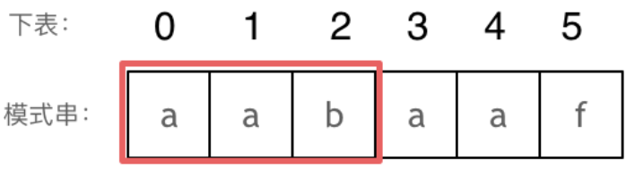
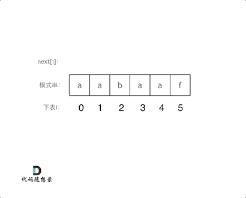

# 28找出字符串中第一个匹配项的下标

[28. 找出字符串中第一个匹配项的下标 ](https://leetcode.cn/problems/find-the-index-of-the-first-occurrence-in-a-string/description/)

## 题目描述

给你两个字符串 `haystack` 和 `needle` ，请你在 `haystack` 字符串中找出 `needle` 字符串的第一个匹配项的下标（下标从 0 开始）。如果 `needle` 不是 `haystack` 的一部分，则返回 `-1` 。

**示例 1：**

```
输入：haystack = "sadbutsad", needle = "sad"
输出：0
解释："sad" 在下标 0 和 6 处匹配。
第一个匹配项的下标是 0 ，所以返回 0 。
```

**示例 2：**

```
输入：haystack = "leetcode", needle = "leeto"
输出：-1
解释："leeto" 没有在 "leetcode" 中出现，所以返回 -1 。
```

**提示：**

- `1 <= haystack.length, needle.length <= 104`
- `haystack` 和 `needle` 仅由小写英文字符组成

## 我的C++解法

这个题就是KMP算法的实现，我这里从暴力逐步优化：

方法一：双指针暴力

思路：外层循环长串，内层循环目标串，如果自长串第i号起始，到遍历完目标串都匹配（这里用count计数，如果count和len2相等，说明内层遍历完了且匹配），返回i即可。如果有一个不匹配，跳出内层循环，长串从下一个位置再次尝试匹配。

在下面的代码中如果使用的是字符串的find操作实际上还是等效于双指针的暴力，在此处不作展示。

```cpp
class Solution {
public:
    int strStr(string haystack, string needle) {
        //双指针暴力
        int len1=haystack.size();
        int len2=needle.size();
        if(len1<len2)   return -1;
        for(int i=0;i<len1;i++){
            int tmp=i;
            int count=0;
            for(int j=0;j<len2;j++){
                if(haystack[tmp]==needle[j]){
                    tmp++;
                    count++;
                    continue;
                }
                else    break;
            }
            if(count==len2) return i;
        }
        return -1;
    }
};
```

结果：


尝试进行优化，优化思路：长字符串在失配之前的字符都是已知的。真难顶啊，思路是有的，但是很难实现啊。数据结构里面手动模拟kmp求next数组和nextval数组比较好弄，因为比较前后缀用人脑很快，但是在计算机上不好实现啊。

## C++参考答案

### 前缀表统一减一操作

```cpp
class Solution {
public:
    void getNext(int* next, const string& s) {
        int j = -1;
        next[0] = j;
        for(int i = 1; i < s.size(); i++) { // 注意i从1开始
            while (j >= 0 && s[i] != s[j + 1]) { // 前后缀不相同了
                j = next[j]; // 向前回退
            }
            if (s[i] == s[j + 1]) { // 找到相同的前后缀
                j++;
            }
            next[i] = j; // 将j（前缀的长度）赋给next[i]
        }
    }
    int strStr(string haystack, string needle) {
        if (needle.size() == 0) {
            return 0;
        }
		vector<int> next(needle.size());
		getNext(&next[0], needle);
        int j = -1; // // 因为next数组里记录的起始位置为-1
        for (int i = 0; i < haystack.size(); i++) { // 注意i就从0开始
            while(j >= 0 && haystack[i] != needle[j + 1]) { // 不匹配
                j = next[j]; // j 寻找之前匹配的位置
            }
            if (haystack[i] == needle[j + 1]) { // 匹配，j和i同时向后移动
                j++; // i的增加在for循环里
            }
            if (j == (needle.size() - 1) ) { // 文本串s里出现了模式串t
                return (i - needle.size() + 1);
            }
        }
        return -1;
    }
};
```

### 前缀表不减一

```cpp
class Solution {
public:
    void getNext(int* next, const string& s) {
        int j = 0;
        next[0] = 0;
        for(int i = 1; i < s.size(); i++) {
            while (j > 0 && s[i] != s[j]) {
                j = next[j - 1];
            }
            if (s[i] == s[j]) {
                j++;
            }
            next[i] = j;
        }
    }
    int strStr(string haystack, string needle) {
        if (needle.size() == 0) {
            return 0;
        }
        vector<int> next(needle.size());
        getNext(&next[0], needle);
        int j = 0;
        for (int i = 0; i < haystack.size(); i++) {
            while(j > 0 && haystack[i] != needle[j]) {
                j = next[j - 1];
            }
            if (haystack[i] == needle[j]) {
                j++;
            }
            if (j == needle.size() ) {
                return (i - needle.size() + 1);
            }
        }
        return -1;
    }
};
```

### 暴力匹配

```cpp
class Solution {
public:
    int strStr(string haystack, string needle) {
        int n = haystack.size(), m = needle.size();
        for (int i = 0; i + m <= n; i++) {
            bool flag = true;
            for (int j = 0; j < m; j++) {
                if (haystack[i + j] != needle[j]) {
                    flag = false;
                    break;
                }
            }
            if (flag) {
                return i;
            }
        }
        return -1;
    }
};
```

### 调用库函数

```cpp
class Solution {
public:
    int strStr(string haystack, string needle) {
        if(needle.empty())
            return 0;
        int pos=haystack.find(needle);
        return pos;
    }
};
```

## C++收获

### KMP算法的实现

#### 主要思想

**当出现字符串不匹配时，可以知道一部分之前已经匹配的文本内容，可以利用这些信息避免从头再去做匹配了。**

#### 前缀表

KMP算法在描述的时候有一个所谓的next数组，实际上就是前缀表。前缀表用于回退，记录了模式串和主串不匹配的时候，模式串应该从哪里开始重新匹配。

为了清楚地了解前缀表的来历，我们来举一个例子：

要在文本串：aabaabaafa 中查找是否出现过一个模式串：aabaaf。动画表示：


文本串中第六个字符b 和 模式串的第六个字符f，不匹配了。如果暴力匹配，发现不匹配，此时就要从头匹配了。但如果使用前缀表，就不会从头匹配，而是从上次已经匹配的内容开始匹配，找到了模式串中第三个字符b继续开始匹配。

前缀表的任务是当前位置匹配失败，找到之前已经匹配上的位置，再重新匹配，此也意味着在某个字符失配时，前缀表会告诉你下一步匹配中，模式串应该跳到哪个位置。那么什么是前缀表：**记录下标i之前（包括i）的字符串中，有多大长度的相同前缀后缀。**

#### 最长公共前后缀

文章中字符串的**前缀是指不包含最后一个字符的所有以第一个字符开头的连续子串**。**后缀是指不包含第一个字符的所有以最后一个字符结尾的连续子串**。

#### 为什么一定要用前缀表

回顾一下，刚刚匹配的过程在下标5的地方遇到不匹配，模式串是指向f，如图：


然后就找到了下标2，指向b，继续匹配：如图：


**下标5之前这部分的字符串（也就是字符串aabaa）的最长相等的前缀 和 后缀字符串是 子字符串aa ，因为找到了最长相等的前缀和后缀，匹配失败的位置是后缀子串的后面，那么我们找到与其相同的前缀的后面重新匹配就可以了。**

所以前缀表具有告诉我们当前位置匹配失败，跳到之前已经匹配过的地方的能力。

#### 如何计算前缀表


长度为前1个字符的子串`a`，最长相同前后缀的长度为0。（注意字符串的**前缀是指不包含最后一个字符的所有以第一个字符开头的连续子串**；**后缀是指不包含第一个字符的所有以最后一个字符结尾的连续子串**。）


长度为前2个字符的子串`aa`，最长相同前后缀的长度为1。



长度为前3个字符的子串`aab`，最长相同前后缀的长度为0。

以此类推： 长度为前4个字符的子串`aaba`，最长相同前后缀的长度为1。 长度为前5个字符的子串`aabaa`，最长相同前后缀的长度为2。 长度为前6个字符的子串`aabaaf`，最长相同前后缀的长度为0。

那么把求得的最长相同前后缀的长度就是对应前缀表的元素，如图：


可以看出模式串与前缀表对应位置的数字表示的就是：**下标i之前（包括i）的字符串中，有多大长度的相同前缀后缀。**

再来看一下如何利用 前缀表找到 当字符不匹配的时候应该指针应该移动的位置。如动画所示：


找到的不匹配的位置， 那么此时我们要看它的前一个字符的前缀表的数值是多少。

为什么要前一个字符的前缀表的数值呢，因为要找前面字符串的最长相同的前缀和后缀。

所以要看前一位的 前缀表的数值。

前一个字符的前缀表的数值是2， 所以把下标移动到下标2的位置继续比配。 可以再反复看一下上面的动画。

最后就在文本串中找到了和模式串匹配的子串了。

#### 前缀表与next数组

next数组就可以是前缀表，但是很多实现都是把前缀表统一减一（右移一位，初始位置为-1）之后作为next数组。**这并不涉及到KMP的原理，而是具体实现，next数组既可以就是前缀表，也可以是前缀表统一减一（右移一位，初始位置为-1）。**

#### 使用next数组来匹配

**以下我们以前缀表统一减一之后的next数组来做演示**。有了next数组，就可以根据next数组来 匹配文本串s，和模式串t了。注意next数组是新前缀表（旧前缀表统一减一了）。匹配过程动画如下：


#### 时间复杂度分析

其中n为文本串长度，m为模式串长度，因为在匹配的过程中，根据前缀表不断调整匹配的位置，可以看出匹配的过程是O(n)，之前还要单独生成next数组，时间复杂度是O(m)。所以整个KMP算法的时间复杂度是O(n+m)的。暴力的解法显而易见是O(n × m)，所以**KMP在字符串匹配中极大地提高了搜索的效率。**

#### 构造next数组

定义一个函数getNext来构建next数组，函数参数为指向next数组的指针，和一个字符串。 代码如下：

```text
void getNext(int* next, const string& s)
```

**构造next数组其实就是计算模式串s，前缀表的过程。** 主要有如下三步：

1. 初始化
2. 处理前后缀不相同的情况
3. 处理前后缀相同的情况

##### 初始化

定义两个指针i和j，j指向前缀末尾位置，i指向后缀末尾位置。然后还要对next数组进行初始化赋值，如下：`int j=-1;next[0]=j;`j 为什么要初始化为 -1呢，因为之前说过 前缀表要统一减一的操作仅仅是其中的一种实现，我们这里选择j初始化为-1，下文我还会给出j不初始化为-1的实现代码。

next[i] 表示 i（包括i）之前最长相等的前后缀长度（其实就是j）所以初始化next[0] = j 。

##### 处理前后缀不相同的情况

因为j初始化为-1，那么i就从1开始，进行s[i] 与 s[j+1]的比较。所以遍历模式串s的循环下标i 要从 1开始，代码如下:`for(int i=1;i<s.size();i++)`如果 s[i] 与 s[j+1]不相同，也就是遇到 前后缀末尾不相同的情况，就要向前回退。怎么回退呢？

next[j]就是记录着j（包括j）之前的子串的相同前后缀的长度。那么 s[i] 与 s[j+1] 不相同，就要找 j+1前一个元素在next数组里的值（就是next[j]）。所以，处理前后缀不相同的情况代码如下：

```cpp
while (j >= 0 && s[i] != s[j + 1]) { // 前后缀不相同了
    j = next[j]; // 向前回退
}
```

##### 处理前后缀相同的情况

如果 s[i] 与 s[j + 1] 相同，那么就同时向后移动i 和j 说明找到了相同的前后缀，同时还要将j（前缀的长度）赋给next[i], 因为next[i]要记录相同前后缀的长度。代码如下

```cpp
if (s[i] == s[j + 1]) { // 找到相同的前后缀
    j++;
}
next[i] = j;
```

最后整体构建next数组的函数代码如下：

```cpp
void getNext(int* next, const string& s){
    int j = -1;
    next[0] = j;
    for(int i = 1; i < s.size(); i++) { // 注意i从1开始
        while (j >= 0 && s[i] != s[j + 1]) { // 前后缀不相同了
            j = next[j]; // 向前回退
        }
        if (s[i] == s[j + 1]) { // 找到相同的前后缀
            j++;
        }
        next[i] = j; // 将j（前缀的长度）赋给next[i]
    }
}
```

代码构造next数组的逻辑流程动画如下：



得到了next数组之后，就要用这个来做匹配了。

#### 使用next数组来做匹配

在文本串s里 找是否出现过模式串t。定义两个下标j 指向模式串起始位置，i指向文本串起始位置。那么j初始值依然为-1，为什么呢？ **依然因为next数组里记录的起始位置为-1。**i就从0开始，遍历文本串，代码如下：`for(int i=0;i<s.size();i++)`接下来就是 s[i] 与 t[j + 1] （因为j从-1开始的） 进行比较。如果 s[i] 与 t[j + 1] 不相同，j就要从next数组里寻找下一个匹配的位置。代码如下：

```cpp
while(j >= 0 && s[i] != t[j + 1]) {
    j = next[j];
}
```

如果 s[i] 与 t[j + 1] 相同，那么i 和 j 同时向后移动， 代码如下：

```cpp
if (s[i] == t[j + 1]) {
    j++; // i的增加在for循环里
}
```

如何判断在文本串s里出现了模式串t呢，如果j指向了模式串t的末尾，那么就说明模式串t完全匹配文本串s里的某个子串了。本题要在文本串字符串中找出模式串出现的第一个位置 (从0开始)，所以返回当前在文本串匹配模式串的位置i 减去 模式串的长度，就是文本串字符串中出现模式串的第一个位置。代码如下：

```cpp
if (s[i] == t[j + 1]) {
    j++; // i的增加在for循环里
}
```

那么使用next数组，用模式串匹配文本串的整体代码如下：

```cpp
int j = -1; // 因为next数组里记录的起始位置为-1
for (int i = 0; i < s.size(); i++) { // 注意i就从0开始
    while(j >= 0 && s[i] != t[j + 1]) { // 不匹配
        j = next[j]; // j 寻找之前匹配的位置
    }
    if (s[i] == t[j + 1]) { // 匹配，j和i同时向后移动
        j++; // i的增加在for循环里
    }
    if (j == (t.size() - 1) ) { // 文本串s里出现了模式串t
        return (i - t.size() + 1);
    }
}
```

此时所有逻辑的代码都已经写出来了，力扣 28.实现strStr 题目的整体代码如下：

#### 前缀表统一减一 C++代码实现

```cpp
class Solution {
public:
    void getNext(int* next, const string& s) {
        int j = -1;
        next[0] = j;
        for(int i = 1; i < s.size(); i++) { // 注意i从1开始
            while (j >= 0 && s[i] != s[j + 1]) { // 前后缀不相同了
                j = next[j]; // 向前回退
            }
            if (s[i] == s[j + 1]) { // 找到相同的前后缀
                j++;
            }
            next[i] = j; // 将j（前缀的长度）赋给next[i]
        }
    }
    int strStr(string haystack, string needle) {
        if (needle.size() == 0) {
            return 0;
        }
		vector<int> next(needle.size());
		getNext(&next[0], needle);
        int j = -1; // // 因为next数组里记录的起始位置为-1
        for (int i = 0; i < haystack.size(); i++) { // 注意i就从0开始
            while(j >= 0 && haystack[i] != needle[j + 1]) { // 不匹配
                j = next[j]; // j 寻找之前匹配的位置
            }
            if (haystack[i] == needle[j + 1]) { // 匹配，j和i同时向后移动
                j++; // i的增加在for循环里
            }
            if (j == (needle.size() - 1) ) { // 文本串s里出现了模式串t
                return (i - needle.size() + 1);
            }
        }
        return -1;
    }
};
```

- 时间复杂度: O(n + m)
- 空间复杂度: O(m), 只需要保存字符串needle的前缀表

#### 前缀表（不减一）C++实现

```cpp
class Solution {
public:
    void getNext(int* next, const string& s) {
        int j = 0;
        next[0] = 0;
        for(int i = 1; i < s.size(); i++) {
            while (j > 0 && s[i] != s[j]) {
                j = next[j - 1];
            }
            if (s[i] == s[j]) {
                j++;
            }
            next[i] = j;
        }
    }
    int strStr(string haystack, string needle) {
        if (needle.size() == 0) {
            return 0;
        }
        vector<int> next(needle.size());
        getNext(&next[0], needle);
        int j = 0;
        for (int i = 0; i < haystack.size(); i++) {
            while(j > 0 && haystack[i] != needle[j]) {
                j = next[j - 1];
            }
            if (haystack[i] == needle[j]) {
                j++;
            }
            if (j == needle.size() ) {
                return (i - needle.size() + 1);
            }
        }
        return -1;
    }
};
```

### [KMP算法，from评论区大佬](https://leetcode.cn/problems/find-the-index-of-the-first-occurrence-in-a-string/solutions/2600821/kan-bu-dong-ni-da-wo-kmp-suan-fa-chao-qi-z1y0)

详见链接

## 我的python解答

我擦我真是随手一写

```python
class Solution:
    def strStr(self, haystack: str, needle: str) -> int:
        return haystack.find(needle)
```

没想到真能运行，更没想到双90

结果：


## python参考答案

```python
class Solution:
    def strStr(self, haystack: str, needle: str) -> int:
    
        # Func: 计算偏移表
        def calShiftMat(st):
            dic = {}
            for i in range(len(st)-1,-1,-1):
                if not dic.get(st[i]):
                    dic[st[i]] = len(st)-i
            dic["ot"] = len(st)+1
            return dic
        
        # 其他情况判断
        if len(needle) > len(haystack):return -1
        if needle=="": return 0
       
        # 偏移表预处理    
        dic = calShiftMat(needle)
        idx = 0
    
        while idx+len(needle) <= len(haystack):
            
            # 待匹配字符串
            str_cut = haystack[idx:idx+len(needle)]
            
            # 判断是否匹配
            if str_cut==needle:
                return idx
            else:
                # 边界处理
                if idx+len(needle) >= len(haystack):
                    return -1
                # 不匹配情况下，根据下一个字符的偏移，移动idx
                cur_c = haystack[idx+len(needle)]
                if dic.get(cur_c):
                    idx += dic[cur_c]
                else:
                    idx += dic["ot"]
            
        
        return -1 if idx+len(needle) >= len(haystack) else idx
```

切片

```python
class Solution:
    def strStr(self, haystack: str, needle: str) -> int:
        if needle not in haystack:
            return -1
        elif needle == '':
            return 0
        else:
            for i in range(len(haystack)):
                if haystack[i:len(needle)+i] == needle[:]:
                    return i
```


## python收获

KMP好理解不好弄出来，以后再悟吧