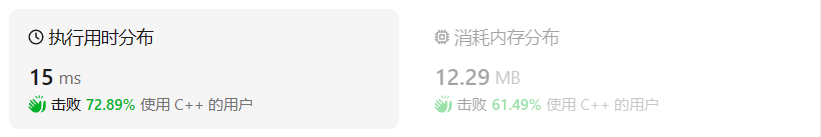
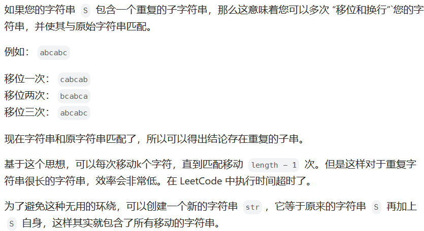
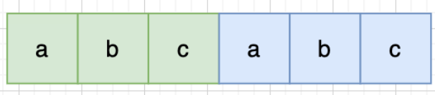
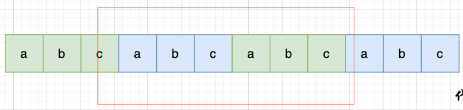
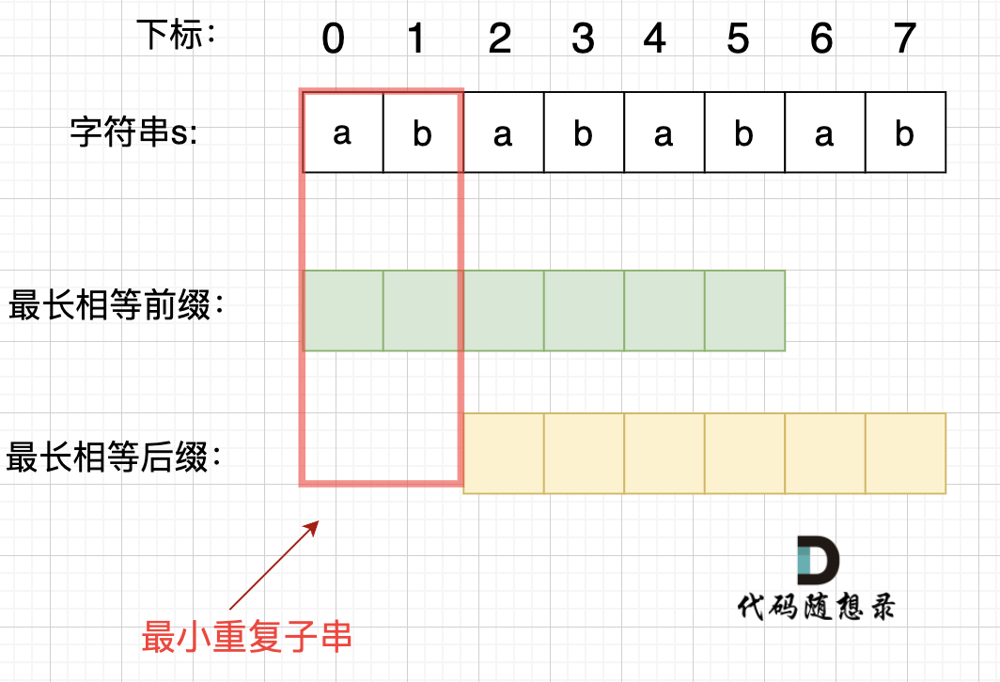
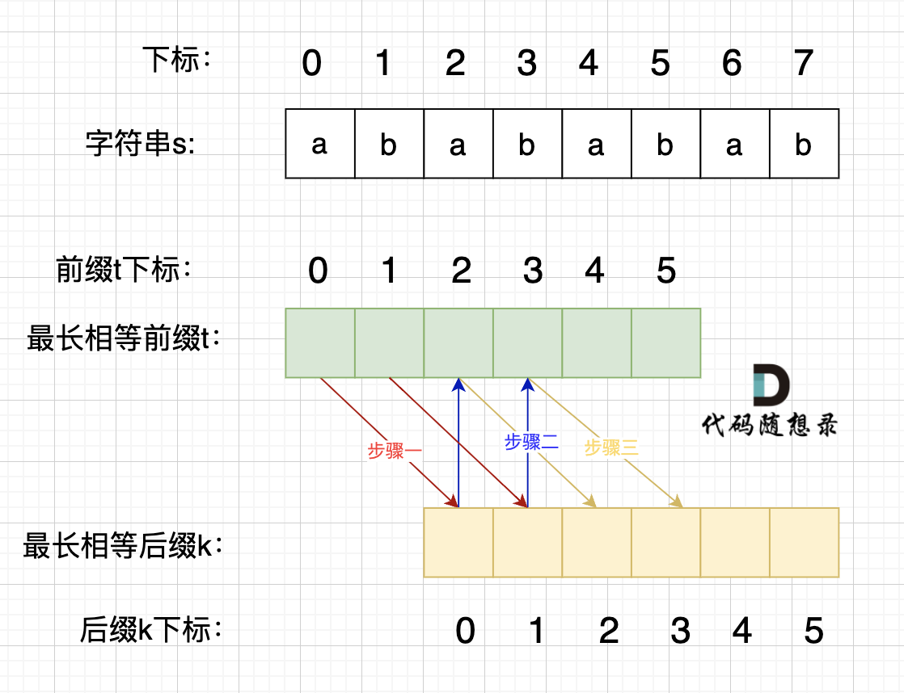

# 459重复的子字符串

[459. 重复的子字符串 ](https://leetcode.cn/problems/repeated-substring-pattern/description/)

## 题目描述

给定一个非空的字符串 `s` ，检查是否可以通过由它的一个子串重复多次构成。

 

**示例 1:**

```
输入: s = "abab"
输出: true
解释: 可由子串 "ab" 重复两次构成。
```

**示例 2:**

```
输入: s = "aba"
输出: false
```

**示例 3:**

```
输入: s = "abcabcabcabc"
输出: true
解释: 可由子串 "abc" 重复四次构成。 (或子串 "abcabc" 重复两次构成。)
```

 

**提示：**


- `1 <= s.length <= 104`
- `s` 由小写英文字母组成

## 我的C++解法

那就是直接暴力啊，子字串的大小肯定是小于等于原字串的一半。如果子串长度不是原长度的因数那么肯定不是，直接尝试下一个长度的子串。在子串中分别对比即可。

```cpp
class Solution {
public:
    bool repeatedSubstringPattern(string s) {
        //字串的长度从1到n/2
        int n = s.size();
        for(int i=1;i<=n/2;i++){
            //i表示字串长度
            if(n%i!=0)  continue;
            string tmp = s.substr(0,i);
            int flag = 0;
            // cout<<"当前子串为:"<<tmp<<endl;
            for(int j=i;j<n;j+=i){
                //划分为长度相等的字串
                // cout<<"当前j的大小为："<<j<<endl;
                // cout<<"目标对比字串："<<s.substr(j,i)<<endl;
                for(int k=0;k<i;k++){
                    //遍历长度为i的字串
                    // cout<<"当前对比字符："<<s[j+k]<<"  "<<s[j+k-i]<<endl;
                    if(s[j+k]!=s[j+k-i]){
                        flag = 1;
                        break;
                    }
                }
                if(flag==1) break;
            }
            if(flag==0) return true;
        }
        return false;
    }
};
```

结果：



说白了用KMP我是做不出来，昨天的KMP都没搞明白。

## C++参考答案

### 移动匹配（滑动窗口）



当一个字符串s：abcabc，内部由重复的子串组成，那么这个字符串的结构一定是这样的：



也就是由前后相同的子串组成。

那么既然前面有相同的子串，后面有相同的子串，用 s + s，这样组成的字符串中，后面的子串做前串，前面的子串做后串，就一定还能组成一个s，如图：



所以判断字符串s是否由重复子串组成，只要两个s拼接在一起，里面还出现一个s的话，就说明是由重复子串组成。在判断 s + s 拼接的字符串里是否出现一个s的的时候，**要刨除 s + s 的首字符和尾字符**，这样避免在s+s中搜索出原来的s，我们要搜索的是中间拼接出来的s。

```cpp
class Solution {
public:
    bool repeatedSubstringPattern(string s) {
        string t = s + s;
        t.erase(t.begin()); t.erase(t.end() - 1); // 掐头去尾
        if (t.find(s) != std::string::npos) return true; // r
        return false;
    }
};
```

- 时间复杂度: O(n)
- 空间复杂度: O(1)

不过这种解法还有一个问题，就是 我们最终还是要判断 一个字符串（s + s）是否出现过 s 的过程，大家可能直接用contains，find 之类的库函数。 却忽略了实现这些函数的时间复杂度（暴力解法是m * n，一般库函数实现为 O(m + n)）。

### KMP

前缀是指不包含最后一个字符的所有以第一个字符开头的连续子串；后缀是指不包含第一个字符的所有以最后一个字符结尾的连续子串

在由重复子串组成的字符串中，最长相等前后缀不包含的子串就是最小重复子串，这里拿字符串s：abababab 来举例，ab就是最小重复单位，如图所示：



为什么一定是开头的ab呢。 其实最关键还是要理解 最长相等前后缀，如图：



步骤一：因为 这是相等的前缀和后缀，t[0] 与 k[0]相同， t[1] 与 k[1]相同，所以 s[0] 一定和 s[2]相同，s[1] 一定和 s[3]相同，即：，s[0]s[1]与s[2]s[3]相同 。

步骤二： 因为在同一个字符串位置，所以 t[2] 与 k[0]相同，t[3] 与 k[1]相同。

步骤三： 因为 这是相等的前缀和后缀，t[2] 与 k[2]相同 ，t[3]与k[3] 相同，所以，s[2]一定和s[4]相同，s[3]一定和s[5]相同，即：s[2]s[3] 与 s[4]s[5]相同。

步骤四：循环往复。

所以字符串s，s[0]s[1]与s[2]s[3]相同， s[2]s[3] 与 s[4]s[5]相同，s[4]s[5] 与 s[6]s[7] 相同。

正是因为 最长相等前后缀的规则，当一个字符串由重复子串组成的，最长相等前后缀不包含的子串就是最小重复子串。

数学推导：

假设字符串s使用多个重复子串构成（这个子串是最小重复单位），重复出现的子字符串长度是x，所以s是由n * x组成。因为字符串s的最长相同前后缀的长度一定是不包含s本身，所以 最长相同前后缀长度必然是m * x，而且 n - m = 1，所以如果 nx % (n - m)x = 0，就可以判定有重复出现的子字符串。

next 数组记录的就是最长相同前后缀， 如果 next[len - 1] != -1，则说明字符串有最长相同的前后缀（就是字符串里的前缀子串和后缀子串相同的最长长度）。最长相等前后缀的长度为：next[len - 1] + 1。(这里的next数组是以统一减一的方式计算的，因此需要+1）

数组长度为：len。如果len % (len - (next[len - 1] + 1)) == 0 ，则说明数组的长度正好可以被 (数组长度-最长相等前后缀的长度) 整除 ，说明该字符串有重复的子字符串。**数组长度减去最长相同前后缀的长度相当于是第一个周期的长度，也就是一个周期的长度，如果这个周期可以被整除，就说明整个数组就是这个周期的循环。**


next[len - 1] = 7，next[len - 1] + 1 = 8，8就是此时字符串asdfasdfasdf的最长相同前后缀的长度。(len - (next[len - 1] + 1)) 也就是： 12(字符串的长度) - 8(最长公共前后缀的长度) = 4， 4正好可以被 12(字符串的长度) 整除，所以说明有重复的子字符串（asdf）。

前缀表统一减一的实现方式：

```cpp
class Solution {
public:
    void getNext (int* next, const string& s){
        next[0] = -1;
        int j = -1;
        for(int i = 1;i < s.size(); i++){
            while(j >= 0 && s[i] != s[j + 1]) {
                j = next[j];
            }
            if(s[i] == s[j + 1]) {
                j++;
            }
            next[i] = j;
        }
    }
    bool repeatedSubstringPattern (string s) {
        if (s.size() == 0) {
            return false;
        }
        int next[s.size()];
        getNext(next, s);
        int len = s.size();
        if (next[len - 1] != -1 && len % (len - (next[len - 1] + 1)) == 0) {
            return true;
        }
        return false;
    }
};
```

前缀表（不减一）的实现：

```python
class Solution {
public:
    void getNext (int* next, const string& s){
        next[0] = 0;
        int j = 0;
        for(int i = 1;i < s.size(); i++){
            while(j > 0 && s[i] != s[j]) {
                j = next[j - 1];
            }
            if(s[i] == s[j]) {
                j++;
            }
            next[i] = j;
        }
    }
    bool repeatedSubstringPattern (string s) {
        if (s.size() == 0) {
            return false;
        }
        int next[s.size()];
        getNext(next, s);
        int len = s.size();
        if (next[len - 1] != 0 && len % (len - (next[len - 1] )) == 0) {
            return true;
        }
        return false;
    }
};
```

时空均为o(n)

## C++收获

### C++截取字符串

在C++中，可以使用`std::string`类的`substr`成员函数来截取字符串的一部分，并将其赋值给一个新的`std::string`对象。`substr`函数的原型如下：

```cpp
string substr(size_t pos = 0, size_t count = npos) const;
```

- `pos` 是要截取的子字符串的起始位置（从0开始计数）。
- `count` 是要截取的子字符串的长度。如果不指定或者指定为`string::npos`，则截取从`pos`开始到原字符串末尾的所有字符。

下面是一个使用`substr`函数的例子：

```cpp
#include <iostream>
#include <string>

int main() {
    std::string str = "Hello, World!";
    size_t pos = 7; // 从第8个字符开始截取
    size_t count = 5; // 截取5个字符

    std::string subStr = str.substr(pos, count);
    std::cout << subStr << std::endl; // 输出 "World"

    return 0;
}
```

在这个例子中，我们从字符串`"Hello, World!"`的第8个字符（位置7，因为索引从0开始）开始截取，截取长度为5的子字符串，得到的结果是`"World"`。

请根据你的具体需求调整`pos`和`count`的值。如果你想要截取从某个位置到字符串末尾的所有字符，可以将`count`设置为`std::string::npos`。

## 我的python解答

和C++的思路一致，py更方便因为有切片操作，不需要第三个循环。

```python
class Solution:
    def repeatedSubstringPattern(self, s: str) -> bool:
        n = len(s)
        for i in range (1,n//2+1):#左闭右开，因此要加一
            if n%i != 0:    continue
            tmp = s[:i]
            flag = 0
            for j in range(i,n,i):
                # j从i到n，步长为i
                if tmp!=s[j:j+i]:   
                    flag = 1
                    break
            if flag == 0 :  return True
        return False
```

结果：


## python参考答案

### 前缀表 减一

```python
class Solution:
    def repeatedSubstringPattern(self, s: str) -> bool:  
        if len(s) == 0:
            return False
        nxt = [0] * len(s)
        self.getNext(nxt, s)
        if nxt[-1] != -1 and len(s) % (len(s) - (nxt[-1] + 1)) == 0:
            return True
        return False
    
    def getNext(self, nxt, s):
        nxt[0] = -1
        j = -1
        for i in range(1, len(s)):
            while j >= 0 and s[i] != s[j+1]:
                j = nxt[j]
            if s[i] == s[j+1]:
                j += 1
            nxt[i] = j
        return nxt
```

### 前缀表 不减一

```python
class Solution:
    def repeatedSubstringPattern(self, s: str) -> bool:  
        if len(s) == 0:
            return False
        nxt = [0] * len(s)
        self.getNext(nxt, s)
        if nxt[-1] != 0 and len(s) % (len(s) - nxt[-1]) == 0:
            return True
        return False
    
    def getNext(self, nxt, s):
        nxt[0] = 0
        j = 0
        for i in range(1, len(s)):
            while j > 0 and s[i] != s[j]:
                j = nxt[j - 1]
            if s[i] == s[j]:
                j += 1
            nxt[i] = j
        return nxt
```

### 使用 find

```python
class Solution:
    def repeatedSubstringPattern(self, s: str) -> bool:
        n = len(s)
        if n <= 1:
            return False
        ss = s[1:] + s[:-1] 
        print(ss.find(s))              
        return ss.find(s) != -1
```

- 假设 s 可由 子串 x 重复 n 次构成，即 s = nx
- 则有 s+s = 2nx
- 移除 s+s 开头和结尾的字符，变为 (s+s)[1:-1]，则破坏了开头和结尾的子串 x
- 此时只剩 2n-2 个子串
- 若 s 在 (s+s)[1:-1] 中，则有 2n-2 >= n，即 n >= 2
- 即 s 至少可由 x 重复 2 次构成
- 否则，n < 2，n 为整数，只能取 1，说明 s 不能由其子串重复多次构成

```python
class Solution:
    def repeatedSubstringPattern(self, s: str) -> bool:
        return s in (s+s)[1:-1]
```

### 暴力法

```python
class Solution:
    def repeatedSubstringPattern(self, s: str) -> bool:
        n = len(s)
        if n <= 1:
            return False
        
        substr = ""
        for i in range(1, n//2 + 1):
            if n % i == 0:
                substr = s[:i]
                if substr * (n//i) == s:
                    return True
                
        return False
```

## python收获

### py中KMP算法next数组的构建

#### 前缀表 减一

```python
def getNext(self, nxt, s):
    nxt[0] = -1
    j = -1
    for i in range(1, len(s)):
        while j >= 0 and s[i] != s[j+1]:
            j = nxt[j]
        if s[i] == s[j+1]:
            j += 1
        nxt[i] = j
    return nxt
```

#### 前缀表 不减一

```python
def getNext(self, nxt, s):
    nxt[0] = 0
    j = 0
    for i in range(1, len(s)):
        while j > 0 and s[i] != s[j]:
            j = nxt[j - 1]
        if s[i] == s[j]:
            j += 1
        nxt[i] = j
    return nxt
```

