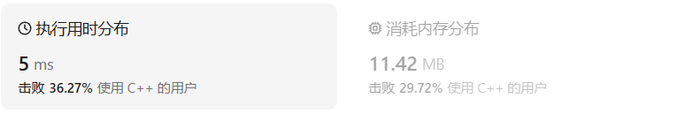
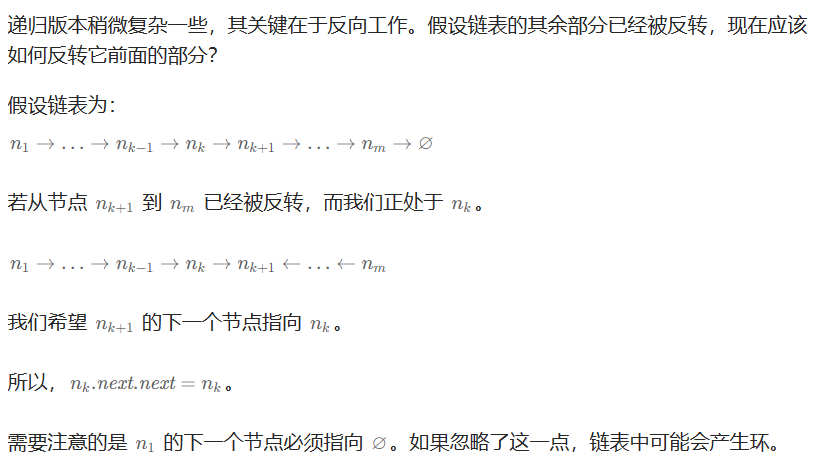
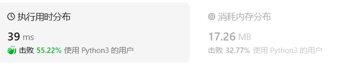

# 206反转链表

## 题目描述

给你单链表的头节点 `head` ，请你反转链表，并返回反转后的链表。

 

**示例 1：**


```
输入：head = [1,2,3,4,5]
输出：[5,4,3,2,1]
```

**示例 2：**


```
输入：head = [1,2]
输出：[2,1]
```

**示例 3：**

```
输入：head = []
输出：[]
```

 

**提示：**

- 链表中节点的数目范围是 `[0, 5000]`
- `-5000 <= Node.val <= 5000`

 

**进阶：**链表可以选用迭代或递归方式完成反转。你能否用两种方法解决这道题？

## 我的C++解法

思路很清晰，节点逐个头插法即可完成逆置操作

```cpp
/**
 * Definition for singly-linked list.
 * struct ListNode {
 *     int val;
 *     ListNode *next;
 *     ListNode() : val(0), next(nullptr) {}
 *     ListNode(int x) : val(x), next(nullptr) {}
 *     ListNode(int x, ListNode *next) : val(x), next(next) {}
 * };
 */
class Solution {
public:
    ListNode* reverseList(ListNode* head) {
        //思路：逐个断开再进行头插法
        if(!head || !head->next)   return head;//链表没有元素或者只有一个节点，直接返回
        ListNode* virtue_node=new ListNode();
        virtue_node->next=head;//虚拟头节点
        ListNode *p=head;
        ListNode* q=p->next;
        p->next=nullptr;//断开连接
        while(q->next){//q->next非空
            ListNode* tmp=q->next;
            q->next=virtue_node->next;
            virtue_node->next=q;
            q=tmp;
        }
        //q->next为空，说明只剩最后一个节点没有头插法。
        q->next=virtue_node->next;
        virtue_node->next=q;
        return virtue_node->next;
    }
};
```

结果：


## C++参考答案

### 方法一：双指针法原地逆置

思路：


```cpp
class Solution {
public:
    ListNode* reverseList(ListNode* head) {
        ListNode* temp; // 保存cur的下一个节点
        ListNode* cur = head;
        ListNode* pre = NULL;
        while(cur) {
            temp = cur->next;  // 保存一下 cur的下一个节点，因为接下来要改变cur->next
            cur->next = pre; // 翻转操作
            // 更新pre 和 cur指针
            pre = cur;
            cur = temp;
        }
        return pre;
    }
};
```

这个思路很好，之前从来没有这样想过，一直以来都是断开连接然后头插法解决的。着实拓宽了我的思路

```cpp
class Solution {
public:
    ListNode* reverseList(ListNode* head) {
        ListNode* prev = nullptr;
        ListNode* curr = head;
        while (curr) {
            ListNode* next = curr->next;
            curr->next = prev;
            prev = curr;
            curr = next;
        }
        return prev;
    }
};

//作者：力扣官方题解
```


### 方法二：递归

```cpp
class Solution {
public:
    ListNode* reverse(ListNode* pre,ListNode* cur){
        if(cur == NULL) return pre;
        ListNode* temp = cur->next;
        cur->next = pre;
        // 可以和双指针法的代码进行对比，如下递归的写法，其实就是做了这两步
        // pre = cur;
        // cur = temp;
        return reverse(cur,temp);
    }
    ListNode* reverseList(ListNode* head) {
        // 和双指针法初始化是一样的逻辑
        // ListNode* cur = head;
        // ListNode* pre = NULL;
        return reverse(NULL, head);
    }

};
```

是的，递归的代码容易理解，但是难以编写，因为太容易绕进去了。仅作为一个了解。

官方解法：



```cpp
class Solution {
public:
    ListNode* reverseList(ListNode* head) {
        if (!head || !head->next) {
            return head;
        }
        ListNode* newHead = reverseList(head->next);
        head->next->next = head;
        head->next = nullptr;
        return newHead;
    }
};
```

### 方法三：逆递归

这个思路是从后向前反转指针的指向方向

```cpp
class Solution {
public:
    ListNode* reverseList(ListNode* head) {
        // 边缘条件判断
        if(head == NULL) return NULL;
        if (head->next == NULL) return head;
        
        // 递归调用，翻转第二个节点开始往后的链表
        ListNode *last = reverseList(head->next);
        // 翻转头节点与第二个节点的指向
        head->next->next = head;
        // 此时的 head 节点为尾节点，next 需要指向 NULL
        head->next = NULL;
        return last;
    }
}; 
```

以为妙绝。思路很好，因为从来没有这样考虑过。但是缺点是太容易被绕进去，对我来说这种代码写出来的难度很高

## C++收获

拓宽了思路。对单链表的逆置不再局限于最熟悉和稳妥的断链头插法了。

## 我的python解答

思路和C++一致，断开链表进行头插法，时间复杂度o（n）

```python
# Definition for singly-linked list.
# class ListNode:
#     def __init__(self, val=0, next=None):
#         self.val = val
#         self.next = next
class Solution:
    def reverseList(self, head: Optional[ListNode]) -> Optional[ListNode]:
        if head==None or head.next==None:   return head
        #空或者单一节点则直接返回
        virtue_node=ListNode(0,head)
        p=head.next
        head.next=None
        q=p.next
        while q:
            p.next=virtue_node.next
            virtue_node.next=p
            p=q
            q=q.next
        #剩下最后一个节点p
        p.next=virtue_node.next
        virtue_node.next=p
        return virtue_node.next
```

结果：

## python参考答案

### 方法一：双指针

```python
class Solution:
    def reverseList(self, head: ListNode) -> ListNode:
        cur, pre = head, None
        while cur:
            tmp = cur.next # 暂存后继节点 cur.next
            cur.next = pre # 修改 next 引用指向
            pre = cur      # pre 暂存 cur
            cur = tmp      # cur 访问下一节点
        return pre
```

简化，利用 Python 语言的平行赋值语法，可以进一步简化代码（但可读性下降）：

```python
class Solution:
    def reverseList(self, head: ListNode) -> ListNode:
        cur, pre = head, None
        while cur:
            cur.next, pre, cur = pre, cur, cur.next
        return pre
```

### 方法二：递归

```python
class Solution:
    def reverseList(self, head: ListNode) -> ListNode:
        def recur(cur, pre):
            if not cur: return pre     # 终止条件
            res = recur(cur.next, cur) # 递归后继节点
            cur.next = pre             # 修改节点引用指向
            return res                 # 返回反转链表的头节点
        
        return recur(head, None)       # 调用递归并返回
```


## python收获

Python 语言中的平行赋值（也称为元组赋值或多变量赋值）是一种允许你在同一行代码中为多个变量赋值的语法。这种赋值通常用于同时从元组或列表中解包多个值。

### 平行赋值的基本语法：

```python
a, b = 1, 2
```

这行代码将值 `1` 分配给变量 `a`，将值 `2` 分配给变量 `b`。

### 平行赋值的高级用法：

1. **从序列中解包**：

```python
# 从元组中解包
a, b, c = (1, 2, 3)

# 从列表中解包
a, b, c = [1, 2, 3]
```

2. **交换变量的值**：

```python
a, b = 1, 2
a, b = b, a  # 交换 a 和 b 的值
```

3. **在函数返回多个值时使用**：

```python
def get_coordinates():
    return 10, 20

x, y = get_coordinates()  # 平行赋值用于接收多个返回值
```

4. **扩展赋值**：

你可以在赋值的右侧使用比左侧更多的值，Python 会自动丢弃多余的值。

```python
a, b = 1, 2, 3, 4  # a 将被赋值为 1，b 将被赋值为 2
```

5. **捕获未定义的变量**：

如果你在左侧使用比右侧更多的变量，Python 会为未赋值的变量赋值为 `None`。

```python
a, b, c = (1, 2)  # a 将被赋值为 1，b 将被赋值为 2，c 将被赋值为 None
```

6. **嵌套平行赋值**：

你可以在平行赋值中嵌套其他平行赋值。

```python
a, (b, c) = 1, (2, 3)  # a 将被赋值为 1，b 将被赋值为 2，c 将被赋值为 3
```

7. **解包序列中的序列**：

你可以解包序列中的序列，Python 允许你为内部序列指定变量名。

```python
a, (b, c) = [1, [2, 3]]  # a 将被赋值为 1，b 将被赋值为 2，c 将被赋值为 3
```

### 注意事项：

- 平行赋值要求左侧变量的数量与右侧序列中的元素数量一致，否则会引发 `ValueError`。
- 从Python 3.5开始，可以使用“星号赋值”（`*`）来捕获元组或列表中的剩余元素。

```python
a, *b, c = 1, 2, 3, 4  # a 将被赋值为 1，b 将是一个列表 [2, 3]，c 将被赋值为 4
```

平行赋值是Python中一种强大且表达性极强的特性，它允许你以简洁的语法进行复杂的赋值操作。


在 `Solution` 类的 `reverseList` 方法中，目标是将传入的链表反转。这个方法接收一个 `ListNode` 类型的参数 `head`，它指向链表的头节点，并返回一个新的头节点，该节点是原始链表反转后的结果。

以下是 `while` 循环中关键的一行代码的详细解释：

```python
cur.next, pre, cur = pre, cur, cur.next
```

这行代码是一个平行赋值（也称为元组赋值），它利用了Python的GIL（全局解释器锁）和赋值的原子性来在一行中完成三个赋值操作。这行代码的目的是更新三个变量 `cur.next`、`pre` 和 `cur` 的值，以实现链表节点的反转。

### 平行赋值的执行步骤：

1. `cur.next, pre, cur`：这三个变量将被赋予右侧表达式的值。
2. `= pre, cur, cur.next`：右侧的表达式按照从左到右的顺序求值，并将值赋给左侧的变量。

### 赋值过程：

- 首先，`cur.next` 被赋值为**当前**的 `pre` 值，这实际上是将当前节点的 `next` 指针指向前一个节点，从而反转链接的方向。
- 然后，`pre` 被赋值为**当前**的 `cur` 值，这样 `pre` 就指向了下一个要处理的节点。
- 最后，`cur` 被赋值为 `cur.next`，即当前节点的原始 `next` 指针，这样 `cur` 就移动到了下一个节点。

### 反转过程的示例：

假设我们有如下链表：`1 -> 2 -> 3 -> None`。

1. 初始状态：`cur` 指向 `1`，`pre` 为 `None`。
2. 执行平行赋值后：
   - `cur.next` (即 `1` 的 `next` 指针) 指向 `pre` (`None`)。
   - `pre` 指向 `cur` (`1`)。
   - `cur` 指向 `cur.next` (`2`)。
3. 下一个循环迭代：
   - `cur` 现在指向 `2`，`pre` 指向 `1`。
   - 重复上述过程。

这个过程会一直进行，直到 `cur` 为 `None`，表示链表已经完全遍历和反转。

### 为什么这样做是安全的？

由于Python的赋值操作是原子的，这意味着在多线程环境中，这行代码不会导致竞争条件。在单线程程序中，这行代码安全地重新链接了节点，而不会对链表的完整性造成风险。

这种方法是Python中常见的技巧，它利用了Python的赋值机制来简化代码并提高效率。