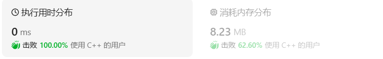
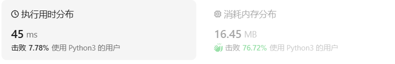

# 232用栈实现队列

[232. 用栈实现队列 ](https://leetcode.cn/problems/implement-queue-using-stacks/description/)

## 题目描述

请你仅使用两个栈实现先入先出队列。队列应当支持一般队列支持的所有操作（`push`、`pop`、`peek`、`empty`）：

实现 `MyQueue` 类：

- `void push(int x)` 将元素 x 推到队列的末尾
- `int pop()` 从队列的开头移除并返回元素
- `int peek()` 返回队列开头的元素
- `boolean empty()` 如果队列为空，返回 `true` ；否则，返回 `false`

**说明：**

- 你 **只能** 使用标准的栈操作 —— 也就是只有 `push to top`, `peek/pop from top`, `size`, 和 `is empty` 操作是合法的。
- 你所使用的语言也许不支持栈。你可以使用 list 或者 deque（双端队列）来模拟一个栈，只要是标准的栈操作即可。

 

**示例 1：**

```
输入：
["MyQueue", "push", "push", "peek", "pop", "empty"]
[[], [1], [2], [], [], []]
输出：
[null, null, null, 1, 1, false]

解释：
MyQueue myQueue = new MyQueue();
myQueue.push(1); // queue is: [1]
myQueue.push(2); // queue is: [1, 2] (leftmost is front of the queue)
myQueue.peek(); // return 1
myQueue.pop(); // return 1, queue is [2]
myQueue.empty(); // return false
```

 

**提示：**

- `1 <= x <= 9`
- 最多调用 `100` 次 `push`、`pop`、`peek` 和 `empty`
- 假设所有操作都是有效的 （例如，一个空的队列不会调用 `pop` 或者 `peek` 操作）

## 我的C++解法

整体思路在王道上看过，就是两个栈来回倒

```cpp
class MyQueue {
public:
    MyQueue() {
        stack <int> a;
        stack <int> b;
    }

    void push(int x) {
        a.push(x);
    }
    
    int pop() {
        while(!a.empty()){
            int tmp=a.top();
            a.pop();
            b.push(tmp);
        }
        int top=b.top();
        b.pop();
        // swap(a,b);
        while(!b.empty()){
            int tmp=b.top();
            b.pop();
            a.push(tmp);
        }        
        return top;
    }
    
    int peek() {
        while(!a.empty()){
            int tmp=a.top();
            a.pop();
            b.push(tmp);
        }
        int top=b.top();
        // swap(a,b);
        while(!b.empty()){
            int tmp=b.top();
            b.pop();
            a.push(tmp);
        }
        return top;        
    }
    
    bool empty() {
        return a.empty();
    }
private:
    stack <int> a;
    stack <int> b;   
};

/**
 * Your MyQueue object will be instantiated and called as such:
 * MyQueue* obj = new MyQueue();
 * obj->push(x);
 * int param_2 = obj->pop();
 * int param_3 = obj->peek();
 * bool param_4 = obj->empty();
 */
```

结果：



## C++参考答案

```cpp
class MyQueue {
private:
    stack<int> inStack, outStack;

    void in2out() {
        while (!inStack.empty()) {
            outStack.push(inStack.top());
            inStack.pop();
        }
    }

public:
    MyQueue() {}

    void push(int x) {
        inStack.push(x);
    }

    int pop() {
        if (outStack.empty()) {
            in2out();
        }
        int x = outStack.top();
        outStack.pop();
        return x;
    }

    int peek() {
        if (outStack.empty()) {
            in2out();
        }
        return outStack.top();
    }

    bool empty() {
        return inStack.empty() && outStack.empty();
    }
};
```

这个解法的思想在于不及时把b中元素倒回去。因为操作之后对队首元素的获取或者弹出，因此b中如果有元素，则栈顶元素一定是队首元素，所以不用每次操作之后都把b压回a中。私有元素在私有类中声明过之后不用在构造函数里面再次声明。

```cpp
class MyQueue {
public:
    stack<int> stIn;
    stack<int> stOut;
    /** Initialize your data structure here. */
    MyQueue() {

    }
    /** Push element x to the back of queue. */
    void push(int x) {
        stIn.push(x);
    }

    /** Removes the element from in front of queue and returns that element. */
    int pop() {
        // 只有当stOut为空的时候，再从stIn里导入数据（导入stIn全部数据）
        if (stOut.empty()) {
            // 从stIn导入数据直到stIn为空
            while(!stIn.empty()) {
                stOut.push(stIn.top());
                stIn.pop();
            }
        }
        int result = stOut.top();
        stOut.pop();
        return result;
    }

    /** Get the front element. */
    int peek() {
        int res = this->pop(); // 直接使用已有的pop函数
        stOut.push(res); // 因为pop函数弹出了元素res，所以再添加回去
        return res;
    }

    /** Returns whether the queue is empty. */
    bool empty() {
        return stIn.empty() && stOut.empty();
    }
};
```

这个解法是把变量的声明放入了共有中

## C++收获

在C++中如果想要有在类中可以调用的数据结构，可以在private类型中进行声明，也可以在public中声明。在后面编写的函数中可以直接调用这些数据结构。

## 我的python解答

同C++思想

```python
class MyQueue:

    def __init__(self):
        self.a = []
        self.b = []

    def push(self, x: int) -> None:
        self.a.append(x)

    def pop(self) -> int:
        while self.a:
            self.b.append(self.a.pop())
        element = self.b.pop()
        while self.b:
            self.a.append(self.b.pop())
        return element

    def peek(self) -> int:
        return self.a[0]

    def empty(self) -> bool:
        return self.a==[]


# Your MyQueue object will be instantiated and called as such:
# obj = MyQueue()
# obj.push(x)
# param_2 = obj.pop()
# param_3 = obj.peek()
# param_4 = obj.empty()
```

结果：



## python参考答案

```python
class MyQueue:

    def __init__(self):
        """
        in主要负责push，out主要负责pop
        """
        self.stack_in = []
        self.stack_out = []


    def push(self, x: int) -> None:
        """
        有新元素进来，就往in里面push
        """
        self.stack_in.append(x)


    def pop(self) -> int:
        """
        Removes the element from in front of queue and returns that element.
        """
        if self.empty():
            return None
        
        if self.stack_out:
            return self.stack_out.pop()
        else:
            for i in range(len(self.stack_in)):
                self.stack_out.append(self.stack_in.pop())
            return self.stack_out.pop()


    def peek(self) -> int:
        """
        Get the front element.
        """
        ans = self.pop()
        self.stack_out.append(ans)
        return ans


    def empty(self) -> bool:
        """
        只要in或者out有元素，说明队列不为空
        """
        return not (self.stack_in or self.stack_out)
```

```python
class MyQueue(object):

    def __init__(self):
        self.stack1 = []
        self.stack2 = []

    def push(self, x):
        self.stack1.append(x)

    def pop(self):
        if not self.stack2:
            while self.stack1:
                self.stack2.append(self.stack1.pop())
        return self.stack2.pop()

    def peek(self):
        if not self.stack2:
            while self.stack1:
                self.stack2.append(self.stack1.pop())
        return self.stack2[-1]

    def empty(self):
        return not self.stack1 and not self.stack2
```

## python收获

py的类如果想要有一个能够在类中使用的数据结构，则需要在构造函数`def __init__(self)`中进行`self.名称=...`样式的声明，表明在此类对象中有数据结构可以调用。在后面的函数中调用这些数据结构也需要进行`self.名称`的样式来进行操作。