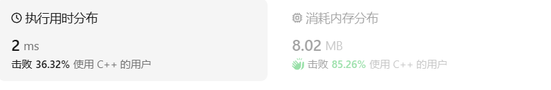
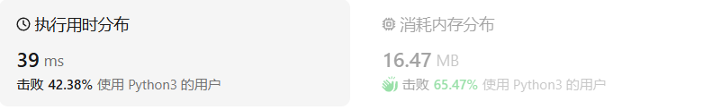

# 225用队列实现栈

[225. 用队列实现栈 ](https://leetcode.cn/problems/implement-stack-using-queues/description/)

## 题目描述

请你仅使用两个队列实现一个后入先出（LIFO）的栈，并支持普通栈的全部四种操作（`push`、`top`、`pop` 和 `empty`）。

实现 `MyStack` 类：

- `void push(int x)` 将元素 x 压入栈顶。
- `int pop()` 移除并返回栈顶元素。
- `int top()` 返回栈顶元素。
- `boolean empty()` 如果栈是空的，返回 `true` ；否则，返回 `false` 。

 

**注意：**

- 你只能使用队列的标准操作 —— 也就是 `push to back`、`peek/pop from front`、`size` 和 `is empty` 这些操作。
- 你所使用的语言也许不支持队列。 你可以使用 list （列表）或者 deque（双端队列）来模拟一个队列 , 只要是标准的队列操作即可。

 

**示例：**

```
输入：
["MyStack", "push", "push", "top", "pop", "empty"]
[[], [1], [2], [], [], []]
输出：
[null, null, null, 2, 2, false]

解释：
MyStack myStack = new MyStack();
myStack.push(1);
myStack.push(2);
myStack.top(); // 返回 2
myStack.pop(); // 返回 2
myStack.empty(); // 返回 False
```

 

**提示：**

- `1 <= x <= 9`
- 最多调用`100` 次 `push`、`pop`、`top` 和 `empty`
- 每次调用 `pop` 和 `top` 都保证栈不为空

 

**进阶：**你能否仅用一个队列来实现栈。

## 我的C++解法

只使用一个队列：

整体思路：每次获取栈顶元素或者弹出栈顶元素都要对它前面的元素依次出栈再入栈，这样栈顶元素就是队列的最先出队元素了。

```cpp
class MyStack {
public:
    queue<int> a;
    MyStack() {
    }
    
    void push(int x) {
        a.push(x);
    }
    
    int pop() {
        int n = a.size();
        for(int i=0;i<n-1;i++){
            a.push(a.front());
            a.pop();
        }
        int tmp = a.front();
        a.pop();
        return tmp;
    }
    
    int top() {
        int n = a.size();
        for(int i=0;i<n-1;i++){
            a.push(a.front());
            a.pop();
        }
        int tmp = a.front();
        a.push(tmp);
        a.pop();
        return tmp;
    }
    
    bool empty() {
        return a.empty();
    }
};

/**
 * Your MyStack object will be instantiated and called as such:
 * MyStack* obj = new MyStack();
 * obj->push(x);
 * int param_2 = obj->pop();
 * int param_3 = obj->top();
 * bool param_4 = obj->empty();
 */
```

结果：



## C++参考答案

### 双队列

当需要插入新元素时，将旧元素放入另一个队列（swap也行），空队列放入新元素，再把所有就元素依次导入有新元素的队列

```cpp
class MyStack {
public:
    queue<int> queue1;
    queue<int> queue2;

    MyStack() {

    }

    void push(int x) {
        queue2.push(x);
        while (!queue1.empty()) {
            queue2.push(queue1.front());
            queue1.pop();
        }
        swap(queue1, queue2);
    }
    
    int pop() {
        int r = queue1.front();
        queue1.pop();
        return r;
    }
    
    int top() {
        int r = queue1.front();
        return r;
    }
    
    bool empty() {
        return queue1.empty();
    }
};
```

```cpp
class MyStack {
public:
    queue<int> queue1;
    queue<int> queue2;

    /** Initialize your data structure here. */
    MyStack() {

    }

    /** Push element x onto stack. */
    void push(int x) {
        queue2.push(x);
        while (!queue1.empty()) {
            queue2.push(queue1.front());
            queue1.pop();
        }
        swap(queue1, queue2);
    }
    
    /** Removes the element on top of the stack and returns that element. */
    int pop() {
        int r = queue1.front();
        queue1.pop();
        return r;
    }
    
    /** Get the top element. */
    int top() {
        int r = queue1.front();
        return r;
    }
    
    /** Returns whether the stack is empty. */
    bool empty() {
        return queue1.empty();
    }
};
```


## C++收获

NULL

## 我的python解答

使用list的切片操作

```python
class MyStack:
    def __init__(self):
        self.a = []

    def push(self, x: int) -> None:
        self.a.append(x)

    def pop(self) -> int:
        tmp = self.a[-1]
        del self.a[-1]
        return tmp

    def top(self) -> int:
        return self.a[-1]

    def empty(self) -> bool:
        return self.a==[]


# Your MyStack object will be instantiated and called as such:
# obj = MyStack()
# obj.push(x)
# param_2 = obj.pop()
# param_3 = obj.top()
# param_4 = obj.empty()
```

结果：



## python参考答案

### 双队列

```python
class MyStack:

    def __init__(self):
        """
        Initialize your data structure here.
        """
        self.queue1 = collections.deque()
        self.queue2 = collections.deque()


    def push(self, x: int) -> None:
        self.queue2.append(x)
        while self.queue1:
            self.queue2.append(self.queue1.popleft())
        self.queue1, self.queue2 = self.queue2, self.queue1


    def pop(self) -> int:
        return self.queue1.popleft()


    def top(self) -> int:
        return self.queue1[0]


    def empty(self) -> bool:
        return not self.queue1
```

```python
class MyStack:

    def __init__(self):
        """
        Initialize your data structure here.
        """
        self.queue1 = collections.deque()
        self.queue2 = collections.deque()


    def push(self, x: int) -> None:
        self.queue2.append(x)
        while self.queue1:
            self.queue2.append(self.queue1.popleft())
        self.queue1, self.queue2 = self.queue2, self.queue1


    def pop(self) -> int:
        return self.queue1.popleft()


    def top(self) -> int:
        return self.queue1[0]


    def empty(self) -> bool:
        return not self.queue1
```

### 单队列：

就是循环

```python
class MyStack:

    def __init__(self):
        """
        Initialize your data structure here.
        """
        self.queue = collections.deque()


    def push(self, x: int) -> None:
        n = len(self.queue)
        self.queue.append(x)
        for _ in range(n):
            self.queue.append(self.queue.popleft())


    def pop(self) -> int:
        return self.queue.popleft()


    def top(self) -> int:
        return self.queue[0]


    def empty(self) -> bool:
        return not self.queue
```


## python收获

### py中的队列

Python 提供了几种队列的实现，包括标准的队列（FIFO - First In, First Out）和双端队列（deque - 双端队列，允许在两端进行操作）。以下是对这些数据结构的详细介绍：

#### 1. 列表（List）作为队列
虽然列表不是真正的队列数据结构，但可以通过使用列表的 `append()` 方法在一端添加元素，使用 `pop(0)` 方法在另一端移除元素来模拟队列的行为。然而，这种方法在移除元素时效率较低，因为 `pop(0)` 需要移动列表中的所有元素。

```python
from collections import deque

queue = deque()
queue.append('a')  # 入队
queue.append('b')
queue.append('c')

print(queue.popleft())  # 出队，返回 'a'
```

#### 2. `collections.deque` 作为双端队列
Python 的 `collections` 模块提供了 `deque` 类，它是一个双端队列的实现，允许在两端快速添加和删除元素。`deque` 是通过双向链表实现的，因此它提供了 `append()` 和 `appendleft()` 方法来分别在两端添加元素，以及 `pop()` 和 `popleft()` 方法来分别在两端移除元素。

```python
from collections import deque

dq = deque()
dq.append('a')  # 在右侧添加元素
dq.append('b')
dq.appendleft('z')  # 在左侧添加元素

print(dq)  # 输出：deque(['z', 'a', 'b'])

dq.pop()  # 从右侧移除元素，返回 'b'
dq.popleft()  # 从左侧移除元素，返回 'z'

print(dq)  # 输出：deque([])
```

#### 3. `queue.Queue` 作为线程安全的队列
Python 的 `queue` 模块提供了一个线程安全的队列实现，适用于多线程编程。`Queue` 类提供了 `put()` 方法来添加元素，`get()` 方法来移除元素，并且还有 `task_done()` 和 `join()` 方法来支持任务完成的通知。

```python
import queue

q = queue.Queue()
q.put('a')
q.put('b')

print(q.get())  # 从队列中获取元素，返回 'a'
print(q.get())  # 返回 'b'

# 如果队列为空，get() 将阻塞，直到有元素被添加
```

#### 4. 优先队列
虽然标准的 `queue.Queue` 不支持优先级，但是 `heapq` 模块可以用来实现一个优先队列。`heapq` 提供了一个列表的堆队列算法实现，允许你维护一个列表，使得列表的第一个元素总是最小的（或最大的，取决于你的实现）。

```python
import heapq

pq = []
heapq.heappush(pq, (1, 'low priority'))
heapq.heappush(pq, (3, 'high priority'))

print(heapq.heappop(pq))  # 返回最小元素的元组，(1, 'low priority')
```

在这个例子中，我们使用元组 `(优先级, 值)` 来存储元素，`heapq` 会根据元组的第一个元素（即优先级）来排序。

#### 总结
- 使用列表作为队列时，需要注意性能问题，尤其是在频繁地从列表头部移除元素时。
- `collections.deque` 是实现队列和双端队列的理想选择，因为它提供了高效的两端操作。
- `queue.Queue` 是线程安全的队列实现，适用于多线程环境。
- `heapq` 可以用来实现优先队列，但需要手动管理优先级。

每种队列实现都有其适用场景，你可以根据你的具体需求来选择最合适的一种。