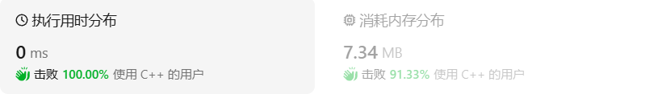
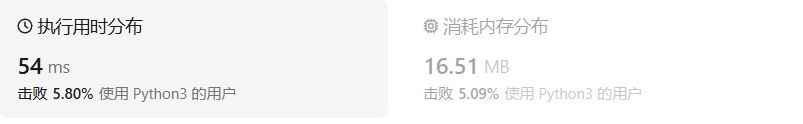

# 20.有效的括号

[20. 有效的括号 ](https://leetcode.cn/problems/valid-parentheses/description/)

## 题目描述

给定一个只包括 `'('`，`')'`，`'{'`，`'}'`，`'['`，`']'` 的字符串 `s` ，判断字符串是否有效。

有效字符串需满足：

1. 左括号必须用相同类型的右括号闭合。
2. 左括号必须以正确的顺序闭合。
3. 每个右括号都有一个对应的相同类型的左括号。

 

**示例 1：**

```
输入：s = "()"
输出：true
```

**示例 2：**

```
输入：s = "()[]{}"
输出：true
```

**示例 3：**

```
输入：s = "(]"
输出：false
```

 

**提示：**

- `1 <= s.length <= 104`
- `s` 仅由括号 `'()[]{}'` 组成

## 我的C++解法

一眼借助栈来实现

思路是开辟一个栈，遇到左半部分则压入，遇到右半部分则出栈栈顶且判断是否匹配。运行后发现出现问题：当首元素是右半部分的时候，根据for循环的逻辑需要对空栈进行出栈操作，因此报错。修改：开头判断首元素是不是右半部分。运行和再次报错：`s="(){}}{"`时，当当访问到第二个右半大括号，根据逻辑需要对空栈出栈，因此报错。解决：在出栈前要判断是否为空。这样的话起始上一个修改就显得没必要了，因为在for循环中如果首元素是右半，则需要对空栈出栈，直接返回false

```cpp
class Solution {
public:
    bool isValid(string s) {
        stack<char> a;
        if(s.size()==0)   return true;
        if(s[0]==')' || s[0]==']' || s[0]=='}') return false;
        for(char x:s){
            if(x=='(' || x=='[' || x=='{'){
                a.push(x);
            }
            else{
                if(!a.empty()){
                    char tmp = a.top();
                    a.pop();
                    if(x==')'){
                        if(tmp == '(')  continue;
                        else return false;
                    }
                    if(x==']'){
                        if(tmp == '[')  continue;
                        else return false;
                    }
                    if(x=='}'){
                        if(tmp == '{')  continue;
                        else return false;
                    }                
                }
                else return false;
            }
        }
        return a.empty();
    }
};
```

结果：



其实还可以用一个栈和一个队列，栈压入左半部分，队列入队右半部分，访问完字符串之后比较元素数目，不等则false；相等则同时出栈和出队，比较是否匹配。

显得没必要啊，不再编写这个想法了。

## C++参考答案

第一种情况：已经遍历完了字符串，但是栈不为空，说明有相应的左括号没有右括号来匹配，所以return false

第二种情况：遍历字符串匹配的过程中，发现栈里没有要匹配的字符。所以return false

第三种情况：遍历字符串匹配的过程中，栈已经为空了，没有匹配的字符了，说明右括号没有找到对应的左括号return false

那么什么时候说明左括号和右括号全都匹配了呢，就是字符串遍历完之后，栈是空的，就说明全都匹配了。

但还有一些技巧，在**匹配左括号的时候，右括号先入栈**，就只需要比较当前元素和栈顶相不相等就可以了，比左括号先入栈代码实现要简单的多了！

```cpp
class Solution {
public:
    bool isValid(string s) {
        if (s.size() % 2 != 0) return false; // 如果s的长度为奇数，一定不符合要求
        stack<char> st;
        for (int i = 0; i < s.size(); i++) {
            if (s[i] == '(') st.push(')');
            else if (s[i] == '{') st.push('}');
            else if (s[i] == '[') st.push(']');
            // 第三种情况：遍历字符串匹配的过程中，栈已经为空了，没有匹配的字符了，说明右括号没有找到对应的左括号 return false
            // 第二种情况：遍历字符串匹配的过程中，发现栈里没有我们要匹配的字符。所以return false
            else if (st.empty() || st.top() != s[i]) return false;
            else st.pop(); // st.top() 与 s[i]相等，栈弹出元素
        }
        // 第一种情况：此时我们已经遍历完了字符串，但是栈不为空，说明有相应的左括号没有右括号来匹配，所以return false，否则就return true
        return st.empty();
    }
};
```

先压入对应的右半是我没想到的

```cpp
class Solution {
public:
    bool isValid(string s) {
        int n = s.size();
        if (n % 2 == 1) {
            return false;
        }

        unordered_map<char, char> pairs = {
            {')', '('},
            {']', '['},
            {'}', '{'}
        };
        stack<char> stk;
        for (char ch: s) {
            if (pairs.count(ch)) {
                if (stk.empty() || stk.top() != pairs[ch]) {
                    return false;
                }
                stk.pop();
            }
            else {
                stk.push(ch);
            }
        }
        return stk.empty();
    }
};
```

## C++收获


## 我的python解答

```python
class Solution:
    def isValid(self, s: str) -> bool:
        stack=[]
        n=0
        dic = {'(':')','[':']','{':'}'}
        for ch in s:
            if ch in ['(','[','{']:
                stack.append(ch)
                n+=1
            else:
                if n==0:    return False
                tmp , stack = stack[-1], stack[:-1]
                n-=1
                if dic[tmp]!=ch:    return False
        return n==0
```

结果：



结果不尽人意啊

## python参考答案

方法一，仅使用栈，更省空间

```python
class Solution:
    def isValid(self, s: str) -> bool:
        stack = []
        
        for item in s:
            if item == '(':
                stack.append(')')
            elif item == '[':
                stack.append(']')
            elif item == '{':
                stack.append('}')
            elif not stack or stack[-1] != item:
                return False
            else:
                stack.pop()
        
        return True if not stack else False
```

方法二，使用字典

```python
class Solution:
    def isValid(self, s: str) -> bool:
        stack = []
        mapping = {
            '(': ')',
            '[': ']',
            '{': '}'
        }
        for item in s:
            if item in mapping.keys():
                stack.append(mapping[item])
            elif not stack or stack[-1] != item: 
                return False
            else: 
                stack.pop()
        return True if not stack else False
```

## python收获