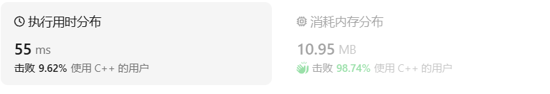
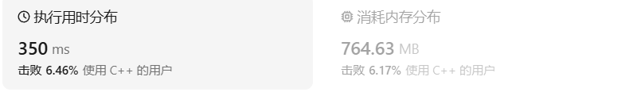
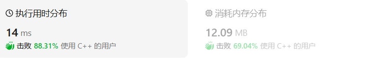
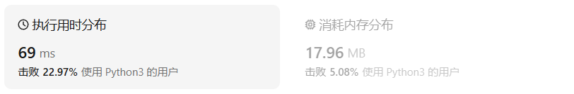
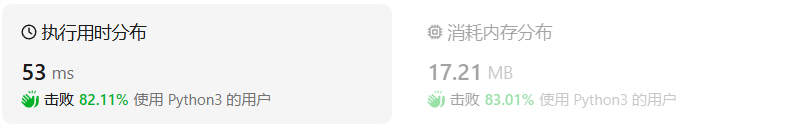

# 1047.删除字符串中的所有相邻重复项

[1047. 删除字符串中的所有相邻重复项](https://leetcode.cn/problems/remove-all-adjacent-duplicates-in-string/description/)

## 题目描述

给出由小写字母组成的字符串 `S`，**重复项删除操作**会选择两个相邻且相同的字母，并删除它们。

在 S 上反复执行重复项删除操作，直到无法继续删除。

在完成所有重复项删除操作后返回最终的字符串。答案保证唯一。

 

**示例：**

```
输入："abbaca"
输出："ca"
解释：
例如，在 "abbaca" 中，我们可以删除 "bb" 由于两字母相邻且相同，这是此时唯一可以执行删除操作的重复项。之后我们得到字符串 "aaca"，其中又只有 "aa" 可以执行重复项删除操作，所以最后的字符串为 "ca"。
```

 

**提示：**

1. `1 <= S.length <= 20000`
2. `S` 仅由小写英文字母组成。

## 我的C++解法

第一种思路就是简单的循环，及时进行对字符串的erase操作

```cpp
class Solution {
public:
    string removeDuplicates(string s) {
        for(int i=0;i<s.size()-1;i++){
            if(s[i]==s[i+1]){
                s.erase(i,2);
                if(s.size()<2)  return s;
                else    i=-1;
            }
        }
        return s;
    }
};
```

所有测试都通过但是超时了。

发现一个问题就是后面删去元素之后回溯到首元素这点会导致耗时增加，尝试修改。当非首元素时，删除后i-=2，使得下次判别不用回溯到首位；当是首元素时，删除后i=-1

```cpp
class Solution {
public:
    string removeDuplicates(string s) {
        for(int i=0;i<s.size()-1;i++){
            if(s[i]==s[i+1]){
                s.erase(i,2);
                if(s.size()<2)  return s;
                else if(i>0)    i-=2;
                else    i=-1;
            }
        }
        return s;
    }
};
```

结果：



耗时还是高。

想到使用栈

```cpp
class Solution {
public:
    string removeDuplicates(string s) {
        //直接使用栈啊
        stack<char> a;
        for(char x:s){
            if(!a.empty()){
                x==a.top()?a.pop():a.push(x);
            }
            else    a.push(x);
        }
        s="";
        while(!a.empty()){
            s=a.top()+s;
            a.pop();
        }
        return s;
    }
};
```

结果：



啊？耗时和耗空间更高了。问题出在哪？

## C++参考答案

使用栈

```cpp
class Solution {
public:
    string removeDuplicates(string S) {
        string stk;
        for (char ch : S) {
            if (!stk.empty() && stk.back() == ch) {
                stk.pop_back();
            } else {
                stk.push_back(ch);
            }
        }
        return stk;
    }
};
```

结果：



因为这个解法并不是开辟一个真正的stack，而是用string来模拟stack，因为sting可以有弹出尾元素和装入尾元素的操作

## C++收获

### C++使用string模拟存储类型为char的栈

在C++中，可以使用`std::string`来模拟一个存储`char`数据的栈。`std::string`提供了在字符串末尾添加和删除元素的功能，这与栈的后进先出（LIFO）特性相符合。以下是使用`std::string`模拟栈的一个简单示例：

```cpp
#include <iostream>
#include <string>

class CharStack {
private:
    std::string stack; // 使用字符串作为栈的底层容器

public:
    // 入栈操作
    void push(char c) {
        stack.push_back(c); // 在字符串末尾添加元素
    }

    // 出栈操作
    void pop() {
        if (!stack.empty()) {
            stack.pop_back(); // 删除字符串末尾的元素
        } else {
            std::cout << "Stack is empty, cannot pop." << std::endl;
        }
    }

    // 查看栈顶元素
    char top() const {
        if (!stack.empty()) {
            return stack.back(); // 返回字符串末尾的元素
        } else {
            std::cout << "Stack is empty, no top element." << std::endl;
            return '\0'; // 返回空字符，表示栈为空
        }
    }

    // 检查栈是否为空
    bool empty() const {
        return stack.empty(); // 字符串为空则栈为空
    }

    // 获取栈的大小
    size_t size() const {
        return stack.size(); // 返回字符串的长度
    }
};

int main() {
    CharStack myStack;

    // 入栈操作
    myStack.push('a');
    myStack.push('b');
    myStack.push('c');

    // 查看栈顶元素
    std::cout << "Top element is: " << myStack.top() << std::endl;

    // 出栈操作
    myStack.pop();
    std::cout << "Top element after one pop is: " << myStack.top() << std::endl;

    // 检查栈是否为空
    if (myStack.empty()) {
        std::cout << "The stack is empty." << std::endl;
    } else {
        std::cout << "The stack is not empty." << std::endl;
    }

    return 0;
}
```

在这个示例中，`CharStack`类使用`std::string`作为底层容器来存储`char`类型的数据。我们定义了`push`、`pop`、`top`、`empty`和`size`方法来模拟栈的基本操作。

- `push`方法使用`std::string::push_back`在栈顶添加一个元素。
- `pop`方法使用`std::string::pop_back`移除栈顶元素，如果栈为空，则输出错误信息。
- `top`方法返回栈顶元素，如果栈为空，则输出错误信息并返回空字符。
- `empty`方法返回栈是否为空的状态。
- `size`方法返回栈中元素的数量。

这个简单的栈实现可以用于基本的字符数据栈操作。如果需要更复杂的功能，比如异常安全或者线程安全，可能需要进一步扩展这个类。

### C++对字符串的操作

在C++中，`std::string` 是标准库中的一个类模板，专门用于处理字符串。以下是一些常见的 `std::string` 操作：

#### 构造和初始化
- 默认构造一个空字符串：
  ```cpp
  std::string str;
  ```
- 通过指定字符数量和默认字符初始化：
  ```cpp
  std::string str(10, 'a'); // 创建一个包含10个'a'的字符串
  ```
- 通过复制或移动构造：
  ```cpp
  std::string str1("Hello");
  std::string str2 = str1; // 复制构造
  std::string str3 = std::move(str1); // 移动构造
  ```
- 通过C风格字符串初始化：
  ```cpp
  const char* cstr = "C-string";
  std::string str(cstr);
  ```

#### 赋值操作
- 赋值操作符：
  ```cpp
  std::string str;
  str = "Hello"; // 赋值
  ```
- 移动赋值操作符：
  ```cpp
  str = std::move(otherStr); // 移动赋值
  ```

#### 访问元素
- 通过下标访问字符串中的字符：
  ```cpp
  char ch = str[0]; // 获取第一个字符
  ```
- 使用 `at()` 成员函数，它还检查索引是否有效：
  ```cpp
  char ch = str.at(0); // 获取第一个字符，带边界检查
  ```

#### 字符串长度和大小
- 获取字符串长度：
  ```cpp
  size_t len = str.length(); // 或者使用 str.size()
  ```
- 清空字符串：
  ```cpp
  str.clear();
  ```

#### 字符串拼接
- 使用 `+` 运算符拼接字符串：
  ```cpp
  std::string str1 = "Hello";
  std::string str2 = "World";
  std::string str3 = str1 + " " + str2;
  ```
- 使用 `append()` 或 `operator+=`：
  ```cpp
  str1.append(str2);
  str1 += str2; // 等价于 append
  ```

#### 字符串比较
- 使用 `==`, `!=`, `<`, `>`, `<=`, `>=` 比较字符串：
  ```cpp
  if (str1 == str2) {
    // 字符串相等
  }
  ```

#### 子字符串操作
- 使用 `substr()` 获取子字符串：
  ```cpp
  std::string sub = str.substr(0, 5); // 获取前5个字符
  ```
- 使用 `find()` 查找子字符串：
  ```cpp
  size_t pos = str.find("sub");
  if (pos != std::string::npos) {
    // 找到了子字符串
  }
  ```

#### 字符串替换
- 使用 `replace()` 替换字符串中的部分：
  ```cpp
  str.replace(0, 5, "New");
  // 将从索引0开始的5个字符替换为"New"
  ```

#### 字符串插入和删除
- 使用 `insert()` 在指定位置插入字符或字符串：
  ```cpp
  str.insert(0, "New-");
  // 在索引0的位置插入"New-"
  ```
- 使用 `erase()` 删除字符或字符串：
  ```cpp
  str.erase(0, 5);
  // 删除从索引0开始的5个字符
  ```

#### 字符串搜索和查找
- 查找字符或字符串的位置：
  ```cpp
  size_t pos = str.find('e');
  if (pos != std::string::npos) {
    // 找到了字符
  }
  ```
- 查找字符串的最后一次出现：
  ```cpp
  size_t pos = str.rfind('e');
  if (pos != std::string::npos) {
    // 找到了字符
  }
  ```

#### 字符串转换
- 转换为C风格字符串：
  ```cpp
  const char* cstr = str.c_str();
  ```
- 转换为其他数据类型（例如，整数、浮点数）：
  ```cpp
  int num = std::stoi(str);
  ```

#### 字符串格式化
- 使用 `std::ostringstream` 进行格式化：
  ```cpp
  std::ostringstream oss;
  oss << "The value is " << value;
  std::string formattedStr = oss.str();
  ```

这些是 `std::string` 类的一些基本操作。C++标准库提供了丰富的功能来处理字符串，可以根据需要使用这些功能来执行各种字符串操作。

## 我的python解答

使用list类型的栈

```python
class Solution:
    def removeDuplicates(self, s: str) -> str:
        s=list(s)
        stack = []
        for i in range(len(s)):
            if len(stack):
                if s[i]==stack[-1]:
                    del stack[-1]
                else:
                    stack.append(s[i])
                i+=1
            else:
                stack.append(s[i])
                i+=1
        return "".join(stack)
```

结果：



时空还是高，怎么回事呢？

## python参考答案

```python
class Solution:
    def removeDuplicates(self, S: str) -> str:
        stk = list()
        for ch in S:
            if stk and stk[-1] == ch:
                stk.pop()
            else:
                stk.append(ch)
        return "".join(stk)
```

结果：




## python收获

list类型数据也有pop操作，弹出最后一个元素。