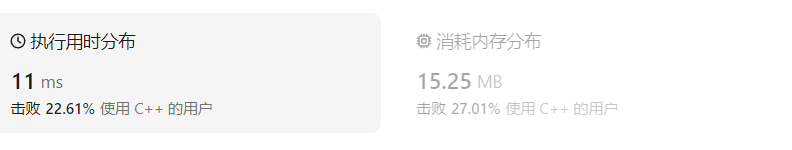

# 150逆波兰表达式求值（中等）

[150. 逆波兰表达式求值 - 力扣（LeetCode）](https://leetcode.cn/problems/evaluate-reverse-polish-notation/description/)

## 题目描述

给你一个字符串数组 `tokens` ，表示一个根据 [逆波兰表示法](https://baike.baidu.com/item/逆波兰式/128437) 表示的算术表达式。

请你计算该表达式。返回一个表示表达式值的整数。

**注意：**

- 有效的算符为 `'+'`、`'-'`、`'*'` 和 `'/'` 。
- 每个操作数（运算对象）都可以是一个整数或者另一个表达式。
- 两个整数之间的除法总是 **向零截断** 。
- 表达式中不含除零运算。
- 输入是一个根据逆波兰表示法表示的算术表达式。
- 答案及所有中间计算结果可以用 **32 位** 整数表示。

 

**示例 1：**

```
输入：tokens = ["2","1","+","3","*"]
输出：9
解释：该算式转化为常见的中缀算术表达式为：((2 + 1) * 3) = 9
```

**示例 2：**

```
输入：tokens = ["4","13","5","/","+"]
输出：6
解释：该算式转化为常见的中缀算术表达式为：(4 + (13 / 5)) = 6
```

**示例 3：**

```
输入：tokens = ["10","6","9","3","+","-11","*","/","*","17","+","5","+"]
输出：22
解释：该算式转化为常见的中缀算术表达式为：
  ((10 * (6 / ((9 + 3) * -11))) + 17) + 5
= ((10 * (6 / (12 * -11))) + 17) + 5
= ((10 * (6 / -132)) + 17) + 5
= ((10 * 0) + 17) + 5
= (0 + 17) + 5
= 17 + 5
= 22
```

 

**提示：**

- `1 <= tokens.length <= 104`
- `tokens[i]` 是一个算符（`"+"`、`"-"`、`"*"` 或 `"/"`），或是在范围 `[-200, 200]` 内的一个整数

 

**逆波兰表达式：**

逆波兰表达式是一种后缀表达式，所谓后缀就是指算符写在后面。

- 平常使用的算式则是一种中缀表达式，如 `( 1 + 2 ) * ( 3 + 4 )` 。
- 该算式的逆波兰表达式写法为 `( ( 1 2 + ) ( 3 4 + ) * )` 。

逆波兰表达式主要有以下两个优点：

- 去掉括号后表达式无歧义，上式即便写成 `1 2 + 3 4 + * `也可以依据次序计算出正确结果。
- 适合用栈操作运算：遇到数字则入栈；遇到算符则取出栈顶两个数字进行计算，并将结果压入栈中

## 我的C++解法

栈

```cpp
class Solution {
public:
    int evalRPN(vector<string>& tokens) {
        //就是借助栈
        stack<int> a;
        for(string x:tokens){
            if(x=="+"){
                int tmp = a.top();
                a.pop();
                tmp = tmp+a.top();
                a.pop();
                a.push(tmp);
            }
            else if(x=="-"){
                int tmp = a.top();
                a.pop();
                tmp = a.top()-tmp;
                a.pop();
                a.push(tmp);
            }
            else if(x=="*"){
                int tmp = a.top();
                a.pop();
                tmp = tmp*a.top();
                a.pop();
                a.push(tmp);
            }
            else if(x=="/"){
                int tmp = a.top();
                a.pop();
                tmp = a.top()/tmp;
                a.pop();
                a.push(tmp);
            }  
            else{
                istringstream ss(x);
                int num;
                ss>>num;
                a.push(num);
            }                
        }
        return a.top();
    }
};
```

结果：



时空有点大，尝试变换。使用vector来模拟栈：

```cpp
class Solution {
public:
    int evalRPN(vector<string>& tokens) {
        //就是借助栈
        vector<int> a;
        for(string x:tokens){
            if(x=="+"){
                int tmp = a.back();
                a.pop_back();
                tmp = tmp+a.back();
                a.pop_back();
                a.push_back(tmp);
            }
            else if(x=="-"){
                int tmp = a.back();
                a.pop_back();
                tmp = a.back()-tmp;
                a.pop_back();
                a.push_back(tmp);
            }
            else if(x=="*"){
                int tmp = a.back();
                a.pop_back();
                tmp = tmp*a.back();
                a.pop_back();
                a.push_back(tmp);
            }
            else if(x=="/"){
                int tmp = a.back();
                a.pop_back();
                tmp = a.back()/tmp;
                a.pop_back();
                a.push_back(tmp);
            }  
            else{
                istringstream ss(x);
                int num;
                ss>>num;
                a.push_back(num);
            }                
        }
        return a[0];
    }
};
```

整体思路和上面一致，只是使用了vector类型来实现栈。

结果：


## C++参考答案

### 直接使用栈

```cpp
class Solution {
public:
    int evalRPN(vector<string>& tokens) {
        stack<int> stk;
        int n = tokens.size();
        for (int i = 0; i < n; i++) {
            string& token = tokens[i];
            if (isNumber(token)) {
                stk.push(atoi(token.c_str()));
            } else {
                int num2 = stk.top();
                stk.pop();
                int num1 = stk.top();
                stk.pop();
                switch (token[0]) {
                    case '+':
                        stk.push(num1 + num2);
                        break;
                    case '-':
                        stk.push(num1 - num2);
                        break;
                    case '*':
                        stk.push(num1 * num2);
                        break;
                    case '/':
                        stk.push(num1 / num2);
                        break;
                }
            }
        }
        return stk.top();
    }

    bool isNumber(string& token) {
        return !(token == "+" || token == "-" || token == "*" || token == "/");
    }
};
```

### 数组模拟栈

```cpp
class Solution {
public:
    int evalRPN(vector<string>& tokens) {
        int n = tokens.size();
        vector<int> stk((n + 1) / 2);
        int index = -1;
        for (int i = 0; i < n; i++) {
            string& token = tokens[i];
            if (token.length() > 1 || isdigit(token[0])) {
                index++;
                stk[index] = atoi(token.c_str());
            } else {
                switch (token[0]) {
                    case '+':
                        index--;
                        stk[index] += stk[index + 1];
                        break;
                    case '-':
                        index--;
                        stk[index] -= stk[index + 1];
                        break;
                    case '*':
                        index--;
                        stk[index] *= stk[index + 1];
                        break;
                    case '/':
                        index--;
                        stk[index] /= stk[index + 1];
                        break;
                }
            }
        }
        return stk[index];
    }
};
```


## C++收获

### C++中string和int之间的相互转化

在C++中，`std::string` 类型和 `int` 类型之间的相互转换可以通过以下几种方式实现：

#### 从 `int` 转换为 `std::string`
##### 通过 std::to_string() 函数转换

可以使用 `std::to_string` 函数将整数转换为字符串：

```cpp
#include <string>

int num = 123;
std::string str = std::to_string(num);
// str 现在是 "123"
```

##### 通过 ostringstream 转换

```cpp
#include <iostream>
#include <sstream>

int main()
{
    int num = 123;
    std::ostringstream ss;
    ss << num;
    std::cout << ss.str();
    return 0;
}
```

这是一种通过字符流的方式将整数转换成字符串，这种方式在C++11之前也可以使用。

##### 通过 sprintf 转换

```cpp
#include <stdio.h>

int main()
{
    int num = 123;
    char buffer[256];
    sprintf(buffer, "%d", num);

    printf("%s", buffer);
    return 0;
}
```

这是一种C语言中的转换方式，`sprintf` 也可以换成更安全的 `snprintf` 函数

#### 从 `std::string` 转换为 `int`

##### 通过 istringstream 转换

```cpp
#include <iostream>
#include <sstream>

int main()
{
    std::string str = "668";
    int num = 0;

    std::istringstream ss(str);
    ss >> num;

    std::cout << num;
    return 0;
}
```

使用 `istringstream` 可以从字符流中读取整数，与 `ostringstream` 是一种相反的操作

##### 使用 sscanf 来转化

```cpp
#include <iostream>
#include <stdio.h>

int main()
{
    std::string str = "668";
    int num = 0;

    sscanf(str.c_str(), "%d", &num);
    std::cout << num;
    return 0;
}
```

注意 `sscanf` 函数的第一个参数类型是 `const char *`，`string`类型的参数需要转换一下

##### 使用 atoi 转换

```cpp
#include <iostream>
#include <stdlib.h>

int main()
{
    std::string str = "668";
    std::cout << atoi(str.c_str());
    return 0;
}
```

`atoi` 函数的头文件是 `stdlib.h`，同样是一个C语言中的函数

##### 使用stoi转换

可以使用 `std::stoi` 函数将字符串转换为整数：

```cpp
#include <string>

std::string str = "123";
int num = std::stoi(str);
// num 现在是 123
```


#### 注意事项

- 在进行字符串到整数的转换时，如果字符串包含非数字字符，`std::stoi` 会抛出一个 `std::invalid_argument` 异常。如果字符串以数字开头，但后面有非数字字符，`std::stoi` 会抛出一个 `std::out_of_range` 异常。
- `std::to_string` 可以正确处理负数和正数的转换。

#### 示例代码
```cpp
#include <iostream>
#include <string>
#include <stdexcept>

int main() {
    // 从 int 转换为 string
    int number = -456;
    std::string numberStr = std::to_string(number);
    std::cout << "String: " << numberStr << std::endl;

    // 从 string 转换为 int
    std::string text = "7890";
    try {
        int number = std::stoi(text);
        std::cout << "Integer: " << number << std::endl;
    } catch (const std::invalid_argument& e) {
        std::cerr << "Invalid input: " << e.what() << std::endl;
    } catch (const std::out_of_range& e) {
        std::cerr << "Input out of range: " << e.what() << std::endl;
    }

    return 0;
}
```

在实际应用中，务必注意异常处理，以确保程序的健壮性。

### string转换为long long

在C++中，`stoll` 是一个标准库函数，用于将字符串转换为 `long long` 类型的整数。这个函数位于 `<sstream>` 头文件中，因此在使用之前需要包含这个头文件。

`stoll` 函数的声明如下：

```cpp
long long stoll(const string& str, size_t* pos = 0, int base = 10);
```

参数说明：
- `str`：要转换的字符串。
- `pos`（可选）：指向 `size_t` 类型的指针，用于存储解析过程中到达的位置。如果提供了这个参数，转换将从 `str` 的这个位置开始，并且在转换完成后更新这个位置的值。如果转换失败，这个位置将被设置为0。
- `base`（可选）：数值基数，可以是2到36之间的任意值，表示字符串表示的数的进制。默认值为10，表示十进制。

使用 `stoll` 的示例：

```cpp
#include <iostream>
#include <sstream>
#include <string>

int main() {
    std::string str = "1234567890";
    long long result;

    // 转换十进制字符串
    result = std::stoll(str);
    std::cout << "Decimal string converted to long long: " << result << std::endl;

    // 转换十六进制字符串
    str = "1A3F";
    result = std::stoll(str, nullptr, 16);
    std::cout << "Hexadecimal string converted to long long: " << result << std::endl;

    return 0;
}
```

在这个示例中，我们首先将一个十进制的字符串转换为 `long long` 类型，然后转换一个十六进制的字符串。

如果字符串 `str` 不是一个有效的整数表示，或者它表示的数值超出了 `long long` 类型的范围，`stoll` 将抛出一个 `std::invalid_argument` 或 `std::out_of_range` 异常。因此，在使用 `stoll` 时，可能需要进行异常处理。

```cpp
try {
    std::string str = "1234abc";
    long long result = std::stoll(str);
} catch (const std::invalid_argument& e) {
    std::cerr << "Invalid argument: " << e.what() << '\n';
} catch (const std::out_of_range& e) {
    std::cerr << "Out of range: " << e.what() << '\n';
}
```

这将捕获并处理由 `stoll` 抛出的任何异常。

## 我的python解答

```python
class Solution:
    def evalRPN(self, tokens: List[str]) -> int:
        a = []
        for ch in tokens:
            if ch in ["+","-","*","/"]:
                tmp = a[-1]
                del a[-1]
                if ch=="+": a[-1] = a[-1]+tmp
                if ch=="-": a[-1] = a[-1]-tmp
                if ch=="*": a[-1] = a[-1]*tmp
                if ch=="/": a[-1] = int(a[-1]/tmp)
                # print("执行运算操作后：",a)
            else:
                a.append(int(ch))
                # print("压入数据：",a)
        return a[0]
```

结果：


在这个解法中出现了小问题，比如在py中，6/-132=-0.045454545454545456，我想要的结果是-0，也就是0，但是6//-132=-1，得到的是-1，因此只能使用小数除法转整数的方式了。

## python参考答案

### 栈

```python
class Solution:
    def evalRPN(self, tokens: List[str]) -> int:
        op_to_binary_fn = {
            "+": add,
            "-": sub,
            "*": mul,
            "/": lambda x, y: int(x / y),   # 需要注意 python 中负数除法的表现与题目不一致
        }

        stack = list()
        for token in tokens:
            try:
                num = int(token)
            except ValueError:
                num2 = stack.pop()
                num1 = stack.pop()
                num = op_to_binary_fn[token](num1, num2)
            finally:
                stack.append(num)
            
        return stack[0]
```

### 数组

```python
class Solution:
    def evalRPN(self, tokens: List[str]) -> int:
        op_to_binary_fn = {
            "+": add,
            "-": sub,
            "*": mul,
            "/": lambda x, y: int(x / y),   # 需要注意 python 中负数除法的表现与题目不一致
        }

        n = len(tokens)
        stack = [0] * ((n + 1) // 2)
        index = -1
        for token in tokens:
            try:
                num = int(token)
                index += 1
                stack[index] = num
            except ValueError:
                index -= 1
                stack[index] = op_to_binary_fn[token](stack[index], stack[index + 1])
            
        return stack[0]
```

```python
class Solution:
    def evalRPN(self, tokens: List[str]) -> int:
        stack = []
        for item in tokens:
            if item not in {"+", "-", "*", "/"}:
                stack.append(item)
            else:
                first_num, second_num = stack.pop(), stack.pop()
                stack.append(
                    int(eval(f'{second_num} {item} {first_num}'))   # 第一个出来的在运算符后面
                )
        return int(stack.pop()) # 如果一开始只有一个数，那么会是字符串形式的
```

## python收获

### 操作符从字符串到运算符

可以构建一个映射表

```python
op_to_binary_fn = {
    "+": add,
    "-": sub,
    "*": mul,
    "/": lambda x, y: int(x / y),   # 需要注意 python 中负数除法的表现与题目不一致
}
```

后面就可以通过调用映射表来实现运算操作，如：`op_to_binary_fn[tokens[10]](tmp1,tmp2)`假设`tokens[10]="-"`，则等价于`sub(tmp1,tmp2)=tmp1-tmp2`

### 使用eval函数进行逆波兰运算

在Python中，`eval` 函数用于执行一个字符串表达式，并返回表达式的值。这个函数可以接受一个字符串参数，该字符串包含了有效的Python表达式，并且可以执行它。

在你提供的代码片段中，`eval` 被用于计算两个操作数的算术运算。让我们来详细解释第十行代码：

```python
stack.append(
    int(eval(f'{second_num} {item} {first_num}'))   # 第一个出来的在运算符后面
)
```

这行代码位于一个逆波兰表达式（Reverse Polish Notation, RPN）求值函数中。逆波兰表达式是一种不需要括号来标识操作符优先级的算术表达式表示方法。在逆波兰表达式中，操作符位于它们的两个操作数之后。

在这个特定的代码段中，`second_num` 和 `first_num` 是从栈中弹出的两个操作数，`item` 是一个操作符（"+", "-", "*", "/" 中的一个）。`eval` 函数被用来计算这两个操作数和操作符组成的表达式的值。

- `f'{second_num} {item} {first_num}'`：这是一个格式化字符串（也称为 f-string），它将 `second_num`、`item` 和 `first_num` 插入到字符串中，形成一个新的字符串，这个字符串代表了一个有效的Python表达式。例如，如果 `second_num` 是 `"3"`，`item` 是 `"+"`，`first_num` 是 `"5"`，那么这个字符串将是 `"3 + 5"`。
- `eval(...)`：这个函数执行上述创建的字符串表达式，并返回计算结果。
- `int(...)`：由于 `eval` 返回的结果可能是浮点数（特别是当进行除法操作时），而题目要求返回一个整数结果，因此使用 `int()` 函数将 `eval` 的结果转换为整数。

因此，这行代码的作用是：从栈中弹出两个操作数和一个操作符，使用 `eval` 计算它们的运算结果，并将这个结果转换为整数后压入栈中。

**注意**：在实际应用中，使用 `eval` 可以带来安全风险，因为它会执行字符串中的任何代码。因此，如果输入不可信，应避免使用 `eval` 或采取适当的安全措施。在逆波兰表达式求值的问题中，可以考虑使用更安全的方法来避免使用 `eval`。