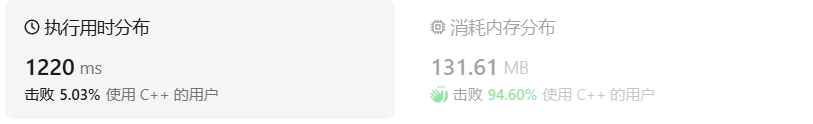
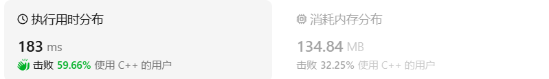
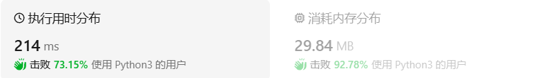

# 239 滑动窗口最大值（困难）

[239. 滑动窗口最大值 - 力扣（LeetCode）](https://leetcode.cn/problems/sliding-window-maximum/description/)

## 题目描述

给你一个整数数组 `nums`，有一个大小为 `k` 的滑动窗口从数组的最左侧移动到数组的最右侧。你只可以看到在滑动窗口内的 `k` 个数字。滑动窗口每次只向右移动一位。

返回 *滑动窗口中的最大值* 。

 

**示例 1：**

```
输入：nums = [1,3,-1,-3,5,3,6,7], k = 3
输出：[3,3,5,5,6,7]
解释：
滑动窗口的位置                最大值
---------------               -----
[1  3  -1] -3  5  3  6  7       3
 1 [3  -1  -3] 5  3  6  7       3
 1  3 [-1  -3  5] 3  6  7       5
 1  3  -1 [-3  5  3] 6  7       5
 1  3  -1  -3 [5  3  6] 7       6
 1  3  -1  -3  5 [3  6  7]      7
```

**示例 2：**

```
输入：nums = [1], k = 1
输出：[1]
```

 

**提示：**

- `1 <= nums.length <= 105`
- `-104 <= nums[i] <= 104`
- `1 <= k <= nums.length`

## 我的 C++解法

第一遍看错题了，以为是返回滑动窗口和的最大

```cpp
class Solution {
public:
    vector<int> maxSlidingWindow(vector<int>& nums, int k) {
        int sum=0;
        vector<int> result;
        for(int i=0;i<k;i++){
            sum+=nums[i];
        }
        result.push_back(sum);
        int previous = sum;
        for(int i=1;i<=nums.size()-k;i++){
            sum-=nums[i-1];
            sum+=nums[i+k-1];
            result.push_back(max(sum,previous));
            previous = sum;
        }
        return result;
    }
};
```

重新编写。

思路就是：首先在首个窗口中找到最大值，返回其下标。压入结果。移动窗口，如果窗口初试下标小于等于最大值下标，则只用比较最大和新进入窗口的值；否则重新比较窗口中的最大值。

```cpp
class Solution {
public:
    int max_in_window(vector<int>& nums,int i,int k){
        //i是当前窗口初试位置，k为大小
        int max = nums[i];
        int pos = i;
        for(int j =i;j<i+k;j++){
            // max>nums[j]?pos = pos: pos = j,max=nums[j];
            if(max<=nums[j]){
                pos = j;
                max = nums[j];
            }
        }
        return pos;
    }

    vector<int> maxSlidingWindow(vector<int>& nums, int k) {
        vector<int> result;
        int pos = max_in_window(nums,0,k);
        result.push_back(nums[pos]);
        for(int i=1;i<=nums.size()-k;i++){
            if(pos>=i){
                // nums[pos]<=nums[i+k-1] ? result.push_back(nums[i+k-1]),(pos = i+k-1):result.push_back(nums[pos]);
                if(nums[pos]<=nums[i+k-1]){
                    result.push_back(nums[i+k-1]);
                    pos = i+k-1;
                }
                else{
                    result.push_back(nums[pos]);
                }
            }
            else{
                pos = max_in_window(nums,i,k);
                result.push_back(nums[pos]);
            }
        }
        return result;
    }
};
```

结果：空间复杂度低，时间高。



三目运算不知为何报错了，无奈注释掉，重写。

看了参考答案后尝试自己写：

```cpp
class Solution {
public:
//学习双端队列后尝试做一下
    vector<int> maxSlidingWindow(vector<int>& nums, int k) {
        deque<int> deque;
        deque.push_back(nums[0]);
        vector<int> result;
        for(int i=1;i<k;i++){
            //创建初试单调队列
            if(!deque.empty() && nums[i]<=deque.back()){
                deque.push_back(nums[i]);
                continue;
            }
            while(!deque.empty() && nums[i]>deque.front()){
                deque.pop_front();
            }
            while(!deque.empty() && nums[i]>deque.back()){
                deque.pop_back();
            }            
            deque.push_back(nums[i]);
        }
        result.push_back(deque.front());
        for(int i = k;i<nums.size();i++){
            if(nums[i-k]==deque.front())    deque.pop_front();
            if(!deque.empty() && nums[i]<=deque.back()){
                deque.push_back(nums[i]);
                result.push_back(deque.front());
                continue;
            }
            while(!deque.empty() && nums[i]>deque.front()){
                deque.pop_front();
            }
            while(!deque.empty() && nums[i]>deque.back()){
                deque.pop_back();
            }
            deque.push_back(nums[i]);
            result.push_back(deque.front());        
        }
    return result;
    }
};
```

写的很不顺畅，不是这里少就是哪里少，结果：



## C++参考答案

### 单调队列

$$
单调队列
\begin{cases}
双端队列\begin{cases}
移除最左边的元素\\
移除最右边的元素\\
在最右边插入元素
\end{cases}\\
单调性：从队首到对位单调递减
\end{cases}
$$

目标是队首存储当前滑动窗口中的最大值，后面的元素保持单调递减即可，小元素直接移除，因为无法成为最大值。


使用双端队列来实现这个单调队列最佳。

单调队列的实现：

```cpp
class MyQueue { //单调队列（从大到小）
public:
    deque<int> que; // 使用deque来实现单调队列
    // 每次弹出的时候，比较当前要弹出的数值是否等于队列出口元素的数值，如果相等则弹出。
    // 同时pop之前判断队列当前是否为空。
    void pop(int value) {
        if (!que.empty() && value == que.front()) {
            que.pop_front();
        }
    }
    // 如果push的数值大于入口元素的数值，那么就将队列后端的数值弹出，直到push的数值小于等于队列入口元素的数值为止。
    // 这样就保持了队列里的数值是单调从大到小的了。
    void push(int value) {
        while (!que.empty() && value > que.back()) {
            que.pop_back();
        }
        que.push_back(value);

    }
    // 查询当前队列里的最大值 直接返回队列前端也就是front就可以了。
    int front() {
        return que.front();
    }
};
```

单调队列一旦创建，剩下的思路就很好理解了

```cpp
class Solution {
private:
    class MyQueue { //单调队列（从大到小）
    public:
        deque<int> que; // 使用deque来实现单调队列
        // 每次弹出的时候，比较当前要弹出的数值是否等于队列出口元素的数值，如果相等则弹出。
        // 同时pop之前判断队列当前是否为空。
        void pop(int value) {
            if (!que.empty() && value == que.front()) {
                que.pop_front();
            }
        }
        // 如果push的数值大于入口元素的数值，那么就将队列后端的数值弹出，直到push的数值小于等于队列入口元素的数值为止。
        // 这样就保持了队列里的数值是单调从大到小的了。
        void push(int value) {
            while (!que.empty() && value > que.back()) {
                que.pop_back();
            }
            que.push_back(value);

        }
        // 查询当前队列里的最大值 直接返回队列前端也就是front就可以了。
        int front() {
            return que.front();
        }
    };
public:
    vector<int> maxSlidingWindow(vector<int>& nums, int k) {
        MyQueue que;
        vector<int> result;
        for (int i = 0; i < k; i++) { // 先将前k的元素放进队列
            que.push(nums[i]);
        }
        result.push_back(que.front()); // result 记录前k的元素的最大值
        for (int i = k; i < nums.size(); i++) {
            que.pop(nums[i - k]); // 滑动窗口移除最前面元素
            que.push(nums[i]); // 滑动窗口前加入最后面的元素
            result.push_back(que.front()); // 记录对应的最大值
        }
        return result;
    }
};
```

另一种思路：单调队列中只记录索引值

```cpp
class Solution {
public:
    vector<int> maxSlidingWindow(vector<int>& nums, int k) {
        vector<int> ans;
        deque<int> q; // 双端队列
        for (int i = 0; i < nums.size(); i++) {
            // 1. 入
            while (!q.empty() && nums[q.back()] <= nums[i]) {
                q.pop_back(); // 维护 q 的单调性
            }
            q.push_back(i); // 入队
            // 2. 出
            if (i - q.front() >= k) { // 队首已经离开窗口了
                q.pop_front();
            }
            // 3. 记录答案
            if (i >= k - 1) {
                // 由于队首到队尾单调递减，所以窗口最大值就是队首
                ans.push_back(nums[q.front()]);
            }
        }
        return ans;
    }
};
```

### 优先队列（堆）

```cpp
class Solution {
public:
    vector<int> maxSlidingWindow(vector<int>& nums, int k) {
        int n = nums.size();
        priority_queue<pair<int, int>> q;
        for (int i = 0; i < k; ++i) {
            q.emplace(nums[i], i);
        }
        vector<int> ans = {q.top().first};
        for (int i = k; i < n; ++i) {
            q.emplace(nums[i], i);
            while (q.top().second <= i - k) {
                q.pop();
            }
            ans.push_back(q.top().first);
        }
        return ans;
    }
};
```

这段代码是一个 C++类的成员函数，它属于一个名为 `Solution` 的类。这个函数的目的是找到一个给定数组 `nums` 中的每个滑动窗口（长度为 `k`）的最大值，并返回这些最大值的列表。

让我们逐步分析这段代码：

1. 函数 `maxSlidingWindow` 接收两个参数：一个整数数组 `nums` 和一个整数 `k`，表示滑动窗口的大小。

2. 函数内部，首先声明了一个 `priority_queue`（优先队列），它存储 `pair<int, int>` 类型的元素。这里 `pair<int, int>` 第一个 `int` 表示 `nums` 中的值，第二个 `int` 表示该值在 `nums` 中的索引。

3. 接下来，使用一个 `for` 循环将窗口的前 `k` 个元素及其索引存入优先队列中。由于 `priority_queue` 默认是最大堆，因此最大的元素会位于队列顶部。

4. 将队列顶部元素的值（即当前窗口中的最大值）添加到答案数组 `ans` 中。

5. 然后，使用另一个 `for` 循环处理从索引 `k` 开始到 `nums` 结尾的数组元素：
   - 将当前元素及其索引存入优先队列。
   - 使用 `while` 循环从队列中移除那些索引小于 `i - k + 1` 的元素，这是因为这些元素已经不在当前考虑的窗口内了（滑动窗口向前滑动了）。
   - 再次将队列顶部元素的值添加到答案数组 `ans` 中。

6. 最后，函数返回包含每个滑动窗口最大值的数组 `ans`。

代码中使用 `priority_queue` 来有效地找到每个窗口内的最大值。由于 `priority_queue` 是基于堆的，所以插入和删除操作的时间复杂度都是 O(log k)。但是，由于在每次迭代中可能需要删除多个元素，最坏情况下的时间复杂度可能会达到 O(n k log k)，其中 n 是 `nums` 的长度。

这种解法的空间复杂度是 O(k)，因为优先队列中最多同时存储 k 个元素。时间复杂度是 O(n log k)，其中 n 是数组 `nums` 的长度。

## C++收获

### 双端队列 deque

<center>关键词：双端队列<center>

<center>关键词：deque<center>

在 C++中，双端队列（deque，全称 double-ended queue）是一种类似于向量（vector）的序列容器，但它提供了在序列的两端快速添加（push）和删除（pop）元素的能力。双端队列通常通过某种形式的链表实现，这使得在两端进行操作的时间复杂度为 O(1)。

以下是 C++中使用双端队列的一些基本操作：

#### 包含头文件
```cpp
#include <deque>
```

#### 创建双端队列
```cpp
std::deque<int> deque;
```

#### 添加元素
- 在前端添加：
  ```cpp
  deque.push_front(10); // 在双端队列前端添加元素10
  ```
- 在后端添加：
  ```cpp
  deque.push_back(20); // 在双端队列后端添加元素20
  ```

#### 删除元素
- 从前端删除：
  ```cpp
  deque.pop_front(); // 删除双端队列前端的元素
  ```
- 从后端删除：
  ```cpp
  deque.pop_back(); // 删除双端队列后端的元素
  ```

#### 访问元素
- 访问第一个元素：
  ```cpp
  int frontElement = deque.front(); // 获取前端元素的值
  ```
- 访问最后一个元素：
  ```cpp
  int backElement = deque.back(); // 获取后端元素的值
  ```

#### 大小和容量
- 获取双端队列的大小：
  ```cpp
  size_t size = deque.size(); // 返回双端队列中的元素数量
  ```
- 检查双端队列是否为空：
  ```cpp
  bool isEmpty = deque.empty(); // 如果双端队列为空，则返回true
  ```

#### 遍历双端队列
```cpp
for (int elem : deque) {
    std::cout << elem << " ";
}
```

#### 例子
```cpp
#include <iostream>
#include <deque>

int main() {
    std::deque<int> d;

    // 添加元素
    d.push_back(10);
    d.push_back(20);
    d.push_front(30);

    // 访问元素
    std::cout << "Front element: " << d.front() << std::endl;
    std::cout << "Back element: " << d.back() << std::endl;

    // 删除元素
    d.pop_front();
    d.pop_back();

    // 遍历双端队列
    for (int elem : d) {
        std::cout << elem << " ";
    }
    std::cout << std::endl;

    return 0;
}
```

输出将是：
```
Front element: 30
Back element: 20
20 
```

双端队列非常适合于需要在序列的两端进行操作的场景，例如实现队列或栈。与标准队列相比，双端队列提供了更大的灵活性。

### 优先队列 priority_queue

<center>关键词：优先队列<center>

<center>关键词：priority_queue<center>

在 C++中，`std::priority_queue` 是标准模板库（STL）中的一个容器适配器，它提供了一个优先队列的功能，其中元素按照特定的顺序自动排列。默认情况下，`std::priority_queue` 是一个最大堆，这意味着队列顶部（通过 `top()` 函数访问）的元素始终是最大的。

以下是 `std::priority_queue` 的一些关键特性和操作：

#### 包含头文件
要使用 `std::priority_queue`，你需要包含以下头文件：

```cpp
#include <queue>
```

#### 创建优先队列
创建一个 `std::priority_queue` 的实例：

```cpp
std::priority_queue<int> pq;
```

#### 插入元素
使用 `push()` 函数向优先队列中插入元素：

```cpp
pq.push(10);
pq.push(20);
```

#### 访问顶部元素
使用 `top()` 函数访问优先队列中的顶部元素（最大元素）：

```cpp
int topElement = pq.top();
```

#### 删除顶部元素
使用 `pop()` 函数从优先队列中删除顶部元素：

```cpp
pq.pop();
```

#### 检查队列是否为空
使用 `empty()` 函数检查优先队列是否为空：

```cpp
bool isEmpty = pq.empty();
```

#### 获取队列的大小
使用 `size()` 函数获取优先队列中的元素数量：

```cpp
size_t size = pq.size();
```

#### 自定义比较函数
可以通过模板参数自定义 `std::priority_queue` 的比较函数，以改变元素的排序方式（例如，改为最小堆）：

```cpp
#include <functional>

struct compare {
    bool operator()(int a, int b) {
        return a > b; // 改变为最小堆
    }
};

std::priority_queue<int, std::vector<int>, compare> minHeap;
```

#### 示例代码
```cpp
#include <iostream>
#include <queue>

int main() {
    std::priority_queue<int> pq;

    // 插入元素
    pq.push(30);
    pq.push(10);
    pq.push(20);

    // 访问并删除顶部元素
    while (!pq.empty()) {
        std::cout << pq.top() << " ";
        pq.pop();
    }

    return 0;
}
```

输出将是：
```
30 20 10 
```

`std::priority_queue` 在需要按照优先级处理元素的场景中非常有用，例如在任务调度、事件驱动模拟、Dijkstra 算法等算法中。然而，由于它是基于堆实现的，所以不支持随机访问，即不能高效地访问除了顶部之外的其他元素。此外，`std::priority_queue` 也不支持 `erase()` 操作或其他直接访问元素的操作。

### C++中的pair

<center>关键词：pair<center>

<center>关键词：键值对<center>

在C++中，`std::pair` 是一个模板类，用于表示一对元素的复合数据类型。它通常用于存储两个相关联的值，这两个值可以是不同的类型。`std::pair` 广泛用于标准库的容器和算法中，例如在关联容器（如 `std::map` 和 `std::multimap`）中存储键值对，或者在排序算法中返回两个元素的比较结果。

以下是 `std::pair` 的一些基本用法：

#### 包含头文件
要使用 `std::pair`，需要包含以下头文件：

```cpp
#include <utility>
```

#### 创建和初始化 `std::pair`
```cpp
// 使用构造函数创建 pair
std::pair<int, double> p(1, 3.14);

// 使用 make_pair 创建 pair，它是一个便捷函数
std::pair<int, std::string> p2 = std::make_pair(2, "C++");
```

#### 访问 `std::pair` 的元素
`std::pair` 提供了 `first` 和 `second` 两个成员变量来访问存储的值：

```cpp
int a = p.first;    // 获取第一个元素
double b = p.second; // 获取第二个元素

// 或者使用 make_pair 函数初始化并直接访问
int x = p2.first;
std::string y = p2.second;
```

#### 使用 `std::pair` 作为函数返回类型
`std::pair` 可以作为函数的返回类型，用于一次返回两个值：

```cpp
std::pair<int, int> minMax(const std::vector<int>& vec) {
    if (vec.empty()) return std::make_pair(0, 0);
    
    int minVal = vec[0], maxVal = vec[0];
    for (int val : vec) {
        if (val < minVal) minVal = val;
        if (val > maxVal) maxVal = val;
    }
    return std::make_pair(minVal, maxVal);
}
```

#### 使用 `std::pair` 作为 `std::map` 的元素
`std::pair` 通常用作 `std::map` 的值类型，其中第一个元素是键（key），第二个元素是值（value）：

```cpp
std::map<std::string, int> myMap;
myMap["apple"] = 1;
myMap["banana"] = 2;

for (const auto& pair : myMap) {
    std::cout << "Key: " << pair.first << ", Value: " << pair.second << std::endl;
}
```

#### 自定义比较函数
当使用 `std::pair` 作为 `std::sort` 或 `std::map` 等算法和容器的元素时，可以自定义比较函数：

```cpp
bool comparePairs(const std::pair<int, int>& a, const std::pair<int, int>& b) {
    return a.first < b.first;
}

// 使用自定义比较函数对 vector<pair> 进行排序
std::vector<std::pair<int, int>> vecOfPairs;
// ... 填充 vecOfPairs ...
std::sort(vecOfPairs.begin(), vecOfPairs.end(), comparePairs);
```

`std::pair` 是一个灵活且多用途的数据结构，它在C++标准库中扮演着重要的角色，特别是在需要同时返回或存储两个相关值的情况下。

### C++中的emplace函数

<center>关键词：emplace函数<center>

在C++中，`emplace` 是一种用于容器的函数，它允许你就地（in-place）构造容器中的元素，而不是先构造一个临时对象然后再将其复制或移动到容器中。`emplace` 方法通常用于避免不必要的复制或移动，从而提高性能。

`emplace` 函数在不同的容器中有不同的重载版本，但基本思想是相同的。以下是一些常见容器的 `emplace` 用法示例：

#### `std::vector` 和 `std::deque`
对于序列容器（如 `std::vector` 和 `std::deque`），`emplace` 通常用于在容器的末尾就地构造一个新元素。

```cpp
#include <vector>
#include <string>

int main() {
    std::vector<std::string> v;
    // 使用 emplace_back 构造一个新字符串
    v.emplace_back("Hello, World!");

    // 使用 emplace 和初始化列表构造一个新字符串
    v.emplace(1, "Hello,emplace");

    for (const auto& s : v) {
        std::cout << s << std::endl;
    }

    return 0;
}
```

#### `std::map` 和 `std::set`
对于关联容器（如 `std::map` 和 `std::set`），`emplace` 可以用于构造键值对或键。

```cpp
#include <map>

int main() {
    std::map<int, std::string> m;
    // 使用 emplace 构造一个键值对
    m.emplace(1, "one");

    // 使用 emplace 构造另一个键值对，带初始化列表
    m.emplace(std::piecewise_construct,
               std::forward_as_tuple(2),
               std::forward_as_tuple("two"));

    for (const auto& kv : m) {
        std::cout << "Key: " << kv.first << ", Value: " << kv.second << std::endl;
    }

    return 0;
}
```

#### `std::priority_queue`
对于 `std::priority_queue`，`emplace` 也可以用于就地构造元素，然后将其推入队列。

```cpp
#include <queue>

int main() {
    std::priority_queue<int> pq;
    // 使用 emplace 构造并推入一个整数
    pq.emplace(42);

    while (!pq.empty()) {
        std::cout << pq.top() << " ";
        pq.pop();
    }

    return 0;
}
```

#### 为什么使用 `emplace`？
使用 `emplace` 而不是 `push_back` 或 `insert` 的好处包括：
- **性能**：`emplace` 可以就地构造对象，避免了复制或移动构造函数的开销。
- **语义清晰**：`emplace` 明确表示元素是在容器中构造的，而不是从外部推入的。
- **支持复杂类型**：对于复杂或大型对象，使用 `emplace` 可以减少临时对象的创建，从而提高效率。

`emplace` 是C++11引入的特性，它提供了一种更现代、更高效的方法来构造容器中的元素。

## 我的 python 解答

```python
class Solution:
    def maxSlidingWindow(self, nums: List[int], k: int) -> List[int]:
        result = list()
        for i in range(len(nums)-k+1):
            # tmp = nums[i:i+k]
            result.append(max(nums[i:i+k]))
        return result
```

不出意外地超时了。

使用 C++做法

```python
class Solution:
    def maxSlidingWindow(self, nums: List[int], k: int) -> List[int]:
        result = list()
        item = max(enumerate(nums[0:k]),key=lambda item:item[1])
        max_index,max_val = item
        for i in range(len(nums)-k+1):
            if i <= max_index:
                if max_val<nums[i+k-1]:
                    max_val = nums[i+k-1]
                    max_index = i+k-1
                result.append(max_val)
            else:
                item = max(enumerate(nums[i:i+k]),key=lambda item:item[1])
                max_index,max_val = item
                result.append(max_val)                
        return result
```

还是超时

突然有个想法，其实只用比较 nums [i-1] 和 nums [i+k-1] 啊

```python
class Solution:
    def maxSlidingWindow(self, nums: List[int], k: int) -> List[int]:
        result = list()
        item = max(enumerate(nums[0:k]),key=lambda item:item[1])
        # print("第一个窗口:",item)
        max_index,max_val = item
        result.append(max_val)
        for i in range(1,len(nums)-k+1):
            out_num = nums[i-1]
            in_num = nums[i+k-1]
            if i-1!=max_index:
                # print("非最大值出队")
                if max_val<=in_num:
                    max_index = i+k-1
                    max_val = in_num
                    result.append(max_val)
                    continue
                else:
                    result.append(max_val)
                    continue
                # print("最大：",max_val)
                # print("索引：",max_index)
            else:
                # print("最大值出去了")
                if out_num<=in_num:
                    max_index=i+k-1
                    max_val=in_num
                    result.append(max_val)
                    continue
                else:
                    item = max(enumerate(nums[i:i+k]),key=lambda item:item[1])
                    max_index,max_val = item
                    max_index+=i
                    result.append(max_val)
                    continue
                # print("最大：",max_val)
                # print("索引：",max_index)                            
        return result
```

在编写的时候少了第三十三行的+= 1 操作，使得结果不正确。真无语了，递减长序列的测试例超时了。

了解了单调队列的构造后，尝试编写答案：

```python
class Solution:
    def maxSlidingWindow(self, nums: List[int], k: int) -> List[int]:
        # 尝试写单调队列
        d = deque()
        ans = list()
        for x in nums[:k]:#前k项
            while d and x>d[0]:
                # 队列非空且队首元素较小
                d.popleft()
            while d and x>d[-1]:
                d.pop()
            d.append(x)
        ans.append(d[0])
        for i in range(k,len(nums)):
            if nums[i-k]==d[0]: d.popleft()
            while d and nums[i]>d[0]:
                # 队列非空且队首元素较小
                d.popleft()
            while d and nums[i]>d[-1]:
                d.pop()
            d.append(nums[i])
            ans.append(d[0])
        return ans
```

在判断双端队列是否为空时搞错了，在 while 中用的是 not d，实际上是 d。结果：



## python 参考答案

### 单调队列

```python
class Solution:
    def maxSlidingWindow(self, nums: List[int], k: int) -> List[int]:
        ans = []
        q = deque()  # 双端队列
        for i, x in enumerate(nums):
            # 1. 入
            while q and nums[q[-1]] <= x:
                q.pop()  # 维护 q 的单调性
            q.append(i)  # 入队
            # 2. 出
            if i - q[0] >= k:  # 队首已经离开窗口了
                q.popleft()
            # 3. 记录答案
            if i >= k - 1:
                # 由于队首到队尾单调递减，所以窗口最大值就是队首
                ans.append(nums[q[0]])
        return ans
```

```python
class Solution:
    def maxSlidingWindow(self, nums: List[int], k: int) -> List[int]:
        n = len(nums)
        q = collections.deque()
        for i in range(k):
            while q and nums[i] >= nums[q[-1]]:
                q.pop()
            q.append(i)

        ans = [nums[q[0]]]
        for i in range(k, n):
            while q and nums[i] >= nums[q[-1]]:
                q.pop()
            q.append(i)
            while q[0] <= i - k:
                q.popleft()
            ans.append(nums[q[0]])
        
        return ans
```


### 优先队列

```python
class Solution:
    def maxSlidingWindow(self, nums: List[int], k: int) -> List[int]:
        n = len(nums)
        # 注意 Python 默认的优先队列是小根堆
        q = [(-nums[i], i) for i in range(k)]
        heapq.heapify(q)

        ans = [-q[0][0]]
        for i in range(k, n):
            heapq.heappush(q, (-nums[i], i))
            while q[0][1] <= i - k:
                heapq.heappop(q)
            ans.append(-q[0][0])
        
        return ans
```

时间复杂度：O(nlog⁡n)空间复杂度：O(n)

## python 收获

### py 获取数组中最大值和索引

<center>关键词：数组最值索引<center>

在 Python 中，获取列表中的最大值及其对应索引可以通过几种方式实现。以下是一些常见的方法：

#### 方法 1: 使用内置函数 `max()` 和 `index()`
```python
my_list = [3, 1, 4, 1, 5, 9, 2, 6, 5, 3, 5]
max_value = max(my_list)  # 获取最大值
max_index = my_list.index(max_value)  # 获取最大值的索引
print(f"最大值: {max_value}, 索引: {max_index}")
```

#### 方法 2: 使用循环遍历
```python
my_list = [3, 1, 4, 1, 5, 9, 2, 6, 5, 3, 5]
max_value = my_list[0]
max_index = 0

for i, value in enumerate(my_list):
    if value > max_value:
        max_value = value
        max_index = i

print(f"最大值: {max_value}, 索引: {max_index}")
```

#### 方法 3: 使用 `max()` 函数和 `enumerate()`
```python
my_list = [3, 1, 4, 1, 5, 9, 2, 6, 5, 3, 5]
max_item = max(enumerate(my_list), key=lambda item: item[1])
max_value, max_index = max_item
print(f"最大值: {max_value}, 索引: {max_index}")
```

#### 方法 4: 使用 `heapq.nlargest()`
如果你需要找到最大的 N 个元素及其索引，可以使用 `heapq` 模块中的 `nlargest` 函数。
```python
import heapq

my_list = [3, 1, 4, 1, 5, 9, 2, 6, 5, 3, 5]
largest_items = heapq.nlargest(1, enumerate(my_list), key=lambda item: item[1])
max_value, max_index = largest_items[0]
print(f"最大值: {max_value}, 索引: {max_index}")
```

以上方法中，方法 1 和方法 2 是最直接的。方法 3 提供了一种更 Pythonic 的方式，而方法 4 适用于需要找到多个最大值的情况。

选择哪种方法取决于你的具体需求，例如是否需要找到多个最大值，以及对性能的考虑。

### py 中的双端队列

<center>关键词：双端队列<center>

<center>关键词：deque<center>

在 Python 中，双端队列（deque，全称为 "double-ended queue"）是 `collections` 模块提供的一种数据结构，它支持在两端进行快速的添加和删除操作。`deque` 是基于双向链表实现的，这使得它在队列的两端进行操作时具有很高的效率。

以下是如何在 Python 中使用双端队列的一些基本操作：

#### 导入模块
```python
from collections import deque
```

#### 创建双端队列
```python
d = deque()
```

#### 添加元素
- 在前端添加：
  ```python
  d.appendleft('a')  # 在双端队列前端添加元素'a'
  ```
- 在后端添加：
  ```python
  d.append('b')  # 在双端队列后端添加元素'b'
  ```

#### 删除元素
- 从前端删除：
  ```python
  d.popleft()  # 删除双端队列前端的元素
  ```
- 从后端删除：
  ```python
  d.pop()  # 删除双端队列后端的元素
  ```

#### 访问元素
- 访问前端元素：
  ```python
  front_element = d[0]  # 获取前端元素的值
  ```
- 访问后端元素：
  ```python
  back_element = d[-1]  # 获取后端元素的值
  ```

#### 大小和容量
- 获取双端队列的大小：
  ```python
  size = len(d)  # 返回双端队列中的元素数量
  ```
- 检查双端队列是否为空：
  ```python
  is_empty = not d  # 如果双端队列为空，则返回True
  ```

#### 遍历双端队列
```python
for element in d:
    print(element)
```

#### 例子
```python
from collections import deque

# 创建并初始化双端队列
d = deque(['a', 'b', 'c'])

# 在前端添加元素
d.appendleft('x')

# 在后端添加元素
d.append('d')

# 访问前端和后端元素
print("Front element:", d[0])
print("Back element:", d[-1])

# 删除前端和后端元素
d.popleft()
d.pop()

# 遍历双端队列
print("Deque elements:")
for element in d:
    print(element)

# 输出双端队列的大小
print("Size of deque:", len(d))
```

输出将是：
```
Front element: x
Back element: d
Deque elements:
x
b
c
d
Size of deque: 4
```

双端队列在 Python 中非常有用，特别是在需要快速从两端添加或删除元素的场景中。此外，`deque` 还提供了线程安全的选项，可以通过设置 `deque` 的 `maxlen` 属性来创建一个线程安全的队列。

### py中的堆

<center>关键词：堆排序<center>

在Python中，堆（Heap）是一种特殊的树状数据结构，通常用于实现优先队列。Python标准库中的`heapq`模块提供了堆队列算法的实现，它允许你以堆的形式维护一组元素，并执行高效的堆操作。

以下是使用`heapq`模块的一些基本操作：

#### 导入模块
```python
import heapq
```

#### 创建堆
在Python中，堆通常用一个列表来表示。你可以使用`heapq`模块的`heapify()`函数将一个列表转换成堆。

```python
# 创建一个列表并将其转换成堆
h = [1, 3, 5, 7]
heapq.heapify(h)
```

#### 添加元素到堆
使用`heappush()`函数将一个新元素添加到堆中。

```python
heapq.heappush(h, 2)  # 堆现在是 [1, 3, 5, 7, 2]
```

#### 弹出堆顶元素
使用`heappop()`函数从堆中弹出最小的元素（根节点）。

```python
 smallest = heapq.heappop(h)  # 返回 1，堆现在是 [2, 3, 5, 7]
```

#### 查看堆顶元素
虽然`heapq`不提供直接访问堆顶元素的函数，但你可以通过索引来访问。

```python
top_element = h[0]  # 返回最小的元素，即堆顶元素
```

#### 检查堆是否为空

检查列表是否为空，因为`heapq`本身不维护任何状态信息。

```py
is_empty = not h  # 如果堆为空，则返回True
```

检查列表是否为空，因为`heapq`本身不维护任何状态信息。

```python
is_empty = not h  # 如果堆为空，则返回True
```

#### 获取堆的大小
使用`len()`函数获取堆中的元素数量。

```python
heap_size = len(h)
```

#### 例子
```python
import heapq

# 初始化一个空堆
h = []

# 添加一些元素
heapq.heappush(h, 10)
heapq.heappush(h, 20)
heapq.heappush(h, 15)

# 弹出元素
while h:
    print(heapq.heappop(h))  # 输出：10, 15, 20
```

#### 自定义比较函数
默认情况下，`heapq`模块实现一个最小堆。如果你需要最大堆的行为，可以通过在添加元素之前对它们应用一个转换函数。

```python
# 创建一个最大堆
max_heap = []
for num in [1, 3, 5, 7]:
    heapq.heappush(max_heap, -num)  # 通过取负号来模拟最大堆

# 弹出元素
while max_heap:
    print(-heapq.heappop(max_heap))  # 输出：7, 5, 3, 1
```

`heapq`模块是实现优先队列和执行各种堆相关算法（如Dijkstra算法）的有用工具。由于Python的`heapq`实现是最小堆，因此如果需要最大堆的行为，你需要适当地调整元素的值。