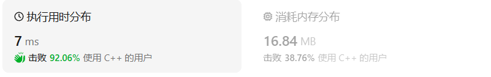
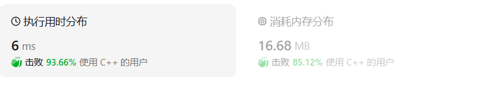
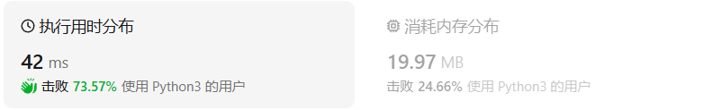

# 347前k个高频元素（中等）

[347. 前 K 个高频元素 - 力扣（LeetCode）](https://leetcode.cn/problems/top-k-frequent-elements/description/)

## 题目描述

给你一个整数数组 `nums` 和一个整数 `k` ，请你返回其中出现频率前 `k` 高的元素。你可以按 **任意顺序** 返回答案。

 

**示例 1:**

```
输入: nums = [1,1,1,2,2,3], k = 2
输出: [1,2]
```

**示例 2:**

```
输入: nums = [1], k = 1
输出: [1]
```

 

**提示：**

- `1 <= nums.length <= 105`
- `k` 的取值范围是 `[1, 数组中不相同的元素的个数]`
- 题目数据保证答案唯一，换句话说，数组中前 `k` 个高频元素的集合是唯一的

 

**进阶：**你所设计算法的时间复杂度 **必须** 优于 `O(n log n)` ，其中 `n` 是数组大小。

## 我的C++解法

第一下想到的是哈希表存储频次，然后找哈希表频次最大的几个元素

```cpp
class Solution {
public:
    vector<int> topKFrequent(vector<int>& nums, int k) {
        //哈希表解法
        vector<int> result;
        unordered_map<int,int> hashmap;
        for(int x :nums){
            hashmap[x]++;
        }
        vector<pair<int,int>> vec;
        for(const auto& pair:hashmap){
            vec.push_back(pair);
        }
        partial_sort(vec.begin(),vec.begin()+k,vec.end(),
        [](const pair<int,int>& a,const pair<int,int>& b)
        {return a.second>b.second;
        });
        for(auto iter :vec){
            if(k){
                result.push_back(iter.first);
                k--;
            }
            else    break;
        }
        return result;
    }
};
```

用空间换时间，编写过程中用到了昨天整理的pair键值对，结果：



## C++参考答案

### 优先队列

首先统计元素出现的频率，这一类的问题可以使用map来进行统计。然后是对频率进行排序，这里我们可以使用一种 容器适配器就是**优先级队列**。优先队列其实**就是一个披着队列外衣的堆**，因为优先级队列对外接口只是从队头取元素，从队尾添加元素，再无其他取元素的方式，看起来就是一个队列。而且优先级队列内部元素是自动依照元素的权值排列。缺省情况下priority_queue利用max-heap（大顶堆）完成对元素的排序，这个大顶堆是以vector为表现形式的complete binary tree（完全二叉树）。

实际上是大小根堆。在学数据结构的时候只是知道有大小根堆这个东西，也知道想要找出序列中前n个最大元素则构建小根堆，一趟遍历即可；找小元素则反之。现在终于到动手实现的时候了

```cpp
class Solution {
public:
    // 小顶堆
    class mycomparison {
    public:
        bool operator()(const pair<int, int>& lhs, const pair<int, int>& rhs) {
            return lhs.second > rhs.second;
        }
    };
    vector<int> topKFrequent(vector<int>& nums, int k) {
        // 要统计元素出现频率
        unordered_map<int, int> map; // map<nums[i],对应出现的次数>
        for (int i = 0; i < nums.size(); i++) {
            map[nums[i]]++;
        }

        // 对频率排序
        // 定义一个小顶堆，大小为k
        priority_queue<pair<int, int>, vector<pair<int, int>>, mycomparison> pri_que;

        // 用固定大小为k的小顶堆，扫面所有频率的数值
        for (unordered_map<int, int>::iterator it = map.begin(); it != map.end(); it++) {
            pri_que.push(*it);
            if (pri_que.size() > k) { // 如果堆的大小大于了K，则队列弹出，保证堆的大小一直为k
                pri_que.pop();
            }
        }

        // 找出前K个高频元素，因为小顶堆先弹出的是最小的，所以倒序来输出到数组
        vector<int> result(k);
        for (int i = k - 1; i >= 0; i--) {
            result[i] = pri_que.top().first;
            pri_que.pop();
        }
        return result;

    }
};
```

时间O(nlogk)空间O(n)

```cpp
class Solution {
public:
    vector<int> topKFrequent(vector<int>& nums, int k) {
    //1.map记录元素出现的次数
        unordered_map<int,int>map;//两个int分别是元素和出现的次数
        for(auto& c:nums){
            map[c]++;
        }
    //2.利用优先队列，将出现次数排序
        //自定义优先队列的比较方式，小顶堆
        struct myComparison{
            bool operator()(pair<int,int>&p1,pair<int,int>&p2){
                return p1.second>p2.second;//小顶堆是大于号
            }
        };
        //创建优先队列
        priority_queue<pair<int,int>,vector<pair<int,int>>,myComparison> q;
        //遍历map中的元素
        //1.管他是啥，先入队列，队列会自己排序将他放在合适的位置
        //2.若队列元素个数超过k，则将栈顶元素出栈（栈顶元素一定是最小的那个）
        for(auto& a:map){
            q.push(a);
            if(q.size()>k){
               q.pop(); 
            }
        }
        //将结果导出
        vector<int>res;
        while(!q.empty()){
            res.emplace_back(q.top().first);
            q.pop();
        }
        return res;

    }
};
```

结果：

 

官方解题：

```cpp
class Solution {
public:
    static bool cmp(pair<int, int>& m, pair<int, int>& n) {
        return m.second > n.second;
    }

    vector<int> topKFrequent(vector<int>& nums, int k) {
        unordered_map<int, int> occurrences;
        for (auto& v : nums) {
            occurrences[v]++;
        }

        // pair 的第一个元素代表数组的值，第二个元素代表了该值出现的次数
        priority_queue<pair<int, int>, vector<pair<int, int>>, decltype(&cmp)> q(cmp);
        for (auto& [num, count] : occurrences) {
            if (q.size() == k) {
                if (q.top().second < count) {
                    q.pop();
                    q.emplace(num, count);
                }
            } else {
                q.emplace(num, count);
            }
        }
        vector<int> ret;
        while (!q.empty()) {
            ret.emplace_back(q.top().first);
            q.pop();
        }
        return ret;
    }
};
```

在 C++ 中，`decltype` 是一个关键字，用于推断对象的类型。`decltype(&cmp)` 的作用是获取函数 `cmp` 的地址的类型。这里 `cmp` 是一个静态成员函数，其地址用作 `priority_queue` 的第三个模板参数，以指定优先队列中元素的比较方式。

让我们分解第 14 行代码：

```cpp
priority_queue<pair<int, int>, vector<pair<int, int>>, decltype(&cmp)> q(cmp);
```

- `priority_queue<pair<int, int>, vector<pair<int, int>>, decltype(&cmp)>`：这部分声明了一个 `priority_queue` 的类型。队列中的元素是 `pair<int, int>` 类型，即包含两个 `int` 的对。`vector<pair<int, int>>` 是存储这些对的底层容器类型。`decltype(&cmp)` 是指定自定义比较逻辑的函数或函数对象的类型，这里它是 `cmp` 函数地址的类型。

- `q(cmp)`：这里 `cmp` 函数被用作初始化参数传递给 `priority_queue` 的构造函数。由于 `cmp` 是一个静态成员函数，它需要被显式地绑定到类上（即 `Solution::cmp`），但在这种场景下，通常可以省略，因为构造函数能够推断出函数的正确地址。

为什么要这样写？这是因为 `priority_queue` 需要一个比较操作来确定元素的顺序。在这种情况下，我们想要一个最小堆，其中元素根据它们的第二个成员（即出现次数）来排序，但是 `priority_queue` 默认创建一个最大堆。为了反转元素的排序，我们提供一个自定义的比较函数 `cmp`，它告诉 `priority_queue` 当一个元素的第二个成员（出现次数）更大时，它应该排在前面。

自定义比较可以通过以下两种方式之一提供：

1. 使用函数对象（如 lambda 表达式）：
   ```cpp
   priority_queue<pair<int, int>, vector<pair<int, int>>, function<bool(const pair<int, int>&, const pair<int, int>&)>> q([](const pair<int, int>& a, const pair<int, int>& b) { return a.second > b.second; });
   ```

2. 使用函数的地址，像在示例代码中那样使用 `decltype(&cmp)`。

在示例代码中，使用 `decltype(&cmp)` 是为了明确指定比较函数的类型，并将其地址传递给 `priority_queue`。这是一种显式的类型转换，有助于代码的清晰性和可读性，尤其是在复杂的模板代码中。然而，通常可以省略 `decltype` 并直接使用函数名，因为编译器能够推断出正确的类型。例如：

```cpp
priority_queue<pair<int, int>, vector<pair<int, int>>, bool(*)(pair<int, int>&, pair<int, int>&)> q(cmp);
```

或者，如果函数是全局的或静态的，并且上下文足够明确，可以直接传递函数名：

```cpp
priority_queue<pair<int, int>, vector<pair<int, int>>, bool(*)(pair<int, int>&, pair<int, int>&)> q(cmp);
```

在 C++14 及以后的版本中，由于类型推断的改进，可以直接使用 `cmp` 作为比较函数，而不需要显式指定类型。

### 基于快速排序

```cpp
class Solution {
public:
    void qsort(vector<pair<int, int>>& v, int start, int end, vector<int>& ret, int k) {
        int picked = rand() % (end - start + 1) + start;
        swap(v[picked], v[start]);

        int pivot = v[start].second;
        int index = start;
        for (int i = start + 1; i <= end; i++) {
            // 使用双指针把不小于基准值的元素放到左边，
            // 小于基准值的元素放到右边
            if (v[i].second >= pivot) {
                swap(v[index + 1], v[i]);
                index++;
            }
        }
        swap(v[start], v[index]);

        if (k <= index - start) {
            // 前 k 大的值在左侧的子数组里
            qsort(v, start, index - 1, ret, k);
        } else {
            // 前 k 大的值等于左侧的子数组全部元素
            // 加上右侧子数组中前 k - (index - start + 1) 大的值
            for (int i = start; i <= index; i++) {
                ret.push_back(v[i].first);
            }
            if (k > index - start + 1) {
                qsort(v, index + 1, end, ret, k - (index - start + 1));
            }
        }
    }

    vector<int> topKFrequent(vector<int>& nums, int k) {
        // 获取每个数字出现次数
        unordered_map<int, int> occurrences;
        for (auto& v: nums) {
            occurrences[v]++;
        }

        vector<pair<int, int>> values;
        for (auto& kv: occurrences) {
            values.push_back(kv);
        }
        vector<int> ret;
        qsort(values, 0, values.size() - 1, ret, k);
        return ret;
    }
};
```


## C++收获

### C++获取哈希表中值最大的前几个键

<center>关键词：哈希表排序<center>

#### 对哈希表全排列

在C++中，对哈希表（`std::unordered_map`）依据值大小进行排序，需要将哈希表的元素复制到另一个数据结构（如向量 `std::vector`）中，然后对这个数据结构中的元素进行排序。由于 `std::unordered_map` 并不保证元素的顺序，所以不能直接对其进行排序。

以下是对 `std::unordered_map` 依据值进行排序的步骤：

1. 创建 `std::unordered_map`

```cpp
std::unordered_map<Key, Value> umap;
```

2. 填充 `std::unordered_map`

```cpp
umap[key1] = value1;
umap[key2] = value2;
// ...
```

3. 复制到 `std::vector` 并排序

```cpp
#include <vector>
#include <algorithm> // std::sort

// 将 unordered_map 转换为 vector
std::vector<std::pair<Key, Value>> vec(umap.begin(), umap.end());

// 使用 std::sort 对 vector 进行排序
// 注意：这里使用自定义比较函数以根据值进行排序
std::sort(vec.begin(), vec.end(),
          [](const std::pair<Key, Value>& a, const std::pair<Key, Value>& b) {
              return a.second < b.second; // 对值进行升序排序
          });
```

4. 打印或使用排序后的 `std::vector`

```cpp
for (const auto& pair : vec) {
    std::cout << pair.first << " : " << pair.second << std::endl;
}
```

示例代码

```cpp
#include <iostream>
#include <unordered_map>
#include <vector>
#include <algorithm>

int main() {
    std::unordered_map<std::string, int> umap = {
        {"apple", 10},
        {"banana", 20},
        {"cherry", 15}
    };

    // 将 unordered_map 转换为 vector
    std::vector<std::pair<std::string, int>> vec(umap.begin(), umap.end());

    // 对 vector 进行排序（依据值）
    std::sort(vec.begin(), vec.end(),
              [&](const std::pair<std::string, int>& a, const std::pair<std::string, int>& b) {
                  return a.second < b.second; // 升序排序
              });

    // 打印排序后的 vector
    for (const auto& pair : vec) {
        std::cout << pair.first << " : " << pair.second << std::endl;
    }

    return 0;
}
```

输出将是：

```
apple : 10
cherry : 15
banana : 20
```

请注意，由于 `std::sort` 是一个稳定的排序算法，如果 `umap` 中有相同值的元素，它们在 `vec` 中的相对顺序将保持不变。

另外，如果你想要降序排序，只需更改比较函数中的 `<` 符号为 `>` 即可。此外，如果你**只需要排序前N个元素，可以使用 `std::partial_sort` 函数代替 `std::sort`。**

#### 排序哈希表前N个元素

在C++中，获取哈希表（如 `std::unordered_map`）中值最大的前N个键通常涉及以下步骤：

1. 遍历哈希表以收集所有键值对。
2. 使用适当的数据结构（如最小堆或排序向量）来找到最大的N个值。
3. 根据需要提取这些值对应的键。

这里有一个示例，演示如何找到 `std::unordered_map` 中值最大的前N个键：

```cpp
#include <iostream>
#include <unordered_map>
#include <vector>
#include <algorithm> // std::sort
#include <queue>     // std::priority_queue

int main() {
    // 示例哈希表
    std::unordered_map<std::string, int> umap = {
        {"apple", 10},
        {"banana", 20},
        {"cherry", 15},
        {"date", 30},
        {"elderberry", 5}
    };

    const int N = 3; // 我们想要的最大的键的数量
    std::vector<std::pair<std::string, int>> vec;

    // 将哈希表的键值对复制到向量中
    for (const auto& pair : umap) {
        vec.push_back(pair);
    }

    // 部分排序，只排序最大的N个元素
    std::partial_sort(vec.begin(), vec.begin() + N, vec.end(),
        [](const std::pair<std::string, int>& a, const std::pair<std::string, int>& b) {
            return a.second > b.second; // 降序排序
        });

    // 或者使用最小堆来找到最大的N个元素
    std::priority_queue<std::pair<std::string, int>, 
                        std::vector<std::pair<std::string, int>>, 
                        std::greater<std::pair<std::string, int>>> min_heap;

    for (const auto& pair : vec) {
        min_heap.push(pair);
    }

    // 从最小堆中提取最大的N个元素
    std::vector<std::pair<std::string, int>> topN;
    for (int i = 0; i < N; ++i) {
        topN.push_back(min_heap.top());
        min_heap.pop();
    }

    // 打印结果
    for (const auto& pair : topN) {
        std::cout << pair.first << " : " << pair.second << std::endl;
    }

    return 0;
}
```

在这个示例中，我们首先将 `std::unordered_map` 的内容复制到一个 `std::vector` 中，然后使用 `std::partial_sort` 函数对前N个元素进行排序，以找到最大的N个键值对。或者，我们也可以使用 `std::priority_queue`（最小堆）来有效地找到最大的N个键值对。

请注意，`std::partial_sort` 会部分排序整个向量，只确保前N个元素是最大的。而 `std::priority_queue` 则提供了一种更有效的方法来处理这个问题，特别是当N远小于哈希表的大小时。在这个示例中，我们使用最小堆（通过 `std::greater` 比较函数）来自动保持最大的元素在堆的顶部。

### 优先队列

<center>关键词：优先队列<center>

<center>关键词：priority_queue<center>

在C++中，`std::priority_queue` 是标准模板库（STL）中提供的一个容器适配器，它用来实现优先队列。优先队列是一种特殊的队列，元素出队的顺序是根据优先级决定的，而不是入队的顺序。在 `std::priority_queue` 中，默认情况下元素是按最大堆的性质组织的，即队首（top 元素）始终是当前队列中的最大元素。

以下是 `std::priority_queue` 的一些基本用法：

#### 包含头文件
```cpp
#include <queue>
#include <vector>
#include <iostream>
```

#### 定义优先队列

```cpp
priotiry_queuq<Type,Container.Functional>;
//Type是要存放的数据类型
//Container是实现底层堆的容器，必须是数组实现的容器，比如vector,deque
//Functional是比较方式/比较函数/优先级
priority_queue<type>;
//此时默认容器为vector，默认的比较方式是大顶堆 less<type>
```

#### 创建优先队列

```cpp
std::priority_queue<int> pq;

//小顶堆
priority_queue <int,vector<int>,greater<int> > q;
//大顶堆
priority_queue <int,vector<int>,less<int> >q;
//默认大顶堆
priority_queue<int> a;
```

#### 插入元素push
使用 `push()` 方法向优先队列中插入元素：
```cpp
pq.push(10);
pq.push(20);
```

#### 插入元素emplace

emplace用于就地构造元素，然后将其推入队列

```cpp
#include <queue>

int main() {
    std::priority_queue<int> pq;
    // 使用 emplace 构造并推入一个整数
    pq.emplace(42);

    while (!pq.empty()) {
        std::cout << pq.top() << " ";
        pq.pop();
    }

    return 0;
}
```

#### 访问顶部元素top

使用 `top()` 方法访问优先队列中的顶部元素（最大元素）：
```cpp
int topElement = pq.top();
```

#### 删除顶部元素pop
使用 `pop()` 方法从优先队列中删除顶部元素：
```cpp
pq.pop();
```

#### 检查队列是否为空empty
使用 `empty()` 方法检查优先队列是否为空：
```cpp
bool isEmpty = pq.empty();
```

#### 获取队列的大小
使用 `size()` 方法获取优先队列中的元素数量：
```cpp
size_t size = pq.size();
```

#### 自定义比较函数
可以通过模板参数自定义 `std::priority_queue` 的比较函数，以改变元素的排序方式（例如，改为最小堆）：
```cpp
#include <functional>

struct compare {
    bool operator()(int a, int b) {
        return a > b; // 改变为最小堆
    }
};

std::priority_queue<int, std::vector<int>, compare> minHeap;
```

当数据类型并不是基本数据类型，而是自定义的数据类型时，就不能用greater或less的比较方式了，而是需要自定义比较方式。在此假设数据类型是自定义的水果：

```cpp
struct fruit{
    string name;
    int price;
};
```

有两种自定义比较方法，如下：

##### 重载运算符

重载''<''

若希望水果价格高为优先级高，则

```cpp
//大顶堆
struct fruit
{
	string name;
	int price;
	friend bool operator < (fruit f1,fruit f2)
	{
		return f1.peice < f2.price;
	}
};
```

若希望水果价格低为优先级高

```python
//小顶堆
struct fruit
{
    string name;
    int price;
    friend bool operator < (fruit f1,fruit f2)
    {
        return f1.peice > f2.price;//此处是大于号
    }
};
```

##### 仿函数

若希望水果价格高为优先级高，则

```cpp
//大顶堆
struct myComparison
{
	bool operator () (fruit f1,fruit f2)
	{
		return f1.price < f2.price;
	}
};

//此时优先队列的定义应该如下
priority_queue<fruit,vector<fruit>,myComparison> q;
```

#### 示例代码

```cpp
int main() {
    std::priority_queue<int> pq;

    // 插入元素
    pq.push(30);
    pq.push(10);
    pq.push(20);

    // 访问并删除顶部元素
    while (!pq.empty()) {
        std::cout << pq.top() << " "; // 访问顶部元素
        pq.pop(); // 删除顶部元素
    }

    return 0;
}
```
输出将是：
```
30 20 10 
```

```cpp
priority_queue<pair<int, int> > a;
pair<int, int> b(1, 2);
pair<int, int> c(1, 3);
pair<int, int> d(2, 5);
a.push(d);
a.push(c);
a.push(b);
while (!a.empty()) 
{
   cout << a.top().first << ' ' << a.top().second << '\n';
   a.pop();
}
//输出结果为：
2 5
1 3
1 2
```

`std::priority_queue` 在需要根据优先级处理元素的场景中非常有用，例如在任务调度、事件驱动模拟、Dijkstra算法等算法中。然而，由于它是基于堆实现的，所以不支持随机访问，即不能高效地访问除了顶部之外的其他元素。此外，`std::priority_queue` 也不支持 `erase()` 操作或其他直接访问元素的操作。

### decltype关键字及应用

<center>关键词：decltype<center>

<center>关键词：推断类型<center>

在C++中，`decltype` 是一个关键字，用于推断表达式的类型。它常用于模板编程中，以便编写与模板参数类型相关的代码，而不需要事先知道这些类型具体是什么。`decltype` 的基本用法如下：

#### 基本语法
```cpp
decltype(expression) variable;
```

这里，`expression` 是你要推断类型的表达式，`variable` 是用来存储推断出来的类型的变量。

#### 示例
假设我们有一个变量，并希望创建一个类型与之相同的新变量：

```cpp
int a = 10;
decltype(a) b; // b 的类型被推断为 int
```

#### 与 decltype 关键字相关的几个要点：

1. **类型推断**：`decltype` 根据其参数的类型来推断类型。如果 `decltype` 的参数是一个未命名的值，那么 `decltype` 推断其类型但不包括顶层的引用修饰符。如果参数是一个变量，那么 `decltype` 会推断其类型，包括引用修饰符。

2. **顶层 const**：如果表达式是一个顶层 `const` 值，`decltype` 会忽略这个 `const`。例如：
   ```cpp
   const int ci = 10;
   decltype(ci) b; // b 的类型是 int, 而不是 const int
   ```

3. **引用类型**：如果表达式的结果是一个引用，`decltype` 会推断出引用类型：
   ```cpp
   int a = 10;
   int& ref = a;
   decltype(ref) b; // b 的类型是 int&
   ```

4. **指针类型**：如果表达式是一个指针，`decltype` 会推断出指针类型：
   ```cpp
   int* p = nullptr;
   decltype(p) q; // q 的类型是 int*
   ```

5. **函数类型**：如果表达式是一个函数调用，`decltype` 会推断出函数的返回类型：
   ```cpp
   int func() { return 1; }
   decltype(func()) a; // a 的类型是 int
   ```

6. **类成员函数**：对于类的成员函数，`decltype` 会推断出成员函数的类型（返回类型加 const 修饰符，如果有的话）：
   ```cpp
   class MyClass {
   public:
       void myMethod() const {}
   };
   
   MyClass myObject;
   decltype(myObject.myMethod) a; // a 的类型是 void (MyClass::*)() const
   ```

7. **decltype(auto)**：C++14 引入了 `decltype(auto)`，它用于自动推断类型，特别适用于 lambda 表达式和 decltype 的递归推断：
   ```cpp
   auto x = 5;
   decltype(auto) y = x; // y 被推断为 int
   ```

8. **模板参数**：`decltype` 可以用于模板参数中，以推断模板实参的类型：
   ```cpp
   template <typename T>
   void func(T t) {
       decltype(t) copy = t;
   }
   ```

`decltype` 是一个非常有用的工具，特别是在模板编程中，它允许程序员编写更灵活和通用的代码，同时保持类型安全。

在 C++ 中，`decltype` 是一个关键字，用于推断对象的类型。`decltype(&cmp)` 的作用是获取函数 `cmp` 的地址的类型。这里 `cmp` 是一个静态成员函数，其地址用作 `priority_queue` 的第三个模板参数，以指定优先队列中元素的比较方式。

让我们分解第 14 行代码：

```cpp
priority_queue<pair<int, int>, vector<pair<int, int>>, decltype(&cmp)> q(cmp);
```

- `priority_queue<pair<int, int>, vector<pair<int, int>>, decltype(&cmp)>`：这部分声明了一个 `priority_queue` 的类型。队列中的元素是 `pair<int, int>` 类型，即包含两个 `int` 的对。`vector<pair<int, int>>` 是存储这些对的底层容器类型。`decltype(&cmp)` 是指定自定义比较逻辑的函数或函数对象的类型，这里它是 `cmp` 函数地址的类型。

- `q(cmp)`：这里 `cmp` 函数被用作初始化参数传递给 `priority_queue` 的构造函数。由于 `cmp` 是一个静态成员函数，它需要被显式地绑定到类上（即 `Solution::cmp`），但在这种场景下，通常可以省略，因为构造函数能够推断出函数的正确地址。

为什么要这样写？这是因为 `priority_queue` 需要一个比较操作来确定元素的顺序。在这种情况下，我们想要一个最小堆，其中元素根据它们的第二个成员（即出现次数）来排序，但是 `priority_queue` 默认创建一个最大堆。为了反转元素的排序，我们提供一个自定义的比较函数 `cmp`，它告诉 `priority_queue` 当一个元素的第二个成员（出现次数）更大时，它应该排在前面。

自定义比较可以通过以下两种方式之一提供：

1. 使用函数对象（如 lambda 表达式）：
   ```cpp
   priority_queue<pair<int, int>, vector<pair<int, int>>, function<bool(const pair<int, int>&, const pair<int, int>&)>> q([](const pair<int, int>& a, const pair<int, int>& b) { return a.second > b.second; });
   ```

2. 使用函数的地址，像在示例代码中那样使用 `decltype(&cmp)`。

在示例代码中，使用 `decltype(&cmp)` 是为了明确指定比较函数的类型，并将其地址传递给 `priority_queue`。这是一种显式的类型转换，有助于代码的清晰性和可读性，尤其是在复杂的模板代码中。然而，通常可以省略 `decltype` 并直接使用函数名，因为编译器能够推断出正确的类型。例如：

```cpp
priority_queue<pair<int, int>, vector<pair<int, int>>, bool(*)(pair<int, int>&, pair<int, int>&)> q(cmp);
```

或者，如果函数是全局的或静态的，并且上下文足够明确，可以直接传递函数名：

```cpp
priority_queue<pair<int, int>, vector<pair<int, int>>, bool(*)(pair<int, int>&, pair<int, int>&)> q(cmp);
```

在 C++14 及以后的版本中，由于类型推断的改进，可以直接使用 `cmp` 作为比较函数，而不需要显式指定类型。

## 我的python解答

一下就想到了我的毕设里面的做法，就是统计出现频次最高的几个数据并返回

```python
class Solution:
    def topKFrequent(self, nums: List[int], k: int) -> List[int]:
        counter = collections.Counter(nums)
        # counter = collections.Counter([elem for elem in nums])
        # return [].append(counter.most_common(k))
        res = []
        for elem in counter.most_common(k):
            res.append(elem[0])
        return res
```

结果：



## python参考答案

```python
class Solution:
    def topKFrequent(self, nums: List[int], k: int) -> List[int]:
        count = collections.Counter(nums)
        return [item[0] for item in count.most_common(k)]
```

更优雅

```python
class Solution:
    def topKFrequent(self, nums: List[int], k: int) -> List[int]:
        count = collections.Counter(nums)
        heap = [(val, key) for key, val in count.items()]
        return [item[1] for item in heapq.nlargest(k, heap)]
```

```python
class Solution:
    def topKFrequent(self, nums: List[int], k: int) -> List[int]:
        count = collections.Counter(nums)
        heap = []
        for key, val in count.items():
            if len(heap) >= k:
                if val > heap[0][0]:
                    heapq.heapreplace(heap, (val, key))
            else:
                heapq.heappush(heap, (val, key))
        return [item[1] for item in heap]
```


### 优先队列

```python
#时间复杂度：O(nlogk)
#空间复杂度：O(n)
import heapq
class Solution:
    def topKFrequent(self, nums: List[int], k: int) -> List[int]:
        #要统计元素出现频率
        map_ = {} #nums[i]:对应出现的次数
        for i in range(len(nums)):
            map_[nums[i]] = map_.get(nums[i], 0) + 1
        
        #对频率排序
        #定义一个小顶堆，大小为k
        pri_que = [] #小顶堆
        
        #用固定大小为k的小顶堆，扫描所有频率的数值
        for key, freq in map_.items():
            heapq.heappush(pri_que, (freq, key))
            if len(pri_que) > k: #如果堆的大小大于了K，则队列弹出，保证堆的大小一直为k
                heapq.heappop(pri_que)
        
        #找出前K个高频元素，因为小顶堆先弹出的是最小的，所以倒序来输出到数组
        result = [0] * k
        for i in range(k-1, -1, -1):
            result[i] = heapq.heappop(pri_que)[1]
        return result
```

```python
class Solution:
    def topKFrequent(self, nums: List[int], k: int) -> List[int]:
        # 使用字典统计数字出现次数
        time_dict = defaultdict(int)
        for num in nums:
            time_dict[num] += 1
        # 更改字典，key为出现次数，value为相应的数字的集合
        index_dict = defaultdict(list)
        for key in time_dict:
            index_dict[time_dict[key]].append(key)
        # 排序
        key = list(index_dict.keys())
        key.sort()
        result = []
        cnt = 0
        # 获取前k项
        while key and cnt != k:
            result += index_dict[key[-1]]
            cnt += len(index_dict[key[-1]])
            key.pop()

        return result[0: k]
```

```python
import heapq

class Solution:
    def topKFrequent(self, nums, k):
        # 使用普通字典来统计每个数字出现的频率。
        frequencyMap = {}
        for num in nums:
            if num in frequencyMap:
                frequencyMap[num] += 1
            else:
                frequencyMap[num] = 1

        # 构建一个小顶堆，用于维护出现频率最高的k个数字。
        minHeap = []
        for num, freq in frequencyMap.items():
            # 如果堆还没满（即堆中元素少于k个），就直接添加当前元素
            if len(minHeap) < k:
                heapq.heappush(minHeap, (freq, num))
            # 如果堆已满，且当前元素的频率高于堆顶元素的频率，
            # 则替换堆顶元素（即频率最低的元素）。
            elif freq > minHeap[0][0]:
                heapq.heappushpop(minHeap, (freq, num))

        # 最后，从小顶堆中提取前k个频率最高的元素。
        topK = [num for freq, num in minHeap]
        return topK
```

### 堆排序思想

```python
class Solution:
    def topKFrequent(self, nums: List[int], k: int) -> List[int]:
        count = collections.Counter(nums)
        num_cnt = list(count.items())
        topKs = self.findTopK(num_cnt, k, 0, len(num_cnt) - 1)
        return [item[0] for item in topKs]
    
    def findTopK(self, num_cnt, k, low, high):
        pivot = random.randint(low, high)
        num_cnt[low], num_cnt[pivot] = num_cnt[pivot], num_cnt[low]
        base = num_cnt[low][1]
        i = low
        for j in range(low + 1, high + 1):
            if num_cnt[j][1] > base:
                num_cnt[i + 1], num_cnt[j] = num_cnt[j], num_cnt[i + 1]
                i += 1
        num_cnt[low], num_cnt[i] = num_cnt[i], num_cnt[low]
        if i == k - 1:
            return num_cnt[:k]
        elif i > k - 1:
            return self.findTopK(num_cnt, k, low, i - 1)
        else:
            return self.findTopK(num_cnt, k, i + 1, high)
```

## python收获

### py寻找前n个最值

<center>关键词：前n个最值<center>

<center>关键词：统计<center>

#### 字典类型数据

调用函数`most_common(n)`即可返回字典数据中value值最大的前几个可迭代对象

#### 堆类型数据

`nlargest(n, iterable[, key])`返回可迭代对象中最大的 `n` 个元素的列表（元素是有序的，从最大到最小）。

`nsmallest(n, iterable[, key])`返回可迭代对象中最小的 `n` 个元素的列表（元素是有序的，从小到大）。

堆排序