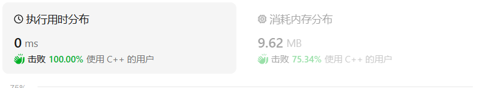
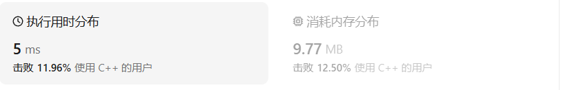
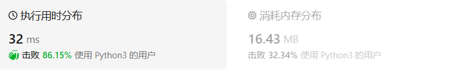
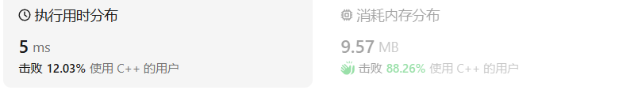
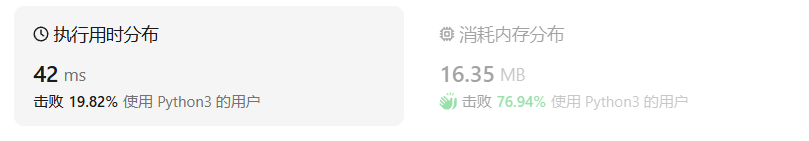

# 迭代方法遍历二叉树

## 中序遍历

### 我的C++解法

```cpp
/**
 * Definition for a binary tree node.
 * struct TreeNode {
 *     int val;
 *     TreeNode *left;
 *     TreeNode *right;
 *     TreeNode() : val(0), left(nullptr), right(nullptr) {}
 *     TreeNode(int x) : val(x), left(nullptr), right(nullptr) {}
 *     TreeNode(int x, TreeNode *left, TreeNode *right) : val(x), left(left), right(right) {}
 * };
 */
class Solution {
public:
    vector<int> preorderTraversal(TreeNode* root) {
        //迭代先序遍历,使用栈，如果有孩子，优先压入右
        stack<TreeNode*> s;
        vector<int> result;
        if(!root)   return result;
        s.push(root);
        while(!s.empty()){
            auto tmp = s.top();
            s.pop();
            result.push_back(tmp->val);
            if(tmp->right)  s.push(tmp->right);
            if(tmp->left)   s.push(tmp->left);
        }
        return result;
    }
};
```

结果：



### 我的python解法

```python
# Definition for a binary tree node.
# class TreeNode:
#     def __init__(self, val=0, left=None, right=None):
#         self.val = val
#         self.left = left
#         self.right = right
class Solution:
    def preorderTraversal(self, root: Optional[TreeNode]) -> List[int]:
        result = list()
        if not root:   return result
        # stack.append(root)
        stack=[root]
        while stack:
            tmp = stack.pop()
            result.append(tmp.val)
            # del stack[0]
            if tmp.right:  stack.append(tmp.right)
            if tmp.left:   stack.append(tmp.left)
        return result
```

结果：


## 中序遍历

### C++解法

```cpp
class Solution {
public:
    vector<int> inorderTraversal(TreeNode* root) {
        //思路：还是栈，只不过这次是先招最左下节点
        vector<int> result;
        if(!root)   return result;
        TreeNode* current = root;
        stack<TreeNode*> s;
        while(current!=NULL || !s.empty()){
            if(current){
                s.push(current);
                current = current->left;}
            else{
                current = s.top();
                s.pop();
                result.push_back(current->val);
                current = current->right;
            }
        }
        return result;
    }
};
```

结果：



### Python解法

```python
# Definition for a binary tree node.
# class TreeNode:
#     def __init__(self, val=0, left=None, right=None):
#         self.val = val
#         self.left = left
#         self.right = right
class Solution:
    def inorderTraversal(self, root: Optional[TreeNode]) -> List[int]:
        if not root:    return []
        stack = []
        result = []
        cur = root
        while cur or stack:
            if cur:
                stack.append(cur)
                cur = cur.left
            else:
                top = stack.pop()
                result.append(top.val)
                cur = top.right
        return result
```

结果：



## 后序遍历

后序遍历如果按照中序遍历的方法来改的话很不好实现。但是如果按先序遍历，先压入左再压入右的话，得到的是后续的逆序（从中左右到左右中的转变）

### C++解法

```cpp
/**
 * Definition for a binary tree node.
 * struct TreeNode {
 *     int val;
 *     TreeNode *left;
 *     TreeNode *right;
 *     TreeNode() : val(0), left(nullptr), right(nullptr) {}
 *     TreeNode(int x) : val(x), left(nullptr), right(nullptr) {}
 *     TreeNode(int x, TreeNode *left, TreeNode *right) : val(x), left(left), right(right) {}
 * };
 */
class Solution {
public:
    vector<int> postorderTraversal(TreeNode* root) {
        vector<int> result;
        if(!root)   return result;
        stack<TreeNode*> s;
        s.push(root);
        while(!s.empty()){
            TreeNode* cur = s.top();
            s.pop();
            result.push_back(cur->val);
            if(cur->left)   s.push(cur->left);
            if(cur->right)  s.push(cur->right);
        }
        reverse(result.begin(),result.end());
        return result;
    }
};
```

结果：



### python解法：

```python
# Definition for a binary tree node.
# class TreeNode:
#     def __init__(self, val=0, left=None, right=None):
#         self.val = val
#         self.left = left
#         self.right = right
class Solution:
    def postorderTraversal(self, root: Optional[TreeNode]) -> List[int]:
        if not root: return []
        result =[]
        stack = [root]
        while stack:
            tmp = stack.pop()
            # print(tmp)
            result.append(tmp.val)
            # print(result)
            if tmp.left:    stack.append(tmp.left)
            if tmp.right:   stack.append(tmp.right)
        result.reverse()
        return result
```

有点疑惑就是直接`return result.reverse()`得到的是NULL。结果：



## C++收获

#### 二叉树的迭代遍历

**递归的实现就是：每一次递归调用都会把函数的局部变量、参数值和返回地址等压入调用栈中**，然后递归返回的时候，从栈顶弹出上一次递归的各项参数，所以这就是递归为什么可以返回上一层位置的原因。

##### 先序遍历

前序遍历是中左右，每次先处理的是中间节点，那么先将根节点放入栈中，然后将右孩子加入栈，再加入左孩子。为什么要先加入 右孩子，再加入左孩子呢？ 因为这样出栈的时候才是中左右的顺序。


```cpp
class Solution {
public:
    vector<int> preorderTraversal(TreeNode* root) {
        stack<TreeNode*> st;
        vector<int> result;
        if (root == NULL) return result;
        st.push(root);
        while (!st.empty()) {
            TreeNode* node = st.top();                       // 中
            st.pop();
            result.push_back(node->val);
            if (node->right) st.push(node->right);           // 右（空节点不入栈）
            if (node->left) st.push(node->left);             // 左（空节点不入栈）
        }
        return result;
    }
};
```

```cpp
class Solution {
public:
    vector<int> preorderTraversal(TreeNode* root) {
        vector<int> res;
        if (root == nullptr) {
            return res;
        }

        stack<TreeNode*> stk;
        TreeNode* node = root;
        while (!stk.empty() || node != nullptr) {
            while (node != nullptr) {
                res.emplace_back(node->val);
                stk.emplace(node);
                node = node->left;
            }
            node = stk.top();
            stk.pop();
            node = node->right;
        }
        return res;
    }
};
```


##### 中序遍历

前序遍历的代码，不能和中序遍历通用。因为前序遍历的顺序是中左右，先访问的元素是中间节点，要处理的元素也是中间节点，所以刚刚才能写出相对简洁的代码，**因为要访问的元素和要处理的元素顺序是一致的，都是中间节点。**那么再看看中序遍历，中序遍历是左中右，先访问的是二叉树顶部的节点，然后一层一层向下访问，直到到达树左面的最底部，再开始处理节点（也就是在把节点的数值放进result数组中），这就造成了**处理顺序和访问顺序是不一致的。**那么**在使用迭代法写中序遍历，就需要借用指针的遍历来帮助访问节点，栈则用来处理节点上的元素。**


```cpp
class Solution {
public:
    vector<int> inorderTraversal(TreeNode* root) {
        vector<int> result;
        stack<TreeNode*> st;
        TreeNode* cur = root;
        while (cur != NULL || !st.empty()) {
            if (cur != NULL) { // 指针来访问节点，访问到最底层
                st.push(cur); // 将访问的节点放进栈
                cur = cur->left;                // 左
            } else {
                cur = st.top(); // 从栈里弹出的数据，就是要处理的数据（放进result数组里的数据）
                st.pop();
                result.push_back(cur->val);     // 中
                cur = cur->right;               // 右
            }
        }
        return result;
    }
};
```

```cpp
class Solution {
public:
    vector<int> inorderTraversal(TreeNode* root) {
        vector<int> res;
        stack<TreeNode*> stk;
        while (root != nullptr || !stk.empty()) {
            while (root != nullptr) {
                stk.push(root);
                root = root->left;
            }
            root = stk.top();
            stk.pop();
            res.push_back(root->val);
            root = root->right;
        }
        return res;
    }
};
```


##### 后序遍历

再来看后序遍历，先序遍历是中左右，后续遍历是左右中，那么我们只需要调整一下先序遍历的代码顺序，就变成中右左的遍历顺序，然后在反转result数组，输出的结果顺序就是左右中了。

```cpp
class Solution {
public:
    vector<int> postorderTraversal(TreeNode* root) {
        stack<TreeNode*> st;
        vector<int> result;
        if (root == NULL) return result;
        st.push(root);
        while (!st.empty()) {
            TreeNode* node = st.top();
            st.pop();
            result.push_back(node->val);
            if (node->left) st.push(node->left); // 相对于前序遍历，这更改一下入栈顺序 （空节点不入栈）
            if (node->right) st.push(node->right); // 空节点不入栈
        }
        reverse(result.begin(), result.end()); // 将结果反转之后就是左右中的顺序了
        return result;
    }
};
```

官方的想法也很好。

```cpp
class Solution {
public:
    vector<int> postorderTraversal(TreeNode *root) {
        vector<int> res;
        if (root == nullptr) {
            return res;
        }

        stack<TreeNode *> stk;
        TreeNode *prev = nullptr;
        while (root != nullptr || !stk.empty()) {
            while (root != nullptr) {
                stk.emplace(root);
                root = root->left;
            }//找到最左下方节点
            root = stk.top();
            stk.pop();
            if (root->right == nullptr || root->right == prev) {
                res.emplace_back(root->val);
                prev = root;
                root = nullptr;
            } else {
                stk.emplace(root);
                root = root->right;
            }
        }
        return res;
    }
};
```


## python收获

#### 二叉树的迭代遍历

##### 先序遍历

```python
class Solution:
    def preorderTraversal(self, root: TreeNode) -> List[int]:
        # 根结点为空则返回空列表
        if not root:
            return []
        stack = [root]
        result = []
        while stack:
            node = stack.pop()
            # 中结点先处理
            result.append(node.val)
            # 右孩子先入栈
            if node.right:
                stack.append(node.right)
            # 左孩子后入栈
            if node.left:
                stack.append(node.left)
        return result
```


##### 中序遍历

```python
class Solution:
    def inorderTraversal(self, root: TreeNode) -> List[int]:
        if not root:
            return []
        stack = []  # 不能提前将root结点加入stack中
        result = []
        cur = root
        while cur or stack:
            # 先迭代访问最底层的左子树结点
            if cur:     
                stack.append(cur)
                cur = cur.left		
            # 到达最左结点后处理栈顶结点    
            else:		
                cur = stack.pop()
                result.append(cur.val)
                # 取栈顶元素右结点
                cur = cur.right	
        return result
```


##### 后序遍历

```python
class Solution:
   def postorderTraversal(self, root: TreeNode) -> List[int]:
       if not root:
           return []
       stack = [root]
       result = []
       while stack:
           node = stack.pop()
           # 中结点先处理
           result.append(node.val)
           # 左孩子先入栈
           if node.left:
               stack.append(node.left)
           # 右孩子后入栈
           if node.right:
               stack.append(node.right)
       # 将最终的数组翻转
       return result[::-1]
```

```python
class Solution:
    def postorderTraversal(self, root: TreeNode) -> List[int]:
        if not root:
            return list()
        
        res = list()
        stack = list()
        prev = None

        while root or stack:
            while root:
                stack.append(root)
                root = root.left
            root = stack.pop()
            if not root.right or root.right == prev:
                res.append(root.val)
                prev = root
                root = None
            else:
                stack.append(root)
                root = root.right
        
        return res
```

