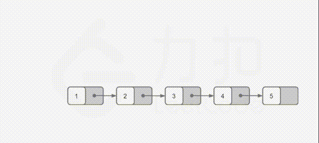
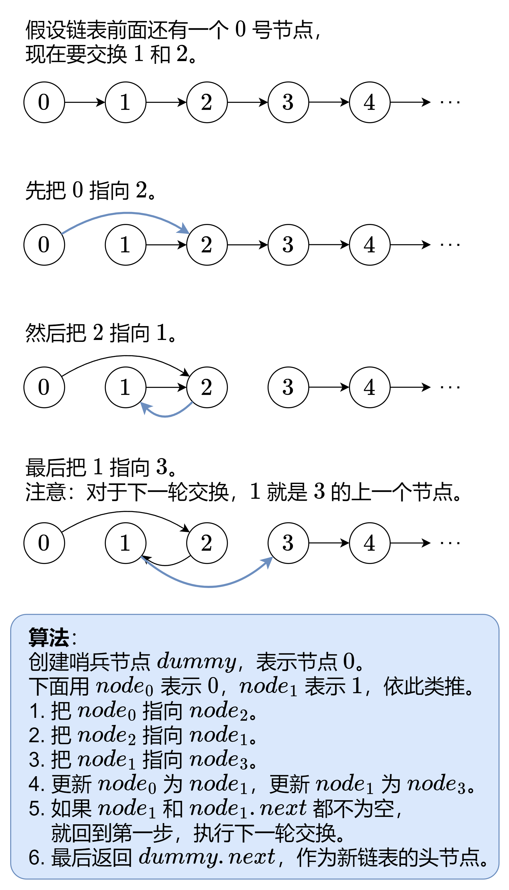
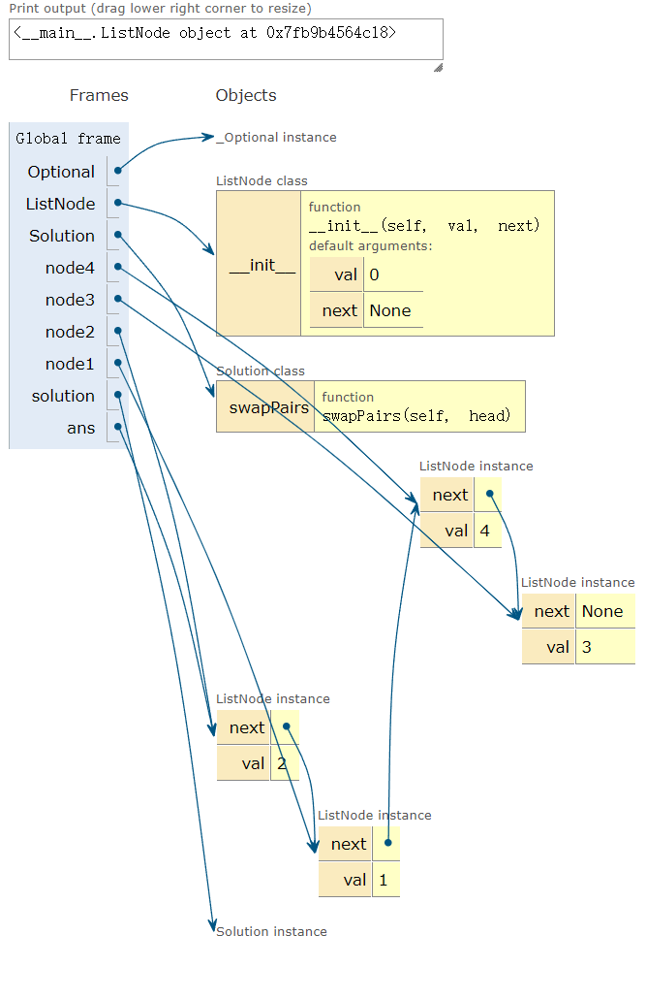

# 24两两交换链表中的节点（中等）

## 题目描述

[24. 两两交换链表中的节点](https://leetcode.cn/problems/swap-nodes-in-pairs/)

给你一个链表，两两交换其中相邻的节点，并返回交换后链表的头节点。你必须在不修改节点内部的值的情况下完成本题（即，只能进行节点交换）。

 

**示例 1：**


```
输入：head = [1,2,3,4]
输出：[2,1,4,3]
```

**示例 2：**

```
输入：head = []
输出：[]
```

**示例 3：**

```
输入：head = [1]
输出：[1]
```

 

**提示：**

- 链表中节点的数目在范围 `[0, 100]` 内
- `0 <= Node.val <= 100`

## 我的C++解法

```cpp
/**
 * Definition for singly-linked list.
 * struct ListNode {
 *     int val;
 *     ListNode *next;
 *     ListNode() : val(0), next(nullptr) {}
 *     ListNode(int x) : val(x), next(nullptr) {}
 *     ListNode(int x, ListNode *next) : val(x), next(next) {}
 * };
 */
class Solution {
public:
    // void print_list(ListNode* head){
    //     ListNode* tmp=head;
    //     while(tmp!=nullptr){
    //         cout<<tmp->val<<"  ";
    //         tmp=tmp->next;
    //     }
    // }
    ListNode* swapPairs(ListNode* head) {
        //虚拟头节点大法好啊
        // print_list(head);
        cout<<endl;
        if(!head || !head->next)    return head;//0节点和1节点直接返回
        ListNode* pre=head;
        ListNode* p=pre->next;
        ListNode* virtue_node=new ListNode(0,p);
        ListNode* sorted=pre;
        while(p){
            ListNode* tmp=p->next;
            pre->next=tmp;
            p->next=pre;
            pre=tmp;
            if(tmp!=nullptr){
                p=tmp->next;
                if(p==nullptr)  return virtue_node->next;
                else{
                    sorted->next=p;
                    sorted=pre;
                }
            }
            else{
                p=tmp;
            }
        }
        return virtue_node->next;
    }
};
```

结果：

我的思路就是以两个节点为单位，每个单位内进行对换操作，需要额外记忆对换成功后两个单位中的最后一个，因为它需要链接下一个单元。如此循环往复。实际上从这个思路我还想到了递归操作，每次递归的返回排好序的单元这样子。但是仔细想象这玩意并不好实现啊。更像是把上面while里面的函数封装为另一个函数。

## C++参考答案

### 方法一：迭代


```cpp
class Solution {
public:
    ListNode* swapPairs(ListNode* head) {
        ListNode* dummyHead = new ListNode(0); // 设置一个虚拟头结点
        dummyHead->next = head; // 将虚拟头结点指向head，这样方便后面做删除操作
        ListNode* cur = dummyHead;
        while(cur->next != nullptr && cur->next->next != nullptr) {
            ListNode* tmp = cur->next; // 记录临时节点
            ListNode* tmp1 = cur->next->next->next; // 记录临时节点

            cur->next = cur->next->next;    // 步骤一
            cur->next->next = tmp;          // 步骤二
            cur->next->next->next = tmp1;   // 步骤三

            cur = cur->next->next; // cur移动两位，准备下一轮交换
        }
        ListNode* result = dummyHead->next;
        delete dummyHead;
        return result;
    }
};
```

官方的解法：



```cpp
class Solution {
public:
    ListNode* swapPairs(ListNode* head) {
        ListNode* dummyHead = new ListNode(0);
        dummyHead->next = head;
        ListNode* temp = dummyHead;
        while (temp->next != nullptr && temp->next->next != nullptr) {
            ListNode* node1 = temp->next;
            ListNode* node2 = temp->next->next;
            temp->next = node2;
            node1->next = node2->next;
            node2->next = node1;
            temp = node1;
        }
        ListNode* ans = dummyHead->next;
        delete dummyHead;
        return ans;
    }
};
```

解法二：递归

递归的终止条件是链表中没有节点，或者链表中只有一个节点，此时无法进行交换。

如果链表中至少有两个节点，则在两两交换链表中的节点之后，原始链表的头节点变成新的链表的第二个节点，原始链表的第二个节点变成新的链表的头节点。链表中的其余节点的两两交换可以递归地实现。在对链表中的其余节点递归地两两交换之后，更新节点之间的指针关系，即可完成整个链表的两两交换。

用` head `表示原始链表的头节点，新的链表的第二个节点，用` newHead `表示新的链表的头节点，原始链表的第二个节点，则原始链表中的其余节点的头节点是` newHead.next`。令` head.next = swapPairs(newHead.next)`，表示将其余节点进行两两交换，交换后的新的头节点为` head `的下一个节点。然后令` newHead.next = head`，即完成了所有节点的交换。最后返回新的链表的头节点 `newHead`。

```cpp
class Solution {
public:
    ListNode* swapPairs(ListNode* head) {
        if (head == nullptr || head->next == nullptr) {
            return head;
        }
        ListNode* newHead = head->next;
        head->next = swapPairs(newHead->next);
        newHead->next = head;
        return newHead;
    }
};
```

## C++收获

不管是递归还是迭代，都拓宽了我的思路。对于迭代，我的提升点是多考虑辅助节点，从整体上考虑问题，不能急。比如参考答案里面给的方法是逐个组进行调换操作，借助组前指针tmp来实现链表的链接；而我的想法太过跳跃，想要一口吃个胖子，直接就让一个调整好的组的next指向下一个组的第二个元素，思路上跳跃导致编码上的不便。其次就是递归。在我自己进行解答的时候，也考虑过递归，但是我当时还是局限于前文中提到的方法。递归不会写，说白了是倒着考虑问题，总感觉很别扭，脑子转不过来这个弯。

## 我的python解答

```python
# Definition for singly-linked list.
# class ListNode:
#     def __init__(self, val=0, next=None):
#         self.val = val
#         self.next = next
class Solution:
    def swapPairs(self, head: Optional[ListNode]) -> Optional[ListNode]:
        if head is None or head.next is None:   return head
        pre=head
        p=pre.next
        head=p
        while p:
            if p.next!=None:
                #后面有元素
                if p.next.next!=None:
                    #可以成组
                    pre.next=p.next.next
                    tmp=p.next
                    p.next=pre
                    pre=tmp
                else:
                    #无法成组，只有一个元素
                    pre.next=p.next
                    p.next=pre
                    pre=pre.next
                p=pre.next
            else:
                #后面没有元素
                pre.next=p.next
                p.next=pre
                p=None
        return head
```

结果：

## python参考答案

方法一：迭代



```python
class Solution:
    def swapPairs(self, head: Optional[ListNode]) -> Optional[ListNode]:
        node0 = dummy = ListNode(next=head)  # 用哨兵节点简化代码逻辑
        node1 = head
        while node1 and node1.next:  # 至少有两个节点
            node2 = node1.next
            node3 = node2.next

            node0.next = node2  # 0 -> 2
            node2.next = node1  # 2 -> 1
            node1.next = node3  # 1 -> 3

            node0 = node1  # 下一轮交换，0 是 1
            node1 = node3  # 下一轮交换，1 是 3
        return dummy.next  # 返回新链表的头节点
```

方法二：递归

和方法一类似。这里直接用` swapPairs` 当作递归函数：

- 递归边界：如果`head` 或者 `head.next `为空，说明剩余节点不足两个，无需交换，返回`head`。
- 先交换以` node3`为头节点的链表，即递归调用` swapPairs(node3)`。
- 把` node1`指向递归返回的链表头。
- 把` node2`指向`node1`。
- 返回` node2`，作为交换后的链表头节点。

```python
class Solution:
    def swapPairs(self, head: Optional[ListNode]) -> Optional[ListNode]:
        if head is None or head.next is None:  # 递归边界
            return head  # 不足两个节点，无需交换

        node1 = head
        node2 = head.next
        node3 = node2.next

        node1.next = self.swapPairs(node3)  # 1 指向递归返回的链表头
        node2.next = node1  # 2 指向 1

        return node2  # 返回交换后的链表头节点
```

## python收获

今日收获是可视化网站:[可视化执行](https://pythontutor.com/)，可以完全模拟一个程序的执行过程。比如py参考答案中的代码就可以丢到里面查看完整的执行流程

```python
from typing import Optional
class ListNode:
    def __init__(self, val=0, next=None):
        self.val = val
        self.next = next

class Solution:
    def swapPairs(self, head: Optional[ListNode]) -> Optional[ListNode]:
        if head is None or head.next is None:  # 递归边界
            return head  # 不足两个节点，无需交换

        node1 = head
        node2 = head.next
        node3 = node2.next

        node1.next = self.swapPairs(node3)  # 1 指向递归返回的链表头
        node2.next = node1  # 2 指向 1

        return node2  # 返回交换后的链表头节点
node4=ListNode(4)
node3=ListNode(3,node4)
node2=ListNode(2,node3)
node1=ListNode(1,node2)

solution=Solution()
ans=solution.swapPairs(node1)
print(ans)
```

执行最终结果示例图

