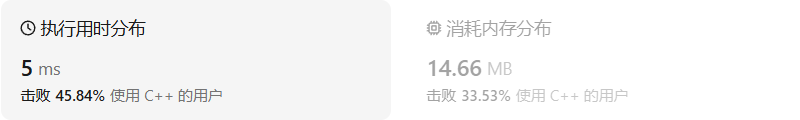
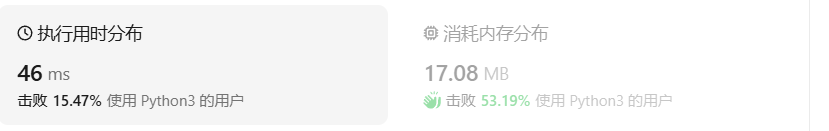
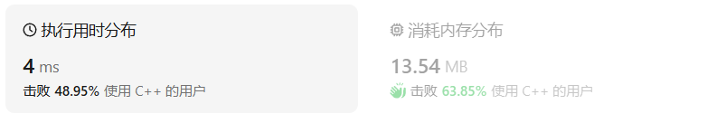
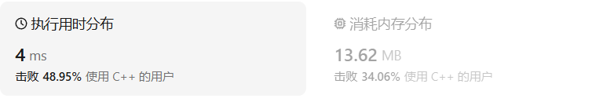
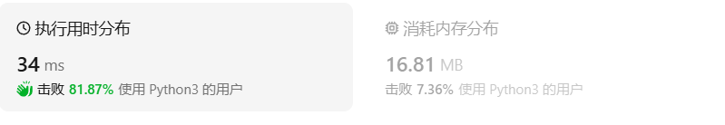
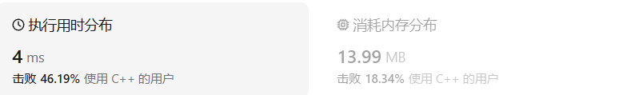
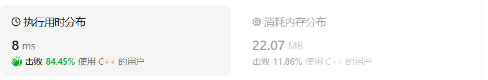
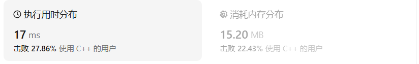

# 102二叉树的层序遍历（中等）

[102. 二叉树的层序遍历 - 力扣（LeetCode）](https://leetcode.cn/problems/binary-tree-level-order-traversal/description/)

## 题目描述

给你二叉树的根节点 `root` ，返回其节点值的 **层序遍历** 。 （即逐层地，从左到右访问所有节点）。

 

**示例 1：**


```
输入：root = [3,9,20,null,null,15,7]
输出：[[3],[9,20],[15,7]]
```

**示例 2：**

```
输入：root = [1]
输出：[[1]]
```

**示例 3：**

```
输入：root = []
输出：[]
```

 

**提示：**

- 树中节点数目在范围 `[0, 2000]` 内
- `-1000 <= Node.val <= 1000`

## 我的C++解法

借助队列来实现

```cpp
/**
 * Definition for a binary tree node.
 * struct TreeNode {
 *     int val;
 *     TreeNode *left;
 *     TreeNode *right;
 *     TreeNode() : val(0), left(nullptr), right(nullptr) {}
 *     TreeNode(int x) : val(x), left(nullptr), right(nullptr) {}
 *     TreeNode(int x, TreeNode *left, TreeNode *right) : val(x), left(left), right(right) {}
 * };
 */
class Solution {
public:
    vector<vector<int>> levelOrder(TreeNode* root) {
        //层序遍历就是典中典的队列的应用
        //现在的问题就在于如何让同一层的元素在一个vector中
        vector<vector<int>> result;
        if(!root)   return result;
        deque<TreeNode*> s;
        s.push_back(root);
        int layer = 1;
        int next_layer = 0;
        while(!s.empty()){
            vector<int> inner;
            while(layer){
                TreeNode* tmp = s.front();
                s.pop_front();
                inner.push_back(tmp->val);
                if(tmp->left){
                    next_layer++;
                    s.push_back(tmp->left);
                }
                if(tmp->right){
                    next_layer++;
                    s.push_back(tmp->right);
                }
                layer--;
            }
            layer = next_layer;
            next_layer = 0;
            result.push_back(inner);
        }
        return result;
    }
};
```

结果：



## C++参考答案

### 方法一：两个数组

```cpp
class Solution {
public:
    vector<vector<int>> levelOrder(TreeNode *root) {
        if (root == nullptr) return {};
        vector<vector<int>> ans;
        vector<TreeNode*> cur = {root};
        while (cur.size()) {
            vector<TreeNode*> nxt;
            vector<int> vals;
            for (auto node : cur) {
                vals.push_back(node->val);
                if (node->left)  nxt.push_back(node->left);
                if (node->right) nxt.push_back(node->right);
            }
            cur = move(nxt);
            ans.emplace_back(vals);
        }
        return ans;
    }
};
```

在C++中，`std::move` 是一个标准库函数，用于将一个对象的所有权转移给另一个对象。当你对一个对象调用 `std::move` 时，你告诉编译器这个对象之后不再需要被使用，它的资源可以被其他对象接管。

在你提供的代码中，`cur` 是一个存储 `TreeNode*` 的向量，它在遍历二叉树的每一层时保存当前层的节点指针。`nxt` 是另一个向量，用于存储下一层的节点指针。

第15行代码 `cur = move(nxt);` 的作用是：

1. **转移所有权**：将 `nxt` 中的所有权（即所有节点指针）转移给 `cur`。在这之后，`nxt` 不再包含这些指针，`cur` 接管了它们。

2. **避免拷贝**：通常情况下，如果直接将 `nxt` 赋值给 `cur`，会发生一次元素的拷贝操作。使用 `std::move` 可以避免这个拷贝过程，因为编译器知道 `nxt` 不再需要使用，所以可以进行优化。

3. **释放资源**：`std::move` 之后，`nxt` 中的资源（在这里是指针）被 `cur` 接管，`nxt` 不再负责这些资源的管理。这意味着 `nxt` 可以被重用，用于存储下一层节点的指针，而不用担心之前的资源泄露。

4. **提高效率**：通过避免不必要的拷贝操作，使用 `std::move` 可以提高程序的效率，特别是在处理大量数据时。

请注意，`std::move` 之后，原始对象（在这里是 `nxt`）应该被认为是"移动后无效"的，也就是说，不应该再对原始对象进行操作，因为它可能不再处于有效状态。在实际的迭代过程中，`nxt` 会在每次循环的开始被重新赋值，因此在下一次迭代中可以安全使用。

在这段代码中，使用 `std::move` 是一个优化手段，它确保了在层次遍历过程中，当前层级的节点指针在转移到下一层之前不会被拷贝，从而提高了算法的效率。

### 方法二：队列

```cpp
class Solution {
public:
    vector<vector<int>> levelOrder(TreeNode *root) {
        if (root == nullptr) return {};
        vector<vector<int>> ans;
        queue<TreeNode *> q;
        q.push(root);
        while (!q.empty()) {
            vector<int> vals;
            for (int n = q.size(); n--;) {
                auto node = q.front();
                q.pop();
                vals.push_back(node->val);
                if (node->left)  q.push(node->left);
                if (node->right) q.push(node->right);
            }
            ans.emplace_back(vals);
        }
        return ans;
    }
};
```

## 我的python解答

和C++思路一致，添加一个计数器统计每一层元素的个数

```python
# Definition for a binary tree node.
# class TreeNode:
#     def __init__(self, val=0, left=None, right=None):
#         self.val = val
#         self.left = left
#         self.right = right
class Solution:
    def levelOrder(self, root: Optional[TreeNode]) -> List[List[int]]:
        result = []
        if not root:    return result
        deque = list()
        deque.append(root)
        layer = 1
        next_layer = 0
        while deque:
            inner = list()
            while layer:
                top = deque[0]
                del deque[0]
                inner.append(top.val)
                if top.left:
                    next_layer+=1
                    deque.append(top.left)
                if top.right:
                    next_layer+=1
                    deque.append(top.right)
                layer -=1
            result.append(inner)
            layer = next_layer
            next_layer =0                    
        return result
```

结果：



## python参考答案

### 方法一：双数组

```python
class Solution:
    def levelOrder(self, root: Optional[TreeNode]) -> List[List[int]]:
        if root is None:
            return []
        ans = []
        cur = [root]
        while cur:
            nxt = []
            vals = []
            for node in cur:
                vals.append(node.val)
                if node.left:  nxt.append(node.left)
                if node.right: nxt.append(node.right)
            cur = nxt
            ans.append(vals)
        return ans
```

这个方法直接把每一层的所有结点都统一存储在一个list类型数据中，因此无需计数器的参与，每次迭代cur只用找到该list即可。

### 解法二：队列

```python
class Solution:
    def levelOrder(self, root: Optional[TreeNode]) -> List[List[int]]:
        if root is None:
            return []
        ans = []
        q = deque([root])
        while q:
            vals = []
            for _ in range(len(q)):
                node = q.popleft()
                vals.append(node.val)
                if node.left:  q.append(node.left)
                if node.right: q.append(node.right)
            ans.append(vals)
        return ans
```

这个解法告诉我：在for循环中，条件的定义是不变的，当进行过一次`range(len(q))`之后，后面的循环就不再求q的长度，而是依据第一次获取的长度范围来循环，这样也省去了计数器的实现，直接让同一层同时压入队列并同时弹出队列即可。

# 107二叉树的层序遍历II（中等）

[107. 二叉树的层序遍历 II - 力扣（LeetCode）](https://leetcode.cn/problems/binary-tree-level-order-traversal-ii/description/)

## 题目描述

给你二叉树的根节点 `root` ，返回其节点值 **自底向上的层序遍历** 。 （即按从叶子节点所在层到根节点所在的层，逐层从左向右遍历）

 

**示例 1：**


```
输入：root = [3,9,20,null,null,15,7]
输出：[[15,7],[9,20],[3]]
```

**示例 2：**

```
输入：root = [1]
输出：[[1]]
```

**示例 3：**

```
输入：root = []
输出：[]
```

 

**提示：**

- 树中节点数目在范围 `[0, 2000]` 内
- `-1000 <= Node.val <= 1000`

## 我的C++解法

```cpp
class Solution {
public:
    vector<vector<int>> levelOrderBottom(TreeNode* root) {
        //普通层序遍历是自上而下 那么现在想要自下而上就可以逆置正常结果
        vector<vector<int>> result;
        if(!root)   return result;
        queue<TreeNode*> q;
        q.push(root);
        while(!q.empty()){
            vector<int> inner;
            for(int n =q.size();n--;){
                auto node = q.front();
                q.pop();
                inner.push_back(node->val);
                if(node->left)  q.push(node->left);
                if(node->right) q.push(node->right);
            }
            result.emplace_back(inner);
        }
        reverse(result.begin(),result.end());
        return result;
    }
};
```

把正常输出的顺序倒置即可。结果：



用双数组来尝试解题：

```cpp
/**
 * Definition for a binary tree node.
 * struct TreeNode {
 *     int val;
 *     TreeNode *left;
 *     TreeNode *right;
 *     TreeNode() : val(0), left(nullptr), right(nullptr) {}
 *     TreeNode(int x) : val(x), left(nullptr), right(nullptr) {}
 *     TreeNode(int x, TreeNode *left, TreeNode *right) : val(x), left(left), right(right) {}
 * };
 */
class Solution {
public:
    vector<vector<int>> levelOrderBottom(TreeNode* root) {
        // 尝试使用两个数组解法
        vector<vector<int>> result;
        if(!root)   return result;
        vector<TreeNode*> cur;
        vector<TreeNode*> next;
        cur.push_back(root);
        while(!cur.empty()){
            vector<int> inner;
            for(auto node: cur){
                inner.push_back(node->val);
                if(node->left)  next.push_back(node->left);
                if(node->right) next.push_back(node->right);
            }
            cur = move(next);
            result.emplace_back(inner);
        }
        reverse(result.begin(),result.end());
        return result;
    }
};
```

结果：



## C++参考答案

```cpp
class Solution {
public:
    vector<vector<int>> levelOrderBottom(TreeNode *root) {
        if (root == nullptr) return {};
        vector<vector<int>> ans;
        vector<TreeNode*> cur{root};
        while (cur.size()) {
            vector<TreeNode*> nxt;
            vector<int> vals;
            for (auto node : cur) {
                vals.push_back(node->val);
                if (node->left)  nxt.push_back(node->left);
                if (node->right) nxt.push_back(node->right);
            }
            cur = move(nxt);
            ans.emplace_back(vals);
        }
        ranges::reverse(ans);
        return ans;
    }
};
```

```cpp
class Solution {
public:
    vector<vector<int>> levelOrderBottom(TreeNode *root) {
        if (root == nullptr) return {};
        vector<vector<int>> ans;
        queue<TreeNode*> q;
        q.push(root);
        while (!q.empty()) {
            vector<int> vals;
            for (int n = q.size(); n--;) {
                auto node = q.front();
                q.pop();
                vals.push_back(node->val);
                if (node->left)  q.push(node->left);
                if (node->right) q.push(node->right);
            }
            ans.emplace_back(vals);
        }
        ranges::reverse(ans);
        return ans;
    }
};
```


## 我的python解法

```python
class Solution:
    def levelOrderBottom(self, root: Optional[TreeNode]) -> List[List[int]]:
        result = []
        if not root:    return result
        q = deque([root])
        while q:
            inner = []
            for _ in range(len(q)):
                node = q.popleft()
                inner.append(node.val)
                if node.left:   q.append(node.left)
                if node.right:  q.append(node.right)

            result.append(inner)
        result.reverse()
        return result
```

结果：



## python参考答案

最后`return result[::-1]`即可

# 199二叉树的右视图（中等）

[199. 二叉树的右视图 - 力扣（LeetCode）](https://leetcode.cn/problems/binary-tree-right-side-view/description/)

## 题目描述

给定一个二叉树的 **根节点** `root`，想象自己站在它的右侧，按照从顶部到底部的顺序，返回从右侧所能看到的节点值。

 

**示例 1:**


```
输入: [1,2,3,null,5,null,4]
输出: [1,3,4]
```

**示例 2:**

```
输入: [1,null,3]
输出: [1,3]
```

**示例 3:**

```
输入: []
输出: []
```

 

**提示:**

- 二叉树的节点个数的范围是 `[0,100]`
- `-100 <= Node.val <= 100` 

## 我的C++解法

```cpp
/**
 * Definition for a binary tree node.
 * struct TreeNode {
 *     int val;
 *     TreeNode *left;
 *     TreeNode *right;
 *     TreeNode() : val(0), left(nullptr), right(nullptr) {}
 *     TreeNode(int x) : val(x), left(nullptr), right(nullptr) {}
 *     TreeNode(int x, TreeNode *left, TreeNode *right) : val(x), left(left), right(right) {}
 * };
 */
class Solution {
public:
    vector<int> rightSideView(TreeNode* root) {
        if (root == nullptr) return {};
        vector<int> ans;
        queue<TreeNode*> q;
        q.push(root);
        while (!q.empty()) {
            vector<int> vals;
            for (int n = q.size(); n--;) {
                auto node = q.front();
                q.pop();
                vals.push_back(node->val);
                if (node->left)  q.push(node->left);
                if (node->right) q.push(node->right);
            }
            ans.emplace_back(vals[vals.size()-1]);
        }
        return ans;
    }
};
```

结果：



## C++参考答案

先递归右子树，再递归左子树，当某个深度首次达到时，对应节点就在右视图中

```cpp
class Solution {
    vector<int> ans;

    void dfs(TreeNode* node, int depth) {
        if (node == nullptr) {
            return;
        }
        if (depth == ans.size()) { // 这个深度首次遇到
            ans.push_back(node->val);
        }
        dfs(node->right, depth + 1); // 先递归右子树，保证首次遇到的一定是最右边的节点
        dfs(node->left, depth + 1);
    }

public:
    vector<int> rightSideView(TreeNode* root) {
        dfs(root, 0);
        return ans;
    }
};
```

确实妙啊

## 我的python解法

```python
class Solution:
    def rightSideView(self, root: Optional[TreeNode]) -> List[int]:
        result = []
        if not root:    return result
        q = deque([root])
        while q:
            inner = []
            for _ in range(len(q)):
                node = q.popleft()
                inner.append(node.val)
                if node.left:   q.append(node.left)
                if node.right:  q.append(node.right)
            result.append(inner[-1])
        return result        
```

结果：


## python参考答案

```python
class Solution:
    def rightSideView(self, root: Optional[TreeNode]) -> List[int]:
        ans = []
        def dfs(node: Optional[TreeNode], depth: int) -> None:
            if node is None:
                return
            if depth == len(ans):  # 这个深度首次遇到
                ans.append(node.val)
            dfs(node.right, depth + 1)  # 先递归右子树，保证首次遇到的一定是最右边的节点
            dfs(node.left, depth + 1)
        dfs(root, 0)
        return ans
```

# 637二叉树的层平均值

[637. 二叉树的层平均值 - 力扣（LeetCode）](https://leetcode.cn/problems/average-of-levels-in-binary-tree/description/)

## 题目描述

给定一个非空二叉树的根节点 `root` , 以数组的形式返回每一层节点的平均值。与实际答案相差 `10-5` 以内的答案可以被接受。

 

**示例 1：**


```
输入：root = [3,9,20,null,null,15,7]
输出：[3.00000,14.50000,11.00000]
解释：第 0 层的平均值为 3,第 1 层的平均值为 14.5,第 2 层的平均值为 11 。
因此返回 [3, 14.5, 11] 。
```

**示例 2:**


```
输入：root = [3,9,20,15,7]
输出：[3.00000,14.50000,11.00000]
```

 

**提示：**


- 树中节点数量在 `[1, 104]` 范围内
- `-231 <= Node.val <= 231 - 1`

## C++解法

```cpp
class Solution {
public:
    vector<double> averageOfLevels(TreeNode* root) {
        if (root == nullptr) return {};
        vector<double> ans;
        queue<TreeNode*> q;
        q.push(root);
        while (!q.empty()) {
            vector<int> vals;
            for (int n = q.size(); n--;) {
                auto node = q.front();
                q.pop();
                vals.push_back(node->val);
                if (node->left)  q.push(node->left);
                if (node->right) q.push(node->right);
            }
            double sum = 0;
            for(int x : vals){
                sum+=x;
            }
            ans.push_back(sum/vals.size());
        }
        return ans;
    }
};
```

结果：



## C++参考答案

### 深度优先搜索

```cpp
class Solution {
public:
    vector<double> averageOfLevels(TreeNode* root) {
        auto counts = vector<int>();
        auto sums = vector<double>();
        dfs(root, 0, counts, sums);
        auto averages = vector<double>();
        int size = sums.size();
        for (int i = 0; i < size; i++) {
            averages.push_back(sums[i] / counts[i]);
        }
        return averages;
    }

    void dfs(TreeNode* root, int level, vector<int> &counts, vector<double> &sums) {
        if (root == nullptr) {
            return;
        }
        if (level < sums.size()) {
            sums[level] += root->val;
            counts[level] += 1;
        } else {
            sums.push_back(1.0 * root->val);
            counts.push_back(1);
        }
        dfs(root->left, level + 1, counts, sums);
        dfs(root->right, level + 1, counts, sums);
    }
};
```

### 广度优先搜索

```cpp
class Solution {
public:
    vector<double> averageOfLevels(TreeNode* root) {
        auto averages = vector<double>();
        auto q = queue<TreeNode*>();
        q.push(root);
        while (!q.empty()) {
            double sum = 0;
            int size = q.size();
            for (int i = 0; i < size; i++) {
                auto node = q.front();
                q.pop();
                sum += node->val;
                auto left = node->left, right = node->right;
                if (left != nullptr) {
                    q.push(left);
                }
                if (right != nullptr) {
                    q.push(right);
                }
            }
            averages.push_back(sum / size);
        }
        return averages;
    }
};
```


## py解法

```python
class Solution:
    def averageOfLevels(self, root: Optional[TreeNode]) -> List[float]:
        result = []
        if not root:    return result
        q = deque([root])
        while q:
            inner = []
            for _ in range(len(q)):
                node = q.popleft()
                inner.append(node.val)
                if node.left:   q.append(node.left)
                if node.right:  q.append(node.right)
            result.append(sum(inner)/len(inner))
        return result  
```

结果：


## py参考答案

```python
class Solution:
    def averageOfLevels(self, root: TreeNode) -> List[float]:
        def dfs(root: TreeNode, level: int):
            if not root:
                return
            if level < len(totals):
                totals[level] += root.val
                counts[level] += 1
            else:
                totals.append(root.val)
                counts.append(1)
            dfs(root.left, level + 1)
            dfs(root.right, level + 1)

        counts = list()
        totals = list()
        dfs(root, 0)
        return [total / count for total, count in zip(totals, counts)]
```

```python
class Solution:
    def averageOfLevels(self, root: TreeNode) -> List[float]:
        averages = list()
        queue = collections.deque([root])
        while queue:
            total = 0
            size = len(queue)
            for _ in range(size):
                node = queue.popleft()
                total += node.val
                left, right = node.left, node.right
                if left:
                    queue.append(left)
                if right:
                    queue.append(right)
            averages.append(total / size)
        return averages
```

# 429N叉树的层序遍历（中等）

[429. N 叉树的层序遍历 - 力扣（LeetCode）](https://leetcode.cn/problems/n-ary-tree-level-order-traversal/description/)

## 题目描述

给定一个 N 叉树，返回其节点值的*层序遍历*。（即从左到右，逐层遍历）。

树的序列化输入是用层序遍历，每组子节点都由 null 值分隔（参见示例）。

 

**示例 1：**


```
输入：root = [1,null,3,2,4,null,5,6]
输出：[[1],[3,2,4],[5,6]]
```

**示例 2：**


```
输入：root = [1,null,2,3,4,5,null,null,6,7,null,8,null,9,10,null,null,11,null,12,null,13,null,null,14]
输出：[[1],[2,3,4,5],[6,7,8,9,10],[11,12,13],[14]]
```

 

**提示：**

- 树的高度不会超过 `1000`
- 树的节点总数在 `[0, 104]` 之间

## C++解法

```cpp
/*
// Definition for a Node.
class Node {
public:
    int val;
    vector<Node*> children;

    Node() {}

    Node(int _val) {
        val = _val;
    }

    Node(int _val, vector<Node*> _children) {
        val = _val;
        children = _children;
    }
};
*/

class Solution {
public:
    vector<vector<int>> levelOrder(Node* root) {
        if (root == nullptr) return {};
        vector<vector<int>> ans;
        queue<Node *> q;
        q.push(root);
        while (!q.empty()) {
            vector<int> vals;
            for (int n = q.size(); n--;) {
                auto node = q.front();
                q.pop();
                vals.push_back(node->val);
                // if (node->left)  q.push(node->left);
                // if (node->right) q.push(node->right);
                // while(node->children)   q.push(node->children);
                for(auto child:node->children){
                    q.push(child);
                }
            }
            ans.emplace_back(vals);
        }
        return ans;     
    }
};
```

结果：



## C++参考答案

### 双数组

```cpp
class Solution {
public:
    vector<vector<int>> levelOrder(Node *root) {
        if (root == nullptr) return {};
        vector<vector<int>> ans;
        vector<Node*> cur = {root};
        while (cur.size()) {
            vector<Node*> nxt;
            vector<int> vals;
            for (auto node : cur) {
                vals.push_back(node->val);
                nxt.insert(nxt.end(), node->children.begin(), node->children.end());
            }
            ans.emplace_back(vals);
            cur = move(nxt);
        }
        return ans;
    }
};
```

### 队列

```cpp
class Solution {
public:
    vector<vector<int>> levelOrder(Node *root) {
        if (root == nullptr) return {};
        vector<vector<int>> ans;
        queue<Node*> q;
        q.push(root);
        while (!q.empty()) {
            vector<int> vals;
            for (int n = q.size(); n--;) {
                auto node = q.front();
                q.pop();
                vals.push_back(node->val);
                for (auto c : node->children) {
                    q.push(c);
                }
            }
            ans.emplace_back(vals);
        }
        return ans;
    }
};
```

## py解法

```python
"""
# Definition for a Node.
class Node:
    def __init__(self, val=None, children=None):
        self.val = val
        self.children = children
"""

class Solution:
    def levelOrder(self, root: 'Node') -> List[List[int]]:
        if root is None:
            return []
        ans = []
        q = deque([root])
        while q:
            vals = []
            for _ in range(len(q)):
                node = q.popleft()
                vals.append(node.val)
                # if node.left:  q.append(node.left)
                # if node.right: q.append(node.right)
                for child in node.children:
                    q.append(child)
            ans.append(vals)
        return ans     
```

把二叉树层序改一下就行了。结果：


## py参考答案

### 两个数组

```python
class Solution:
    def levelOrder(self, root: 'Node') -> List[List[int]]:
        if root is None:
            return []
        ans = []
        q = [root]
        while q:
            ans.append([node.val for node in q])
            q = [c for node in q for c in node.children]
        return ans
```

### 一个队列

```python
class Solution:
    def levelOrder(self, root: 'Node') -> List[List[int]]:
        if root is None:
            return []
        ans = []
        q = deque([root])
        while q:
            vals = []
            for _ in range(len(q)):
                node = q.popleft()
                vals.append(node.val)
                q.extend(node.children)
            ans.append(vals)
        return ans
```


## C++收获

### C++中的move函数

<center>关键词：move函数<center>

在C++中，`std::move` 是一个标准库函数，用于将对象的所有权从一个对象转移到另一个对象。它通常用于智能指针、容器类等可移动（move-aware）类型的对象，以实现资源的有效转移，避免不必要的拷贝操作。

#### `std::move` 的作用：

1. **资源转移**：`std::move` 将对象的所有权从一个实例转移到另一个实例。对于像 `std::unique_ptr` 这样的智能指针，这意味着指针所管理的资源将被转移。

2. **避免拷贝**：使用 `std::move` 可以避免对象拷贝，因为移动操作通常比拷贝操作要高效。对于大型对象或者资源密集型对象（如文件句柄、网络连接等），移动操作可以显著提高性能。

3. **优化性能**：通过转移所有权，`std::move` 允许对象在不再需要时释放资源，而接收方则接管这些资源。

#### 使用 `std::move` 的场景：

- **容器的移动构造函数和移动赋值操作符**：例如，`std::vector`、`std::string` 等容器提供了移动构造函数和移动赋值操作符，它们使用 `std::move` 来转移容器内部资源的所有权。

  ```cpp
  std::vector<int> vecA = {1, 2, 3};
  std::vector<int> vecB = std::move(vecA);  // vecA 的资源被转移给 vecB，vecA 不再持有资源
  ```

- **智能指针的转移**：智能指针如 `std::unique_ptr` 和 `std::shared_ptr` 可以使用 `std::move` 来转移指针所管理的资源。

  ```cpp
  std::unique_ptr<int> ptrA(new int);
  std::unique_ptr<int> ptrB = std::move(ptrA);  // ptrA 的资源被转移给 ptrB
  ```

- **函数返回**：当函数需要返回一个资源密集型对象时，可以使用 `std::move` 来避免拷贝。

  ```cpp
  std::vector<int> createVector() {
      std::vector<int> localVector;
      // ... 填充 localVector ...
      return std::move(localVector);  // 将 localVector 移动出去，避免拷贝
  }
  ```

#### 注意事项：

- **移动后的对象状态**：使用 `std::move` 后，原始对象的状态是未定义的，它应该被认为是“移动后无效”的。这意味着不应该再对原始对象进行操作，除非它被重新赋值。

- **移动和拷贝的区别**：移动操作可能会执行资源的转移，而拷贝操作总是创建资源的一个新副本。

- **自定义类型的移动语义**：对于自定义类型，如果你想利用移动语义，需要定义类的移动构造函数和移动赋值操作符。

  ```cpp
  class MyType {
  public:
      MyType(MyType&& other) { // 移动构造函数
          // ... 转移资源 ...
      }
      MyType& operator=(MyType&& other) { // 移动赋值操作符
          // ... 转移资源 ...
          return *this;
      }
  };
  ```

`std::move` 是C++11引入的特性之一，它为资源管理提供了一种高效的方式，特别是在涉及到临时对象或者大型对象时。

### C++中的insert函数

<center>关键词：insert函数<center>

在C++中，`insert` 是一个关联容器（如 `std::vector`、`std::list`、`std::set`、`std::map` 等）的成员函数，用于在容器中的指定位置插入一个或多个元素。不同的容器类型提供了不同的 `insert` 函数变体，以适应它们各自的特性。

以下是一些常见容器的 `insert` 方法使用示例：

#### `std::vector` 的 `insert`
对于 `std::vector`，`insert` 方法可以在指定位置插入单个元素或一个元素序列。

```cpp
#include <vector>

std::vector<int> vec = {1, 2, 4, 5};
// 在索引2的位置插入元素3
vec.insert(vec.begin() + 2, 3);
// 现在 vec 是 {1, 2, 3, 4, 5}

// 在索引1到索引3的位置插入两个元素6和7
vec.insert(vec.begin() + 1, 2, 6); // 从索引1开始插入两个6
// 现在 vec 是 {1, 6, 6, 2, 3, 4, 5}

vector<int> a;
vector<int> b;
a.insert(a.end(),b.begin(),b.end());//实现a和b的合并操作
```

#### `std::list` 的 `insert`
`std::list` 的 `insert` 方法允许你在指定迭代器位置插入一个元素或一个元素范围。

```cpp
#include <list>

std::list<int> lst = {1, 2, 4, 5};
// 在lst的末尾之前插入3
lst.insert(--lst.end(), 3);
// 现在 lst 是 {1, 2, 3, 4, 5}

// 插入范围
std::vector<int> vec = {6, 7};
lst.insert(lst.end(), vec.begin(), vec.end());
// 现在 lst 是 {1, 2, 3, 4, 5, 6, 7}
```

#### `std::set` 和 `std::map` 的 `insert`
对于 `std::set` 和 `std::map`，`insert` 方法用于插入一个唯一的元素或键值对。如果容器中已存在相同的元素或键，则不会插入新元素。

```cpp
#include <set>

std::set<int> s;
// 插入元素
s.insert(1);
// 尝试插入重复元素
s.insert(1); // 不会插入，因为1已存在

#include <map>

std::map<int, std::string> m;
// 插入键值对
m.insert(std::make_pair(1, "one"));
// 尝试插入重复键
m.insert(std::make_pair(1, "another")); // 不会插入，因为键1已存在
```

#### 注意事项
- `insert` 方法可能会返回一个迭代器，指向插入点（对于 `std::list` 和 `std::vector`），或者返回一个插入结果（对于 `std::set` 和 `std::map`）。
- 对于 `std::set` 和 `std::map`，`insert` 方法返回的是一个 `std::pair`，其中 `first` 是一个指向插入元素的迭代器，`second` 是一个布尔值，指示插入是否发生。
- 在 `std::vector` 中使用 `insert` 可能会引起原有元素的移动，因为 `std::vector` 需要为新元素腾出空间。
- 在 `std::list` 中使用 `insert` 不会引起元素移动，因为 `std::list` 是一个双向链表。

`insert` 是C++标准库容器中用于增加元素的重要方法，它提供了灵活的方式来修改容器内容。

### C++中的list

<center>关键词：list<center>

<center>关键词：双向链表<center>

在C++中，`std::list` 是标准模板库（STL）中提供的一种容器，它实现了双向链表的数据结构。与 `std::vector` 这样的动态数组不同，`std::list` 允许在列表的任何位置高效地插入和删除元素，而不需要像 `std::vector` 那样可能需要复制或移动大量元素。

以下是 `std::list` 的一些主要特性和操作：

#### 包含头文件
```cpp
#include <list>
```

#### 创建 `std::list`
```cpp
std::list<int> myList;
```

#### 插入元素
- 在末尾添加元素：
  ```cpp
  myList.push_back(10);
  ```
- 在开头添加元素：
  ```cpp
  myList.push_front(20);
  ```
- 在指定迭代器位置添加元素：
  ```cpp
  myList.insert(myList.begin(), 30); // 在开始位置插入
  ```

#### 删除元素
- 删除末尾元素：
  ```cpp
  myList.pop_back();
  ```
- 删除开头元素：
  ```cpp
  myList.pop_front();
  ```
- 删除指定迭代器位置的元素：
  ```cpp
  myList.erase(myList.begin()); // 删除开始位置的元素
  ```

#### 访问元素
- 前缀递增运算符 `++` 用于移动到下一个元素：
  ```cpp
  std::list<int>::iterator it = myList.begin();
  ++it; // 移动到下一个元素
  ```
- 后缀递增运算符 `--` 用于移动到上一个元素：
  ```cpp
  --it; // 移动到上一个元素
  ```

#### 遍历 `std::list`
```cpp
for (std::list<int>::iterator it = myList.begin(); it != myList.end(); ++it) {
    std::cout << *it << " ";
}
```

#### 清空 `std::list`
```cpp
myList.clear();
```

#### 检查 `std::list` 是否为空
```cpp
bool isEmpty = myList.empty();
```

#### 获取 `std::list` 的大小
```cpp
size_t size = myList.size();
```

#### 反转 `std::list`
```cpp
myList.reverse();
```

#### 排序 `std::list`

```cpp
myList.sort(); // 默认从小到大排序
```

#### `std::list` 的优势
- **高效的插入和删除**：在链表的任何位置插入或删除元素都是高效的，时间复杂度为 O(1)，只要提供了正确的迭代器。
- **不需要连续内存**：与 `std::vector` 相比，`std::list` 不需要一块连续的内存空间，这使得它在处理大型数据结构时更加灵活。

#### `std::list` 的局限性
- **不支持随机访问**：由于底层实现是链表，`std::list` 不支持像 `std::vector` 那样的随机访问。访问元素需要从头开始遍历。
- **更高的内存开销**：每个元素除了存储数据外，还需要额外存储指向前后元素的指针，因此内存开销比 `std::vector` 大。

`std::list` 是实现序列容器时的一个有用选择，特别是当你需要频繁地在序列中间插入或删除元素时。

## python收获

### py中的extend函数

<center>关键词：extend函数<center>

在Python中，`extend` 是一个用于列表（list）的方法，它用于在列表的末尾一次性追加另一个迭代器（如列表、元组、集合或任何支持迭代的对象）。这个方法会修改原来的列表，而不是创建一个新的列表。

下面是 `extend` 方法的一些使用示例：

#### 基本用法
```python
# 创建两个列表
list1 = [1, 2, 3]
list2 = [4, 5, 6]

# 使用 extend 将 list2 添加到 list1 的末尾
list1.extend(list2)

# 现在 list1 变成了 [1, 2, 3, 4, 5, 6]
print(list1)
```

#### 与 `+` 操作符的区别

使用 `extend` 方法与使用 `+` 操作符连接两个列表不同。`extend` 会直接修改原来的列表，而 `+` 操作符会创建一个新的列表。

```python
list1 = [1, 2, 3]
list2 = [4, 5, 6]

# 使用 + 操作符连接两个列表
new_list = list1 + list2

# list1 保持不变，仍然是 [1, 2, 3]
# new_list 是连接后的新列表，[1, 2, 3, 4, 5, 6]
print(list1)  # 输出: [1, 2, 3]
print(new_list)  # 输出: [1, 2, 3, 4, 5, 6]
```

#### 扩展其他可迭代对象
`extend` 不仅限于列表，它可以接受任何可迭代对象作为参数。

```python
list1 = [1, 2, 3]
tuple1 = (4, 5)
set1 = {6, 7}

# 扩展元组和集合
list1.extend(tuple1)
list1.extend(set1)

# 现在 list1 变成了 [1, 2, 3, 4, 5, 6, 7]
print(list1)
```

#### 注意事项
- `extend` 会修改调用它的列表，它不会返回新的列表。
- 如果传给 `extend` 的迭代器是空的，原列表不会发生变化。
- 如果你尝试扩展一个不可迭代的对象，Python 将抛出 `TypeError`。

`extend` 是处理列表合并和添加元素时非常有用的工具，它提供了一种高效且直观的方式来增加列表的内容。