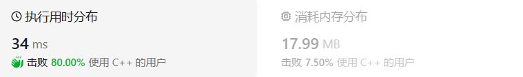
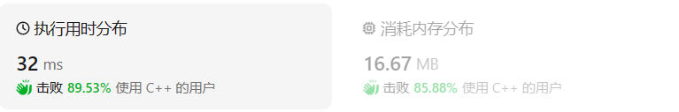
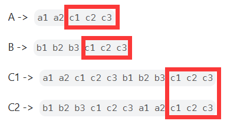
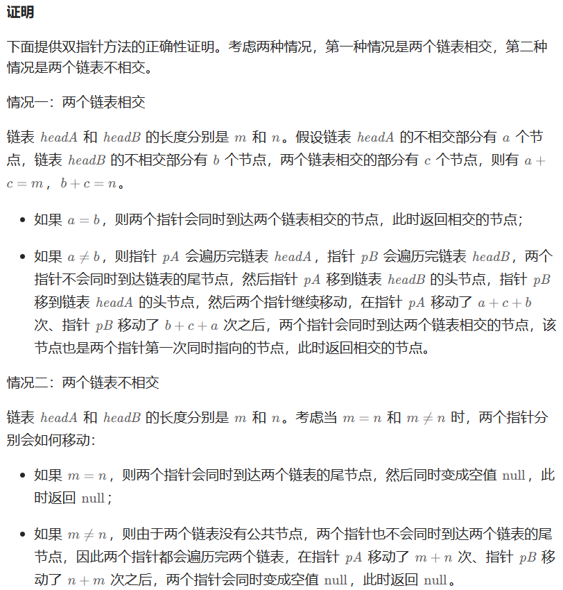
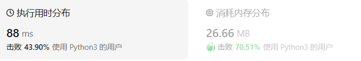

# 面试题02.07链表相交

[面试题02.07 链表相交](https://leetcode.cn/problems/intersection-of-two-linked-lists-lcci/)

## 题目描述

给你两个单链表的头节点 `headA` 和 `headB` ，请你找出并返回两个单链表相交的起始节点。如果两个链表没有交点，返回 `null` 。

图示两个链表在节点 `c1` 开始相交：

[](https://assets.leetcode-cn.com/aliyun-lc-upload/uploads/2018/12/14/160_statement.png)

题目数据 **保证** 整个链式结构中不存在环。

**注意**，函数返回结果后，链表必须 **保持其原始结构** 。

 

**示例 1：**

[](https://assets.leetcode.com/uploads/2018/12/13/160_example_1.png)

```
输入：intersectVal = 8, listA = [4,1,8,4,5], listB = [5,0,1,8,4,5], skipA = 2, skipB = 3
输出：Intersected at '8'
解释：相交节点的值为 8 （注意，如果两个链表相交则不能为 0）。
从各自的表头开始算起，链表 A 为 [4,1,8,4,5]，链表 B 为 [5,0,1,8,4,5]。
在 A 中，相交节点前有 2 个节点；在 B 中，相交节点前有 3 个节点。
```

**示例 2：**

[](https://assets.leetcode.com/uploads/2018/12/13/160_example_2.png)

```
输入：intersectVal = 2, listA = [0,9,1,2,4], listB = [3,2,4], skipA = 3, skipB = 1
输出：Intersected at '2'
解释：相交节点的值为 2 （注意，如果两个链表相交则不能为 0）。
从各自的表头开始算起，链表 A 为 [0,9,1,2,4]，链表 B 为 [3,2,4]。
在 A 中，相交节点前有 3 个节点；在 B 中，相交节点前有 1 个节点。
```

**示例 3：**

[](https://assets.leetcode.com/uploads/2018/12/13/160_example_3.png)

```
输入：intersectVal = 0, listA = [2,6,4], listB = [1,5], skipA = 3, skipB = 2
输出：null
解释：从各自的表头开始算起，链表 A 为 [2,6,4]，链表 B 为 [1,5]。
由于这两个链表不相交，所以 intersectVal 必须为 0，而 skipA 和 skipB 可以是任意值。
这两个链表不相交，因此返回 null 。
```

 

**提示：**

- `listA` 中节点数目为 `m`
- `listB` 中节点数目为 `n`
- `0 <= m, n <= 3 * 104`
- `1 <= Node.val <= 105`
- `0 <= skipA <= m`
- `0 <= skipB <= n`
- 如果 `listA` 和 `listB` 没有交点，`intersectVal` 为 `0`
- 如果 `listA` 和 `listB` 有交点，`intersectVal == listA[skipA + 1] == listB[skipB + 1]`

 

**进阶：**你能否设计一个时间复杂度 `O(n)` 、仅用 `O(1)` 内存的解决方案？

## 我的C++解法

第一种想法：借助栈。开辟俩个栈空间，把两个链表分别全部压入，同时弹出栈顶元素，并比较是否相同。

```cpp
/**
 * Definition for singly-linked list.
 * struct ListNode {
 *     int val;
 *     ListNode *next;
 *     ListNode(int x) : val(x), next(NULL) {}
 * };
 */
class Solution {
public:
    ListNode *getIntersectionNode(ListNode *headA, ListNode *headB) {
        //这个题在王道数据结构上面做过
        //第一种想法：借助栈。开辟俩个栈空间，把两个链表分别全部压入，同时弹出栈顶元素，并比较是否相同
        stack<ListNode*> stk1;
        stack<ListNode*> stk2;
        ListNode* dumpheadA=new ListNode(0,headA);
        ListNode* dumpheadB=new ListNode(0,headB);
        ListNode* a=dumpheadA;
        ListNode* b=dumpheadB;        
        if(!a || !b)    return NULL;
        int lenA=0;
        int lenB=0;
        while(a || b){
            if(a){
                stk1.push(a);
                a=a->next;
                lenA++;
            }
            if(b){
                stk2.push(b);
                b=b->next;
                lenB++;
            }
        }//分别压栈
        int flag=1;
        while(flag){
            a=stk1.top();
            if(a)   stk1.pop();//有元素可以弹出
            // b=(struct ListNode*)stk2.pop();
            b=stk2.top();
            if(b)   stk2.pop();
            if(a==b){
                flag=1;
            }
            else    flag=0;
        }
        return a->next;
    }
};
```

结果：



在第一次尝试编写的时候没有设置虚拟头节点导致有些报错，因为我最后的返回是a->next，如果a本身是单一的头节点，那就无法返回了，因此在排查错误的时候添加上了虚拟头节点，使得能够正常返回正确结果。这样看来添加的`lenA`和`lenB`完全没有一点用处啊。这个方法的时空都是o(n)。尝试思考其他方法。

其实这个问题我还是有点不理解，明明函数的形参里面只有两个链表的头节点，为什么题目表述的时候还传入了参数`skipA`和`skipB`？明明`intersectVal`是作为传入参数传入的，我还设计这个函数有什么用呢？

第二种想法：获取链表长度，依据长度进行对齐操作，再同时移动指针

```cpp
/**
 * Definition for singly-linked list.
 * struct ListNode {
 *     int val;
 *     ListNode *next;
 *     ListNode(int x) : val(x), next(NULL) {}
 * };
 */
class Solution {
public:
    ListNode *getIntersectionNode(ListNode *headA, ListNode *headB) {
        //如果知道两个链表的长度，就可以进行对齐操作，使得两指针同时移动。
        ListNode* dumpheadA= new ListNode(-1,headA);
        ListNode* dumpheadB= new ListNode(-2,headB);
        ListNode* a=dumpheadA;
        ListNode* b=dumpheadB;
        int lenA=0;
        int lenB=0;
        while(a || b){
            if(a){
                a=a->next;
                lenA++;
            }
            if(b){
                b=b->next;
                lenB++;
            }
        }
        a=dumpheadA;
        b=dumpheadB;
        if(lenA>lenB){
            for(int i=0;i<lenA-lenB;i++){
                a=a->next;
            }
        }
        else if(lenA<lenB){
            for(int i=0;i<lenB-lenA;i++){
                b=b->next;
            }
        }
        while(a!=b && a){
            a=a->next;
            b=b->next;
        }
        return a;
    }
};
```

结果：

这下时空复杂度都是o(n)了。在编写这个解法的时候突然意识到第一种解法初始化虚拟头节点的时候并不正确，因为普通链表里面的节点值也可以是0。应该设置为一个负数。

上面两种解法就是我现阶段能够想到的了。期待答案有更妙的解法让我学习。

在构思python解法的时候突然想到能不能用`sizeof`来获取链表的长度呢？这样的话就能少一次遍历过程。

## C++参考答案

### 方法一：哈希表

判断两个链表是否相交，可以使用哈希集合存储链表节点。

首先遍历链表`headA`，并将链表 `headA `中的每个节点加入哈希集合中。然后遍历链表 `headB`，对于遍历到的每个节点，判断该节点是否在哈希集合中：

- 如果当前节点不在哈希集合中，则继续遍历下一个节点；

- 如果当前节点在哈希集合中，则后面的节点都在哈希集合中，即从当前节点开始的所有节点都在两个链表的相交部分，因此在链表 `headB`中遍历到的第一个在哈希集合中的节点就是两个链表相交的节点，返回该节点。


如果链表`headB`中的所有节点都不在哈希集合中，则两个链表不相交，返回`null`。

```cpp
class Solution {
public:
    ListNode *getIntersectionNode(ListNode *headA, ListNode *headB) {
        unordered_set<ListNode *> visited;
        ListNode *temp = headA;
        while (temp != nullptr) {
            visited.insert(temp);
            temp = temp->next;
        }
        temp = headB;
        while (temp != nullptr) {
            if (visited.count(temp)) {
                return temp;
            }
            temp = temp->next;
        }
        return nullptr;
    }
};
```

时间o(n+m),空间o(n) n为A的表长，m为B

### 方法二：双指针

很妙很妙，从数学角度入手，给人一种豁然开朗的感觉，确实妙啊。

总体思路：简单理解为：链表A+链表B=链表C1；链表B+链表A=链表C2，这样得到的C1和C2一定是等长的，而且C1和C2的结尾一定是链表AB相交的部分！

数学原理：a+(b-c)=b+(a-c)



当链表`headA `和 `headB `都不为空时，创建两个指针` pA`和 `pB`，初始时分别指向两个链表的头节点 `headA`和 `headB`，然后将两个指针依次遍历两个链表的每个节点。具体做法如下：

- 每步操作需要同时更新指针 `pA`和 `pB`。

- 如果指针 `pA`不为空，则将指针 `pA` 移到下一个节点；如果指针` pB`不为空，则将指针 `pB` 移到下一个节点。

- 如果指针` pA`为空，则将指针 `pA`移到链表 `headB`的头节点；如果指针` pB`为空，则将指针 `pB`移到链表` headA`的头节点。

- 当指针 `pA`和` pB`指向同一个节点或者都为空时，返回它们指向的节点或者 `null`。




```cpp
class Solution {
public:
    ListNode *getIntersectionNode(ListNode *headA, ListNode *headB) {
        if (headA == nullptr || headB == nullptr) {
            return nullptr;
        }
        ListNode *pA = headA, *pB = headB;
        while (pA != pB) {
            pA = pA == nullptr ? headB : pA->next;
            pB = pB == nullptr ? headA : pB->next;
        }
        return pA;
    }
};
```

这个代码不管从数学角度来看还是从编码角度来看，都太美了！优雅！实在是太优雅了！

### 方法三：对齐

```cpp
class Solution {
public:
    ListNode *getIntersectionNode(ListNode *headA, ListNode *headB) {
        ListNode* curA = headA;
        ListNode* curB = headB;
        int lenA = 0, lenB = 0;
        while (curA != NULL) { // 求链表A的长度
            lenA++;
            curA = curA->next;
        }
        while (curB != NULL) { // 求链表B的长度
            lenB++;
            curB = curB->next;
        }
        curA = headA;
        curB = headB;
        // 让curA为最长链表的头，lenA为其长度
        if (lenB > lenA) {
            swap (lenA, lenB);
            swap (curA, curB);
        }
        // 求长度差
        int gap = lenA - lenB;
        // 让curA和curB在同一起点上（末尾位置对齐）
        while (gap--) {
            curA = curA->next;
        }
        // 遍历curA 和 curB，遇到相同则直接返回
        while (curA != NULL) {
            if (curA == curB) {
                return curA;
            }
            curA = curA->next;
            curB = curB->next;
        }
        return NULL;
    }
};
```

这个做法的唯一一个亮点就是swap函数

## C++收获

### C++初始化栈

在C++中，栈（Stack）是一种遵循后进先出（LIFO，Last In First Out）原则的线性数据结构。C++标准库中并没有直接提供一个名为“Stack”的容器，但是可以使用 `std::vector`、`std::deque` 或 `std::list` 等容器来模拟栈的行为。以下是使用这些容器初始化栈的一些方法：

#### 使用 `std::vector`

```cpp
#include <vector>

std::vector<int> stack;
// 初始化一个空栈

// 推入元素
stack.push_back(1);
stack.push_back(2);
stack.push_back(3);

// 弹出元素
int top_element = stack.back();
stack.pop_back();
```

#### 使用 `std::deque`

```cpp
#include <deque>

std::deque<int> stack;
// 初始化一个空栈

// 推入元素
stack.push_back(1);
stack.push_back(2);
stack.push_back(3);

// 弹出元素
int top_element = stack.back();
stack.pop_back();
```

#### 使用 `std::list`

```cpp
#include <list>

std::list<int> stack;
// 初始化一个空栈

// 推入元素
stack.push_back(1);
stack.push_back(2);
stack.push_back(3);

// 弹出元素
int top_element = stack.back();
stack.pop_back();
```

在上述所有示例中，我们使用了容器的 `push_back()` 方法来模拟栈的“推入”操作，使用 `pop_back()` 方法来模拟“弹出”操作。这是因为 `std::vector`、`std::deque` 和 `std::list` 都支持在容器的末尾进行快速的插入和删除操作。

#### 注意事项

- 虽然 `std::vector`、`std::deque` 和 `std::list` 可以模拟栈的行为，但它们的性能特点不同。例如，`std::vector` 在随机访问方面更快，但插入和删除操作可能需要更多时间（如果需要重新分配内存）。相比之下，`std::list` 在插入和删除操作上更快，但不支持随机访问。
- 标准库中的 `std::stack` 适配器也可以用来实现栈，它使用其他标准容器作为底层容器。

#### 使用 `std::stack` 适配器

```cpp
#include <stack>
#include <vector>

std::stack<int, std::vector<int>> stack(std::vector<int>());
// 使用 vector 作为底层容器初始化一个空栈

// 推入元素
stack.push(1);
stack.push(2);
stack.push(3);

// 弹出元素
int top_element = stack.top();
stack.pop();
```

在这个示例中，我们使用了 `std::stack` 适配器，它模板化地使用了 `std::vector` 作为底层容器。`std::stack` 只提供了有限的操作，如 `push()`、`pop()` 和 `top()`，这些操作分别对应栈的推入、弹出和顶部元素访问。

选择哪种方法取决于你的具体需求，包括对性能的要求以及对底层容器特性的偏好。

栈的正统在`# include <stack>`

### C++对栈的操作

在C++中，栈（Stack）是一种常用的数据结构，它遵循后进先出（LIFO，Last In First Out）的原则。虽然C++标准模板库（STL）中没有直接提供名为“Stack”的容器，但是可以使用 `std::stack` 适配器，它基于其他容器（如 `std::vector`、`std::deque` 或 `std::list`）来实现栈的功能。

以下是使用 `std::stack` 适配器对栈进行操作的基本方法：

#### 包含必要的头文件

```cpp
#include <stack>
```

#### 初始化栈

```cpp
std::stack<int> myStack;
```

#### 推入元素（入栈）

```cpp
myStack.push(50); // 推入元素50
myStack.push(100); // 推入元素100
```

#### 弹出元素（出栈）

```cpp
if (!myStack.empty()) {
    int topElement = myStack.top(); // 获取栈顶元素
    myStack.pop(); // 弹出栈顶元素
}
```

需要注意一点是在C++的栈中，使用`pop`函数返回的是void类型，即该函数只完成把栈顶元素出栈操作，而不进行任何返回。若想获取并弹出栈顶元素，则必须先用`top`函数获取栈顶元素再进行`pop`出栈操作。

#### 获取栈顶元素

```cpp
if (!myStack.empty()) {
    int topElement = myStack.top();
    // 可以对topElement进行操作，但不能从栈中移除
}
```

#### 检查栈是否为空

```cpp
bool isEmpty = myStack.empty(); // 如果栈为空，则返回true
```

#### 获取栈的大小

```cpp
size_t size = myStack.size(); // 获取栈中元素的数量
```

#### 清空栈

```cpp
while (!myStack.empty()) {
    myStack.pop(); // 循环弹出所有元素，清空栈
}
```

#### 示例

```cpp
#include <iostream>
#include <stack>

int main() {
    std::stack<int> myStack;

    // 推入元素
    myStack.push(1);
    myStack.push(2);
    myStack.push(3);

    // 弹出元素
    while (!myStack.empty()) {
        int topElement = myStack.top();
        std::cout << "Popped: " << topElement << std::endl;
        myStack.pop();
    }

    return 0;
}
```

#### 注意事项

- `std::stack` 是一个容器适配器，它只提供了有限的操作集合，主要关注栈的基本操作。
- 由于 `std::stack` 是后进先出的，所以不支持随机访问，也不能直接访问除了顶部之外的其他元素。
- `std::stack` 的底层容器的选择会影响其性能特性。例如，基于 `std::vector` 的栈在随机访问时更快，而基于 `std::deque` 的栈可能在频繁的入栈和出栈操作时更高效。

使用 `std::stack` 适配器可以方便地在C++程序中实现栈的操作，同时保持代码的可读性和简洁性。

### C++中的swap函数

在C++中，`swap` 函数是一个非常有用的标准库函数，用于交换两个值或两个容器中的内容。它提供了一种高效且类型安全的方式来交换数据。

#### 标准库中的 `swap` 函数

C++标准库提供了一个通用的 `swap` 函数，它是一个模板函数，可以用于交换大多数类型的值。它的定义在 `<utility>` 头文件中。

**交换值**

```cpp
#include <utility>

void swap(ValueType& a, ValueType& b);
```

这里，`ValueType` 可以是大多数类型的值，包括内置类型、指针、某些用户定义的类型等。标准库中的 `swap` 函数通常实现得非常高效，它利用了类型特定的交换语义，以确保交换操作是安全的并且具有最佳性能。

**示例**

```cpp
#include <iostream>
#include <utility>

int main() {
    int x = 10;
    int y = 20;
    
    std::swap(x, y); // 交换 x 和 y 的值
    
    std::cout << "x: " << x << ", y: " << y << std::endl; // 输出 x: 20, y: 10
    
    return 0;
}
```

#### 交换容器内容

对于容器类型，如 `std::vector`、`std::string` 等，C++标准库也提供了 `swap` 函数的特化版本，这些特化版本通常比通用版本的 `swap` 更高效，因为它们利用了容器的内部实现细节。

**示例**

```cpp
#include <vector>
#include <algorithm>

int main() {
    std::vector<int> vec1 = {1, 2, 3};
    std::vector<int> vec2 = {4, 5, 6};
    
    std::swap(vec1, vec2); // 交换两个向量的内容
    
    // vec1 现在包含 4, 5, 6，而 vec2 包含 1, 2, 3
    
    return 0;
}
```

#### 用户定义类型的 `swap` 函数

对于用户定义的类型，你可以提供自己类型的 `swap` 函数，以确保交换操作是安全的并且符合类型特定的需求。这通常通过定义在类型内部的 `friend` 函数来实现。

**示例**

```cpp
class MyClass {
public:
    MyClass(int v) : value(v) {}
    
    friend void swap(MyClass& first, MyClass& second) {
        // 交换两个 MyClass 对象的内部状态
        std::swap(first.value, second.value);
    }
    
private:
    int value;
};

int main() {
    MyClass obj1(10);
    MyClass obj2(20);
    
    swap(obj1, obj2); // 使用自定义的 swap 函数交换 obj1 和 obj2
    
    return 0;
}
```

#### 注意事项

- 使用标准库的 `swap` 函数通常是交换值或容器内容的首选方法，因为它是类型安全的，并且通常实现得非常高效。
- 为了使 `swap` 函数可交换任何两个元素，它应该满足一些基本的要求，如不抛出异常，并且其复杂度应该是最优的。
- 在某些情况下，如果类型具有昂贵的复制成本，可能会实现一个移动友好的 `swap` 函数，它利用了右值引用和移动语义来提高性能。

`swap` 函数是C++中实现资源有效利用和类型安全交换的重要工具。

### C++中的`unordered_set`哈希集合

在C++中，`unordered_set` 是标准模板库（STL）中的一个容器类，它存储一定数量的唯一元素，并保证插入和访问的高效性。`unordered_set` 是基于哈希表实现的，因此它的元素是以散列的方式存储的，这使得它在查找、插入和删除操作上都能提供平均时间复杂度为 O(1) 的性能。

#### 基本用法

1. **包含头文件**：
   要使用 `unordered_set`，首先需要包含头文件 `<unordered_set>`。

   ```cpp
   #include <unordered_set>
   ```

2. **声明和初始化**：
   声明一个 `unordered_set` 容器，可以指定元素类型和（可选的）初始容量。

   ```cpp
   std::unordered_set<int> mySet;
   ```

   或者使用初始化列表：

   ```cpp
   std::unordered_set<int> mySet = {1, 2, 3, 4};
   ```

3. **元素插入**：
   使用 `insert` 方法向 `unordered_set` 中添加元素。

   ```cpp
   mySet.insert(5);
   ```

4. **元素查找**：
   使用 `find` 方法查找元素是否存在。

   ```cpp
   if (mySet.find(3) != mySet.end()) {
       std::cout << "3 is in the set." << std::endl;
   } else {
       std::cout << "3 is not in the set." << std::endl;
   }
   ```

5. **检查元素是否存在**

   使用`count`函数，语法如下：

   ```cpp
   size_t count(const Key& key) const;
   ```

   这里，`Key` 是键的类型，`size_t` 是无符号整数类型，用于表示大小或计数。

   ```python
   size_t countResult=mySet.count(val);
   ```

   返回size_t类型的无符号整数，表示在哈希表中val存在的个数。

6. **元素删除**：
   使用 `erase` 方法删除一个元素。

   ```cpp
   mySet.erase(mySet.find(3)); // 删除元素3
   ```

7. **遍历**：
   使用迭代器遍历 `unordered_set`。

   ```cpp
   for (auto it = mySet.begin(); it != mySet.end(); ++it) {
       std::cout << *it << " ";
   }
   ```

8. **大小和是否为空**：
   使用 `size()` 方法获取 `unordered_set` 中元素的数量，使用 `empty()` 方法检查它是否为空。

   ```cpp
   std::cout << "Set size: " << mySet.size() << std::endl;
   std::cout << "Set is empty? " << (mySet.empty() ? "Yes" : "No") << std::endl;
   ```

#### 注意事项

- **唯一性**：`unordered_set` 中的所有元素都是唯一的，即它不允许有重复的元素。
- **无序性**：元素在 `unordered_set` 中的存储是无序的，这意味着你不能依赖元素的顺序来遍历它们。
- **哈希函数**：`unordered_set` 使用哈希函数来确定元素的存储位置，不同的元素可能有相同的哈希值，这称为哈希冲突。`unordered_set` 通过某种形式的冲突解决策略（如链地址法或开放寻址法）来处理这种情况。
- **性能**：虽然 `unordered_set` 在大多数情况下提供常数时间的查找性能，但在极端情况下（如大量哈希冲突）性能可能会降低。

#### 性能特点

- **时间复杂度**：平均情况下，`unordered_set` 的插入、删除和查找操作的时间复杂度为 O(1)。在最坏的情况下（例如，所有元素都映射到同一个哈希桶），时间复杂度可能退化到 O(n)，其中 n 是元素的数量。

### 适用场景

- 当你需要存储一组唯一的元素，并且频繁进行插入、删除和查找操作时，`unordered_set` 是一个很好的选择。
- 如果元素的顺序不重要，或者你不需要维护元素的顺序，那么 `unordered_set` 比 `set` 更适合，因为它通常提供更快的访问速度。

总的来说，`unordered_set` 是C++ STL中一个非常有用的容器，它在需要快速查找和插入操作时提供了高效的解决方案。

## 我的python解答

是用C++解法中的第二个的思想，对齐操作

```python
# Definition for singly-linked list.
# class ListNode:
#     def __init__(self, x):
#         self.val = x
#         self.next = None

class Solution:
    def getIntersectionNode(self, headA: ListNode, headB: ListNode) -> ListNode:
        dumpheadA=ListNode(-1,headA)
        dumpheadB=ListNode(-2,headB)
        a=dumpheadA
        b=dumpheadB
        lenA,lenB=0,0
        while a.next or b.next:
            if a.next:
                a=a.next
                lenA+=1
            if b.next:
                b=b.next
                lenB+=1
        if a!=b:    return None#最后一个元素不等
        a,b=dumpheadA,dumpheadB
        if lenA>lenB:
            for i in range(lenA-lenB):
                a=a.next
        if lenA<lenB:
            for i in range(lenB-lenA):
                b=b.next
        while a!=b:
            a=a.next
            b=b.next
        return a
```

结果：

## python参考答案

### 双指针

```python
class Solution:
    def getIntersectionNode(self, headA: ListNode, headB: ListNode) -> ListNode:
        A, B = headA, headB
        while A != B:
            A = A.next if A else headB
            B = B.next if B else headA
        return A
```

### 对齐法

```python
class Solution:
    def getIntersectionNode(self, headA: ListNode, headB: ListNode) -> ListNode:
        lenA, lenB = 0, 0
        cur = headA
        while cur:         # 求链表A的长度
            cur = cur.next 
            lenA += 1
        cur = headB 
        while cur:         # 求链表B的长度
            cur = cur.next 
            lenB += 1
        curA, curB = headA, headB
        if lenA > lenB:     # 让curB为最长链表的头，lenB为其长度
            curA, curB = curB, curA
            lenA, lenB = lenB, lenA 
        for _ in range(lenB - lenA):  # 让curA和curB在同一起点上（末尾位置对齐）
            curB = curB.next 
        while curA:         #  遍历curA 和 curB，遇到相同则直接返回
            if curA == curB:
                return curA
            else:
                curA = curA.next 
                curB = curB.next
        return None 
```

## python收获

`a,b=b,a`可以完成a和b互换的操作