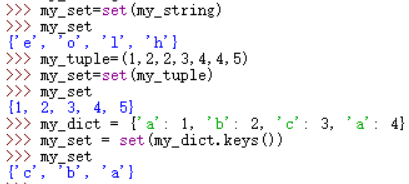

# 142环形链表II（中等）

[142. 环形链表 II ](https://leetcode.cn/problems/linked-list-cycle-ii/description/)

## 题目描述

给定一个链表的头节点  `head` ，返回链表开始入环的第一个节点。 *如果链表无环，则返回 `null`。*

如果链表中有某个节点，可以通过连续跟踪 `next` 指针再次到达，则链表中存在环。 为了表示给定链表中的环，评测系统内部使用整数 `pos` 来表示链表尾连接到链表中的位置（**索引从 0 开始**）。如果 `pos` 是 `-1`，则在该链表中没有环。**注意：`pos` 不作为参数进行传递**，仅仅是为了标识链表的实际情况。

**不允许修改** 链表。

 

**示例 1：**


```
输入：head = [3,2,0,-4], pos = 1
输出：返回索引为 1 的链表节点
解释：链表中有一个环，其尾部连接到第二个节点。
```

**示例 2：**


```
输入：head = [1,2], pos = 0
输出：返回索引为 0 的链表节点
解释：链表中有一个环，其尾部连接到第一个节点。
```

**示例 3：**


```
输入：head = [1], pos = -1
输出：返回 null
解释：链表中没有环。
```

 

**提示：**

- 链表中节点的数目范围在范围 `[0, 104]` 内
- `-105 <= Node.val <= 105`
- `pos` 的值为 `-1` 或者链表中的一个有效索引

 

**进阶：**你是否可以使用 `O(1)` 空间解决此题？

## 我的C++解法

刚开始想法是构建哈希表，逐个存入并访问哈希表中是否有该节点，但是哈希表的find函数传入的参数是key值，而不是需要的val。因此回想起昨天整理的哈希集合，使用哈希集合就可以完成对val的搜索操作

```cpp
/**
 * Definition for singly-linked list.
 * struct ListNode {
 *     int val;
 *     ListNode *next;
 *     ListNode(int x) : val(x), next(NULL) {}
 * };
 */
class Solution {
public:
    ListNode *detectCycle(ListNode *head) {
       //第一眼看这个题目想到的就是借助visited数组来记录节点是否被访问
       //或者存入hash表中，寻找相应元素
        //unordered_map<int,ListNode*> hashmap;
        // hashmap.find(p)!=hashmap.end()这个语句不对，因为哈希表找的是key值而我传入的是val
        unordered_set<ListNode*> hashset;
       ListNode* p= head;
       //int count=0;
       while(p){
        if(hashset.find(p)==hashset.end()){
            //如果找不到该节点
            hashset.insert(p);
            p=p->next;
            //count++;
        }
        else    return p;
       } 
       return NULL;
    }
};
```

结果：


但是这样做开辟了新的空间，空间复杂度o(n)。有没有更好的解法呢？

一个新的思路：把访问过的节点的val重新赋值，设置一个函数专门查找次数。

```cpp
/**
 * Definition for singly-linked list.
 * struct ListNode {
 *     int val;
 *     ListNode *next;
 *     ListNode(int x) : val(x), next(NULL) {}
 * };
 */
class Solution {
public:
    const int MAXINT=65535;
    int getcount(ListNode* head){
        ListNode* p=head;
        int count=0;
        while(p){
            if(p->val==MAXINT){
                return count;
            }
            p->val=MAXINT;
            p=p->next;
            count++;
        }
        return -1;
    }
    ListNode *detectCycle(ListNode *head) {
        //另一种想法就是既然val有范围，那我就让已被访问过的节点的val设置为范围以外的数
        //但是最后如果返回循环节点，那节点的val未知啊，那就在添加一个count
        int count=getcount(head);
        if(count==-1)   return NULL;
        ListNode* result=head;
        for(int i=0;i<count;i++){
            result=result->next;
        }
        return result;
    }
};
```

结果：


这下空间复杂度为o(1)了。

## C++参考答案

### 哈希集合

```cpp
class Solution {
public:
    ListNode *detectCycle(ListNode *head) {
        unordered_set<ListNode *> visited;
        while (head != nullptr) {
            if (visited.count(head)) {
                return head;
            }
            visited.insert(head);
            head = head->next;
        }
        return nullptr;
    }
};
```

这个答案给的方式不是调用find函数，而是使用了`count`函数来判断是否存在该节点。

### 快慢指针

主要问题：判断链表是否有环；如果有环如何找到这个环的入口？

#### 判断是否有环

可以使用快慢指针法，分别定义 fast 和 slow 指针，从头结点出发，fast指针每次移动两个节点，slow指针每次移动一个节点，如果 fast 和 slow指针在途中相遇 ，说明这个链表有环。


#### 如何找到换的入口

从数学角度入手

假设从头结点到环形入口节点 的节点数为x。 环形入口节点到 fast指针与slow指针相遇节点 节点数为y。 从相遇节点 再到环形入口节点节点数为 z。 如图所示：


相遇时：慢指针走过`x+y`个节点（慢指针一定在环内第一圈内和快指针重合，证明略），快指针走过`x+y+n(y+z)`，其中n为快指针在环内走了n圈才遇到慢指针。

因为fast指针是一步走两个节点，slow指针一步走一个节点， 所以 fast指针走过的节点数 = slow指针走过的节点数 * 2：

`(x + y) * 2 = x + y + n (y + z)`

两边消掉一个（x+y）: `x + y = n (y + z)`

因为要找环形的入口，那么要求的是x，因为x表示 头结点到 环形入口节点的的距离。

所以要求x ，将x单独放在左面：`x = n (y + z) - y` ,

再从n(y+z)中提出一个 （y+z）来，整理公式之后为如下公式：`x = (n - 1) (y + z) + z` 注意这里n一定是大于等于1的，因为 fast指针至少要多走一圈才能相遇slow指针。从相遇点到入环点的距离加上 `n−1`圈的环长，恰好等于从链表头部到入环点的距离。在该公式中，`x mod (y+z) = z`.

先拿n为1的情况来举例，意味着fast指针在环形里转了一圈之后，就遇到了 slow指针了。

当 n为1的时候，公式就化解为 `x = z`，

这就意味着，**从头结点出发一个指针，从相遇节点 也出发一个指针，这两个指针每次只走一个节点， 那么当这两个指针相遇的时候就是 环形入口的节点**。

也就是在相遇节点处，定义一个指针index1，在头结点处定一个指针index2。

让index1和index2同时移动，每次移动一个节点， 那么他们相遇的地方就是 环形入口的节点。


```cpp
/**
 * Definition for singly-linked list.
 * struct ListNode {
 *     int val;
 *     ListNode *next;
 *     ListNode(int x) : val(x), next(NULL) {}
 * };
 */
class Solution {
public:
    ListNode *detectCycle(ListNode *head) {
        ListNode* fast = head;
        ListNode* slow = head;
        while(fast != NULL && fast->next != NULL) {
            slow = slow->next;
            fast = fast->next->next;
            // 快慢指针相遇，此时从head 和 相遇点，同时查找直至相遇
            if (slow == fast) {
                ListNode* index1 = fast;
                ListNode* index2 = head;
                while (index1 != index2) {
                    index1 = index1->next;
                    index2 = index2->next;
                }
                return index2; // 返回环的入口
            }
        }
        return NULL;
    }
};
```

```cpp
class Solution {
public:
    ListNode *detectCycle(ListNode *head) {
        ListNode *slow = head, *fast = head;
        while (fast != nullptr) {
            slow = slow->next;
            if (fast->next == nullptr) {
                return nullptr;
            }
            fast = fast->next->next;
            if (fast == slow) {
                ListNode *ptr = head;
                while (ptr != slow) {
                    ptr = ptr->next;
                    slow = slow->next;
                }
                return ptr;
            }
        }
        return nullptr;
    }
};
```

## C++收获

判断元素是否在哈希表内，可以使用find函数，判断返回点是不是末尾点；也可以用count函数，统计元素出现个数，直接`if(hash_set.count(val))`即可，因为如果没有元素返回0，有元素返回个数。

链表成环追击问题着实开阔了眼界，从自然科学入手解决实际问题，美啊，很美啊。

## 我的python解答

第一种：创建哈希集合

```python
# Definition for singly-linked list.
# class ListNode:
#     def __init__(self, x):
#         self.val = x
#         self.next = None

class Solution:
    def detectCycle(self, head: Optional[ListNode]) -> Optional[ListNode]:
        p=head
        hash_set=set()
        while p:
            if p in hash_set:
                return p
            else:
                hash_set.add(p)
                p=p.next
        return None   
```

结果：


使用和C++第二种解法一致的思想：

```python
# Definition for singly-linked list.
# class ListNode:
#     def __init__(self, x):
#         self.val = x
#         self.next = None

class Solution:
    max=65535

    def detectCycle(self, head: Optional[ListNode]) -> Optional[ListNode]:
        count=self.getcount(head)
        if count==-1:   return None
        p=head
        for i in range(count):
            p=p.next
        return p
    @staticmethod
    def getcount(head):
        p=head
        count=0
        while p:
            if p.val != max:
                p.val=max
                p=p.next
                count+=1
            else:   return count
        return -1
```

结果：


## python参考答案

双指针

```python
class Solution(object):
    def detectCycle(self, head):
        fast, slow = head, head
        while True:
            if not (fast and fast.next): return
            fast, slow = fast.next.next, slow.next
            if fast == slow: break
        fast = head
        while fast != slow:
            fast, slow = fast.next, slow.next
        return fast
```


## python收获

### 集合的初始化

特别注意：使用**强制类型转化为set，相同元素会被删除只保留一个**。且集合无序

1.  初始化一个空集合：`my_set=set()`
2. 花括号赋值：`my_set={1,2,3,4}`
3. 也可以从list类型强制转化为set类型：`my_list=[1,2,3,4]``my_set=set(my_list)`
4. 亦可以从其他类型强制转换，每一个字符都是集合的一个元素
5. 使用集合的推导式来初始化`my_set={x**2 for x in range(10)}`

### 查找元素是否存在于集合中

#### 检查元素是否存在

使用in关键字

```python
my_set = {1, 2, 3, 4}

# 检查元素是否存在
if 3 in my_set:
    print("3 is in the set.")
else:
    print("3 is not in the set.")
```

#### 查找并返回元素

由于 `set` 是无序的，并且不保留元素的索引，所以你不能像列表或元组那样通过索引来查找并返回元素。但是，如果你知道元素在集合中，你可以通过遍历集合来找到它：

```python
for item in my_set:
    if item == 3:
        print("Found the element:", item)
        break
else:
    print("Element not found in the set.")
```

### 集合的相关操作

- `add()`：向集合添加一个新元素。
- `remove()` 或 `discard()`：从集合中移除一个元素。`remove()` 在元素不存在时会抛出 `KeyError`，而 `discard()` 不会。
- `union()` 或 `|`：集合的并集。
- `intersection()` 或 `&`：集合的交集。
- `difference()` 或 `-`：集合的差集。
- `symmetric_difference()` 或 `^`：集合的对称差集。

### py中同一个类下的函数如何调用

正确方法：使用`self.function`来调用自身实例中的其他函数。在第二种做法中我在原函数中错误地使用了`count=getcount(head)`这个写法，正确方式应该是`count=self.getcount(head)`，这样才能调用实例自身中的获取序号函数。长知识了。