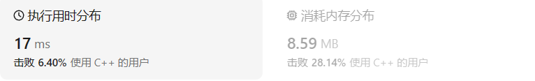
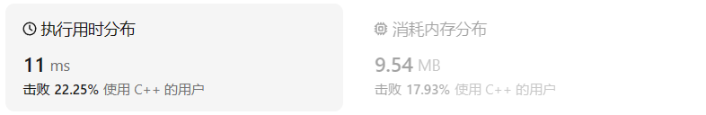
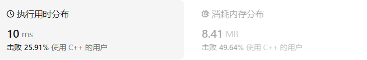
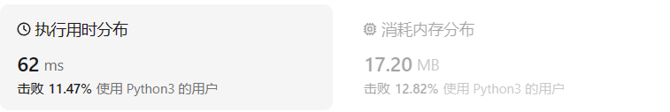
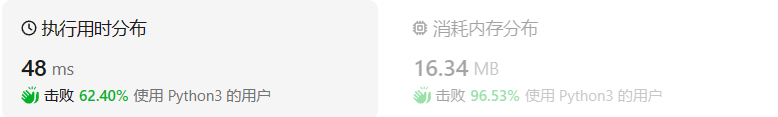

# 242有效的字母异位词

[242. 有效的字母异位词 ](https://leetcode.cn/problems/valid-anagram/description/)

## 题目描述

给定两个字符串 `*s*` 和 `*t*` ，编写一个函数来判断 `*t*` 是否是 `*s*` 的字母异位词。

**注意：**若 `*s*` 和 `*t*` 中每个字符出现的次数都相同，则称 `*s*` 和 `*t*` 互为字母异位词。

 

**示例 1:**

```
输入: s = "anagram", t = "nagaram"
输出: true
```

**示例 2:**

```
输入: s = "rat", t = "car"
输出: false
```

 

**提示:**

- `1 <= s.length, t.length <= 5 * 104`
- `s` 和 `t` 仅包含小写字母

 

**进阶:** 如果输入字符串包含 unicode 字符怎么办？你能否调整你的解法来应对这种情况？

## 我的C++解法

第一种想法就是创建类似py中的字典类型的数据结构，有键值对。创建两个map类型，分别存储对应字符串中字母出现的次数，再对两个map进行比较，得出结果。时间复杂度和空间复杂度都挺高。

```cpp
class Solution {
public:
    bool isAnagram(string s, string t) {
        //就是要分别统计单词中字母和对应出现的次数
        //创建类似py中字典的类型即可
        // hash_map=new map(char ch,int times);
        if(s.size()!=t.size())  return false;
        map<char,int> my_map1;
        map<char,int> my_map2;
        for(int i=0;i<s.size();i++){
            char ch1=s[i];
            char ch2=t[i];
            if(!my_map1.count(ch1)){
                //找不到char1
                my_map1.insert({ch1,1});
            }
            else{
                //能找到
                my_map1.find(ch1)->second+=1;
            }
            if(!my_map2.count(ch2)){
                //找不到char2
                my_map2.insert({ch2,1});
            }
            else{
                //能找到
                my_map2.find(ch2)->second+=1;
            }            
        }

        for (const auto& pair : my_map1) {
            auto it = my_map2.find(pair.first);
            if (it == my_map2.end() || pair.second != it->second) {
                // 如果在map2中没有找到相应的键，或者键对应的值不相等
                return false;
            }
        }

        return true; // 所有键值对都匹配        

    }
};
```

结果：



在此基础上的改进方法就是只创建一个包含26字母的哈希表，遍历s对对应的val进行加操作；遍历t对对应的val进行减操作。如果最后的哈希表的val全都是0表示二者满足题意。

```cpp
class Solution {
public:
    bool isAnagram(string s, string t) {
        if(s.size()!=t.size())  return false;
        map<int,int> my_map;
        for (int i = 0; i < 26; ++i) {
            my_map[i] = 0;
        }        
        for(int i=0;i<s.size();i++){
            my_map[s[i]-'a']+=1;
            my_map[t[i]-'a']-=1;
        }
        for (int i = 0; i < 26; ++i) {
            if(my_map[i] != 0)   return false;
        }
        return true;
    }
};
```

结果：也就时间上少了一点



另一种想法：对每个string类型的数据进行重新排序，如果s==t则返回true

```cpp
#include<algorithm>
class Solution {
public:
    bool isAnagram(string s, string t) {
        if(s.size()!=t.size())  return false;
        //能否让s和t先排列后比较？
        sort(s.begin(),s.end());
        sort(t.begin(),t.end());
        for(int i=0;i<s.size();i++){
            if(s[i]==t[i]){
                continue;
            }
            else    return false;
        }
        return true;
    }
};
```

实际上，最后面的判断可以直接用s==t判断即可

```cpp
// #include<algorithm>
class Solution {
public:
    bool isAnagram(string s, string t) {
        if(s.size()!=t.size())  return false;
        //能否让s和t先排列后比较？
        sort(s.begin(),s.end());
        sort(t.begin(),t.end());
        if(s==t){
            return true;
        }
        return false;
    }
};
```

结果：



另一种想法是调用count函数，统计出现次数

```cpp
class Solution {
public:
    bool isAnagram(string s, string t) {
        if(s.size()!=t.size())  return false;
        //能否直接调用count函数？
        for(int i=0;i<s.size();i++){
            if(count(s.begin(),s.end(),s[i])==count(t.begin(),t.end(),s[i]))    continue;
            else    return false;
        }
        return true;
    }
};
```

但是这个做法遇到超长字符串的时候会超时，因为实在太低效了，还不如直接统计26字母的出现频次。

## C++参考答案

### 哈希表

定一个数组叫做record，大小为26 就可以了，初始化为0，因为字符a到字符z的ASCII也是26个连续的数值。

为了方便举例，判断一下字符串s= "aee", t = "eae"。

操作动画如下：


定义一个数组叫做record用来上记录字符串s里字符出现的次数。

需要把字符映射到数组也就是哈希表的索引下标上，**因为字符a到字符z的ASCII是26个连续的数值，所以字符a映射为下标0，相应的字符z映射为下标25。**

再遍历 字符串s的时候，**只需要将 s[i] - ‘a’ 所在的元素做+1 操作即可，并不需要记住字符a的ASCII，只要求出一个相对数值就可以了。** 这样就将字符串s中字符出现的次数，统计出来了。

那看一下如何检查字符串t中是否出现了这些字符，同样在遍历字符串t的时候，对t中出现的字符映射哈希表索引上的数值再做-1的操作。

那么最后检查一下，**record数组如果有的元素不为零0，说明字符串s和t一定是谁多了字符或者谁少了字符，return false。**

最后如果record数组所有元素都为零0，说明字符串s和t是字母异位词，return true。

时间复杂度为O(n)，空间上因为定义是的一个常量大小的辅助数组，所以空间复杂度为O(1)。

```cpp
class Solution {
public:
    bool isAnagram(string s, string t) {
        int record[26] = {0};
        for (int i = 0; i < s.size(); i++) {
            // 并不需要记住字符a的ASCII，只要求出一个相对数值就可以了
            record[s[i] - 'a']++;
        }
        for (int i = 0; i < t.size(); i++) {
            record[t[i] - 'a']--;
        }
        for (int i = 0; i < 26; i++) {
            if (record[i] != 0) {
                // record数组如果有的元素不为零0，说明字符串s和t 一定是谁多了字符或者谁少了字符。
                return false;
            }
        }
        // record数组所有元素都为零0，说明字符串s和t是字母异位词
        return true;
    }
};
```

官方解法：

```cpp
class Solution {
public:
    bool isAnagram(string s, string t) {
        if (s.length() != t.length()) {
            return false;
        }
        vector<int> table(26, 0);
        for (auto& ch: s) {
            table[ch - 'a']++;
        }
        for (auto& ch: t) {
            table[ch - 'a']--;
            if (table[ch - 'a'] < 0) {
                return false;
            }
        }
        return true;
    }
};
```

### 排序

```cpp
class Solution {
public:
    bool isAnagram(string s, string t) {
        if (s.length() != t.length()) {
            return false;
        }
        sort(s.begin(), s.end());
        sort(t.begin(), t.end());
        return s == t;
    }
};
```

和我的排序做法一致

## C++收获

### 常见的三种哈希结构

当我们想使用哈希法来解决问题的时候，我们一般会选择如下三种数据结构。

- 数组
- set （集合）
- map(映射)

这里数组就没啥可说的了，我们来看一下set。

在C++中，set 和 map 分别提供以下三种数据结构，其底层实现以及优劣如下表所示：

| 集合               | 底层实现 | 是否有序 | 数值是否可以重复 | 能否更改数值 | 查询效率 | 增删效率 |
| ------------------ | -------- | -------- | ---------------- | ------------ | -------- | -------- |
| std::set           | 红黑树   | 有序     | 否               | 否           | O(log n) | O(log n) |
| std::multiset      | 红黑树   | 有序     | 是               | 否           | O(log n) | O(log n) |
| std::unordered_set | 哈希表   | 无序     | 否               | 否           | O(1)     | O(1)     |

std::unordered_set底层实现为哈希表，std::set 和std::multiset 的底层实现是红黑树，红黑树是一种平衡二叉搜索树，所以key值是有序的，但key不可以修改，改动key值会导致整棵树的错乱，所以只能删除和增加。

| 映射               | 底层实现 | 是否有序 | 数值是否可以重复 | 能否更改数值 | 查询效率 | 增删效率 |
| ------------------ | -------- | -------- | ---------------- | ------------ | -------- | -------- |
| std::map           | 红黑树   | key有序  | key不可重复      | key不可修改  | O(log n) | O(log n) |
| std::multimap      | 红黑树   | key有序  | key可重复        | key不可修改  | O(log n) | O(log n) |
| std::unordered_map | 哈希表   | key无序  | key不可重复      | key不可修改  | O(1)     | O(1)     |

std::unordered_map 底层实现为哈希表，std::map 和std::multimap 的底层实现是红黑树。同理，std::map 和std::multimap 的key也是有序的（这个问题也经常作为面试题，考察对语言容器底层的理解）。

当我们要使用集合来解决哈希问题的时候，优先使用unordered_set，因为它的查询和增删效率是最优的，如果需要集合是有序的，那么就用set，如果要求不仅有序还要有重复数据的话，那么就用multiset。

那么再来看一下map ，在map 是一个key value 的数据结构，map中，对key是有限制，对value没有限制的，因为key的存储方式使用红黑树实现的。

其他语言例如：java里的HashMap ，TreeMap 都是一样的原理。可以灵活贯通。

虽然std::set、std::multiset 的底层实现是红黑树，不是哈希表，std::set、std::multiset 使用红黑树来索引和存储，不过给我们的使用方式，还是哈希法的使用方式，即key和value。所以使用这些数据结构来解决映射问题的方法，我们依然称之为哈希法。 map也是一样的道理。

这里在说一下，一些C++的经典书籍上 例如STL源码剖析，说到了hash_set hash_map，这个与unordered_set，unordered_map又有什么关系呢？

实际上功能都是一样一样的， 但是unordered_set在C++11的时候被引入标准库了，而hash_set并没有，所以建议还是使用unordered_set比较好，这就好比一个是官方认证的，hash_set，hash_map 是C++11标准之前民间高手自发造的轮子。

### C++中set类型数据结构

在C++中，`std::set` 是一种关联容器，它存储的元素是唯一的，并按照升序进行排序。`std::set` 通常是基于平衡二叉搜索树（如红黑树）实现的，这使得它能够提供高效的查找、插入和删除操作。

以下是 `std::set` 的一些常用操作：

#### 构造和初始化

```cpp
std::set<int> mySet; // 默认构造一个空的set
std::set<int> mySet = {1, 2, 3}; // 列表初始化
std::set<int> mySet({1, 2, 3}); // 从初始化列表构造
```

#### 元素插入

```cpp
mySet.insert(4); // 插入一个元素
mySet.insert({5, 6}); // 插入多个元素
```

#### 元素查找

```cpp
if (mySet.find(2) != mySet.end()) {
    // 找到元素2
}
```

#### 元素计数

```cpp
int count = mySet.count(2); // 计数元素2的数量，set中每个元素都是唯一的，所以count只会是0或1
```

#### 元素删除

```cpp
mySet.erase(2); // 删除元素2
mySet.erase(mySet.find(3)); // 删除迭代器指向的元素
mySet.erase(mySet.begin(), mySet.end()); // 删除set中的所有元素
```

#### 查看大小

```cpp
size_t size = mySet.size(); // 获取set的大小
```

#### 清空

```cpp
mySet.clear(); // 移除set中的所有元素
```

#### 遍历

```cpp
for (int num : mySet) {
    // 处理num
}
```

或者使用迭代器：

```cpp
for (std::set<int>::iterator it = mySet.begin(); it != mySet.end(); ++it) {
    // 处理*it
}
```

#### 上下界查询

```cpp
std::set<int>::iterator lower = mySet.lower_bound(3); // 查找大于或等于3的最小元素的迭代器
std::set<int>::iterator upper = mySet.upper_bound(3); // 查找大于3的最小元素的迭代器
```

#### 集合操作

```cpp
std::set<int> set1 = {1, 2, 3};
std::set<int> set2 = {3, 4, 5};

set1.insert(set2.begin(), set2.end()); // 将set2的所有元素插入set1

std::set<int> set_union(set1.begin(), set1.end(), set2.begin(), set2.end()); // 并集
std::set<int> set_intersection(set1.begin(), set1.end(), set2.begin(), set2.end()); // 交集
std::set<int> set_difference(set1.begin(), set1.end(), set2.begin(), set2.end()); // 差集
```

#### 注意事项

- `std::set` 中的元素必须是可比较的，即必须能够使用 `<` 运算符进行比较。
- `std::set` 不允许有重复的元素，如果尝试插入一个已经存在的元素，那么这个插入操作将不会执行，并且 `insert` 函数会返回一个指向现有元素的迭代器。
- `std::set` 中的元素按照升序排列，这意味着元素的迭代顺序是有序的。

`std::set` 是C++标准模板库（STL）中非常有用的容器之一，它在需要维护有序且唯一元素集合的场景中非常有用。

### C++中map类型数据

在C++中，`std::map` 是一种关联容器，它存储键值对（key-value pairs），并且按照键的顺序进行排序。`std::map` 通常是基于平衡二叉搜索树（如红黑树）实现的，这使得它能够提供高效的查找、插入和删除操作。

以下是 `std::map` 的一些常用操作：

#### 构造和初始化

```cpp
std::map<int, std::string> myMap; // 默认构造一个空的map
std::map<int, std::string> myMap = {{1, "one"}, {2, "two"}}; // 列表初始化
std::map<int, std::string> myMap {{1, "one"}, {2, "two"}}; // 使用花括号初始化
```

#### 元素插入

```cpp
myMap.insert({3, "three"}); // 插入一个键值对
myMap[4] = "four"; // 通过下标运算符插入或修改键值对
```

#### 元素查找

```cpp
auto it = myMap.find(2);
if (it != myMap.end()) {
    // 找到键2，it->second 是对应的值
}
```

#### 元素访问

```cpp
std::string value = myMap[1]; // 获取键1对应的值，如果键不存在，将插入一个键1的默认值
```

#### 元素计数

```cpp
int count = myMap.count(2); // 计数键2的数量，map中每个键都是唯一的，所以count只会是0或1
```

#### 元素删除

```cpp
myMap.erase(2); // 删除键2
myMap.erase(it); // 删除迭代器指向的元素
myMap.clear(); // 删除map中的所有元素
```

#### 查看大小

```cpp
size_t size = myMap.size(); // 获取map的大小
```

#### 遍历

```cpp
for (const auto& pair : myMap) {
    // pair.first 是键，pair.second 是值
}
```

或者使用迭代器：

```cpp
for (auto it = myMap.begin(); it != myMap.end(); ++it) {
    // it->first 是键，it->second 是值
}
```

#### 上下界查询

```cpp
std::map<int, std::string>::iterator lower = myMap.lower_bound(3); // 查找大于或等于3的最小键的迭代器
std::map<int, std::string>::iterator upper = myMap.upper_bound(3); // 查找大于3的最小键的迭代器
```

#### 注意事项

- `std::map` 中的键必须是可比较的，即必须能够使用 `<` 运算符进行比较。
- `std::map` 不允许有重复的键，如果尝试插入一个已经存在的键，那么这个插入操作将用新的值更新现有键对应的值。
- `std::map` 中的元素按照键的顺序进行排序，这意味着元素的迭代顺序是有序的。

`std::map` 是C++标准模板库（STL）中非常有用的容器之一，它在需要维护有序的键值对集合的场景中非常有用。

### C++中的sort函数

比如，给定字符串`string s='apple'`，对s进行sort操作，使得s变成`aelpp`

正确做法是`sort(s.begin(),s.end())`，而不应该想当然认为是`s=s.sort()`或者`s=s.sort(s.begin(),s.end())`因为会报错，说string类型对象没有对应的sort操作。也不应该和py中的sorted函数搞混淆。

排序的时间复杂度为$o(nlogn)$

### C++中的for循环类py写法

比如要遍历一个字符串类型中的所有字符，在py中是这样：`for ch in s:`在C++中也有类似写法：`for(auto& ch:s)`作用和py的一样，不过需要一个返回类型auto，适配所有循环遍历操作。

## 我的python解答

字符串先排序再比较

```python
class Solution:
    def isAnagram(self, s: str, t: str) -> bool:
        if len(s)!=len(t):  return False
        if(sorted(s)==sorted(t)):   return True
        return False
```

结果：

时空都挺高的

那就试试以空间换时间的哈希表

说实话我并不知道哈希表方式怎么实现。现在我借助4.23的#1002的方式，想要生成哈希表，但是不知道如何同时遍历两个字符串。无奈只能分别遍历了。加注释的地方都是报错了的地方

```python
class Solution:
    def isAnagram(self, s: str, t: str) -> bool:
        if len(s)!=len(t):  return False
        dic1 = {char: 0 for char in string.ascii_lowercase}
        dic2 = {char: 0 for char in string.ascii_lowercase}
        # for ch1,ch2 in s,t:
        #     dic1[ch1]+=1
        #     dic2[ch2]+=1
        # if dic1==dic2   return True
        for ch in s:
            dic1[ch]+=1
        for ch in t:
            dic2[ch]+=1
        for ch in string.ascii_lowercase:
            if dic1[ch]!=dic2[ch]:  return False
        return True
```

结果：



这次的效果竟然意外地好很多

## python参考答案

### 调用counter函数

```python
class Solution: def isAnagram(self, s: str, t: str) -> bool: 
    return collections.Counter(s) == collections.Counter(t)
```

### 普通哈希表

```python
class Solution(object):
    def isAnagram(self, s, t):
        """
        :type s: str
        :type t: str
        :rtype: bool
        """
        if len(s) != len(t):
            return False
        count = {}
        for char in s:
            if char in count:
                count[char] += 1
            else:
                count[char] = 1
        for char in t:
            if char in count:
                count[char] -= 1
            else:
                return False
        for value in count.values():
            if value != 0:
                return False
        return True
```

### 综合

```python
from collections import Counter, defaultdict


# 方法1-利用列表作为哈希表
class Solution1:
    def isAnagram(self, s: str, t: str) -> bool:
        if len(s) != len(t):
            return False

        record = [0] * 26
        for i in s:
            # 并不需要记住字符a的ASCII，只要求出一个相对数值就可以了
            record[ord(i) - ord('a')] += 1
        for j in t:
            record[ord(j) - ord('a')] -= 1

        for item in record:
            if item != 0:
                return False

        return True


# 方法2-利用Counter计数器计数字符
class Solution2:
    def isAnagram(self, s: str, t: str) -> bool:
        counter = Counter()
        for i in s:
            counter[i] += 1
        for j in t:
            counter[j] -= 1
            if counter[j] == 0:
                del counter[j]

        return True if len(counter) == 0 else False


# 方法3-直接初始化计数器
class Solution3:
    def isAnagram(self, s: str, t: str) -> bool:
        if len(s) != len(t):
            return False
        return Counter(s) == Counter(t)


# 方法4-利用defaultdict计数字符
class Solution4:
    def isAnagram(self, s: str, t: str) -> bool:
        char_s = defaultdict(int)
        char_t = defaultdict(int)

        for i in s:
            char_s[i] += 1

        for j in t:
            char_t[j] += 1

        return char_s == char_t

"""
Python collections模块中Counter()和defaultdict()详解：https://blog.csdn.net/weixin_44772440/article/details/122311744?
"""
```


## python收获

Python collections模块中Counter()和defaultdict()详解：https://blog.csdn.net/weixin_44772440/article/details/122311744?

| 容器        | 用途                                                         |
| ----------- | ------------------------------------------------------------ |
| namedtuple  | 创建命名元组子类的工厂函数                                   |
| deque       | 类似列表(list)的容器，实现了在两端快速添加(append)和弹出(pop) |
| OrderDict   | 字典的子类，保存了他们被添加的顺序                           |
| defaultdict | 字典的子类，提供了一个工厂函数，为字典查询提供一个默认值     |
| Counter     | 字典的子类，提供了可哈希对象的计数功能                       |
| ChainMap    | 类似字典(dict)的容器类，将多个映射集合到一个视图里面         |
| UserDict    | 封装了字典对象，简化了字典子类化                             |
| UserList    | 封装了列表对象，简化了列表子类化                             |
| UserString  | 封装了字符串对象，简化了字符串子类化                         |