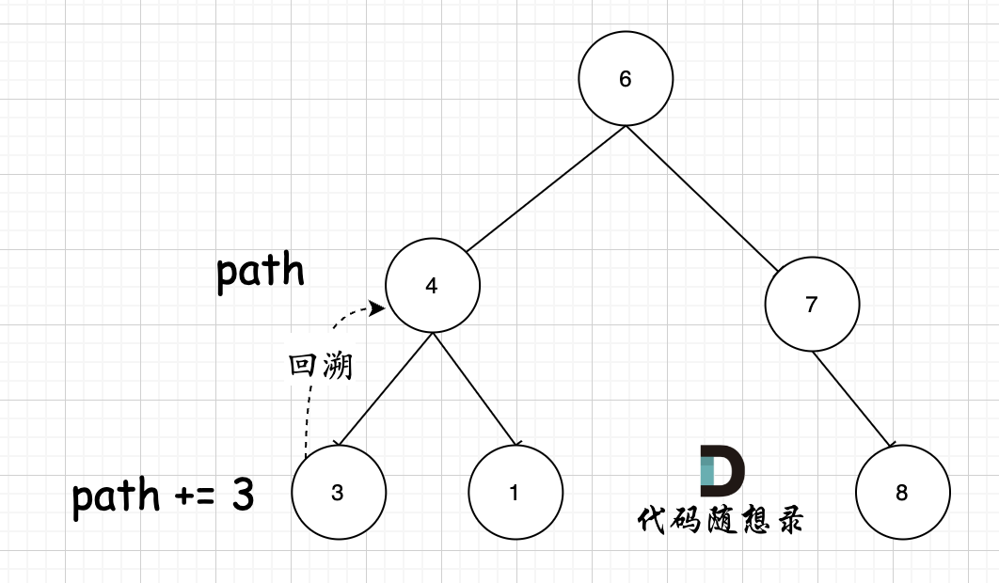

# 257二叉树的所有路径

[257. 二叉树的所有路径 - 力扣（LeetCode）](https://leetcode.cn/problems/binary-tree-paths/description/)

## 题目描述

给你一个二叉树的根节点 `root` ，按 **任意顺序** ，返回所有从根节点到叶子节点的路径。

**叶子节点** 是指没有子节点的节点。

 

**示例 1：**


```
输入：root = [1,2,3,null,5]
输出：["1->2->5","1->3"]
```

**示例 2：**

```
输入：root = [1]
输出：["1"]
```

 

**提示：**

- 树中节点的数目在范围 `[1, 100]` 内
- `-100 <= Node.val <= 100`

## 我的C++解法

深度优先遍历，遍历到叶子节点就返回，在这个过程中每次dfs都要对字符串进行添加项

```cpp
/**
 * Definition for a binary tree node.
 * struct TreeNode {
 *     int val;
 *     TreeNode *left;
 *     TreeNode *right;
 *     TreeNode() : val(0), left(nullptr), right(nullptr) {}
 *     TreeNode(int x) : val(x), left(nullptr), right(nullptr) {}
 *     TreeNode(int x, TreeNode *left, TreeNode *right) : val(x), left(left), right(right) {}
 * };
 */
class Solution {
public:
    // queue<TreeNode*> q;
    vector<string> ans;
    // int length = 0;
    bool isLeaf(TreeNode* node){
        if(!node)   return false;
        else if(node->left==nullptr && node->right==nullptr) return true;
        return false;
    }
    void dfs(TreeNode* node,string& s,int length){
        if(!node)   return;
        int pre_len = length;
        if(isLeaf(node)){
            // q.pop();
            ans.push_back(s);
            s.resize(length);
            return;
        }
        if(node->left){
            length = s.size();
            // q.push(node->left);
            s+="->";
            s+=to_string(node->left->val);
            dfs(node->left,s,length);
        }
        if(node->right){
            length = s.size();
            // q.push(node->right);
            s+="->";
            s+=to_string(node->right->val);
            dfs(node->right,s,length);
        }
        // q.pop();
        s.resize(pre_len);
        return;
    }
    vector<string> binaryTreePaths(TreeNode* root) {
        // dfs深度优先遍历，把其中经过的结点存入队列中
        
        if(!root)   return ans;
        string s = to_string(root->val);
        dfs(root,s,s.size());
        return ans;
    }
};
```

结果：


## C++参考答案

### 递归

1.递归函数参数以及返回值

要传入根节点，记录每一条路径的path，和存放结果集的result，这里递归不需要返回值，代码如下：

```text
void traversal(TreeNode* cur, vector<int>& path, vector<string>& result)
```

2.确定递归终止条件

题要找到叶子节点，就开始结束的处理逻辑了（把路径放进result里）。

```text
if (cur->left == NULL && cur->right == NULL) {
    终止处理逻辑
}
```

为什么没有判断cur是否为空呢，因为下面的逻辑可以控制空节点不入循环。再来看一下终止处理的逻辑。这里使用vector 结构path来记录路径，所以要把vector 结构的path转为string格式，再把这个string 放进 result里。

**那么为什么使用了vector 结构来记录路径呢？** 因为在下面处理单层递归逻辑的时候，要做回溯，使用vector方便来做回溯。

使用vector结构的path容器来记录路径，那么终止处理逻辑如下：

```cpp
if (cur->left == NULL && cur->right == NULL) { // 遇到叶子节点
    string sPath;
    for (int i = 0; i < path.size() - 1; i++) { // 将path里记录的路径转为string格式
        sPath += to_string(path[i]);
        sPath += "->";
    }
    sPath += to_string(path[path.size() - 1]); // 记录最后一个节点（叶子节点）
    result.push_back(sPath); // 收集一个路径
    return;
}
```

3.确定单层递归逻辑

因为是前序遍历，需要先处理中间节点，中间节点就是我们要记录路径上的节点，先放进path中。`path.push_back(cur->val);`然后是递归和回溯的过程，上面说过没有判断cur是否为空，那么在这里递归的时候，如果为空就不进行下一层递归了。

所以递归前要加上判断语句，下面要递归的节点是否为空，如下

```text
if (cur->left) {
    traversal(cur->left, path, result);
}
if (cur->right) {
    traversal(cur->right, path, result);
}
```

此时还没完，递归完，要做回溯啊，因为path 不能一直加入节点，它还要删节点，然后才能加入新的节点。

那么回溯要怎么回溯呢，一些同学会这么写，如下

```cpp
if (cur->left) {
    traversal(cur->left, path, result);
}
if (cur->right) {
    traversal(cur->right, path, result);
}
path.pop_back();
```

这个回溯就有很大的问题，我们知道，**回溯和递归是一一对应的，有一个递归，就要有一个回溯**，这么写的话相当于把递归和回溯拆开了， 一个在花括号里，一个在花括号外。**所以回溯要和递归永远在一起，世界上最遥远的距离是你在花括号里，而我在花括号外！那么代码应该这么写：**

```cpp
if (cur->left) {
    traversal(cur->left, path, result);
    path.pop_back(); // 回溯
}
if (cur->right) {
    traversal(cur->right, path, result);
    path.pop_back(); // 回溯
}
```

那么本题整体代码如下：

```cpp
// 版本一
class Solution {
private:

    void traversal(TreeNode* cur, vector<int>& path, vector<string>& result) {
        path.push_back(cur->val); // 中，中为什么写在这里，因为最后一个节点也要加入到path中 
        // 这才到了叶子节点
        if (cur->left == NULL && cur->right == NULL) {
            string sPath;
            for (int i = 0; i < path.size() - 1; i++) {
                sPath += to_string(path[i]);
                sPath += "->";
            }
            sPath += to_string(path[path.size() - 1]);
            result.push_back(sPath);
            return;
        }
        if (cur->left) { // 左 
            traversal(cur->left, path, result);
            path.pop_back(); // 回溯
        }
        if (cur->right) { // 右
            traversal(cur->right, path, result);
            path.pop_back(); // 回溯
        }
    }

public:
    vector<string> binaryTreePaths(TreeNode* root) {
        vector<string> result;
        vector<int> path;
        if (root == NULL) return result;
        traversal(root, path, result);
        return result;
    }
};
```

如上的C++代码充分体现了回溯。

那么如上代码可以精简成如下代码：

```cpp
class Solution {
private:

    void traversal(TreeNode* cur, string path, vector<string>& result) {
        path += to_string(cur->val); // 中
        if (cur->left == NULL && cur->right == NULL) {
            result.push_back(path);
            return;
        }
        if (cur->left) traversal(cur->left, path + "->", result); // 左
        if (cur->right) traversal(cur->right, path + "->", result); // 右
    }

public:
    vector<string> binaryTreePaths(TreeNode* root) {
        vector<string> result;
        string path;
        if (root == NULL) return result;
        traversal(root, path, result);
        return result;

    }
};
```

如上代码精简了不少，也隐藏了不少东西。注意在函数定义的时候`void traversal(TreeNode* cur, string path, vector<string>& result)` ，定义的是`string path`，每次都是复制赋值，不用使用引用，否则就无法做到回溯的效果。（这里涉及到C++语法知识）

那么在如上代码中，**貌似没有看到回溯的逻辑，其实不然，回溯就隐藏在`traversal(cur->left, path + "->", result);`中的 `path + "->"`。** 每次函数调用完，path依然是没有加上"->" 的，这就是回溯了。

为了把这份精简代码的回溯过程展现出来，大家可以试一试把：

```cpp
if (cur->left) traversal(cur->left, path + "->", result); // 左  回溯就隐藏在这里
```

改成如下代码：

```cpp
path += "->";
traversal(cur->left, path, result); // 左
```

即：

```cpp
if (cur->left) {
    path += "->";
    traversal(cur->left, path, result); // 左
}
if (cur->right) {
    path += "->";
    traversal(cur->right, path, result); // 右
}
```

此时就没有回溯了，这个代码就是通过不了的了。如果想把回溯加上，就要 在上面代码的基础上，加上回溯，就可以AC了。

```cpp
if (cur->left) {
    path += "->";
    traversal(cur->left, path, result); // 左
    path.pop_back(); // 回溯 '>'
    path.pop_back(); // 回溯 '-'
}
if (cur->right) {
    path += "->";
    traversal(cur->right, path, result); // 右
    path.pop_back(); // 回溯 '>' 
    path.pop_back(); //  回溯 '-' 
}
```

整体代码如下

```cpp
//版本二
class Solution {
private:
    void traversal(TreeNode* cur, string path, vector<string>& result) {
        path += to_string(cur->val); // 中，中为什么写在这里，因为最后一个节点也要加入到path中
        if (cur->left == NULL && cur->right == NULL) {
            result.push_back(path);
            return;
        }
        if (cur->left) {
            path += "->";
            traversal(cur->left, path, result); // 左
            path.pop_back(); // 回溯 '>'
            path.pop_back(); // 回溯 '-'
        }
        if (cur->right) {
            path += "->";
            traversal(cur->right, path, result); // 右
            path.pop_back(); // 回溯'>'
            path.pop_back(); // 回溯 '-'
        }
    }

public:
    vector<string> binaryTreePaths(TreeNode* root) {
        vector<string> result;
        string path;
        if (root == NULL) return result;
        traversal(root, path, result);
        return result;

    }
};
```

**大家应该可以感受出来，如果把 `path + "->"`作为函数参数就是可以的，因为并没有改变path的数值，执行完递归函数之后，path依然是之前的数值（相当于回溯了）**

**综合以上，第二种递归的代码虽然精简但把很多重要的点隐藏在了代码细节里，第一种递归写法虽然代码多一些，但是把每一个逻辑处理都完整的展现出来了。**


在第二版本的代码中，其实仅仅是回溯了 `->` 部分（调用两次pop_back，一个pop`>` 一次pop`-`），大家应该疑惑那么 `path += to_string(cur->val);` 这一步为什么没有回溯呢？ 一条路径能持续加节点 不做回溯吗？

其实关键还在于 参数，使用的是 `string path`，这里并没有加上引用`&` ，即本层递归中，path + 该节点数值，但该层递归结束，上一层path的数值并不会受到任何影响。 如图所示：



节点4 的path，在遍历到节点3，path+3，遍历节点3的递归结束之后，返回节点4（回溯的过程），path并不会把3加上。所以这是参数中，不带引用，不做地址拷贝，只做内容拷贝的效果。（这里涉及到C++引用方面的知识）

在第一个版本中，函数参数我就使用了引用，即 `vector<int>& path` ，这是会拷贝地址的，所以 本层递归逻辑如果有`path.push_back(cur->val);` 就一定要有对应的 `path.pop_back()`

那有同学可能想，为什么不去定义一个 `string& path` 这样的函数参数呢，然后也可能在递归函数中展现回溯的过程，但关键在于，`path += to_string(cur->val);` 每次是加上一个数字，这个数字如果是个位数，那好说，就调用一次`path.pop_back()`，但如果是 十位数，百位数，千位数呢？ 百位数就要调用三次`path.pop_back()`，才能实现对应的回溯操作，这样代码实现就太冗余了。

所以，第一个代码版本中，我才使用 vector 类型的path，这样方便给大家演示代码中回溯的操作。 vector类型的path，不管 每次 路径收集的数字是几位数，总之一定是int，所以就一次 pop_back就可以。

### 迭代

这里除了模拟递归需要一个栈，同时还需要一个栈来存放对应的遍历路径。

```cpp
class Solution {
public:
    vector<string> binaryTreePaths(TreeNode* root) {
        stack<TreeNode*> treeSt;// 保存树的遍历节点
        stack<string> pathSt;   // 保存遍历路径的节点
        vector<string> result;  // 保存最终路径集合
        if (root == NULL) return result;
        treeSt.push(root);
        pathSt.push(to_string(root->val));
        while (!treeSt.empty()) {
            TreeNode* node = treeSt.top(); treeSt.pop(); // 取出节点 中
            string path = pathSt.top();pathSt.pop();    // 取出该节点对应的路径
            if (node->left == NULL && node->right == NULL) { // 遇到叶子节点
                result.push_back(path);
            }
            if (node->right) { // 右
                treeSt.push(node->right);
                pathSt.push(path + "->" + to_string(node->right->val));
            }
            if (node->left) { // 左
                treeSt.push(node->left);
                pathSt.push(path + "->" + to_string(node->left->val));
            }
        }
        return result;
    }
};
```

### DFS

```cpp
class Solution {
public:
    void construct_paths(TreeNode* root, string path, vector<string>& paths) {
        if (root != nullptr) {
            path += to_string(root->val);
            if (root->left == nullptr && root->right == nullptr) {  // 当前节点是叶子节点
                paths.push_back(path);                              // 把路径加入到答案中
            } else {
                path += "->";  // 当前节点不是叶子节点，继续递归遍历
                construct_paths(root->left, path, paths);
                construct_paths(root->right, path, paths);
            }
        }
    }

    vector<string> binaryTreePaths(TreeNode* root) {
        vector<string> paths;
        construct_paths(root, "", paths);
        return paths;
    }
};
```

### BFS

我们也可以用广度优先搜索来实现。我们维护一个队列，存储节点以及根到该节点的路径。一开始这个队列里只有根节点。在每一步迭代中，我们取出队列中的首节点，如果它**是叶子节点**，则将它对应的路径加入到答案中。如果它**不是叶子节点**，则将它的所有孩子节点加入到队列的末尾。当队列为空时广度优先搜索结束，我们即能得到答案

```cpp
class Solution {
public:
    vector<string> binaryTreePaths(TreeNode* root) {
        vector<string> paths;
        if (root == nullptr) {
            return paths;
        }
        queue<TreeNode*> node_queue;
        queue<string> path_queue;

        node_queue.push(root);
        path_queue.push(to_string(root->val));

        while (!node_queue.empty()) {
            TreeNode* node = node_queue.front(); 
            string path = path_queue.front();
            node_queue.pop();
            path_queue.pop();

            if (node->left == nullptr && node->right == nullptr) {
                paths.push_back(path);
            } else {
                if (node->left != nullptr) {
                    node_queue.push(node->left);
                    path_queue.push(path + "->" + to_string(node->left->val));
                }

                if (node->right != nullptr) {
                    node_queue.push(node->right);
                    path_queue.push(path + "->" + to_string(node->right->val));
                }
            }
        }
        return paths;
    }
};
```


## C++收获

### C++数字转换字符串

<center>关键词：数字转字符串<center>

<center>关键词：字符串转换<center>

<center>关键词：类型转换：数字到字符串<center>

在C++中，将数字转换为字符串通常可以通过以下几种方法实现：

#### 1. 使用 `std::to_string`（C++11及以上）

这是将整数转换为字符串最简单的方法。

```cpp
#include <string>

int num = 123;
std::string str = std::to_string(num);
```

#### 2. 使用 `std::stringstream`
`std::stringstream` 可以用于流式输入和输出，可以用来转换数字。

```cpp
#include <sstream>

int num = 123;
std::stringstream ss;
ss << num;
std::string str = ss.str();
```

#### 3. 使用 `std::ostringstream`（C++98风格）
`std::ostringstream` 是 `std::stringstream` 的输出版本，专门用于构造字符串。

```cpp
#include <sstream>

int num = 123;
std::ostringstream oss;
oss << num;
std::string str = oss.str();
```

#### 4. 使用 `std::setprecision` 和 `std::fixed`（对于浮点数）
当你需要转换浮点数并指定小数点后的位数时，可以使用 `std::setprecision` 和 `std::fixed`。

```cpp
#include <sstream>
#include <iomanip>

double num = 123.456;
std::stringstream ss;
ss << std::fixed << std::setprecision(2) << num;
std::string str = ss.str();
```

#### 5. 使用 `std::to_string` 转换十六进制或八进制数
对于整数类型，`std::to_string` 可以与格式化标志结合使用，转换为十六进制或八进制表示。

```cpp
#include <string>
#include <iomanip>

int num = 255;
std::string hexStr = std::to_string(num, std::hex);  // 十六进制
std::string octStr = std::to_string(num, std::oct);  // 八进制
```

#### 示例代码
```cpp
#include <iostream>
#include <string>
#include <sstream>

int main() {
    int num = 123;
    std::string str = std::to_string(num);
    std::cout << str << std::endl; // 输出: 123

    double dnum = 123.456;
    std::stringstream ss;
    ss << std::fixed << std::setprecision(2) << dnum;
    std::string dstr = ss.str();
    std::cout << dstr << std::endl; // 输出: 123.46

    return 0;
}
```

选择哪种方法取决于你的具体需求，例如是否需要转换浮点数、是否需要特定的格式等。对于整数，`std::to_string` 是最简单直接的方法；对于浮点数或需要特定格式的整数，使用 `std::stringstream` 或 `std::ostringstream` 更为合适。

### C++中的复制赋值和引用赋值

<center>关键词：赋值区别<center>

在C++中，复制赋值（Copy Assignment）和引用赋值（Reference Assignment）是两种不同的赋值操作，它们在语义和效率上有所区别：

#### 1. 复制赋值（Copy Assignment）
复制赋值操作符是 `=`，它用于将一个对象的值复制给另一个对象。如果对象是自定义类型，需要考虑深拷贝和浅拷贝的问题。

- **自定义类型**：对于自定义类型，复制赋值操作符需要明确定义如何复制对象。通常在类的内部实现复制构造函数和赋值运算符。
- **内置类型**：对于内置类型（如 `int`、`double` 等），复制赋值是直接的值复制。

```cpp
class MyClass {
public:
    int value;
    // 复制赋值操作符
    MyClass& operator=(const MyClass& other) {
        value = other.value;
        return *this;
    }
};

MyClass a;
MyClass b;
a.value = 10;
b = a; // 使用复制赋值操作符，将 a 的值复制给 b
```

#### 2. 引用赋值（Reference Assignment）
引用赋值是将一个变量的引用（或别名）赋给另一个变量。这意味着两个变量将引用同一对象或值。

- **对象引用**：当一个对象被赋值给引用时，引用变量将指向同一个对象。
- **内置类型引用**：对于内置类型，引用赋值操作符 `=` 实际上进行的是值的复制。

```cpp
class MyClass {
public:
    int value;
};

MyClass a;
MyClass b;
a.value = 10;
MyClass& refToA = a; // refToA 是 a 的引用，不是赋值操作
refToA = b; // 现在 refToA 引用 b，但 a 的值不变
```

#### 区别：
- **复制赋值** 创建了原始对象的一个副本，修改副本不会影响原始对象。
- **引用赋值** 不创建副本，而是让两个变量引用同一个对象，对引用对象的修改会影响原始对象。

#### 注意事项：
- 引用赋值通常用于内置类型和对象的引用，而复制赋值用于复制对象。
- 在使用引用时，需要小心循环引用和野引用的问题。
- 对于自定义类型，赋值运算符的实现需要考虑深拷贝和浅拷贝的问题。

正确理解和使用这两种赋值操作对于编写有效的C++程序至关重要。

## 我的python解答

下面的解答中如果dfs只是return则会出错，即回溯失败。

```python
class Solution:
    def binaryTreePaths(self, root: Optional[TreeNode]) -> List[str]:
        ans = []
        if not root:    return ans
        s = str(root.val)
        def isLeaf(node:'TreeNode'):
            if not node:    return False
            if node.left is None and node.right is None:    return True
            return False
        def dfs(node:'TreeNode',s:'str',lenth:'int'):
            if not node:    return
            # pre_len = deepcopy(lenth)
            if isLeaf(node):
                ans.append(s)
                s = s[:lenth] # s=1->2
                lenth-=(len(str(node.val))+2)
                return
            if node.left:
                lenth = len(s)
                s+="->"
                s+=str(node.left.val)
                dfs(node.left,s,lenth)
            if node.right:
                lenth = len(s)
                s+="->"
                s+=str(node.right.val)
                dfs(node.right,s,lenth)
            s = s[:-(len(str(node.val))+2)] # 返回之后得到的s是1->2->5 切片后得到1->2
            return
        dfs(root,s,len(s))
        return ans
```


错误在于 `dfs` 函数中的字符串 `s` 管理方式。在递归调用 `dfs` 时，应该为每个子树创建 `s` 的新副本，而不是修改原有的 `s` 字符串。如果不这样做，由于 `s` 是在函数间共享的，修改 `s` 会影响所有递归层级，导致不正确的结果。

此外，注释中提到的 `pre_len` 和 `lenth` 的操作逻辑也是错误的。`lenth` 变量的使用方式也存在问题，它应该用来记录从根到当前节点的路径长度，而不是通过减去特定数量来恢复原始路径。

以下是修正后的代码：

```python
from typing import Optional, List

class Solution:
    def binaryTreePaths(self, root: Optional[TreeNode]) -> List[str]:
        ans = []

        def dfs(node: Optional[TreeNode], path: List[int], ans: List[str]):
            if not node:
                return
            # 将当前节点的值添加到路径中
            path.append(node.val)
            # 如果是叶子节点，将路径转换为字符串并添加到答案中
            if not node.left and not node.right:
                ans.append('->'.join(map(str, path)))
            # 否则，继续递归左右子树
            dfs(node.left, path, ans)
            dfs(node.right, path, ans)
            # 回溯，移除当前节点，回到上一层
            path.pop()

        dfs(root, [], ans)
        return ans

# 测试代码
root = TreeNode(1)
root.left = TreeNode(2)
root.right = TreeNode(3)
root.left.right = TreeNode(5)

solution = Solution()
print(solution.binaryTreePaths(root))  # 应该输出: ['1->2->5', '1->3']
```

在这个修正版本中：

- 我们定义了一个辅助函数 `dfs`，它接收当前节点、当前路径（以列表形式表示）和答案列表。
- 在 `dfs` 函数中，我们使用列表 `path` 来记录从根到当前节点的路径，而不是使用字符串。
- 当我们到达叶子节点时，将路径列表转换为字符串，并添加到答案列表 `ans` 中。
- 在递归左右子树之前，我们不需要修改 `s` 或 `path`。
- 每次递归返回后，我们通过 `path.pop()` 来进行回溯，移除当前节点，回到上一层路径。

这种方法避免了原始代码中字符串共享导致的问题，并使用了更清晰的列表来管理路径。

如果改成return s，且每个递归均s=dfs()之后，则不会错。这里有些疑问，下午试试debug

```python
# Definition for a binary tree node.
# class TreeNode:
#     def __init__(self, val=0, left=None, right=None):
#         self.val = val
#         self.left = left
#         self.right = right
class Solution:
    def binaryTreePaths(self, root: Optional[TreeNode]) -> List[str]:
        ans = []
        if not root:    return ans
        s = str(root.val)
        def isLeaf(node:'TreeNode'):
            if not node:    return False
            if node.left is None and node.right is None:    return True
            return False
        def dfs(node:'TreeNode',s:'str',lenth:'int'):
            if not node:    return

            if isLeaf(node):
                ans.append(s)
                s = s[:lenth]
                return s
            if node.left:
                lenth = len(s)
                s+="->"
                s+=str(node.left.val)
                s = dfs(node.left,s,lenth)
            # print(s)
            if node.right:
                lenth = len(s)
                s+="->"
                s+=str(node.right.val)
                s = dfs(node.right,s,lenth)
            s = s[:-(len(str(node.val))+2)]
            return s
        dfs(root,s,len(s))
        return ans
```

结果：


## python参考答案

### 递归

```python
# Definition for a binary tree node.
class Solution:
    def traversal(self, cur, path, result):
        path.append(cur.val)  # 中
        if not cur.left and not cur.right:  # 到达叶子节点
            sPath = '->'.join(map(str, path))
            result.append(sPath)
            return
        if cur.left:  # 左
            self.traversal(cur.left, path, result)
            path.pop()  # 回溯
        if cur.right:  # 右
            self.traversal(cur.right, path, result)
            path.pop()  # 回溯

    def binaryTreePaths(self, root):
        result = []
        path = []
        if not root:
            return result
        self.traversal(root, path, result)
        return result
```

```python
from typing import List, Optional

class Solution:
    def binaryTreePaths(self, root: Optional[TreeNode]) -> List[str]:
        if not root:
            return []
        result = []
        self.traversal(root, [], result)
        return result
    
    def traversal(self, cur: TreeNode, path: List[int], result: List[str]) -> None:
        if not cur:
            return
        path.append(cur.val)
        if not cur.left and not cur.right:
            result.append('->'.join(map(str, path)))
        if cur.left:
            self.traversal(cur.left, path[:], result)
        if cur.right:
            self.traversal(cur.right, path[:], result)
```

```python
class Solution:
    def binaryTreePaths(self, root: TreeNode) -> List[str]:
        path = ''
        result = []
        if not root: return result
        self.traversal(root, path, result)
        return result
    
    def traversal(self, cur: TreeNode, path: str, result: List[str]) -> None:
        path += str(cur.val)
        # 若当前节点为leave，直接输出
        if not cur.left and not cur.right:
            result.append(path)

        if cur.left:
            # + '->' 是隐藏回溯
            self.traversal(cur.left, path + '->', result)
        
        if cur.right:
            self.traversal(cur.right, path + '->', result)
```

### 迭代

```python
class Solution:

    def binaryTreePaths(self, root: TreeNode) -> List[str]:
        # 题目中节点数至少为1
        stack, path_st, result = [root], [str(root.val)], []

        while stack:
            cur = stack.pop()
            path = path_st.pop()
            # 如果当前节点为叶子节点，添加路径到结果中
            if not (cur.left or cur.right):
                result.append(path)
            if cur.right:
                stack.append(cur.right)
                path_st.append(path + '->' + str(cur.right.val))
            if cur.left:
                stack.append(cur.left)
                path_st.append(path + '->' + str(cur.left.val))

        return result
```

### DFS

```python
class Solution:
    def binaryTreePaths(self, root):
        """
        :type root: TreeNode
        :rtype: List[str]
        """
        def construct_paths(root, path):
            if root:
                path += str(root.val)
                if not root.left and not root.right:  # 当前节点是叶子节点
                    paths.append(path)  # 把路径加入到答案中
                else:
                    path += '->'  # 当前节点不是叶子节点，继续递归遍历
                    construct_paths(root.left, path)
                    construct_paths(root.right, path)

        paths = []
        construct_paths(root, '')
        return paths
```

### BFS

```python
class Solution:
    def binaryTreePaths(self, root: TreeNode) -> List[str]:
        paths = list()
        if not root:
            return paths

        node_queue = collections.deque([root])
        path_queue = collections.deque([str(root.val)])

        while node_queue:
            node = node_queue.popleft()
            path = path_queue.popleft()

            if not node.left and not node.right:
                paths.append(path)
            else:
                if node.left:
                    node_queue.append(node.left)
                    path_queue.append(path + '->' + str(node.left.val))
                
                if node.right:
                    node_queue.append(node.right)
                    path_queue.append(path + '->' + str(node.right.val))
        return paths
```


## python收获

### py中的复制赋值和引用赋值

<center>关键词：赋值区别<center>

在Python中，赋值操作通常涉及两个概念：复制赋值（Copy Assignment）和引用赋值（Reference Assignment）。然而，Python的动态类型特性和内存管理机制（使用引用计数）使得这两种赋值操作的表现与静态类型语言（如C++）有所不同。

#### 复制赋值（Copy Assignment）
在Python中，复制赋值通常意味着创建一个对象的新的独立副本。当你将一个对象赋值给一个新的变量时，新变量将拥有原始对象的一个副本。

对于不可变类型（如整数、字符串、元组），复制赋值是直接的值复制。

```python
a = 10  # a 是一个整数对象的引用
b = a   # b 复制了 a 的值，现在 b 也有一个整数对象的引用
```

对于可变类型（如列表、字典、集合），复制赋值会创建一个对象的浅拷贝（Shallow Copy），这意味着新对象将包含对原始对象中元素的引用。

```python
list1 = [1, 2, 3]
list2 = list1.copy()  # list2 是 list1 的浅拷贝，包含相同的元素引用
list2.append(4)
print(list1)  # 输出: [1, 2, 3]
print(list2)  # 输出: [1, 2, 3, 4]
```

#### 引用赋值（Reference Assignment）
在Python中，引用赋值意味着两个变量指向内存中的同一个对象。当你将一个变量直接赋值给另一个变量时，两者都引用同一个对象。

```python
a = [1, 2, 3]
b = a  # b 是 a 的引用赋值，两者都指向同一个列表对象
b.append(4)
print(a)  # 输出: [1, 2, 3, 4]
```

#### 深拷贝（Deep Copy）
如果你需要创建一个对象的完全独立的副本，包括所有嵌套对象，你需要使用深拷贝（Deep Copy）。Python的`copy`模块提供了`deepcopy()`函数来实现深拷贝。

```python
import copy

a = [[1, 2], [3, 4]]
b = copy.deepcopy(a)  # b 是 a 的深拷贝
b[0][0] = 99
print(a)  # 输出: [[1, 2], [3, 4]]
print(b)  # 输出: [[99, 2], [3, 4]]
```

#### 注意事项
- 在Python中，赋值操作默认创建对象的引用，而不是对象的副本。
- 对于不可变类型，赋值操作实质上是复制赋值。
- 对于可变类型，默认的赋值操作是引用赋值，除非你使用深拷贝。
- 深拷贝可以避免原始对象和副本对象之间的相互影响。

理解Python中的赋值操作对于编写清晰、可维护的代码非常重要，尤其是在处理可变数据结构时。

### 详细介绍sPath = '->'.join(map(str, path))

<center>关键词：join与map<center>

代码行 `sPath = '->'.join(map(str, path))` 在构建二叉树路径字符串中扮演着重要角色。让我们详细了解这行代码的作用和组成部分：

#### `map(str, path)`
- `map()` 函数在Python中用于将一个函数应用于可迭代对象的每个元素，并收集结果。
- `str` 是将要应用于 `path` 中每个元素的函数，即将每个元素转换为字符串类型。
- `path` 是一个列表，包含了从根节点到当前叶子节点的节点值（整数）。
- `map(str, path)` 将 `str` 函数应用于 `path` 中的每个整数元素，将它们转换为字符串。结果是一个迭代器，其中的元素是 `path` 列表中整数的字符串表示。

#### `->'.join(...)`
- `join()` 是字符串对象的方法，用于将序列中的元素连接（concatenate）成一个单一的字符串。
- `'->'` 是 `join()` 方法中的分隔符，意味着序列中的元素将通过 `'->'` 字符串连接起来。
- `join()` 方法接受一个可迭代对象作为参数，通常是一个列表或元组。

#### 综合 `map` 和 `join`
将 `map(str, path)` 和 `'->'.join(...)` 结合起来：
- 首先，`map(str, path)` 将 `path` 中的每个整数值转换为字符串。
- 然后，`'->'.join(map(str, path))` 将这些字符串元素通过 `'->'` 连接起来，形成一个表示完整路径的单一字符串。

#### 示例
假设 `path` 列表包含以下整数值，表示从根节点到叶子节点的路径：

```python
path = [1, 2, 5]
```

执行 `map(str, path)` 后，我们得到：

```python
['1', '2', '5']
```

然后，执行 `'->'.join(...)` 将这些字符串元素连接起来：

```python
'1->2->5'
```

最终，`sPath` 变量将包含字符串 `'1->2->5'`，这是一个表示从根到叶子节点的路径的字符串。

#### 为什么这样做？
- 这种方法将整数列表转换为一个易于阅读的字符串表示形式，其中每个节点用 `'->'` 分隔，清晰地展示了二叉树中节点的访问顺序。
- 它使得最终的路径结果对于人类阅读者来说是友好的，可以直观地看出路径是如何在树中前进的。

这就是 `sPath = '->'.join(map(str, path))` 这行代码的详细介绍。

### py中的join函数

<center>关键词：join函数<center>

在Python中，`join()` 是字符串对象的一个方法，用于将序列中的元素连接（concatenate）成一个单一的字符串。这个方法通常用于将字符串列表或元组中的元素合并成一个完整的字符串，元素之间可以指定一个分隔符。

#### 基本语法：
```python
str.join(iterable)
```
- `str` 是要连接的元素之间的分隔符字符串。
- `iterable` 是一个可迭代对象，如列表、元组、集合等，其元素将被连接。

#### 参数：
- **iterable**：一个可迭代对象，其元素将按照迭代顺序被 `str` 分隔符连接起来。

#### 返回值：
- 返回一个新的字符串，由 `iterable` 中的元素使用 `str` 作为分隔符连接而成。

#### 示例：

##### 连接字符串列表：
```python
words = ['Hello', 'World', 'Python', 'is', 'awesome']
sentence = ' '.join(words)
print(sentence)  # 输出: "Hello World Python is awesome"
```

在这个例子中，空格 `' '` 用作分隔符，将列表 `words` 中的字符串元素连接成一个完整的句子。

##### 使用特定分隔符：
```python
items = ['apple', 'banana', 'cherry']
result = ', '.join(items)
print(result)  # 输出: "apple, banana, cherry"
```

在这个例子中，逗号加空格 `', '` 作为分隔符，将 `items` 列表中的字符串元素连接成一个以逗号分隔的列表。

##### 连接数字：
```python
numbers = [1, 2, 3, 4, 5]
str_numbers = ''.join(map(str, numbers))
print(str_numbers)  # 输出: "12345"
```

在这个例子中，首先使用 `map()` 函数将每个数字转换为字符串，然后使用空字符串 `''` 作为分隔符将它们连接起来。

#### 注意事项：
- `join()` 方法是字符串对象的方法，所以它不能直接用于非字符串类型的可迭代对象。如果尝试连接非字符串元素，需要先将它们转换为字符串。
- 如果 `iterable` 中包含 `None`，`join()` 会引发 `TypeError`，因为 `None` 类型不能被转换为字符串。如果存在 `None`，需要先将其替换或排除。
- `join()` 是一个非常有用的字符串操作，特别是在处理文本文件、生成报告或将数据格式化为特定格式时。

`join()` 方法提供了一种简洁且高效的方式来合并字符串，是Python文本处理中不可或缺的工具之一。