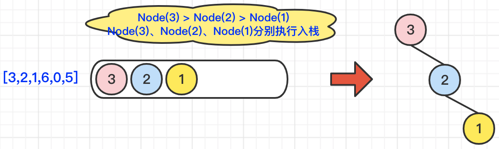
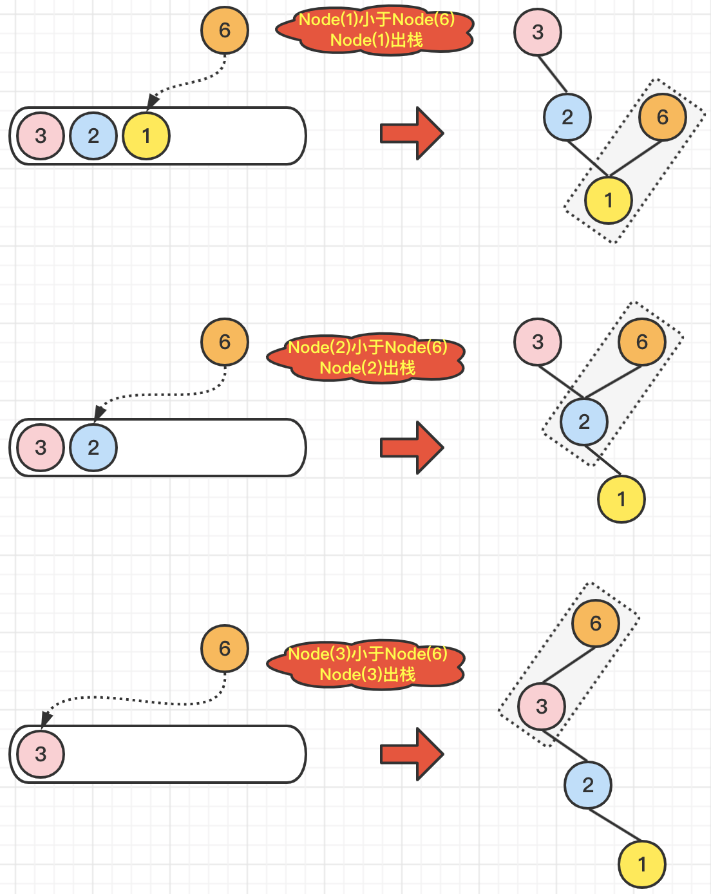
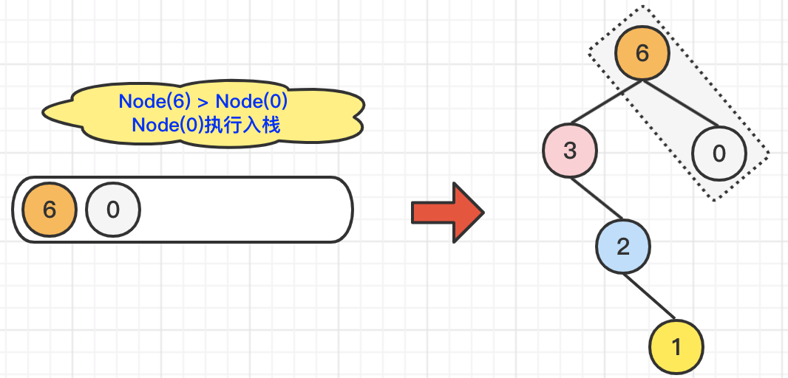
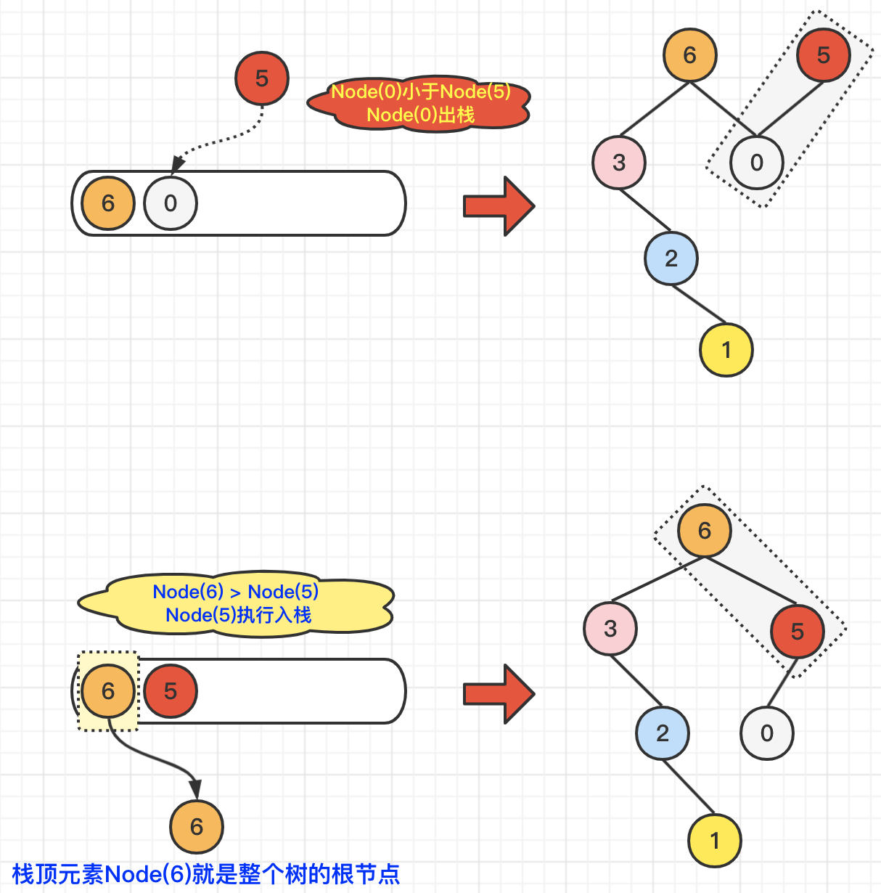

# 654最大二叉树（中等）

[654. 最大二叉树 - 力扣（LeetCode）](https://leetcode.cn/problems/maximum-binary-tree/description/)

## 题目描述

给定一个不重复的整数数组 `nums` 。 **最大二叉树** 可以用下面的算法从 `nums` 递归地构建:

1. 创建一个根节点，其值为 `nums` 中的最大值。
2. 递归地在最大值 **左边** 的 **子数组前缀上** 构建左子树。
3. 递归地在最大值 **右边** 的 **子数组后缀上** 构建右子树。

返回 *`nums` 构建的* ***最大二叉树\*** 。

 

**示例 1：**


```
输入：nums = [3,2,1,6,0,5]
输出：[6,3,5,null,2,0,null,null,1]
解释：递归调用如下所示：
- [3,2,1,6,0,5] 中的最大值是 6 ，左边部分是 [3,2,1] ，右边部分是 [0,5] 。
    - [3,2,1] 中的最大值是 3 ，左边部分是 [] ，右边部分是 [2,1] 。
        - 空数组，无子节点。
        - [2,1] 中的最大值是 2 ，左边部分是 [] ，右边部分是 [1] 。
            - 空数组，无子节点。
            - 只有一个元素，所以子节点是一个值为 1 的节点。
    - [0,5] 中的最大值是 5 ，左边部分是 [0] ，右边部分是 [] 。
        - 只有一个元素，所以子节点是一个值为 0 的节点。
        - 空数组，无子节点。
```

**示例 2：**


```
输入：nums = [3,2,1]
输出：[3,null,2,null,1]
```

 

**提示：**

- `1 <= nums.length <= 1000`
- `0 <= nums[i] <= 1000`
- `nums` 中的所有整数 **互不相同**

## 我的C++解法

和昨天的思路有些相似

```cpp
/**
 * Definition for a binary tree node.
 * struct TreeNode {
 *     int val;
 *     TreeNode *left;
 *     TreeNode *right;
 *     TreeNode() : val(0), left(nullptr), right(nullptr) {}
 *     TreeNode(int x) : val(x), left(nullptr), right(nullptr) {}
 *     TreeNode(int x, TreeNode *left, TreeNode *right) : val(x), left(left), right(right) {}
 * };
 */
class Solution {
public:
    pair<int,int> find_max(vector<int> nums){
        if(nums.size()==0)  return make_pair(-1,-1);
        int max_val = nums[0];
        int pos = 0;
        for(int i = 0; i<nums.size();i++){
            if(nums[i]>max_val){
                max_val = nums[i];
                pos = i;
            }
        }
        return make_pair(pos,max_val);// 先下标后数值
    }
    TreeNode* constructMaximumBinaryTree(vector<int>& nums) {
        if(nums.size()==0)  return nullptr;
        auto tmp = find_max(nums);
        TreeNode* root = new TreeNode(tmp.second);
        // vector<int> left_nums = nums(nums.begin(),nums.begin()+tmp.first);//左闭右开
        vector<int> left_nums(nums.begin(),nums.begin()+tmp.first);
        root->left = constructMaximumBinaryTree(left_nums);
        // vector<int> right_nums = nums(nums.begin()+tmp.first+1,nums.end());
        vector<int> right_nums(nums.begin()+tmp.first+1,nums.end());
        root->right = constructMaximumBinaryTree(right_nums);
        return root;
    }
};
```

结果：


## C++参考答案

### 递归

题目中说了输入的数组大小一定是大于等于1的，所以我们不用考虑小于1的情况，那么当递归遍历的时候，如果传入的数组大小为1，说明遍历到了叶子节点了。

```cpp
class Solution {
public:
    TreeNode* constructMaximumBinaryTree(vector<int>& nums) {
        TreeNode* node = new TreeNode(0);
        if (nums.size() == 1) {
            node->val = nums[0];
            return node;
        }
        // 找到数组中最大的值和对应的下标
        int maxValue = 0;
        int maxValueIndex = 0;
        for (int i = 0; i < nums.size(); i++) {
            if (nums[i] > maxValue) {
                maxValue = nums[i];
                maxValueIndex = i;
            }
        }
        node->val = maxValue;
        // 最大值所在的下标左区间 构造左子树
        if (maxValueIndex > 0) {
            vector<int> newVec(nums.begin(), nums.begin() + maxValueIndex);
            node->left = constructMaximumBinaryTree(newVec);
        }
        // 最大值所在的下标右区间 构造右子树
        if (maxValueIndex < (nums.size() - 1)) {
            vector<int> newVec(nums.begin() + maxValueIndex + 1, nums.end());
            node->right = constructMaximumBinaryTree(newVec);
        }
        return node;
    }
};
```

以上代码比较冗余，效率也不高，每次还要切割的时候每次都要定义新的vector（也就是数组），但逻辑比较清晰。

优化思路：每次分隔不用定义新的数组，而是通过下标索引直接在原数组上操作。

```cpp
class Solution {
private:
    // 在左闭右开区间[left, right)，构造二叉树
    TreeNode* traversal(vector<int>& nums, int left, int right) {
        if (left >= right) return nullptr;

        // 分割点下标：maxValueIndex
        int maxValueIndex = left;
        for (int i = left + 1; i < right; ++i) {
            if (nums[i] > nums[maxValueIndex]) maxValueIndex = i;
        }

        TreeNode* root = new TreeNode(nums[maxValueIndex]);

        // 左闭右开：[left, maxValueIndex)
        root->left = traversal(nums, left, maxValueIndex);

        // 左闭右开：[maxValueIndex + 1, right)
        root->right = traversal(nums, maxValueIndex + 1, right);

        return root;
    }
public:
    TreeNode* constructMaximumBinaryTree(vector<int>& nums) {
        return traversal(nums, 0, nums.size());
    }
};
```

**注意类似用数组构造二叉树的题目，每次分隔尽量不要定义新的数组，而是通过下标索引直接在原数组上操作，这样可以节约时间和空间上的开销。**

结果：


### 单调栈

我们通过递归操作的时候，会发现虽然每次都对数组进行了拆分操作，但是，对数组中的元素也会进行多次的重复遍历，那么有没有一种方式，可以**仅通过对数组nums的一次遍历，就可以得出最终结果的呢？** 其实有的，我们可以通过单调栈的方式进行操作。

采用单调栈的基本思路是这样的：

> 1> 如果栈顶元素大于待插入的元素，那么**直接入栈**。
> 2> 如果栈顶元素小于待插入的元素，那么**栈顶元素出栈**。

当然，在对比两个节点大小和出入栈的同时，依然还是会根据题意，进行二叉树的构造。即：

> 1> 如果栈顶元素大于待插入的元素，则：**栈顶元素.right = 待插入元素**。
> 2> 如果栈顶元素小于待插入的元素，则：**待插入元素.left = 栈顶元素**。

我们依然以`nums = [3,2,1,6,0,5]`为例，看一下通过单调栈是怎么创建二叉树的。首先，对于数组中的前三个元素，满足Node(3) > Node(2) > Node(1)，所以，这三个元素直接入栈，并且构造二叉树`Node(3).right = Node(2)`; `Node(2).right = Node(1)`；具体操作，如下图所示：



当我们遍历到Node(6)的时候，由于Node(1)小于Node(6)，所以Node(1)出栈，并且执行`Node(6).left = Node(1)`; 又由于Node(2) 也小于Node(6)，所以Node(2)也执行出栈操作，并执行并且执行`Node(6).left = Node(2)`;**注意：此时Node(6) 的左子树节点从Node(1)变为了Node(2)**;由于Node(3)也小于Node(6)，Node(3)也执行出栈操作，并执行并且执行`Node(6).left = Node(3)`;**注意：此时Node(6) 的左子树节点从Node(2)变为了Node(3)**;由于栈中元素都出栈了，没有可以跟Node(6)进行对比的元素了，所以，此时Node(6)入栈，本次操作完毕。具体操作，如下图所示：



我们继续遍历到Node(0)，由于Node(0)**小于**栈顶元素Node(6)，所以Node(0)直接入栈就可以了。但是，别忘记维护一下二叉树，也就是说，配置一下`Node(6).right = Node(0)`。具体操作，如下图所示：



最后，我们遍历到了Node(5)，由于Node(5)**大于**当前栈顶元素Node(0)，所以Node(0)执行出栈操作，并维护二叉树结构`Node(5).left = Node(0)`;在对比Node(5)**小于**当前栈顶元素Node(6)，所以，Node(5)直接入栈即可。维护二叉树结构`Node(6).right = Node(5)`。具体操作，如下图所示：




我们可以将题目中构造树的过程等价转换为下面的构造过程：

- 初始时，我们只有一个根节点，其中存储了整个数组；
- 在每一步操作中，我们可以「任选」一个存储了超过一个数的节点，找出其中的最大值并存储在该节点。最大值左侧的数组部分下放到该节点的左子节点，右侧的数组部分下放到该节点的右子节点；
- 如果所有的节点都恰好存储了一个数，那么构造结束。

由于最终构造出的是一棵树，因此无需按照题目的要求「递归」地进行构造，而是每次可以「任选」一个节点进行构造。这里可以类比一棵树的「深度优先搜索」和「广度优先搜索」，二者都可以起到遍历整棵树的效果。

既然可以任意进行选择，那么我们不妨每次选择数组中最大值**最大**的那个节点进行构造。这样一来，我们就可以保证按照数组中元素降序排序的顺序依次构造每个节点。因此：

> 当我们选择的节点中数组的最大值为 nums[i]时，所有大于 nums[i]的元素已经被构造过（即被单独放入某一个节点中），所有小于 nums[i]的元素还没有被构造过。

这就说明：

> 在最终构造出的树上，以 nums[i]为根节点的子树，在原数组中对应的区间，左边界为 **nums[i]左侧第一个比它大的元素所在的位置**，右边界为 **nums[i]右侧第一个比它大的元素所在的位置**。左右边界均为开边界。
>
> 如果某一侧边界不存在，则那一侧边界为数组的边界。如果两侧边界均不存在，说明其为最大值，即根节点。

并且：

> nums[i]的父结点是两个边界中较小的那个元素对应的节点。

因此，我们的任务变为：找出每一个元素左侧和右侧第一个比它大的元素所在的位置。这就是一个经典的单调栈问题了，可以参考 [503. 下一个更大元素 II](https://leetcode.cn/problems/next-greater-element-ii/)。如果左侧的元素较小，那么该元素就是左侧元素的右子节点；如果右侧的元素较小，那么该元素就是右侧元素的左子节点。

```cpp
class Solution {
public:
    TreeNode* constructMaximumBinaryTree(vector<int>& nums) {
        int n = nums.size();
        vector<int> stk;
        vector<int> left(n, -1), right(n, -1);
        vector<TreeNode*> tree(n);
        for (int i = 0; i < n; ++i) {
            tree[i] = new TreeNode(nums[i]);
            while (!stk.empty() && nums[i] > nums[stk.back()]) {
                right[stk.back()] = i;
                stk.pop_back();
            }
            if (!stk.empty()) {
                left[i] = stk.back();
            }
            stk.push_back(i);
        }

        TreeNode* root = nullptr;
        for (int i = 0; i < n; ++i) {
            if (left[i] == -1 && right[i] == -1) {
                root = tree[i];
            }
            else if (right[i] == -1 || (left[i] != -1 && nums[left[i]] < nums[right[i]])) {
                tree[left[i]]->right = tree[i];
            }
            else {
                tree[right[i]]->left = tree[i];
            }
        }
        return root;
    }
};
```

还可以把最后构造树的过程放进单调栈求解的步骤中，省去用来存储左右边界的数组。下面的代码理解起来较为困难，同一个节点的左右子树会被多次赋值，读者可以仔细品味其妙处所在。

```cpp
class Solution {
public:
    TreeNode* constructMaximumBinaryTree(vector<int>& nums) {
        int n = nums.size();
        vector<int> stk;
        vector<TreeNode*> tree(n);
        for (int i = 0; i < n; ++i) {
            tree[i] = new TreeNode(nums[i]);
            while (!stk.empty() && nums[i] > nums[stk.back()]) {
                tree[i]->left = tree[stk.back()];
                stk.pop_back();
            }
            if (!stk.empty()) {
                tree[stk.back()]->right = tree[i];
            }
            stk.push_back(i);
        }
        return tree[stk[0]];
    }
};
```


## C++收获


## 我的python解答

```python
# Definition for a binary tree node.
# class TreeNode:
#     def __init__(self, val=0, left=None, right=None):
#         self.val = val
#         self.left = left
#         self.right = right
class Solution:
    def find_max(self, nums:List[int]):
        max_val = max(nums)
        pos = nums.index(max_val)
        return pos, max_val
    def constructMaximumBinaryTree(self, nums: List[int]) -> Optional[TreeNode]:
        if len(nums)==0:    return None
        position, root_val = self.find_max(nums)
        root = TreeNode(root_val)
        left_nums = nums[:position]
        root.left = self.constructMaximumBinaryTree(left_nums)
        right_nums = nums[position+1:]
        root.right = self.constructMaximumBinaryTree(right_nums)
        return root
```

刚开始错在find_max函数没有添加self关键字

结果：


## python参考答案

### 递归

```python
# Definition for a binary tree node.
# class TreeNode:
#     def __init__(self, val=0, left=None, right=None):
#         self.val = val
#         self.left = left
#         self.right = right
class Solution:
    def constructMaximumBinaryTree(self, nums: List[int]) -> TreeNode:
        if len(nums) == 1:
            return TreeNode(nums[0])
        node = TreeNode(0)
        # 找到数组中最大的值和对应的下标
        maxValue = 0
        maxValueIndex = 0
        for i in range(len(nums)):
            if nums[i] > maxValue:
                maxValue = nums[i]
                maxValueIndex = i
        node.val = maxValue
        # 最大值所在的下标左区间 构造左子树
        if maxValueIndex > 0:
            new_list = nums[:maxValueIndex]
            node.left = self.constructMaximumBinaryTree(new_list)
        # 最大值所在的下标右区间 构造右子树
        if maxValueIndex < len(nums) - 1:
            new_list = nums[maxValueIndex+1:]
            node.right = self.constructMaximumBinaryTree(new_list)
        return node
```

使用下标：

```python
class Solution:
    def traversal(self, nums: List[int], left: int, right: int) -> TreeNode:
        if left >= right:
            return None
        maxValueIndex = left
        for i in range(left + 1, right):
            if nums[i] > nums[maxValueIndex]:
                maxValueIndex = i
        root = TreeNode(nums[maxValueIndex])
        root.left = self.traversal(nums, left, maxValueIndex)
        root.right = self.traversal(nums, maxValueIndex + 1, right)
        return root

    def constructMaximumBinaryTree(self, nums: List[int]) -> TreeNode:
        return self.traversal(nums, 0, len(nums))
```

结果：


切片：

```python
class Solution:
    def constructMaximumBinaryTree(self, nums: List[int]) -> TreeNode:
        if not nums:
            return None
        max_val = max(nums)
        max_index = nums.index(max_val)
        node = TreeNode(max_val)
        node.left = self.constructMaximumBinaryTree(nums[:max_index])
        node.right = self.constructMaximumBinaryTree(nums[max_index+1:])
        return node
```


### 单调栈

```python
class Solution:
    def constructMaximumBinaryTree(self, nums: List[int]) -> Optional[TreeNode]:
        n = len(nums)
        stk = list()
        left, right = [-1] * n, [-1] * n
        tree = [None] * n

        for i in range(n):
            tree[i] = TreeNode(nums[i])
            while stk and nums[i] > nums[stk[-1]]:
                right[stk[-1]] = i
                stk.pop()
            if stk:
                left[i] = stk[-1]
            stk.append(i)
        
        root = None
        for i in range(n):
            if left[i] == right[i] == -1:
                root = tree[i]
            elif right[i] == -1 or (left[i] != -1 and nums[left[i]] < nums[right[i]]):
                tree[left[i]].right = tree[i]
            else:
                tree[right[i]].left = tree[i]
        
        return root
```

```python
class Solution:
    def constructMaximumBinaryTree(self, nums: List[int]) -> Optional[TreeNode]:
        n = len(nums)
        stk = list()
        tree = [None] * n

        for i in range(n):
            tree[i] = TreeNode(nums[i])
            while stk and nums[i] > nums[stk[-1]]:
                tree[i].left = tree[stk[-1]]
                stk.pop()
            if stk:
                tree[stk[-1]].right = tree[i]
            stk.append(i)
        
        return tree[stk[0]]
```


## python收获