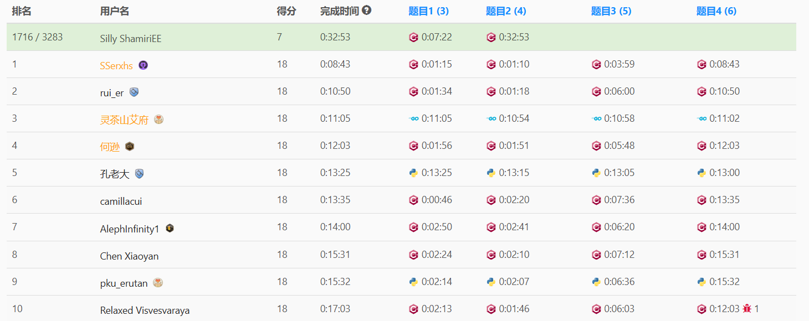
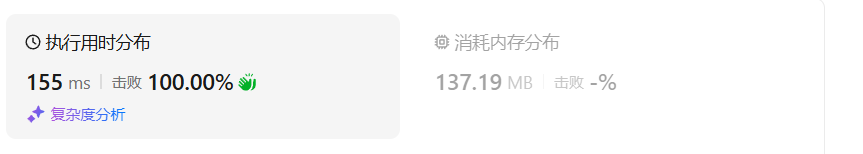
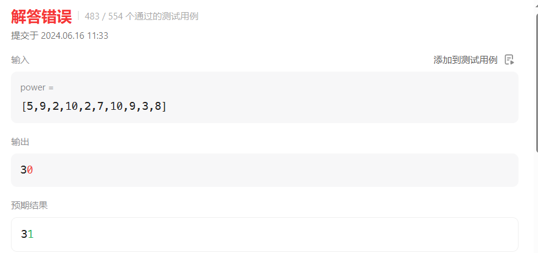
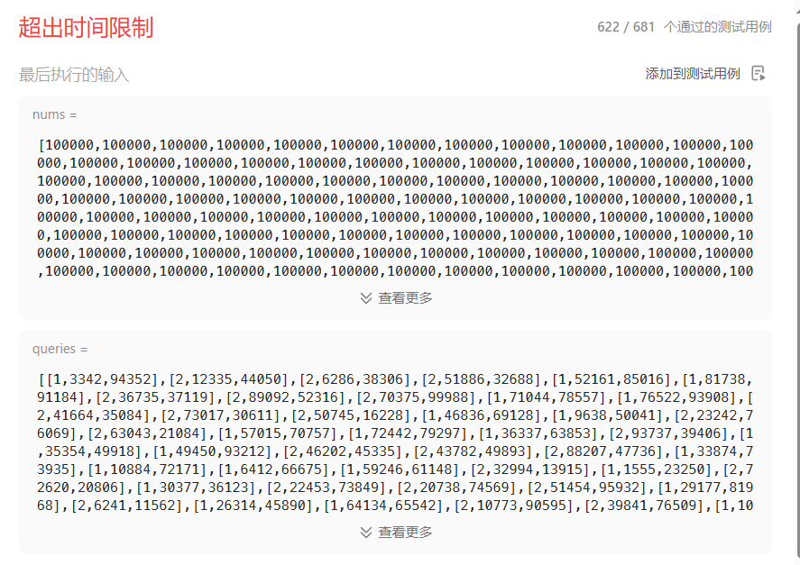

# 第402场周赛

第一次参加，记录一下。排名1716/3283，A出来前两个题



# 100304构成整天的下标对数目I

# 100301构成整天的下标对数目II（中等）

## 题目描述

给你一个整数数组 `hours`，表示以 **小时** 为单位的时间，返回一个整数，表示满足 `i < j` 且 `hours[i] + hours[j]` 构成 **整天** 的下标对 `i`, `j` 的数目。

**整天** 定义为时间持续时间是 24 小时的 **整数倍** 。

例如，1 天是 24 小时，2 天是 48 小时，3 天是 72 小时，以此类推。

 

**示例 1：**

**输入：** hours = [12,12,30,24,24]

**输出：** 2

**解释：**

构成整天的下标对分别是 `(0, 1)` 和 `(3, 4)`。

**示例 2：**

**输入：** hours = [72,48,24,3]

**输出：** 3

**解释：**

构成整天的下标对分别是 `(0, 1)`、`(0, 2)` 和 `(1, 2)`。

 

**提示：**

- `1 <= hours.length <= 5 * 105`
- `1 <= hours[i] <= 109`

## 我的C++解法

### 简单题解法：暴力

```cpp
class Solution {
public:
    int countCompleteDayPairs(vector<int>& hours) {
        //逐个求和再求余
        int ans =0;
        for(int i = 0;i<hours.size()-1;i++){
            for(int j = i+1;j<hours.size();j++){
                if((hours[i]+hours[j])%24==0)   ans++;
            }
        }
        return ans;
    }
};
```

结果：


### 中等题：map哈希表

```cpp
class Solution {
public:
    long long countCompleteDayPairs(vector<int>& hours) {
        //全部求余之后存入哈希表，就可以用哈希表的find操作了
        long long ans = 0;
        for(int i =0;i<hours.size();i++){
            hours[i] = hours[i]%24;
        }
        unordered_map<int,long long> hashmap;
        for(int x:hours){
            hashmap[x]++;
        }
        // auto iter = hashmap.find(0);
        // if(iter!=hashmap.end()){
        //     long long count = iter->second();
        //     count>1? ans+=count*(count-1)/2 : ans+=0;
        // }
        long long count = hashmap[0];
        count>1? ans+=count*(count-1)/2 : ans+=0;
        count = hashmap[12];
        count>1? ans+=count*(count-1)/2 : ans+=0;
        for(int i = 1;i<12;i++){
            ans+=hashmap[i]*hashmap[24-i];
        }
        return ans;
    }
};
```

结果：



考试的时候都是100%击败，没有参考价值。

## C++参考答案

```cpp
class Solution {
public:
    long long countCompleteDayPairs(vector<int> &hours) {
        long long ans = 0;
        int cnt[24]{};
        for (int t : hours) {
            // 先查询 cnt，再更新 cnt，因为题目要求 i<j
            // 如果先更新，再查询，就把 i=j 的情况也考虑进去了
            ans += cnt[(24 - t % 24) % 24];
            cnt[t % 24]++;
        }
        return ans;
    }
};
```

## C++收获

不用map，直接维护一个静态数组即可

# 100316施咒的最大总伤害（中等）

## 题目描述

一个魔法师有许多不同的咒语。

给你一个数组 `power` ，其中每个元素表示一个咒语的伤害值，可能会有多个咒语有相同的伤害值。

已知魔法师使用伤害值为 `power[i]` 的咒语时，他们就 **不能** 使用伤害为 `power[i] - 2` ，`power[i] - 1` ，`power[i] + 1` 或者 `power[i] + 2` 的咒语。

每个咒语最多只能被使用 **一次** 。

请你返回这个魔法师可以达到的伤害值之和的 **最大值** 。

 

**示例 1：**

**输入：**power = [1,1,3,4]

**输出：**6

**解释：**

可以使用咒语 0，1，3，伤害值分别为 1，1，4，总伤害值为 6 。

**示例 2：**

**输入：**power = [7,1,6,6]

**输出：**13

**解释：**

可以使用咒语 1，2，3，伤害值分别为 1，6，6，总伤害值为 13 。

 

**提示：**

- `1 <= power.length <= 105`
- `1 <= power[i] <= 109`

## 我的C++解法

本题是动态规划题，我的水平还没到，只能完成部分实例

```cpp
class Solution {
public:
    long long maximumTotalDamage(vector<int>& power) {
        long long ans = 0;
        map<int,long long,greater<int>> hashmap;// 降序map
        for(int x:power){
            hashmap[x]++;
        }
        for(int i = 0;i<hashmap.size();i++){
            auto tmp_map = hashmap;
            long long cur_ans = 0;
            for(auto pair = next(tmp_map.begin(),i);pair!=tmp_map.end();++pair){
                int cur_val = pair->first;
                long long cur_times = pair->second;
                if(cur_times==0)    continue;
                cur_ans+=cur_val*cur_times;
                if(tmp_map.find(cur_val-1)!=tmp_map.end())  tmp_map[cur_val-1] = 0;
                if(tmp_map.find(cur_val-2)!=tmp_map.end())  tmp_map[cur_val-2] = 0;
            }
            ans = max(ans,cur_ans);
        }
        return ans;
    }
};
```

结果：



# 100317 数组中的峰值（困难）

## 题目描述

数组 `arr` 中 **大于** 前面和后面相邻元素的元素被称为 **峰值** 元素。

给你一个整数数组 `nums` 和一个二维整数数组 `queries` 。

你需要处理以下两种类型的操作：

- `queries[i] = [1, li, ri]` ，求出子数组 `nums[li..ri]` 中 **峰值** 元素的数目。
- `queries[i] = [2, indexi, vali]` ，将 `nums[indexi]` 变为 `vali` 。

请你返回一个数组 `answer` ，它依次包含每一个第一种操作的答案。

**注意：**

- 子数组中 **第一个** 和 **最后一个** 元素都 **不是** 峰值元素。

 

**示例 1：**

**输入：**nums = [3,1,4,2,5], queries = [[2,3,4],[1,0,4]]

**输出：**[0]

**解释：**

第一个操作：我们将 `nums[3]` 变为 4 ，`nums` 变为 `[3,1,4,4,5]` 。

第二个操作：`[3,1,4,4,5]` 中峰值元素的数目为 0 。

**示例 2：**

**输入：**nums = [4,1,4,2,1,5], queries = [[2,2,4],[1,0,2],[1,0,4]]

**输出：**[0,1]

**解释：**

第一个操作：`nums[2]` 变为 4 ，它已经是 4 了，所以保持不变。

第二个操作：`[4,1,4]` 中峰值元素的数目为 0 。

第三个操作：第二个 4 是 `[4,1,4,2,1]` 中的峰值元素。

 

**提示：**

- `3 <= nums.length <= 105`

- `1 <= nums[i] <= 105`

- `1 <= queries.length <= 105`

- `queries[i][0] == 1` 或者 `queries[i][0] == 2`

- 对于所有的

   

  ```
  i
  ```

   ，都有：

  - `queries[i][0] == 1` ：`0 <= queries[i][1] <= queries[i][2] <= nums.length - 1`
  - `queries[i][0] == 2` ：`0 <= queries[i][1] <= nums.length - 1`, `1 <= queries[i][2] <= 105`

## 我的C++解法

本题是树状数组，我还没有学到，只能用基础的解法来尝试

```cpp
class Solution {
public:
    vector<int> countOfPeaks(vector<int>& nums, vector<vector<int>>& queries) {
        vector<int> ans;
        for(int i = 0 ;i<queries.size();i++){
            auto it = queries[i];
            if(it[0]==1){//找峰值的数目
                int count = find_max_nums(nums,it);
                ans.push_back(count);
            }
            if(it[0]==2){//变更数据
                nums[it[1]] = it[2];
            }
        }
        return ans;
    }
    int find_max_nums(vector<int> nums,vector<int> vec){
        vector<int> tmp_nums(nums.begin()+vec[1],nums.begin()+vec[2]+1);
        if(tmp_nums.size()<=2){
            // cout<<"size < 2"<<endl;
            return 0;
        }
        int count;
        for(int i = 1;i<tmp_nums.size()-1;i++){
            if(tmp_nums[i]>tmp_nums[i-1] && tmp_nums[i]>tmp_nums[i+1])  count++;
        }
        return count;
    }
};
```

结果：



超时了。

