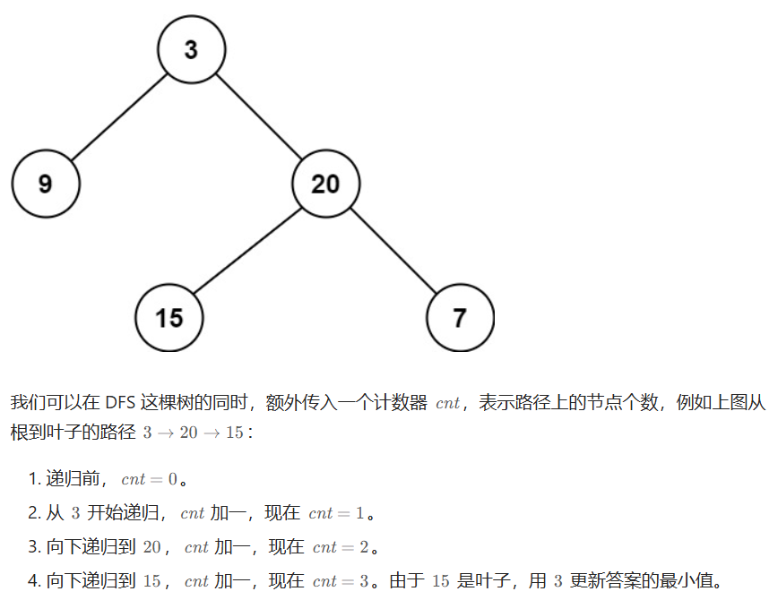
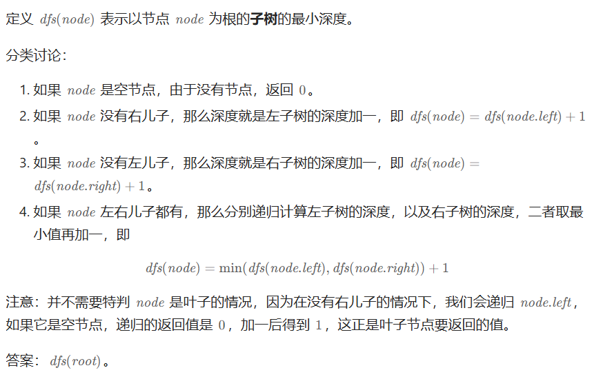

# 515在每个树行中找最大值（中等）

[515. 在每个树行中找最大值 - 力扣（LeetCode）](https://leetcode.cn/problems/find-largest-value-in-each-tree-row/description/)

## 题目描述

给定一棵二叉树的根节点 `root` ，请找出该二叉树中每一层的最大值。

 

**示例1：**


```
输入: root = [1,3,2,5,3,null,9]
输出: [1,3,9]
```

**示例2：**

```
输入: root = [1,2,3]
输出: [1,3]
```

 

**提示：**

- 二叉树的节点个数的范围是 `[0,104]`
- `-231 <= Node.val <= 231 - 1`

## 我的C++解法

用的多数组解法，队列的创建突然忘了

```cpp
/**
 * Definition for a binary tree node.
 * struct TreeNode {
 *     int val;
 *     TreeNode *left;
 *     TreeNode *right;
 *     TreeNode() : val(0), left(nullptr), right(nullptr) {}
 *     TreeNode(int x) : val(x), left(nullptr), right(nullptr) {}
 *     TreeNode(int x, TreeNode *left, TreeNode *right) : val(x), left(left), right(right) {}
 * };
 */
class Solution {
public:
    int find_max(vector<int> vec){
        int max = vec[0];
        for(int x : vec){
            if(x>max)   max = x;
        }
        return max;
    }
    vector<int> largestValues(TreeNode* root) {
        vector<int> result;
        if(!root)   return result;
        vector<TreeNode*> q;
        q.push_back(root);
        while(1){
            vector<TreeNode*> next;
            vector<int> inner;
            for(auto cur:q){
                inner.push_back(cur->val);
                if(cur->left)   next.push_back(cur->left);
                if(cur->right)  next.push_back(cur->right);
            }
            q = move(next);
            result.push_back(find_max(inner));
            if(q.size()==0)   break;
        }
        return result;
    }
};
```

结果：


想了一下，其实不用再额外地弄一个inner数组，再对inner数组找最大，直接在循环的时候就比较大小即可。改进后：

```cpp
class Solution {
public:
    vector<int> largestValues(TreeNode* root) {
        vector<int> result;
        if(!root)   return result;
        vector<TreeNode*> q;
        q.push_back(root);
        while(1){
            vector<TreeNode*> next;
            int max = q[0]->val;
            for(auto cur:q){
                (cur->val)>max ? max = cur->val:max = max;
                if(cur->left)   next.push_back(cur->left);
                if(cur->right)  next.push_back(cur->right);
            }
            q = move(next);
            result.push_back(max);
            if(q.size()==0)   break;
        }
        return result;
    }
};
```

结果：


使用队列：

```cpp
class Solution {
public:
    vector<int> largestValues(TreeNode* root) {
        vector<int> result;
        if(!root)   return result;
        queue<TreeNode*> q;
        q.push(root);
        while(!q.empty()){
            int max = q.front()->val;
            for(int n = q.size();n--;){
                auto cur = q.front();
                q.pop();
                (cur->val)>max? max = cur->val : max = max;
                if(cur->left)   q.push(cur->left);
                if(cur->right)  q.push(cur->right);
            }
            result.push_back(max);
        }
        return result;
    }
};
```

结果：


## C++参考答案

### 深度优先

```cpp
class Solution {
public:
    void dfs(vector<int>& res, TreeNode* root, int curHeight) {
        if (curHeight == res.size()) {
            res.push_back(root->val);
        } else {
            res[curHeight] = max(res[curHeight], root->val);
        }
        if (root->left) {
            dfs(res, root->left, curHeight + 1);
        }
        if (root->right) {
            dfs(res, root->right, curHeight + 1);
        }
    }

    vector<int> largestValues(TreeNode* root) {
        if (!root) {
            return {};
        }
        vector<int> res;
        dfs(res, root, 0);
        return res;
    }
};
```

### 广度优先

```cpp
class Solution {
public:
    vector<int> largestValues(TreeNode* root) {
        if (!root) {
            return {};
        }
        vector<int> res;
        queue<TreeNode*> q;
        q.push(root);
        while (!q.empty()) {
            int len = q.size();
            int maxVal = INT_MIN;
            while (len > 0) {
                len--;
                auto t = q.front();
                q.pop();
                maxVal = max(maxVal, t->val);
                if (t->left) {
                    q.push(t->left);
                }
                if (t->right) {
                    q.push(t->right);
                }
            }
            res.push_back(maxVal);
        }
        return res;
    }
};
```


## 我的python解答

双数组：

```python
# Definition for a binary tree node.
# class TreeNode:
#     def __init__(self, val=0, left=None, right=None):
#         self.val = val
#         self.left = left
#         self.right = right
class Solution:
    def largestValues(self, root: Optional[TreeNode]) -> List[int]:
        if not root:    return []
        result = list()
        # 双数组
        q = [root]
        while(len(q)):
            next = list()
            max = q[0].val
            for cur in q:
                if cur.val>max: max = cur.val
                if cur.left:    next.append(cur.left)
                if cur.right:   next.append(cur.right)
            q = next
            result.append(max)
        return result
```

结果：


单队列：

```python
class Solution:
    def largestValues(self, root: Optional[TreeNode]) -> List[int]:
        if not root:    return []
        result = list()
        # 单队列
        q = deque([root])
        while(q):
            max = q[0].val
            n = len(q)
            for i in range(n):
                cur = q.popleft()
                if cur.val>max: max = cur.val
                if cur.left:    q.append(cur.left)
                if cur.right:   q.append(cur.right)
            
            result.append(max)
        return result
```

结果：


## python参考答案

### 深度优先遍历

```python
class Solution:
    def largestValues(self, root: Optional[TreeNode]) -> List[int]:
        ans = []
        def dfs(node: TreeNode, curHeight: int) -> None:
            if node is None:
                return
            if curHeight == len(ans):
                ans.append(node.val)
            else:
                ans[curHeight] = max(ans[curHeight], node.val)
            dfs(node.left, curHeight + 1)
            dfs(node.right, curHeight + 1)
        dfs(root, 0)
        return ans
```

### 广度优先遍历

```python
class Solution:
    def largestValues(self, root: Optional[TreeNode]) -> List[int]:
        if root is None:
            return []
        ans = []
        q = [root]
        while q:
            maxVal = -inf
            tmp = q
            q = []
            for node in tmp:
                maxVal = max(maxVal, node.val)
                if node.left:
                    q.append(node.left)
                if node.right:
                    q.append(node.right)
            ans.append(maxVal)
        return ans
```


# 116填充每个节点的下一个右侧节点指针（中等）

[116. 填充每个节点的下一个右侧节点指针 - 力扣（LeetCode）](https://leetcode.cn/problems/populating-next-right-pointers-in-each-node/description/)

## 题目描述

给定一个 **完美二叉树** ，其所有叶子节点都在同一层，每个父节点都有两个子节点。二叉树定义如下：

```
struct Node {
  int val;
  Node *left;
  Node *right;
  Node *next;
}
```

填充它的每个 next 指针，让这个指针指向其下一个右侧节点。如果找不到下一个右侧节点，则将 next 指针设置为 `NULL`。

初始状态下，所有 next 指针都被设置为 `NULL`。

 

**示例 1：**


```
输入：root = [1,2,3,4,5,6,7]
输出：[1,#,2,3,#,4,5,6,7,#]
解释：给定二叉树如图 A 所示，你的函数应该填充它的每个 next 指针，以指向其下一个右侧节点，如图 B 所示。序列化的输出按层序遍历排列，同一层节点由 next 指针连接，'#' 标志着每一层的结束。
```


**示例 2:**

```
输入：root = []
输出：[]
```

 

**提示：**

- 树中节点的数量在 `[0, 212 - 1]` 范围内
- `-1000 <= node.val <= 1000`

 

**进阶：**

- 你只能使用常量级额外空间。
- 使用递归解题也符合要求，本题中递归程序占用的栈空间不算做额外的空间复杂度。

## 我的C++解法

### 双数组

```cpp
/*
// Definition for a Node.
class Node {
public:
    int val;
    Node* left;
    Node* right;
    Node* next;

    Node() : val(0), left(NULL), right(NULL), next(NULL) {}

    Node(int _val) : val(_val), left(NULL), right(NULL), next(NULL) {}

    Node(int _val, Node* _left, Node* _right, Node* _next)
        : val(_val), left(_left), right(_right), next(_next) {}
};
*/

class Solution {
public:
    Node* connect(Node* root) {
        //完美二叉树可以依靠层数来实现
        if(!root)   return root;
        //双数组感觉挺合适
        vector<Node*> cur;
        cur.push_back(root);
        while(cur.size()){
            vector<Node*> next;
            for(int i =0;i<cur.size()-1;i++){
                cur[i]->next = cur[i+1];
                if(cur[i]->left)    next.push_back(cur[i]->left);
                if(cur[i]->right)   next.push_back(cur[i]->right);
            }
            // cur[cur.size()-1]->next = NULL;
            // if(cur[cur.size()-1]->left)   next.push_back(cur[cur.size()-1]->left);
            // if(cur[cur.size()-1]->right)  next.push_back(cur[cur.size()-1]->right);
            Node* tmp = cur[cur.size()-1];
            if(tmp->left)   next.push_back(tmp->left);
            if(tmp->right)  next.push_back(tmp->right);
            cur = move(next);
        }
        return root;
    }
};
```

结果：


### 单队列+数学推导

```cpp
class Solution {
public:
    Node* connect(Node* root) {
        if(!root)   return root;
        //单队列
        queue<Node*> cur;
        cur.push(root);
        int index = 1;
        int layer = 0;
        while(!cur.empty()){
            Node* n = cur.front();
            cur.pop();
            if(index == 2*layer+1){
                n->next = NULL;
                layer=index;
            }
            else{
                n->next = cur.front();
            }
            index++;
            if(n->left){
                cur.push(n->left);
                // cout<<n->left->val<<endl;
            }
            if(n->right){
                cur.push(n->right);
                // cout<<n->right->val<<endl;
            }
        }
        return root;
    }
};
```

结果：


## C++参考答案

### 深度优先搜索

DFS 这棵树，从根节点 1 出发，向左递归到 2，再向左递归到 4。这三个节点正好是每一层的第一个节点（类似链表头），用一个数组 pre记录，即 pre[0]为节点1，pre[1]为节点 2，pre[2]为节点 4。pre的下标就是节点的**深度**。

继续递归到 5（深度为 2），从 pre[2]中拿到节点 4，把 4 的 next指向 5。然后更新 pre[2]为节点 5，这样在后面递归到节点 6 时，就可以从 pre[2]中拿到节点 5，把 5 的 next指向 6 了。

**算法**

1. 创建一个空数组 pre（因为一开始不知道二叉树有多深）。
2. DFS 这棵二叉树，递归参数为当前节点 node，以及当前节点的深度 depth。每往下递归一层，就把 depth加一。
3. 如果 depth等于 pre 数组的长度，说明 node是这一层最左边的节点，把 node添加到 pre的末尾。
4. 否则，把 pre[depth]的 next指向 node，然后更新 pre[depth]为 node。
5. 递归边界：如果 node是空节点，直接返回。
6. 递归入口：dfs(root,0)。
7. 最后返回 root。

```cpp
class Solution {
    vector<Node *> pre;
public:
    Node *connect(Node *root) {
        dfs(root, 0); // 根节点的深度为 0
        return root;
    }

    void dfs(Node *node, int depth) {
        if (node == nullptr) {
            return;
        }
        if (depth == pre.size()) { // node 是这一层最左边的节点
            pre.push_back(node);
        } else { // pre[depth] 是 node 左边的节点
            pre[depth]->next = node; // node 左边的节点指向 node
            pre[depth] = node;
        }
        dfs(node->left, depth + 1);
        dfs(node->right, depth + 1);
    }
};
```

结果：


### 广度优先遍历

```cpp
class Solution {
public:
    Node *connect(Node *root) {
        if (root == nullptr) {
            return nullptr;
        }
        vector<Node*> q = {root};
        while (!q.empty()) {
            vector<Node*> nxt;
            for (int i = 0; i < q.size(); i++) {
                Node *node = q[i];
                if (i) { // 连接同一层的两个相邻节点
                    q[i - 1]->next = node;
                }
                if (node->left) {
                    nxt.push_back(node->left);
                }
                if (node->right) {
                    nxt.push_back(node->right);
                }
            }
            q = move(nxt);
        }
        return root;
    }
};
```


## 我的python解答

### 双数组

```python
"""
# Definition for a Node.
class Node:
    def __init__(self, val: int = 0, left: 'Node' = None, right: 'Node' = None, next: 'Node' = None):
        self.val = val
        self.left = left
        self.right = right
        self.next = next
"""

class Solution:
    def connect(self, root: 'Optional[Node]') -> 'Optional[Node]':
        if not root:    return root
        cur = [root]
        while len(cur):
            nex = list()
            for i in range(len(cur)):
                tmp = cur[i]
                if tmp.left:    nex.append(tmp.left)
                if tmp.right:   nex.append(tmp.right)
                if i!=len(cur)-1:   tmp.next = cur[i+1] 
                else: tmp.next=None
            cur = nex
        return root
```

结果：


### 队列

```python
class Solution:
    def connect(self, root: 'Optional[Node]') -> 'Optional[Node]':
        if not root:    return root
        cur = deque([root])
        index = 1
        layer = 0
        while cur:
            top = cur.popleft()
            if index == 2*layer+1:
                top.next = None
                layer = index
            else:
                top.next = cur[0]
            index+=1
            if top.left:    cur.append(top.left)
            if top.right:   cur.append(top.right)
        return root
```

结果：


## python参考答案

### 深度优先遍历

```python
class Solution:
    def connect(self, root: 'Node') -> 'Node':
        pre = []
        def dfs(node: 'Node', depth: int) -> None:
            if node is None:
                return
            if depth == len(pre):  # node 是这一层最左边的节点
                pre.append(node)
            else:  # pre[depth] 是 node 左边的节点
                pre[depth].next = node  # node 左边的节点指向 node
                pre[depth] = node
            dfs(node.left, depth + 1)
            dfs(node.right, depth + 1)
        dfs(root, 0)  # 根节点的深度为 0
        return root
```

结果：


### 广度优先遍历

```python
class Solution:
    def connect(self, root: 'Node') -> 'Node':
        if root is None:
            return None
        q = [root]
        while q:
            # 从左到右依次连接
            for x, y in pairwise(q):
                x.next = y
            # 准备下一层的节点
            tmp = q
            q = []
            for node in tmp:
                if node.left:  q.append(node.left)
                if node.right: q.append(node.right)
        return root
```


# 117填充每个节点的下一个右侧节点指针II（中等）

[117. 填充每个节点的下一个右侧节点指针 II - 力扣（LeetCode）](https://leetcode.cn/problems/populating-next-right-pointers-in-each-node-ii/description/)

## 题目描述

给定一个二叉树：

```
struct Node {
  int val;
  Node *left;
  Node *right;
  Node *next;
}
```

填充它的每个 next 指针，让这个指针指向其下一个右侧节点。如果找不到下一个右侧节点，则将 next 指针设置为 `NULL` 。

初始状态下，所有 next 指针都被设置为 `NULL` 。

 

**示例 1：**


```
输入：root = [1,2,3,4,5,null,7]
输出：[1,#,2,3,#,4,5,7,#]
解释：给定二叉树如图 A 所示，你的函数应该填充它的每个 next 指针，以指向其下一个右侧节点，如图 B 所示。序列化输出按层序遍历顺序（由 next 指针连接），'#' 表示每层的末尾。
```

**示例 2：**

```
输入：root = []
输出：[]
```

 

**提示：**

- 树中的节点数在范围 `[0, 6000]` 内
- `-100 <= Node.val <= 100`

**进阶：**

- 你只能使用常量级额外空间。
- 使用递归解题也符合要求，本题中递归程序的隐式栈空间不计入额外空间复杂度。

## 我的C++解法

直接给我上深度优先遍历，层序遍历直接略过。

```cpp
/*
// Definition for a Node.
class Node {
public:
    int val;
    Node* left;
    Node* right;
    Node* next;

    Node() : val(0), left(NULL), right(NULL), next(NULL) {}

    Node(int _val) : val(_val), left(NULL), right(NULL), next(NULL) {}

    Node(int _val, Node* _left, Node* _right, Node* _next)
        : val(_val), left(_left), right(_right), next(_next) {}
};
*/

class Solution {
vector<Node*> cur;
public:
    void dfs(Node* node,int depth){
        if(!node)   return;
        if(depth == cur.size()){
            cur.push_back(node);// 是最左测首节点
        }
        else{
            cur[depth]->next = node;
            cur[depth] = node;
        }
        if(node->left)  dfs(node->left,depth+1);
        if(node->right) dfs(node->right,depth+1);
    }

    Node* connect(Node* root) {
        //层序遍历略
        // 深度优先遍历
        dfs(root,0);
        return root;
    }
};
```

结果：


不用单独设置最后一个节点的next是null因为原本定义的时候就是null

## C++参考答案

略，和上一题一样

## 我的python解答

不得不说，递归确实好写，空间低

```python
"""
# Definition for a Node.
class Node:
    def __init__(self, val: int = 0, left: 'Node' = None, right: 'Node' = None, next: 'Node' = None):
        self.val = val
        self.left = left
        self.right = right
        self.next = next
"""
class Solution:
    def connect(self, root: 'Node') -> 'Node':
        cur = []
        def dfs(node:'Node',depth:int)->None:
            if not node:    return
            if depth == len(cur):   cur.append(node)
            else:
                cur[depth].next = node
                cur[depth] = node
            if node.left:   dfs(node.left,depth+1)
            if node.right:  dfs(node.right,depth+1)
        dfs(root,0)
        return root
```

结果：


## python参考答案

略，和上一题一样

# 104二叉树的最大深度

[104. 二叉树的最大深度 - 力扣（LeetCode）](https://leetcode.cn/problems/maximum-depth-of-binary-tree/description/)

## 题目描述

给定一个二叉树 `root` ，返回其最大深度。

二叉树的 **最大深度** 是指从根节点到最远叶子节点的最长路径上的节点数。

 

**示例 1：**


 

```
输入：root = [3,9,20,null,null,15,7]
输出：3
```

**示例 2：**

```
输入：root = [1,null,2]
输出：2
```

 

**提示：**

- 树中节点的数量在 `[0, 104]` 区间内。
- `-100 <= Node.val <= 100`

## 我的C++解法

深度优先

```cpp
/**
 * Definition for a binary tree node.
 * struct TreeNode {
 *     int val;
 *     TreeNode *left;
 *     TreeNode *right;
 *     TreeNode() : val(0), left(nullptr), right(nullptr) {}
 *     TreeNode(int x) : val(x), left(nullptr), right(nullptr) {}
 *     TreeNode(int x, TreeNode *left, TreeNode *right) : val(x), left(left), right(right) {}
 * };
 */
class Solution {
int depth = 0;
public:
    //深度优先
    void dfs(TreeNode* node, int d){
        d>depth?depth = d:depth = depth;
        if(!node){
            return;
        }
        if(node->left)  dfs(node->left,d+1);
        if(node->right) dfs(node->right,d+1);
    }
    int maxDepth(TreeNode* root) {
        if(!root)   return depth;
        dfs(root,1);
        return depth;
    }
};
```

结果：


## C++参考答案

### 不用全局

```cpp
class Solution {
public:
    int maxDepth(TreeNode *root) {
        if (root == nullptr) return 0;
        int l_depth = maxDepth(root->left);
        int r_depth = maxDepth(root->right);
        return max(l_depth, r_depth) + 1;
    }
};
```

### 用全局

```cpp
class Solution {
    int ans = 0;

    void dfs(TreeNode *node, int cnt) {
        if (node == nullptr) return;
        ++cnt;
        ans = max(ans, cnt);
        dfs(node->left, cnt);
        dfs(node->right, cnt);
    }

public:
    int maxDepth(TreeNode *root) {
        dfs(root, 0);
        return ans;
    }
};
```


## 我的python解答

深度优先

```python
# Definition for a binary tree node.
# class TreeNode:
#     def __init__(self, val=0, left=None, right=None):
#         self.val = val
#         self.left = left
#         self.right = right
class Solution:
    def maxDepth(self, root: Optional[TreeNode]) -> int:
        depth = 0
        def dfs(node:'TreeNode',d:int)->None:
            depth = max(depth,d)
            if not node:    return
            if node.left:   dfs(node.left,d+1)
            if node.right:  dfs(node.right,d+1)
        dfs(root,1)
        return depth
```

报错了，错在depth在dfs中无法被识别。

在嵌套的 `dfs` 函数中，您尝试将局部变量 `depth` 赋值，但这不会影响外层 `Solution` 类中的 `depth` 变量，因为 `dfs` 函数中的 `depth` 是一个新的局部变量，它遮蔽了外部作用域中的 `depth`。为了修复这个问题，您需要确保 `dfs` 函数中的 `depth` 能够更新外层 `Solution` 类中的 `depth` 变量。

在这个修复的版本中，`depth` 作为 `Solution` 类的一个实例变量来使用。在 `dfs` 函数中，我们使用 `self.depth` 来访问和更新这个实例变量。这样，`dfs` 函数中的递归调用就可以正确地更新 `depth` 变量，最终返回的是正确的最大深度。

修改：

```python
class Solution:
    def maxDepth(self, root: Optional[TreeNode]) -> int:
        self.depth = 0
        if not root:    return 0
        def dfs(node:'TreeNode',d:int)->None:
            self.depth = max(self.depth,d)
            if not node:    return
            if node.left:   dfs(node.left,d+1)
            if node.right:  dfs(node.right,d+1)
        dfs(root,1)
        return self.depth
```

结果：


## python参考答案

### 不用全局变量

```python
class Solution:
    def maxDepth(self, root: Optional[TreeNode]) -> int:
        if root is None: return 0
        l_depth = self.maxDepth(root.left)
        r_depth = self.maxDepth(root.right)
        return max(l_depth, r_depth) + 1
```

### 用全局变量

```python
class Solution:
    def maxDepth(self, root: Optional[TreeNode]) -> int:
        ans = 0
        def dfs(node, cnt):
            if node is None:
                return
            cnt += 1
            nonlocal ans
            ans = max(ans, cnt)
            dfs(node.left, cnt)
            dfs(node.right, cnt)
        dfs(root, 0)
        return ans
```


# 111二叉树的最小深度

[111. 二叉树的最小深度 - 力扣（LeetCode）](https://leetcode.cn/problems/minimum-depth-of-binary-tree/description/)

## 题目描述

给定一个二叉树，找出其最小深度。

最小深度是从根节点到最近叶子节点的最短路径上的节点数量。

**说明：**叶子节点是指没有子节点的节点。

 

**示例 1：**


```
输入：root = [3,9,20,null,null,15,7]
输出：2
```

**示例 2：**

```
输入：root = [2,null,3,null,4,null,5,null,6]
输出：5
```

 

**提示：**

- 树中节点数的范围在 `[0, 105]` 内
- `-1000 <= Node.val <= 1000`

## 我的C++解法

### 不使用全局变量

```cpp
/**
 * Definition for a binary tree node.
 * struct TreeNode {
 *     int val;
 *     TreeNode *left;
 *     TreeNode *right;
 *     TreeNode() : val(0), left(nullptr), right(nullptr) {}
 *     TreeNode(int x) : val(x), left(nullptr), right(nullptr) {}
 *     TreeNode(int x, TreeNode *left, TreeNode *right) : val(x), left(left), right(right) {}
 * };
 */
class Solution {
public:
    int minDepth(TreeNode* root) {
        if(!root)   return 0;
        if(!(root->left))   return 1+minDepth(root->right);
        if(!(root->right))  return 1+minDepth(root->left);
        int left = minDepth(root->left);
        int right = minDepth(root->right);
        return min(left,right)+1;
    }
};
```

结果:


### 层序遍历

```cpp
class Solution {
public:
    bool isLeaf(TreeNode* node){
        if(!(node->left) && !(node->right)) return true;
        return false;
    }
    int minDepth(TreeNode* root) {
        //层序遍历，遇到第一个叶节点直接返回层数
        if(!root)   return 0;
        queue<TreeNode*> q;
        q.push(root);
        int ans = 1;
        while(!q.empty()){
            int n = q.size();
            for(;n>0;n--){
                TreeNode* top = q.front();
                q.pop();
                if(isLeaf(top)) return ans;
                if(top->left)   q.push(top->left);
                if(top->right)  q.push(top->right);}
            ans++;
        }
        return ans;
    }
};
```

结果：


## C++参考答案

### 自顶向下



```cpp
class Solution {
    int ans = INT_MAX;

    void dfs(TreeNode *node, int cnt) {
        if (node == nullptr) {
            return;
        }
        cnt++;
        if (node->left == node->right) { // node 是叶子
            ans = min(ans, cnt);
            return;
        }
        dfs(node->left, cnt);
        dfs(node->right, cnt);
    };

public:
    int minDepth(TreeNode *root) {
        dfs(root, 0);
        return root ? ans : 0;
    }
};
```

优化：

如果递归中发现 cnt≥ans，由于继续向下递归也不会让 ans 变小，直接返回。

```cpp
class Solution {
    int ans = INT_MAX;

    void dfs(TreeNode *node, int cnt) {
        if (node == nullptr || ++cnt >= ans) {
            return;
        }
        if (node->left == node->right) { // node 是叶子
            ans = cnt;
            return;
        }
        dfs(node->left, cnt);
        dfs(node->right, cnt);
    };

public:
    int minDepth(TreeNode *root) {
        dfs(root, 0);
        return root ? ans : 0;
    }
};
```

### 自底向上



```cpp
class Solution {
public:
    int minDepth(TreeNode *root) {
        if (root == nullptr) {
            return 0;
        }
        if (root->right == nullptr) {
            return minDepth(root->left) + 1;
        }
        if (root->left == nullptr) {
            return minDepth(root->right) + 1;
        }
        return min(minDepth(root->left), minDepth(root->right)) + 1;
    }
};
```


## 我的python解答

### 递归

```python
# Definition for a binary tree node.
# class TreeNode:
#     def __init__(self, val=0, left=None, right=None):
#         self.val = val
#         self.left = left
#         self.right = right
class Solution:
    def minDepth(self, root: Optional[TreeNode]) -> int:
        if not root:    return 0
        if not root.left:   return 1+self.minDepth(root.right)
        if not root.right:  return 1+self.minDepth(root.left)
        l = self.minDepth(root.left)
        r = self.minDepth(root.right)
        return min(l,r)+1
```

结果：


### 层序

```python
class Solution:

    def minDepth(self, root: Optional[TreeNode]) -> int:
        if not root:    return 0
        q = [root]
        ans = 1
        def isLeaf(node:'TreeNode'):
            if not (node.left) and not (node.right):    return True
            return False
        while q:
            n = len(q)
            for _ in range(n):
                top = q[0]
                del q[0]
                if isLeaf(top): return ans
                if top.left:    q.append(top.left)
                if top.right:   q.append(top.right)
            ans+=1
        return ans
```

结果：


## python参考答案

### 自顶向下

```python
class Solution:
    def minDepth(self, root: Optional[TreeNode]) -> int:
        ans = inf
        def dfs(node: Optional[TreeNode], cnt: int) -> None:
            if node is None:
                return
            nonlocal ans
            cnt += 1
            if cnt >= ans:
                return  # 最优性剪枝
            if node.left is node.right:  # node 是叶子
                ans = cnt
                return
            dfs(node.left, cnt)
            dfs(node.right, cnt)
        dfs(root, 0)
        return ans if root else 0
```

### 自底向上

```python
class Solution:
    def minDepth(self, root: Optional[TreeNode]) -> int:
        if root is None:
            return 0
        if root.right is None:
            return self.minDepth(root.left) + 1
        if root.left is None:
            return self.minDepth(root.right) + 1
        return min(self.minDepth(root.left), self.minDepth(root.right)) + 1
```


## C++收获

### C++中的队列

<center>关键词：队列<center>

<center>关键词：queue<center>

在C++中，`std::queue` 是标准模板库（STL）中的一个容器适配器，它提供了队列（FIFO - First In, First Out）的功能。队列是一种特殊的线性容器，只允许在一端（队尾）添加元素，而在另一端（队首）移除元素。

以下是 `std::queue` 的一些关键特性和操作：

#### 包含头文件
```cpp
#include <queue>
```

#### 创建队列
```cpp
std::queue<int> q;
```

#### 向队列中添加元素（入队）
使用 `push()` 方法向队列末尾添加元素：
```cpp
q.push(10);
q.push(20);
```

#### 从队列中移除元素（出队）
使用 `pop()` 方法从队列头部移除元素。注意，`pop()` 只会移除元素，不会返回它的值。
```cpp
q.pop();
```

#### 访问队首元素
使用 `front()` 方法访问队首元素，但不移除它：
```cpp
int frontElement = q.front();
```

#### 检查队列是否为空
使用 `empty()` 方法检查队列是否为空：
```cpp
bool isEmpty = q.empty();
```

#### 获取队列的大小
使用 `size()` 方法获取队列中的元素数量：
```cpp
size_t size = q.size();
```

#### 例子
```cpp
#include <iostream>
#include <queue>

int main() {
    std::queue<int> q;

    // 向队列中添加元素
    q.push(10);
    q.push(20);
    q.push(30);

    // 访问并移除队首元素
    while (!q.empty()) {
        std::cout << "Processing: " << q.front() << std::endl;
        q.pop();
    }

    return 0;
}
```

输出将是：
```
Processing: 10
Processing: 20
Processing: 30
```

#### 注意事项
- `std::queue` 是一个容器适配器，它不是基于数组或链表的序列容器，而是一个模板类，提供了队列的操作接口。
- 队列不允许随机访问元素，你不能直接访问队列中的特定位置。
- `std::queue` 不提供 `erase()` 操作，因为队列的后端可能不支持高效删除操作。
- 队列通常用于实现先进先出的数据处理，例如任务调度、广度优先搜索等场景。

`std::queue` 是实现队列操作的有用工具，它提供了一种简单有效的方式来管理需要保持特定顺序的元素集合。

## python收获

### pairwise函数

<center>关键词：pairwise函数<center>

#### [itertools](https://so.csdn.net/so/search?q=itertools&spm=1001.2101.3001.7020).pairwise()

首先，这个函数是Python 3.10 新特性。
它表示的是一个迭代器（有点废话，itertools里面都是各种迭代器），他的含义是，从对象中获取连续的**重叠对**。

比如说：s= ‘abcde’，itertools.pairwise(s)的输出应该为，ab, bc, cd, de;
如果s中的个数小于2，输出为空。

示例程序：

```python
from itertools import pairwise
a = pairwise('12345') 
# 输出的a应为是 12 23 34 45

b = pairwise([1])
# b为空
```

#### 替换itertools.pairwise()函数

如上所述，这个函数在python3.10后才有，之前的版本中并不能使用。
那么如果要在程序中实现这个功能，其实也很简单，一次for循环即可。

```python
s = '12345'
for i in range(1,len(s)):
	k1, k2 = s[i-1], s[i] # k1,k2输出应该为1,2;2,3...
```

与迭代器pairwise相比，这个的麻烦地方在于，不能使用迭代器对`重叠对`进行比较，程序效率较慢一点。

实际上也有一些其他的pairwise函数的实例，比如：[python实现pariwise](http://t.zoukankan.com/kuzaman-p-7202146.html)。该链接中有完整的python程序。

### nonlocal关键字

<center>关键词：nonlocal<center>

在Python中，`nonlocal` 关键字用于在嵌套的函数中修改外层（非全局）作用域中的变量。当在一个函数内部定义了一个变量，该变量与嵌套函数外部的变量同名时，使用 `nonlocal` 可以指明内部函数中的变量应该绑定到外部（非全局）作用域中的变量，而不是在内部函数中创建一个新的局部变量。

#### 使用场景

`nonlocal` 主要用于闭包（closures），即当一个嵌套的函数在其定义中引用了外部函数的变量时。

#### 示例

以下是一个使用 `nonlocal` 的示例：

```python
def outer():
    x = 0  # 这是外部函数的局部变量

    def inner():
        nonlocal x  # 指明 x 绑定到外部函数的局部变量
        x = x + 1  # 修改外部函数中的局部变量
        print("Inner:", x)

    inner()
    print("Outer:", x)

outer()
```

输出将是：
```
Inner: 1
Outer: 1
```

在这个示例中，`inner` 函数中的 `nonlocal x` 语句告诉Python解释器，`x` 应该绑定到 `outer` 函数中的局部变量，而不是在 `inner` 函数中创建一个新的局部变量。

#### 规则和限制

- `nonlocal` 只能用于修改嵌套作用域中的变量，不能用于全局变量。
- 如果在嵌套函数中尝试修改一个没有在外部函数中声明的变量，Python会抛出一个 `UnboundLocalError`。
- `nonlocal` 声明必须在嵌套函数中所有使用该变量之前出现。

#### 与 `global` 的比较

- `global` 关键字用于在函数内部声明一个全局变量，即它属于全局作用域。
- `nonlocal` 关键字用于在**嵌套函数**中声明一个变量，该变量属于最近的非全局（通常是外层函数的局部）作用域。

#### 另一个示例

考虑一个计数器的例子，其中外部函数希望在每次调用嵌套函数时递增计数器：

```python
def create_counter():
    count = 0

    def counter():
        nonlocal count
        count += 1
        return count

    return counter

my_counter = create_counter()
print(my_counter())  # 输出: 1
print(my_counter())  # 输出: 2
```

在这个例子中，每次调用 `my_counter()` 时，它都会递增 `create_counter` 函数中的 `count` 变量。

`nonlocal` 是Python作用域规则的一个重要组成部分，它提供了在嵌套函数中修改外部变量的能力。