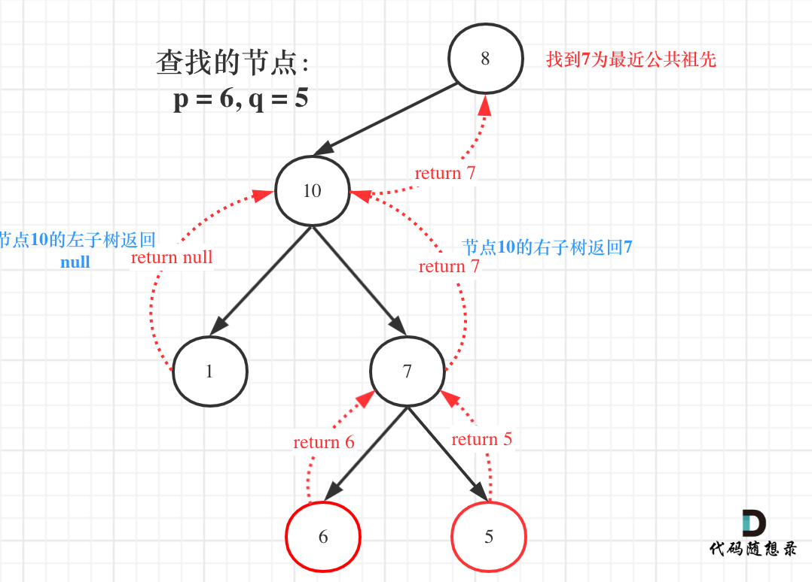

# 236二叉树的最近公共祖先（中等）

[236. 二叉树的最近公共祖先 - 力扣（LeetCode）](https://leetcode.cn/problems/lowest-common-ancestor-of-a-binary-tree/description/)

## 题目描述

给定一个二叉树, 找到该树中两个指定节点的最近公共祖先。

[百度百科](https://baike.baidu.com/item/最近公共祖先/8918834?fr=aladdin)中最近公共祖先的定义为：“对于有根树 T 的两个节点 p、q，最近公共祖先表示为一个节点 x，满足 x 是 p、q 的祖先且 x 的深度尽可能大（**一个节点也可以是它自己的祖先**）。”

 

**示例 1：**


```
输入：root = [3,5,1,6,2,0,8,null,null,7,4], p = 5, q = 1
输出：3
解释：节点 5 和节点 1 的最近公共祖先是节点 3 。
```

**示例 2：**


```
输入：root = [3,5,1,6,2,0,8,null,null,7,4], p = 5, q = 4
输出：5
解释：节点 5 和节点 4 的最近公共祖先是节点 5 。因为根据定义最近公共祖先节点可以为节点本身。
```

**示例 3：**

```
输入：root = [1,2], p = 1, q = 2
输出：1
```

 

**提示：**

- 树中节点数目在范围 `[2, 105]` 内。
- `-109 <= Node.val <= 109`
- 所有 `Node.val` `互不相同` 。
- `p != q`
- `p` 和 `q` 均存在于给定的二叉树中。

## 我的C++解法

先序遍历

```cpp
/**
 * Definition for a binary tree node.
 * struct TreeNode {
 *     int val;
 *     TreeNode *left;
 *     TreeNode *right;
 *     TreeNode(int x) : val(x), left(NULL), right(NULL) {}
 * };
 */
class Solution {
public:
    stack<TreeNode*> s;

    vector<TreeNode*> traverse(TreeNode* node,TreeNode* p,vector<TreeNode*>& trace){
        if(!node)   return trace;
        while(!s.empty() || node!=NULL){
            while(node!=NULL){
                s.push(node);
                trace.emplace_back(node);
                if(node == p)   return trace;
                node = node->left;
            }
            node = s.top();
            s.pop();
            trace.pop_back();
            if(node->right) node = node->right;
            else{
                node = s.top()->right;
            }
        }
        return trace;

    }

    TreeNode* lowestCommonAncestor(TreeNode* root, TreeNode* p, TreeNode* q) {
        // 我的想法是先序遍历，存储路径到数组中，从数组中找最后一个相同的元素。
        while(!s.empty()){
            s.pop();
        }// 清空栈
        vector<TreeNode*> trace;
        TreeNode* ans;
        vector<TreeNode*> a = traverse(root,p,trace);
        TreeNode* node = s.top();
        s.pop();
        trace.pop_back();
        vector<TreeNode*> b = traverse(node,q,trace);
        int min_len = min(a.size(),b.size());
        for(int i = 0;i<min_len;i++){
            if(a[i]==b[i])  ans = a[i];
            else return ans;
        }
        return root;
    }
};
```

陷入了死循环，因为先序遍历没有弄对。


这棵树会陷入死循环，当遍历到节点4的时候。

重新分析一下需求：需要记忆从根节点到所有叶子节点的所有路径。如果在记忆路径过程中，某个节点就是要找的节点，则直接返回从根节点到当前节点的路径，另一个待查找的节点也进行同样操作，最后对比两个路径，找出第一个不同点的前一个节点即可。


不用迭代了，迭代给我弄的脑子一团浆糊，硬控好几个小时。

```cpp
/**
 * Definition for a binary tree node.
 * struct TreeNode {
 *     int val;
 *     TreeNode *left;
 *     TreeNode *right;
 *     TreeNode(int x) : val(x), left(NULL), right(NULL) {}
 * };
 */
class Solution {
public:
    bool traverse(TreeNode* node,TreeNode* p,vector<TreeNode*>& trace){
        if(!node)   return false;
        trace.emplace_back(node);
        if(node == p)   return true;
        
        if(node->left){
            if(traverse(node->left,p,trace))    return true;
            while(trace.back()!=node){
                trace.pop_back();
            }
        }
        
        if(node->right){
            if(traverse(node->right,p,trace))   return true;
        }
        return false;
    }

    TreeNode* lowestCommonAncestor(TreeNode* root, TreeNode* p, TreeNode* q) {
        vector<TreeNode*> trace;
        TreeNode* ans;
        traverse(root,p,trace);
        vector<TreeNode*> a(trace.begin(),trace.end());
        trace.clear();
        traverse(root,q,trace);
        // vector<TreeNode*> b = traverse(node,q,trace);
        int min_len = min(a.size(),trace.size());
        for(int i = 0;i<min_len;i++){
            if(a[i]==trace[i])  ans = a[i];
            else return ans;
        }
        return ans;
    }
};
```

结果：


## C++参考答案

遇到这个题目首先想的是要是能自底向上查找就好了，这样就可以找到公共祖先了。那么二叉树如何可以自底向上查找呢？二叉树回溯的过程就是从低到上。后序遍历（左右中）就是天然的回溯过程，可以根据左右子树的返回值，来处理中节点的逻辑。

接下来就看如何判断一个节点是节点q和节点p的公共祖先呢。**首先最容易想到的一个情况：如果找到一个节点，发现左子树出现结点p，右子树出现节点q，或者 左子树出现结点q，右子树出现节点p，那么该节点就是节点p和q的最近公共祖先。** 即情况一：


判断逻辑是 如果递归遍历遇到q，就将q返回，遇到p 就将p返回，那么如果 左右子树的返回值都不为空，说明此时的中节点，一定是q 和p 的最近祖先。

**但是很多人容易忽略一个情况，就是节点本身p(q)，它拥有一个子孙节点q(p)。** 情况二：


其实情况一 和 情况二 代码实现过程都是一样的，也可以说，实现情况一的逻辑，顺便包含了情况二。因为遇到 q 或者 p 就返回，这样也包含了 q 或者 p 本身就是 公共祖先的情况。

递归三部曲：

- 确定递归函数返回值以及参数
  需要递归函数返回值，来告诉我们是否找到节点q或者p，那么返回值为bool类型就可以了。但我们还要返回最近公共节点，可以利用上题目中返回值是TreeNode * ，那么如果遇到p或者q，就把q或者p返回，返回值不为空，就说明找到了q或者p。`TreeNode* lowestCommonAncestor(TreeNode* root, TreeNode* p, TreeNode* q)`

- 确定终止条件
  遇到空的话，因为树都是空了，所以返回空。
  那么我们来说一说，如果 root == q，或者 root == p，说明找到 q p ，则将其返回，这个返回值，后面在中节点的处理过程中会用到，那么中节点的处理逻辑，下面讲解。`if (root == q || root == p || root == NULL) return root;`
- 确定单层递归逻辑
  值得注意的是 本题函数有返回值，是因为回溯的过程需要递归函数的返回值做判断，但本题我们依然要遍历树的所有节点。
  递归函数有返回值就是要遍历某一条边，但有返回值也要看如何处理返回值！
  如果递归函数有返回值，如何区分要搜索一条边，还是搜索整个树呢？

搜索一条边的写法：

```cpp
if (递归函数(root->left)) return ;

if (递归函数(root->right)) return ;
```

搜索整个树写法：

```cpp
left = 递归函数(root->left);  // 左
right = 递归函数(root->right); // 右
left与right的逻辑处理;         // 中 
```

**在递归函数有返回值的情况下：如果要搜索一条边，递归函数返回值不为空的时候，立刻返回，如果搜索整个树，直接用一个变量left、right接住返回值，这个left、right后序还有逻辑处理的需要，也就是后序遍历中处理中间节点的逻辑（也是回溯）**。

那么为什么要遍历整棵树呢？直观上来看，找到最近公共祖先，直接一路返回就可以了。


就像图中一样直接返回7。但事实上还要遍历根节点右子树（即使此时已经找到了目标节点了），也就是图中的节点4、15、20。因为在如下代码的后序遍历中，如果想利用left和right做逻辑处理， 不能立刻返回，而是要等left与right逻辑处理完之后才能返回。

```cpp
left = 递归函数(root->left);  // 左
right = 递归函数(root->right); // 右
left与right的逻辑处理;         // 中
```

所以此时要知道我们要遍历整棵树。那么先用left和right接住左子树和右子树的返回值，代码如下

```cpp
TreeNode* left = lowestCommonAncestor(root->left, p, q);
TreeNode* right = lowestCommonAncestor(root->right, p, q);
```

**如果left 和 right都不为空，说明此时root就是最近公共节点。这个比较好理解**。**如果left为空，right不为空，就返回right，说明目标节点是通过right返回的，反之依然**。



图中节点10的左子树返回null，右子树返回目标值7，那么此时节点10的处理逻辑就是把右子树的返回值（最近公共祖先7）返回上去！那么如果left和right都为空，则返回left或者right都是可以的，也就是返回空。

```cpp
if (left == NULL && right != NULL) return right;
else if (left != NULL && right == NULL) return left;
else  { //  (left == NULL && right == NULL)
    return NULL;
}
```

完整流程图


```cpp
class Solution {
public:
    TreeNode* lowestCommonAncestor(TreeNode* root, TreeNode* p, TreeNode* q) {
        if (root == q || root == p || root == NULL) return root;
        TreeNode* left = lowestCommonAncestor(root->left, p, q);
        TreeNode* right = lowestCommonAncestor(root->right, p, q);
        if (left != NULL && right != NULL) return root;

        if (left == NULL && right != NULL) return right;
        else if (left != NULL && right == NULL) return left;
        else  { //  (left == NULL && right == NULL)
            return NULL;
        }

    }
};
```

稍加精简，代码如下

```cpp
class Solution {
public:
    TreeNode* lowestCommonAncestor(TreeNode* root, TreeNode* p, TreeNode* q) {
        if (root == q || root == p || root == NULL) return root;
        TreeNode* left = lowestCommonAncestor(root->left, p, q);
        TreeNode* right = lowestCommonAncestor(root->right, p, q);
        if (left != NULL && right != NULL) return root;
        if (left == NULL) return right;
        return left;
    }
```

结果：


```cpp
class Solution {
public:
    TreeNode* ans;
    bool dfs(TreeNode* root, TreeNode* p, TreeNode* q) {
        if (root == nullptr) return false;
        bool lson = dfs(root->left, p, q);
        bool rson = dfs(root->right, p, q);
        if ((lson && rson) || ((root->val == p->val || root->val == q->val) && (lson || rson))) {
            ans = root;
        } 
        return lson || rson || (root->val == p->val || root->val == q->val);
    }
    TreeNode* lowestCommonAncestor(TreeNode* root, TreeNode* p, TreeNode* q) {
        dfs(root, p, q);
        return ans;
    }
};
```

```cpp
class Solution {
public:
    unordered_map<int, TreeNode*> fa;
    unordered_map<int, bool> vis;
    void dfs(TreeNode* root){
        if (root->left != nullptr) {
            fa[root->left->val] = root;
            dfs(root->left);
        }
        if (root->right != nullptr) {
            fa[root->right->val] = root;
            dfs(root->right);
        }
    }
    TreeNode* lowestCommonAncestor(TreeNode* root, TreeNode* p, TreeNode* q) {
        fa[root->val] = nullptr;
        dfs(root);
        while (p != nullptr) {
            vis[p->val] = true;
            p = fa[p->val];
        }
        while (q != nullptr) {
            if (vis[q->val]) return q;
            q = fa[q->val];
        }
        return nullptr;
    }
};
```


## C++收获


## 我的python解答

递归

```python
# Definition for a binary tree node.
# class TreeNode:
#     def __init__(self, x):
#         self.val = x
#         self.left = None
#         self.right = None

class Solution:
    def lowestCommonAncestor(self, root: 'TreeNode', p: 'TreeNode', q: 'TreeNode') -> 'TreeNode':
        trace_a = list()
        def traverse(node:TreeNode,p:TreeNode,trace:list):
            if not node:    return False
            trace.append(node)
            if node == p:   return True
            if node.left:
                if(traverse(node.left,p,trace)):
                    return True
                while trace[-1]!=node:
                    trace.pop()
            if node.right:
                if(traverse(node.right,p,trace)):
                    return True
            return False
        traverse(root,p,trace_a)
        trace_b = list()
        traverse(root,q,trace_b)
        ans = root
        min_len = min(len(trace_a),len(trace_b))
        for i in range(min_len):
            if trace_a[i]==trace_b[i]:    ans = trace_a[i]
            else:   return ans
        return ans
```

结果：


## python参考答案

```python
class Solution:
    def lowestCommonAncestor(self, root, p, q):
        if root == q or root == p or root is None:
            return root

        left = self.lowestCommonAncestor(root.left, p, q)
        right = self.lowestCommonAncestor(root.right, p, q)

        if left is not None and right is not None:
            return root

        if left is None and right is not None:
            return right
        elif left is not None and right is None:
            return left
        else: 
            return None
```

```python
class Solution:
    def lowestCommonAncestor(self, root, p, q):
        if root == q or root == p or root is None:
            return root

        left = self.lowestCommonAncestor(root.left, p, q)
        right = self.lowestCommonAncestor(root.right, p, q)

        if left is not None and right is not None:
            return root

        if left is None:
            return right
        return left
```


## python收获