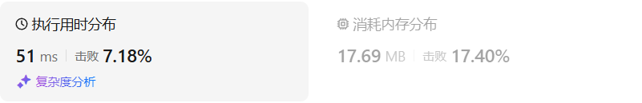

# 108将有序数组转换为二叉搜索树

[108. 将有序数组转换为二叉搜索树 - 力扣（LeetCode）](https://leetcode.cn/problems/convert-sorted-array-to-binary-search-tree/description/)

## 题目描述

给你一个整数数组 `nums` ，其中元素已经按 **升序** 排列，请你将其转换为一棵 

平衡

 二叉搜索树。


 

**示例 1：**


```
输入：nums = [-10,-3,0,5,9]
输出：[0,-3,9,-10,null,5]
解释：[0,-10,5,null,-3,null,9] 也将被视为正确答案：
```

**示例 2：**


```
输入：nums = [1,3]
输出：[3,1]
解释：[1,null,3] 和 [3,1] 都是高度平衡二叉搜索树。
```

 

**提示：**

- `1 <= nums.length <= 104`
- `-104 <= nums[i] <= 104`
- `nums` 按 **严格递增** 顺序排列

## 我的C++解法

把数组的中间元素当作是根节点，然后递归地构建左右子树，这样可以保证构建出来的是二叉平衡搜索树。

```cpp
/**
 * Definition for a binary tree node.
 * struct TreeNode {
 *     int val;
 *     TreeNode *left;
 *     TreeNode *right;
 *     TreeNode() : val(0), left(nullptr), right(nullptr) {}
 *     TreeNode(int x) : val(x), left(nullptr), right(nullptr) {}
 *     TreeNode(int x, TreeNode *left, TreeNode *right) : val(x), left(left), right(right) {}
 * };
 */
class Solution {
public:
    TreeNode* sortedArrayToBST(vector<int>& nums) {
        // 二叉搜索树好弄，但是要求平衡 这让我想起来之前的一道题是构建一颗平衡二叉树
        // 中间元素为根，递归构造平衡二叉树
        if(nums.size()==0)  return nullptr;
        if(nums.size()==1)  return new TreeNode(nums[0]);
        int mid_index = nums.size()/2;
        TreeNode* node = new TreeNode(nums[mid_index]);
        vector<int> left(nums.begin(),nums.begin()+mid_index);// 左闭右开
        node->left = sortedArrayToBST(left);
        vector<int> right(nums.begin()+mid_index+1,nums.end());// 感觉这里可能会越界错误
        node->right = sortedArrayToBST(right);
        return node;
    }
};
```

结果：


这个结果疑似有点太差了

## C++参考答案

### 递归

```cpp
class Solution {
private:
    TreeNode* traversal(vector<int>& nums, int left, int right) {
        if (left > right) return nullptr;
        int mid = left + ((right - left) / 2);
        TreeNode* root = new TreeNode(nums[mid]);
        root->left = traversal(nums, left, mid - 1);
        root->right = traversal(nums, mid + 1, right);
        return root;
    }
public:
    TreeNode* sortedArrayToBST(vector<int>& nums) {
        TreeNode* root = traversal(nums, 0, nums.size() - 1);
        return root;
    }
};
```

### 迭代

迭代法可以通过三个队列来模拟，一个队列放遍历的节点，一个队列放左区间下标，一个队列放右区间下标。模拟的就是不断分割的过程

```cpp
class Solution {
public:
    TreeNode* sortedArrayToBST(vector<int>& nums) {
        if (nums.size() == 0) return nullptr;

        TreeNode* root = new TreeNode(0);   // 初始根节点
        queue<TreeNode*> nodeQue;           // 放遍历的节点
        queue<int> leftQue;                 // 保存左区间下标
        queue<int> rightQue;                // 保存右区间下标
        nodeQue.push(root);                 // 根节点入队列
        leftQue.push(0);                    // 0为左区间下标初始位置
        rightQue.push(nums.size() - 1);     // nums.size() - 1为右区间下标初始位置

        while (!nodeQue.empty()) {
            TreeNode* curNode = nodeQue.front();
            nodeQue.pop();
            int left = leftQue.front(); leftQue.pop();
            int right = rightQue.front(); rightQue.pop();
            int mid = left + ((right - left) / 2);

            curNode->val = nums[mid];       // 将mid对应的元素给中间节点

            if (left <= mid - 1) {          // 处理左区间
                curNode->left = new TreeNode(0);
                nodeQue.push(curNode->left);
                leftQue.push(left);
                rightQue.push(mid - 1);
            }

            if (right >= mid + 1) {         // 处理右区间
                curNode->right = new TreeNode(0);
                nodeQue.push(curNode->right);
                leftQue.push(mid + 1);
                rightQue.push(right);
            }
        }
        return root;
    }
};
```

## C++收获


## 我的python解答

解法也是递归构造平衡二叉树

```python
# Definition for a binary tree node.
# class TreeNode:
#     def __init__(self, val=0, left=None, right=None):
#         self.val = val
#         self.left = left
#         self.right = right
class Solution:
    def sortedArrayToBST(self, nums: List[int]) -> Optional[TreeNode]:
        if len(nums)==0:  return None
        if len(nums)==1:  return TreeNode(nums[0])
        mid = len(nums) // 2
        node = TreeNode(nums[mid])
        node.left = self.sortedArrayToBST(nums[:mid])
        node.right = self.sortedArrayToBST(nums[mid+1:])
        return node
```

结果：



好怪啊，怎么结果还是这么差？大伙有更巧妙的方法吗？？？

## python参考答案

### 递归

```python
class Solution:
    def traversal(self, nums: List[int], left: int, right: int) -> TreeNode:
        if left > right:
            return None
        
        mid = left + (right - left) // 2
        root = TreeNode(nums[mid])
        root.left = self.traversal(nums, left, mid - 1)
        root.right = self.traversal(nums, mid + 1, right)
        return root
    
    def sortedArrayToBST(self, nums: List[int]) -> TreeNode:
        root = self.traversal(nums, 0, len(nums) - 1)
        return root
```

```python
class Solution:
    def sortedArrayToBST(self, nums: List[int]) -> Optional[TreeNode]:
        if not nums:
            return
        mid = len(nums) // 2
        root = TreeNode(nums[mid])
        root.left = self.sortedArrayToBST(nums[:mid])
        root.right = self.sortedArrayToBST(nums[mid + 1 :])
        return root
```

### 迭代

```python
from collections import deque

class Solution:
    def sortedArrayToBST(self, nums: List[int]) -> TreeNode:
        if len(nums) == 0:
            return None
        
        root = TreeNode(0)  # 初始根节点
        nodeQue = deque()   # 放遍历的节点
        leftQue = deque()   # 保存左区间下标
        rightQue = deque()  # 保存右区间下标
        
        nodeQue.append(root)               # 根节点入队列
        leftQue.append(0)                  # 0为左区间下标初始位置
        rightQue.append(len(nums) - 1)     # len(nums) - 1为右区间下标初始位置

        while nodeQue:
            curNode = nodeQue.popleft()
            left = leftQue.popleft()
            right = rightQue.popleft()
            mid = left + (right - left) // 2

            curNode.val = nums[mid]  # 将mid对应的元素给中间节点

            if left <= mid - 1:  # 处理左区间
                curNode.left = TreeNode(0)
                nodeQue.append(curNode.left)
                leftQue.append(left)
                rightQue.append(mid - 1)

            if right >= mid + 1:  # 处理右区间
                curNode.right = TreeNode(0)
                nodeQue.append(curNode.right)
                leftQue.append(mid + 1)
                rightQue.append(right)

        return root
```

## python收获