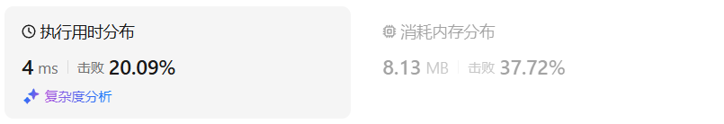
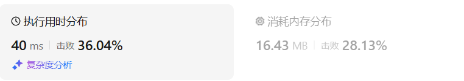

# 17电话号码的字母组合（中等）

[17. 电话号码的字母组合 - 力扣（LeetCode）](https://leetcode.cn/problems/letter-combinations-of-a-phone-number/description/)

## 题目描述

给定一个仅包含数字 `2-9` 的字符串，返回所有它能表示的字母组合。答案可以按 **任意顺序** 返回。

给出数字到字母的映射如下（与电话按键相同）。注意 1 不对应任何字母。


 

**示例 1：**

```
输入：digits = "23"
输出：["ad","ae","af","bd","be","bf","cd","ce","cf"]
```

**示例 2：**

```
输入：digits = ""
输出：[]
```

**示例 3：**

```
输入：digits = "2"
输出：["a","b","c"]
```

 

**提示：**

- `0 <= digits.length <= 4`
- `digits[i]` 是范围 `['2', '9']` 的一个数字。

## 我的C++解法

现在的思路：创建一个数组，存储了每一个数字对应的字母，回溯式访问每一个数对应的字母，组成字符串

```cpp
class Solution {
private:
    // char num_2[3] = {'a','b','c'};
    // char num_3[3] = {'d','e','f'};
    // char num_4[3] = {'g','h','i'};
    // char num_5[3] = {'j','k','l'};
    // char num_6[3] = {'m','n','o'};
    // char num_7[4] = {'p','q','r','s'};
    // char num_8[3] = {'t','u','v'};
    // char num_9[4] = {'w','x','y','z'};
    // vector<vector<char>> list_map = {num_2,num_3,num_4,num_5,num_6,num_7,num_8,num_9};
    vector<vector<char>> list_map = {{'a','b','c'},{'d','e','f'},{'g','h','i'},{'j','k','l'},{'m','n','o'},{'p','q','r','s'},{'t','u','v'},{'w','x','y','z'}};
    string tmp;
    vector<string> ans;

public:
    vector<string> letterCombinations(string digits) {
        // 依据digits的大小来决定回溯的层数
        // 感觉需要建立一个哈希表的映射？似乎也不用？只有7和9对应4个字母，其他都是三个字母为一组的
        tmp = "";
        ans.clear();
        int len = digits.size();
        backtracking(0,len,digits);
        return ans;
    }
    void backtracking(int cur_num_index,int len,string digits){
        if(tmp.size()==len){
            ans.push_back(tmp);
            return;
        }
        if(cur_num_index>=len)  return;
        for(char x:list_map[int(digits[cur_num_index])-2]){
            tmp += x;
            backtracking(cur_num_index+1,len,digits);
            tmp.erase(tmp.size()-1);
            // tmp.pop_back();
        }
        return;
    }
};
```

但是出了问题，比如示例输入了digits = '23'，按理来说，digits[0]得到的是‘2’，再把它转化为int，之后就可以做减法了。但是实际上转化出来的是50

打完上面这行字之后突然想到一个问题：有没有可能把char强制转化int（我的做法是直接int(x)）后得到的是该字符的ACSII值。

还真是这样，解决方法：不直接转换int，而是与'0'做差。

```cpp
class Solution {
private:
    // char num_2[3] = {'a','b','c'};
    // char num_3[3] = {'d','e','f'};
    // char num_4[3] = {'g','h','i'};
    // char num_5[3] = {'j','k','l'};
    // char num_6[3] = {'m','n','o'};
    // char num_7[4] = {'p','q','r','s'};
    // char num_8[3] = {'t','u','v'};
    // char num_9[4] = {'w','x','y','z'};
    // vector<vector<char>> list_map = {num_2,num_3,num_4,num_5,num_6,num_7,num_8,num_9};
    vector<vector<char>> list_map = {{'a','b','c'},{'d','e','f'},{'g','h','i'},{'j','k','l'},{'m','n','o'},{'p','q','r','s'},{'t','u','v'},{'w','x','y','z'}};
    string tmp;
    vector<string> ans;

public:
    vector<string> letterCombinations(string digits) {
        // 依据digits的大小来决定回溯的层数
        // 感觉需要建立一个哈希表的映射？似乎也不用？只有7和9对应4个字母，其他都是三个字母为一组的
        tmp = "";
        ans.clear();
        int len = digits.size();
        if(len==0)  return ans;
        backtracking(0,len,digits);
        return ans;
    }
    void backtracking(int cur_num_index,int len,string digits){
        if(tmp.size()==len){
            ans.push_back(tmp);
            return;
        }
        if(cur_num_index>=len)  return;
        for(char x:list_map[int(digits[cur_num_index] - '0')-2]){
            tmp += x;
            backtracking(cur_num_index+1,len,digits);
            tmp.erase(tmp.size()-1);
            // tmp.pop_back();
        }
        return;
    }
};
```

结果：



## C++参考答案

```cpp
// 版本一
class Solution {
private:
    const string letterMap[10] = {
        "", // 0
        "", // 1
        "abc", // 2
        "def", // 3
        "ghi", // 4
        "jkl", // 5
        "mno", // 6
        "pqrs", // 7
        "tuv", // 8
        "wxyz", // 9
    };
public:
    vector<string> result;
    string s;
    void backtracking(const string& digits, int index) {
        if (index == digits.size()) {
            result.push_back(s);
            return;
        }
        int digit = digits[index] - '0';        // 将index指向的数字转为int
        string letters = letterMap[digit];      // 取数字对应的字符集
        for (int i = 0; i < letters.size(); i++) {
            s.push_back(letters[i]);            // 处理
            backtracking(digits, index + 1);    // 递归，注意index+1，一下层要处理下一个数字了
            s.pop_back();                       // 回溯
        }
    }
    vector<string> letterCombinations(string digits) {
        s.clear();
        result.clear();
        if (digits.size() == 0) {
            return result;
        }
        backtracking(digits, 0);
        return result;
    }
};
```

```cpp
// 版本二
class Solution {
private:
        const string letterMap[10] = {
            "", // 0
            "", // 1
            "abc", // 2
            "def", // 3
            "ghi", // 4
            "jkl", // 5
            "mno", // 6
            "pqrs", // 7
            "tuv", // 8
            "wxyz", // 9
        };
public:
    vector<string> result;
    void getCombinations(const string& digits, int index, const string& s) { // 注意参数的不同
        if (index == digits.size()) {
            result.push_back(s);
            return;
        }
        int digit = digits[index] - '0';
        string letters = letterMap[digit];
        for (int i = 0; i < letters.size(); i++) {
            getCombinations(digits, index + 1, s + letters[i]);  // 注意这里的不同
        }
    }
    vector<string> letterCombinations(string digits) {
        result.clear();
        if (digits.size() == 0) {
            return result;
        }
        getCombinations(digits, 0, "");
        return result;

    }
};
```

```cpp
class Solution {
public:
    vector<string> letterCombinations(string digits) {
        vector<string> combinations;
        if (digits.empty()) {
            return combinations;
        }
        unordered_map<char, string> phoneMap{
            {'2', "abc"},
            {'3', "def"},
            {'4', "ghi"},
            {'5', "jkl"},
            {'6', "mno"},
            {'7', "pqrs"},
            {'8', "tuv"},
            {'9', "wxyz"}
        };
        string combination;
        backtrack(combinations, phoneMap, digits, 0, combination);
        return combinations;
    }

    void backtrack(vector<string>& combinations, const unordered_map<char, string>& phoneMap, const string& digits, int index, string& combination) {
        if (index == digits.length()) {
            combinations.push_back(combination);
        } else {
            char digit = digits[index];
            const string& letters = phoneMap.at(digit);
            for (const char& letter: letters) {
                combination.push_back(letter);
                backtrack(combinations, phoneMap, digits, index + 1, combination);
                combination.pop_back();
            }
        }
    }
};
```

C++的队列算法：先放入a、b、c，然后把a提出，放入ad、ae、af，再把b提出，放入bd、be、bf······

```cpp
class Solution {
public:
    vector<string> letterCombinations(string digits) {
        vector<string> ans{""}; 
        ans.reserve(150); //指定容量，减少扩容消耗
        unordered_map<char, string> hashtable {
                {'2', "abc"},
                {'3', "def"},
                {'4', "ghi"},
                {'5', "jkl"},
                {'6', "mno"},
                {'7', "pqrs"},
                {'8', "tuv"},
                {'9', "wxyz"}
        };
        if (digits.empty()) {
            ans.erase(ans.begin());
            return ans;
        } //返回空的vector容器
        string tmp;
        for (char& i : digits) {
            int n = ans.size();
            for (int j = 0; j < n; ++j) {
                tmp = ans[0]; //把第一个元素值提出来
                ans.erase(ans.begin()); //提出来后在容器中删除
                for (auto& k : hashtable.at(i)) {
                    ans.push_back(tmp + k); //把新的元素放入
                }
            }
        }
        return ans;
    }
};
```


## C++收获

### C++删除字符串中的最后一个元素

<center>关键词：字符串弹出尾元素<center>

<center>关键词：删除字符串最后一个元素<center>

<center>关键词：string弹出尾元素<center>

在C++中，删除字符串类型元素的最后一个字符可以使用 `std::string` 类的 `pop_back()` 成员函数。这个函数是C++11标准引入的，用于从字符串末尾移除最后一个字符。

以下是如何使用 `pop_back()` 函数的示例：

```cpp
#include <iostream>
#include <string>

int main() {
    std::string str = "Hello, World!";

    // 删除最后一个字符
    if (!str.empty()) {
        str.pop_back();
    }

    std::cout << "After removing the last character: " << str << std::endl;

    return 0;
}
```

输出将是：
```
After removing the last character: Hello, World
```

请注意，`pop_back()` 函数在尝试删除空字符串的字符时会失败，并可能导致未定义行为。因此，在调用 `pop_back()` 之前，最好检查字符串是否为空。

另外，如果你使用的是旧版本的C++（C++11之前），那么可以使用 `erase()` 成员函数来删除最后一个字符：

```cpp
str.erase(str.size() - 1);
```

这种方法通过 `erase()` 函数删除指定位置的字符，其中 `str.size() - 1` 是最后一个字符的位置。这种方法在C++11之前是删除最后一个字符的标准做法。

### C++把字符型数字转化为对应数字

<center>关键词：char_to_int<center>

<center>关键词：字符转数字<center>

在C++中，将数字型字符转换为对应的整数值，可以使用以下几种方法：

#### 1. `std::atoi` 函数（C++98）
`std::atoi` 是一个C风格的字符串到整数的转换函数，定义在 `<cstdlib>` 头文件中。

```cpp
#include <cstdlib>

char ch = '2';
int num = std::atoi(&ch); // 将字符 '2' 转换为整数 2
```

#### 2. `std::stoi` 函数（C++11及以上）
`std::stoi` 是C++11标准库中的一个函数，用于将字符串转换为整数。

```cpp
#include <string>

char ch = '2';
int num = std::stoi(&ch); // 将字符 '2' 转换为整数 2
```

#### 3. 类型转换
对于单个字符，可以直接将其转换为 `int` 类型，因为字符的内部表示是基于其ASCII值的。

```cpp
char ch = '2';
int num = ch - '0'; // 将字符 '2' 转换为整数 2
```

这种方法利用了字符的ASCII值。字符 '0' 到 '9' 在ASCII表中是连续的，并且它们与整数 0 到 9 的差值是相同的。因此，通过减去字符 '0' 的ASCII值，可以直接得到对应的整数值。

#### 4. 使用 `<cctype>` 中的 `std::isdigit` 函数
在转换之前，可以使用 `std::isdigit` 函数检查字符是否为数字。

```cpp
#include <cctype>

char ch = '2';
if (std::isdigit(ch)) {
    int num = ch - '0';
} else {
    // 处理非数字字符的情况
}
```

#### 注意事项
- 当使用 `std::stoi` 或 `std::atoi` 时，它们期望参数是一个以数字开头的字符串。对于单个字符，可以直接传递字符的地址。
- 直接类型转换的方法只适用于 '0' 到 '9' 之间的数字字符。
- 如果字符不是数字字符，使用 `std::isdigit` 进行检查可以避免潜在的转换错误。

在实际编程中，选择哪种方法取决于你的具体需求和使用的C++标准版本。对于C++11及以上版本，推荐使用 `std::stoi`，因为它提供了更强的类型检查和异常安全性。


## 我的python解答

总感觉py的回溯更难写

```python
class Solution:
    list_map = [['a','b','c'],['d','e','f'],['g','h','i'],['j','k','l'],['m','n','o'],['p','q','r','s'],['t','u','v'],['w','x','y','z']]
    def letterCombinations(self, digits: str) -> List[str]:
        if len(digits)==0:  return []
        tmp = str()
        ans = []
        lenth = len(digits)
        self.backtracking(0,lenth,tmp,ans,digits)
        return ans

    def backtracking(self,index:int,lenth:int,tmp:str,ans:list,digits:str):
        if len(tmp)==lenth:
            ans.append(tmp)
            return
        if index>=lenth:    return
        for x in self.list_map[int(digits[index])-2]:
            tmp+=x
            self.backtracking(index+1,lenth,tmp,ans,digits)
            tmp = tmp[:-1]
        return
```

结果：



## python参考答案

```python
class Solution:
    def __init__(self):
        self.letterMap = [
            "",     # 0
            "",     # 1
            "abc",  # 2
            "def",  # 3
            "ghi",  # 4
            "jkl",  # 5
            "mno",  # 6
            "pqrs", # 7
            "tuv",  # 8
            "wxyz"  # 9
        ]
        self.result = []
        self.s = ""
    
    def backtracking(self, digits, index):
        if index == len(digits):
            self.result.append(self.s)
            return
        digit = int(digits[index])    # 将索引处的数字转换为整数
        letters = self.letterMap[digit]    # 获取对应的字符集
        for i in range(len(letters)):
            self.s += letters[i]    # 处理字符
            self.backtracking(digits, index + 1)    # 递归调用，注意索引加1，处理下一个数字
            self.s = self.s[:-1]    # 回溯，删除最后添加的字符
    
    def letterCombinations(self, digits):
        if len(digits) == 0:
            return self.result
        self.backtracking(digits, 0)
        return self.result
```

```python
class Solution:
    def __init__(self):
        self.letterMap = [
            "",     # 0
            "",     # 1
            "abc",  # 2
            "def",  # 3
            "ghi",  # 4
            "jkl",  # 5
            "mno",  # 6
            "pqrs", # 7
            "tuv",  # 8
            "wxyz"  # 9
        ]
        self.result = []
    
    def getCombinations(self, digits, index, s):
        if index == len(digits):
            self.result.append(s)
            return
        digit = int(digits[index])
        letters = self.letterMap[digit]
        for letter in letters:
            self.getCombinations(digits, index + 1, s + letter) # 回溯在这里
    
    def letterCombinations(self, digits):
        if len(digits) == 0:
            return self.result
        self.getCombinations(digits, 0, "")
        return self.result
```

```python
class Solution:
    def __init__(self):
        self.letterMap = [
            "",     # 0
            "",     # 1
            "abc",  # 2
            "def",  # 3
            "ghi",  # 4
            "jkl",  # 5
            "mno",  # 6
            "pqrs", # 7
            "tuv",  # 8
            "wxyz"  # 9
        ]
    
    def getCombinations(self, digits, index, s, result):
        if index == len(digits):
            result.append(s)
            return
        digit = int(digits[index])
        letters = self.letterMap[digit]
        for letter in letters:
            self.getCombinations(digits, index + 1, s + letter, result)
    
    def letterCombinations(self, digits):
        result = []
        if len(digits) == 0:
            return result
        self.getCombinations(digits, 0, "", result)
        return result
```

```python
class Solution:
    def __init__(self):
        self.letterMap = [
            "",     # 0
            "",     # 1
            "abc",  # 2
            "def",  # 3
            "ghi",  # 4
            "jkl",  # 5
            "mno",  # 6
            "pqrs", # 7
            "tuv",  # 8
            "wxyz"  # 9
        ]
    
    def getCombinations(self, digits, index, path, result):
        if index == len(digits):
            result.append(''.join(path))
            return
        digit = int(digits[index])
        letters = self.letterMap[digit]
        for letter in letters:
            path.append(letter)
            self.getCombinations(digits, index + 1, path, result)
            path.pop()
    
    def letterCombinations(self, digits):
        result = []
        if len(digits) == 0:
            return result
        self.getCombinations(digits, 0, [], result)
        return result
```

```python
class Solution:
    def letterCombinations(self, digits: str) -> List[str]:
        if not digits:
            return list()
        
        phoneMap = {
            "2": "abc",
            "3": "def",
            "4": "ghi",
            "5": "jkl",
            "6": "mno",
            "7": "pqrs",
            "8": "tuv",
            "9": "wxyz",
        }

        def backtrack(index: int):
            if index == len(digits):
                combinations.append("".join(combination))
            else:
                digit = digits[index]
                for letter in phoneMap[digit]:
                    combination.append(letter)
                    backtrack(index + 1)
                    combination.pop()

        combination = list()
        combinations = list()
        backtrack(0)
        return combinations
```


## python收获