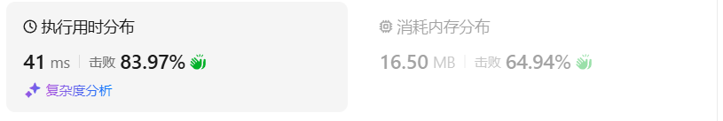

# 39组合总和（中等）

[39. 组合总和 - 力扣（LeetCode）](https://leetcode.cn/problems/combination-sum/description/)

## 题目描述

给你一个 **无重复元素** 的整数数组 `candidates` 和一个目标整数 `target` ，找出 `candidates` 中可以使数字和为目标数 `target` 的 所有 **不同组合** ，并以列表形式返回。你可以按 **任意顺序** 返回这些组合。

`candidates` 中的 **同一个** 数字可以 **无限制重复被选取** 。如果至少一个数字的被选数量不同，则两种组合是不同的。 

对于给定的输入，保证和为 `target` 的不同组合数少于 `150` 个。

 

**示例 1：**

```
输入：candidates = [2,3,6,7], target = 7
输出：[[2,2,3],[7]]
解释：
2 和 3 可以形成一组候选，2 + 2 + 3 = 7 。注意 2 可以使用多次。
7 也是一个候选， 7 = 7 。
仅有这两种组合。
```

**示例 2：**

```
输入: candidates = [2,3,5], target = 8
输出: [[2,2,2,2],[2,3,3],[3,5]]
```

**示例 3：**

```
输入: candidates = [2], target = 1
输出: []
```

 

**提示：**

- `1 <= candidates.length <= 30`
- `2 <= candidates[i] <= 40`
- `candidates` 的所有元素 **互不相同**
- `1 <= target <= 40`

## 我的C++解法

本来以为这个题会比较难，难在数字可以重复选择上，仔细一想，这是回溯法的应用，首先把数组排好序，传入参数target-cur，从当前数字开始，继续递归地查询能否满足新的target是否为0。如果是0则压入，如果不是0，首先和数组最小值比较，如果小于最小，直接返回，后面都不符合。如果不小，则继续递归。

```cpp
class Solution {
private:
    vector<int> tmp;
    vector<vector<int>> ans;
    int min;
    void backtrack(int start,int new_target,vector<int>& candidates){
        if(new_target==0){
            ans.push_back(tmp);
            return;
        }
        else if(new_target<min) return;
        for(int i = start;i<candidates.size();i++){
            tmp.push_back(candidates[i]);
            new_target -= candidates[i];
            start = i;
            backtrack(start, new_target,candidates);
            new_target += candidates[i];
            tmp.pop_back();
        }
    }
public:
    vector<vector<int>> combinationSum(vector<int>& candidates, int target) {
        // 关键在于可以重复使用。那我的想法是target-cur得到新的target，继续递归计算
        // 如果到最后新的target小于最小候选元素，则回溯（直接返回，不压入答案）
        // 使用find函数，在候选中找能不能找到新的target
        // candidates = sort(candidates);
        sort(candidates.begin(),candidates.end());
        min = candidates[0];
        backtrack(0,target,candidates);
        return ans;
    }
};
```

结果：


## C++参考答案

```cpp
// 版本一
class Solution {
private:
    vector<vector<int>> result;
    vector<int> path;
    void backtracking(vector<int>& candidates, int target, int sum, int startIndex) {
        if (sum > target) {
            return;
        }
        if (sum == target) {
            result.push_back(path);
            return;
        }

        for (int i = startIndex; i < candidates.size(); i++) {
            sum += candidates[i];
            path.push_back(candidates[i]);
            backtracking(candidates, target, sum, i); // 不用i+1了，表示可以重复读取当前的数
            sum -= candidates[i];
            path.pop_back();
        }
    }
public:
    vector<vector<int>> combinationSum(vector<int>& candidates, int target) {
        result.clear();
        path.clear();
        backtracking(candidates, target, 0, 0);
        return result;
    }
};
```

剪枝优化：

```cpp
class Solution {
private:
    vector<vector<int>> result;
    vector<int> path;
    void backtracking(vector<int>& candidates, int target, int sum, int startIndex) {
        if (sum == target) {
            result.push_back(path);
            return;
        }

        // 如果 sum + candidates[i] > target 就终止遍历
        for (int i = startIndex; i < candidates.size() && sum + candidates[i] <= target; i++) {
            sum += candidates[i];
            path.push_back(candidates[i]);
            backtracking(candidates, target, sum, i);
            sum -= candidates[i];
            path.pop_back();

        }
    }
public:
    vector<vector<int>> combinationSum(vector<int>& candidates, int target) {
        result.clear();
        path.clear();
        sort(candidates.begin(), candidates.end()); // 需要排序
        backtracking(candidates, target, 0, 0);
        return result;
    }
};
```

## C++收获


## 我的python解答

和C++的思路一致

```python
class Solution:
    def __init__(self):
        self.tmp = []
        self.ans = []
        self.min = 0
    def backtrack(self,start:int,new_target:int,min:int,candidates:list):
        if new_target==0:
            self.ans.append(self.tmp.copy())
            return
        elif new_target< self.min:
            return
        for i in range(start,len(candidates)):
            self.tmp.append(candidates[i])
            new_target -= candidates[i]
            start = i
            self.backtrack(start,new_target,self.min,candidates)
            new_target += candidates[i]
            self.tmp.pop()
        return

    def combinationSum(self, candidates: List[int], target: int) -> List[List[int]]:
        candidates.sort()
        self.min = candidates[0]
        self.tmp = []
        self.ans = []
        self.backtrack(0,target,self.min,candidates)
        return self.ans
```

结果：



## python参考答案

```python
class Solution:

    def backtracking(self, candidates, target, total, startIndex, path, result):
        if total > target:
            return
        if total == target:
            result.append(path[:])
            return

        for i in range(startIndex, len(candidates)):
            total += candidates[i]
            path.append(candidates[i])
            self.backtracking(candidates, target, total, i, path, result)  # 不用i+1了，表示可以重复读取当前的数
            total -= candidates[i]
            path.pop()

    def combinationSum(self, candidates, target):
        result = []
        self.backtracking(candidates, target, 0, 0, [], result)
        return result
```

```python
class Solution:

    def backtracking(self, candidates, target, total, startIndex, path, result):
        if total == target:
            result.append(path[:])
            return

        for i in range(startIndex, len(candidates)):
            if total + candidates[i] > target:
                break
            total += candidates[i]
            path.append(candidates[i])
            self.backtracking(candidates, target, total, i, path, result)
            total -= candidates[i]
            path.pop()

    def combinationSum(self, candidates, target):
        result = []
        candidates.sort()  # 需要排序
        self.backtracking(candidates, target, 0, 0, [], result)
        return result
```

```python
class Solution:
    def combinationSum(self, candidates: List[int], target: int) -> List[List[int]]:
        result =[]
        self.backtracking(candidates, target, 0, [], result)
        return result
    def backtracking(self, candidates, target, startIndex, path, result):
        if target == 0:
            result.append(path[:])
            return
        if target < 0:
            return
        for i in range(startIndex, len(candidates)):
            path.append(candidates[i])
            self.backtracking(candidates, target - candidates[i], i, path, result)
            path.pop()
```

```python
class Solution:
    def combinationSum(self, candidates: List[int], target: int) -> List[List[int]]:
        result =[]
        candidates.sort()
        self.backtracking(candidates, target, 0, [], result)
        return result
    def backtracking(self, candidates, target, startIndex, path, result):
        if target == 0:
            result.append(path[:])
            return

        for i in range(startIndex, len(candidates)):
            if target - candidates[i]  < 0:
                break
            path.append(candidates[i])
            self.backtracking(candidates, target - candidates[i], i, path, result)
            path.pop()
```


## python收获