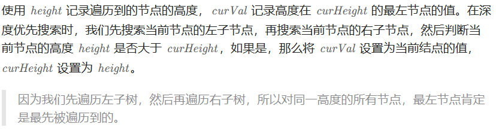

# 513找树左下角的值（中等）

[513. 找树左下角的值 - 力扣（LeetCode）](https://leetcode.cn/problems/find-bottom-left-tree-value/description/)

## 题目描述

给定一个二叉树的 **根节点** `root`，请找出该二叉树的 **最底层 最左边** 节点的值。

假设二叉树中至少有一个节点。

 

**示例 1:**


```
输入: root = [2,1,3]
输出: 1
```

**示例 2:**


```
输入: [1,2,3,4,null,5,6,null,null,7]
输出: 7
```

 

**提示:**

- 二叉树的节点个数的范围是 `[1,104]`
- `-231 <= Node.val <= 231 - 1` 

## 我的C++解法

bfs

```cpp
/**
 * Definition for a binary tree node.
 * struct TreeNode {
 *     int val;
 *     TreeNode *left;
 *     TreeNode *right;
 *     TreeNode() : val(0), left(nullptr), right(nullptr) {}
 *     TreeNode(int x) : val(x), left(nullptr), right(nullptr) {}
 *     TreeNode(int x, TreeNode *left, TreeNode *right) : val(x), left(left), right(right) {}
 * };
 */
class Solution {
public:
    int findBottomLeftValue(TreeNode* root) {
        // 一眼bfs
        if(!root)   return 0;
        queue<TreeNode*> q;
        q.push(root);
        vector<vector<int>> outer;
        vector<int> inner;
        inner.push_back(root->val);
        outer.push_back(inner);
        while(!q.empty()){
            int tmp = inner.size();
            inner.clear();
            for(int i = 0;i<tmp;i++){
                TreeNode* top = q.front();
                q.pop();
                if(top->left){
                    q.push(top->left);
                    inner.push_back(top->left->val);
                }
                if(top->right){
                    q.push(top->right);
                    inner.push_back(top->right->val);
                }
            }
            outer.push_back(inner);
        }
        return outer[outer.size()-2][0];
    }
};
```

结果：


```cpp
class Solution {
public:
    int findBottomLeftValue(TreeNode* root) {
        // 试试非双数组模式
        if(!root)   return 0;
        queue<pair<TreeNode*,int>> q;
        vector<pair<int,int>> vec;
        q.push(make_pair(root,0));
        int max_layer;
        while(!q.empty()){
            TreeNode* top = q.front().first;
            int layer = q.front().second;
            q.pop();
            max_layer=layer;
            if(top->left){
                q.push(make_pair(top->left,layer+1));
            }
            if(top->right){
                q.push(make_pair(top->right,layer+1));
                continue;
            }
            vec.push_back(make_pair(top->val,layer));
        }
        for(auto x:vec){
            if(x.second == max_layer)   return x.first;
        }
        return 0;
    }
};
```

结果：


实际上，从右向左层序遍历得到的最后一个节点即为最后一层的最左侧节点。这是看到了评论才意识到。

```cpp
class Solution {
public:
    int findBottomLeftValue(TreeNode* root) {
        // 从右向左层序
        if(!root)   return 0;
        queue<TreeNode*> q;
        q.push(root);
        TreeNode* top;
        while(!q.empty()){
            top = q.front();
            q.pop();
            if(top->right)  q.push(top->right);
            if(top->left)   q.push(top->left);
        }
        return top->val;
    }
};
```

结果：


## C++参考答案

### 递归

```cpp
class Solution {
public:
    int maxDepth = INT_MIN;
    int result;
    void traversal(TreeNode* root, int depth) {
        if (root->left == NULL && root->right == NULL) {
            if (depth > maxDepth) {
                maxDepth = depth;
                result = root->val;
            }
            return;
        }
        if (root->left) {
            depth++;
            traversal(root->left, depth);
            depth--; // 回溯
        }
        if (root->right) {
            depth++;
            traversal(root->right, depth);
            depth--; // 回溯
        }
        return;
    }
    int findBottomLeftValue(TreeNode* root) {
        traversal(root, 0);
        return result;
    }
};
```

当然回溯的地方可以精简，精简代码如下：

```cpp
class Solution {
public:
    int maxDepth = INT_MIN;
    int result;
    void traversal(TreeNode* root, int depth) {
        if (root->left == NULL && root->right == NULL) {
            if (depth > maxDepth) {
                maxDepth = depth;
                result = root->val;
            }
            return;
        }
        if (root->left) {
            traversal(root->left, depth + 1); // 隐藏着回溯
        }
        if (root->right) {
            traversal(root->right, depth + 1); // 隐藏着回溯
        }
        return;
    }
    int findBottomLeftValue(TreeNode* root) {
        traversal(root, 0);
        return result;
    }
};
```

### 迭代

```cpp
class Solution {
public:
    int findBottomLeftValue(TreeNode* root) {
        queue<TreeNode*> que;
        if (root != NULL) que.push(root);
        int result = 0;
        while (!que.empty()) {
            int size = que.size();
            for (int i = 0; i < size; i++) {
                TreeNode* node = que.front();
                que.pop();
                if (i == 0) result = node->val; // 记录最后一行第一个元素
                if (node->left) que.push(node->left);
                if (node->right) que.push(node->right);
            }
        }
        return result;
    }
};
```

### DFS

```CPP
class Solution {
public:
    void dfs(TreeNode *root, int height, int &curVal, int &curHeight) {
        if (root == nullptr) {
            return;
        }
        height++;
        dfs(root->left, height, curVal, curHeight);
        dfs(root->right, height, curVal, curHeight);
        if (height > curHeight) {
            curHeight = height;
            curVal = root->val;
        }
    }

    int findBottomLeftValue(TreeNode* root) {
        int curVal, curHeight = 0;
        dfs(root, 0, curVal, curHeight);
        return curVal;
    }
};
```

### BFS

```CPP
class Solution {
public:
    int findBottomLeftValue(TreeNode* root) {
        int ret;
        queue<TreeNode *> q;
        q.push(root);
        while (!q.empty()) {
            auto p = q.front();
            q.pop();
            if (p->right) {
                q.push(p->right);
            }
            if (p->left) {
                q.push(p->left);
            }
            ret = p->val;
        }
        return ret;
    }
};
```

```CPP
class Solution {
public:
    int findBottomLeftValue(TreeNode *root) {
        TreeNode *node;
        queue<TreeNode *> q;
        q.push(root);
        while (!q.empty()) {
            node = q.front(); q.pop();
            if (node->right) q.push(node->right);
            if (node->left)  q.push(node->left);
        }
        return node->val;
    }
};
```


## C++收获


## 我的python解答

从右到左的层序遍历

```python
# Definition for a binary tree node.
# class TreeNode:
#     def __init__(self, val=0, left=None, right=None):
#         self.val = val
#         self.left = left
#         self.right = right
class Solution:
    def findBottomLeftValue(self, root: Optional[TreeNode]) -> int:
        if not root:    return 0
        q = collections.deque()
        q.append(root)
        top = root
        while len(q):
            top = q.popleft()
            if top.right:   q.append(top.right)
            if top.left:    q.append(top.left)
        return top.val
```

结果：


## python参考答案

### 递归

```python
class Solution:
    def findBottomLeftValue(self, root: TreeNode) -> int:
        self.max_depth = float('-inf')
        self.result = None
        self.traversal(root, 0)
        return self.result
    
    def traversal(self, node, depth):
        if not node.left and not node.right:
            if depth > self.max_depth:
                self.max_depth = depth
                self.result = node.val
            return
        
        if node.left:
            depth += 1
            self.traversal(node.left, depth)
            depth -= 1
        if node.right:
            depth += 1
            self.traversal(node.right, depth)
            depth -= 1
```

```python
class Solution:
    def findBottomLeftValue(self, root: TreeNode) -> int:
        self.max_depth = float('-inf')
        self.result = None
        self.traversal(root, 0)
        return self.result
    
    def traversal(self, node, depth):
        if not node.left and not node.right:
            if depth > self.max_depth:
                self.max_depth = depth
                self.result = node.val
            return
        
        if node.left:
            self.traversal(node.left, depth+1)
        if node.right:
            self.traversal(node.right, depth+1)
```

### 迭代

```python
from collections import deque
class Solution:
    def findBottomLeftValue(self, root):
        if root is None:
            return 0
        queue = deque()
        queue.append(root)
        result = 0
        while queue:
            size = len(queue)
            for i in range(size):
                node = queue.popleft()
                if i == 0:
                    result = node.val
                if node.left:
                    queue.append(node.left)
                if node.right:
                    queue.append(node.right)
        return result
```

### DFS



```python
class Solution:
    def findBottomLeftValue(self, root: Optional[TreeNode]) -> int:
        curVal = curHeight = 0
        def dfs(node: Optional[TreeNode], height: int) -> None:
            if node is None:
                return
            height += 1
            dfs(node.left, height)
            dfs(node.right, height)
            nonlocal curVal, curHeight
            if height > curHeight:
                curHeight = height
                curVal = node.val
        dfs(root, 0)
        return curVal
```

### BFS

```python
class Solution:
    def findBottomLeftValue(self, root: Optional[TreeNode]) -> int:
        q = deque([root])
        while q:
            node = q.popleft()
            if node.right:
                q.append(node.right)
            if node.left:
                q.append(node.left)
            ans = node.val
        return ans
```

```python
class Solution:
    def findBottomLeftValue(self, root: Optional[TreeNode]) -> int:
        q = deque([root])
        while q:
            node = q.popleft()
            if node.right: q.append(node.right)
            if node.left:  q.append(node.left)
        return node.val
```


## python收获