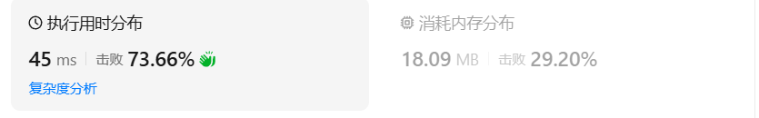

# 589N叉树的谦先序遍历

[589. N 叉树的前序遍历 - 力扣（LeetCode）](https://leetcode.cn/problems/n-ary-tree-preorder-traversal/description/)

## 题目描述

给定一个 n 叉树的根节点 `root` ，返回 *其节点值的 **前序遍历*** 。

n 叉树 在输入中按层序遍历进行序列化表示，每组子节点由空值 `null` 分隔（请参见示例）。


**示例 1：**


```
输入：root = [1,null,3,2,4,null,5,6]
输出：[1,3,5,6,2,4]
```

**示例 2：**


```
输入：root = [1,null,2,3,4,5,null,null,6,7,null,8,null,9,10,null,null,11,null,12,null,13,null,null,14]
输出：[1,2,3,6,7,11,14,4,8,12,5,9,13,10]
```

 

**提示：**

- 节点总数在范围 `[0, 104]`内
- `0 <= Node.val <= 104`
- n 叉树的高度小于或等于 `1000`

 

**进阶：**递归法很简单，你可以使用迭代法完成此题吗?

## 我的C++解法

### 递归

```cpp
/*
// Definition for a Node.
class Node {
public:
    int val;
    vector<Node*> children;

    Node() {}

    Node(int _val) {
        val = _val;
    }

    Node(int _val, vector<Node*> _children) {
        val = _val;
        children = _children;
    }
};
*/

class Solution {
vector<int> res;

public:
    vector<int> preorder(Node* root) {
         //先说递归
         if(!root)  return res;
        res.push_back(root->val);
        for(auto child: root->children){
            preorder(child);
        }
        return res;
    }
};
```

结果：


### 迭代

```cpp
class Solution {
vector<int> res;
public:
    vector<int> preorder(Node* root) {
        // 迭代
        if(!root)   return res;
        // 深度优先，可以用栈，若节点非叶则压入孩子 叶节点直接弹出并输出 最后返回逆置
        stack<Node*> s;
        s.push(root);
        Node* top = s.top();
        Node* pre;
        while(s.size()){
            top = s.top();
            if(top->children.size()==0 || top->children[0] == pre){
                s.pop();
                pre = top;
                res.push_back(top->val);
            }
            else{
                for(auto child:top->children){
                    s.push(child);
                }
            }
        }
        reverse(res.begin(),res.end());
        return res;
    }
};
```

结果：


## C++参考答案

### 递归

```cpp
class Solution {
public:
    vector<int> preorder(Node *root) {
        vector<int> ans;
        function<void(Node*)> dfs = [&](Node *node) {
            if (node == nullptr) {
                return;
            }
            ans.push_back(node->val);
            for (auto c : node->children) {
                dfs(c);
            }
        };
        dfs(root);
        return ans;
    }
};
```

```cpp
class Solution {
public:
    void helper(const Node* root, vector<int> & res) {
        if (root == nullptr) {
            return;
        }
        res.emplace_back(root->val);
        for (auto & ch : root->children) {
            helper(ch, res);
        }
    }

    vector<int> preorder(Node* root) {
        vector<int> res;
        helper(root, res);
        return res;
    }
};
```

### 迭代

方法一中利用递归来遍历树，实际的递归中隐式调用了栈，在此我们可以直接模拟递归中栈的调用。在前序遍历中，我们会先遍历节点本身，然后从左向右依次先序遍历该每个以子节点为根的子树。在这里的栈模拟中比较难处理的在于从当前节点 u的子节点 v1返回时，此时需要处理节点 u的下一个节点 v2，此时需要记录当前已经遍历完成哪些子节点，才能找到下一个需要遍历的节点。在二叉树树中因为只有左右两个子节点，因此比较方便处理，在 N叉树中由于有多个子节点，因此使用哈希表记录当前节点 u已经访问过哪些子节点。

- 每次入栈时都将当前节点的 uu*u* 的第一个子节点压入栈中，直到当前节点为空节点为止。
- 每次查看栈顶元素 pp*p*，如果节点 pp*p* 的子节点已经全部访问过，则将节点 pp*p* 的从栈中弹出，并从哈希表中移除，表示该以该节点的子树已经全部遍历过；如果当前节点 pp*p* 的子节点还有未遍历的，则将当前节点的 pp*p* 的下一个未访问的节点压入到栈中，重复上述的入栈操作。

```cpp
class Solution {
public:
    vector<int> preorder(Node* root) {
        vector<int> res;
        if (root == nullptr) {
            return res;
        }
        
        unordered_map<Node *, int> cnt;
        stack<Node *> st;
        Node * node = root;
        while (!st.empty() || node != nullptr) {
            while (node != nullptr) {
                res.emplace_back(node->val);
                st.emplace(node);
                if (node->children.size() > 0) {
                    cnt[node] = 0;
                    node = node->children[0];
                } else {
                    node = nullptr;
                }         
            }
            node = st.top();
            int index = (cnt.count(node) ? cnt[node] : -1) + 1;
            if (index < node->children.size()) {
                cnt[node] = index;
                node = node->children[index];
            } else {
                st.pop();
                cnt.erase(node);
                node = nullptr;
            }
        }
        return res;
    }
};
```

```cpp
class Solution {
public:
    vector<int> preorder(Node* root) {
        vector<int> res;
        if (root == nullptr) {
            return res;
        }

        stack<Node *> st;
        st.emplace(root);
        while(!st.empty()) {
            Node * node = st.top();
            st.pop();
            res.emplace_back(node->val);
            for (auto it = node->children.rbegin(); it != node->children.rend(); it++) {
                st.emplace(*it);
            }
        }
        return res;
    }
};
```

```cpp
class Solution {
public:
    vector<int> preorder(Node* root) {
        vector<int> res;
        stack<Node*> st;
        if(root == nullptr) return res;
        st.push(root);
        while(!st.empty()){
            Node* node = st.top();
            st.pop();
            res.push_back(node->val);
            for(int i = node->children.size() - 1; i >= 0; --i){
                st.push(node->children[i]);
            }
        }
        return res;
    }
};
```


## C++收获

### C++类中的函数内部声明另一个函数

<center>关键词：函数嵌套<center>

在C++中，可以在类的成员函数内部声明另一个函数，但这种做法并不常见，因为通常函数声明会放在类的外部定义之前。然而，如果你需要在成员函数内部定义一个仅在该成员函数中使用的辅助函数，你可以这样做。

以下是一个示例，演示如何在C++类的一个成员函数内部声明和定义另一个函数：

```cpp
#include <iostream>

class MyClass {
public:
    // 成员函数
    void memberFunction() {
        int value = 10;

        // 在成员函数内部声明和定义一个函数
        auto helperFunction = [&]() {
            std::cout << "Helper function value: " << value << std::endl;
        };

        // 调用内部声明的函数
        helperFunction();
    }
};

int main() {
    MyClass myObject;
    myObject.memberFunction(); // 输出: Helper function value: 10
    return 0;
}
```

在这个示例中，`helperFunction` 是在 `memberFunction` 的作用域内声明和定义的。它是一个lambda表达式，可以访问 `memberFunction` 中的局部变量 `value`。然后，我们调用 `helperFunction` 并传递一个参数。

请注意，内部声明的函数（在这个例子中是lambda表达式）通常用于特定任务，并且只在定义它们的成员函数中使用。它们的作用域被限制在成员函数内部。

此外，内部声明的函数不能有返回类型，因为它们是在成员函数内部定义的，所以它们的返回类型由它们的实现决定。

通常，推荐将函数声明放在类的外部，这样更符合C++的编码规范，也更容易维护和理解。内部声明函数的做法应该谨慎使用，确保不会使代码复杂化。

### C++逆向迭代

<center>关键词：rbegin函数<center>

<center>关键词：rend函数<center>

<center>关键词：逆向迭代<center>

在C++中，`rbegin()` 和 `rend()` 是迭代器适配器，它们分别返回指向容器末尾的逆向迭代器和指向容器开始之前的位置的逆向迭代器。这两个函数通常与标准库中的序列容器（如 `std::vector`、`std::list`、`std::deque` 等）一起使用，允许程序员从后向前遍历容器。

#### rbegin()
- `rbegin()` 函数返回一个迭代器，该迭代器指向容器的最后一个元素的下一个位置（对于空容器，它指向容器的开始位置，这可以视为一个虚拟的位置）。
- 它允许你开始逆向遍历容器。

#### rend()
- `rend()` 函数返回一个迭代器，该迭代器指向容器开始之前的位置（对于空容器，它也指向容器的开始位置）。
- 它标志着逆向遍历的结束。

#### 使用示例
假设我们有一个 `std::vector`：

```cpp
#include <vector>
#include <iostream>

int main() {
    std::vector<int> vec = {1, 2, 3, 4, 5};

    // 正向遍历
    for (auto it = vec.begin(); it != vec.end(); ++it) {
        std::cout << *it << " ";
    }
    std::cout << std::endl;

    // 逆向遍历
    for (auto it = vec.rbegin(); it != vec.rend(); ++it) {
        std::cout << *it << " ";
    }
    std::cout << std::endl;

    return 0;
}
```

输出将是：
```
1 2 3 4 5 
5 4 3 2 1 
```

#### 注意事项
- 逆向迭代器的行为类似于正向迭代器，但它们的迭代方向相反。
- 逆向迭代器不支持解引用来修改容器中的元素，但它们可以被解引用来读取元素的值。
- 在使用 `rbegin()` 和 `rend()` 时，你应该确保容器至少有一个元素，否则逆向迭代器可能会指向无效的位置。

`rbegin()` 和 `rend()` 提供了一种方便的方式来逆向遍历容器，这在某些算法中非常有用，例如在需要从后向前处理元素的场景中。

## 我的python解答

### 递归

```python
"""
# Definition for a Node.
class Node:
    def __init__(self, val=None, children=None):
        self.val = val
        self.children = children
"""

class Solution:
    res = list()
    def preorder(self, root: 'Node') -> List[int]:
        if not root:    return self.res
        # print(self.res)
        self.res.append(root.val)
        for child in root.children:
            self.preorder(child)
        return self.res
```

这个做法得到答案是错误的，错在后面的实例调用res，前面的res数据不会消失。

在您的代码中，`Solution` 类的 `preorder` 方法旨在实现对给定节点的前序遍历。然而，存在几个问题需要解决：

1. **返回值**：`preorder` 方法应该返回当前节点的前序遍历结果，而不是类级别的 `self.res`。每次调用 `preorder` 都应该产生一个新的结果列表。

2. **类变量 `res`**：`self.res` 作为类变量，如果在多次调用 `preorder` 时没有重置，它会保留上一次调用的结果，这可能会导致错误。

3. **方法调用**：在 `preorder` 方法中，您返回了 `self.res`，但这个返回值在递归调用中并没有更新。应该返回局部变量，它将包含当前节点及其子节点的遍历结果。

4. **导入 `List`**：代码中使用了 `List` 类型注解，但没有导入 `List` 从 `typing` 模块。

下面是修改后的代码：

```python
from typing import List

class Solution:
    def preorder(self, root: 'Node') -> List[int]:
        # 初始化局部结果列表
        local_res = []
        if not root:
            return local_res
        
        # 访问当前节点
        local_res.append(root.val)
        
        # 递归访问子节点
        for child in root.children:
            local_res.extend(self.preorder(child))
        return local_res
```

在这个修改中，我创建了一个局部变量 `local_res` 来存储每次递归调用的结果。这样，每次调用 `preorder` 都会生成一个新的列表，避免了类变量 `self.res` 带来的问题。此外，我使用了 `extend` 方法来合并子节点的遍历结果，而不是在类级别上修改 `self.res`。

请注意，您需要根据实际的 `Node` 类定义和树结构来调整示例中的使用示例。

```python
class Solution:
    def preorder(self, root: 'Node') -> List[int]:
        local_res = []
        if not root:    return local_res
        # print(self.res)
        local_res.append(root.val)
        for child in root.children:
            local_res.extend(self.preorder(child))
        return local_res
```

结果：



### 迭代

```python
class Solution:
    # 迭代
    def preorder(self, root: 'Node') -> List[int]:
        local_res = []
        if not root:    return local_res
        stack = []
        stack.append(root)
        while len(stack):
            top = stack[-1]
            stack.pop() #删去最后一个元素
            local_res.append(top.val)
            if len(top.children):
                for child in top.children[::-1]:
                    stack.append(child)
        return local_res
```

结果：


## python参考答案

### 递归

```python
class Solution:
    def preorder(self, root: 'Node') -> List[int]:
        ans = []
        def dfs(node: 'Node') -> None:
            if node is None:
                return
            ans.append(node.val)
            for c in node.children:
                dfs(c)
        dfs(root)
        return ans
```

### 迭代

```python
class Solution:
    def preorder(self, root: 'Node') -> List[int]:
        if root is None:
            return []
        ans = []
        st = [root]
        while st:
            node = st.pop()
            ans.append(node.val)
            st.extend(reversed(node.children))
        return ans
```

## python收获