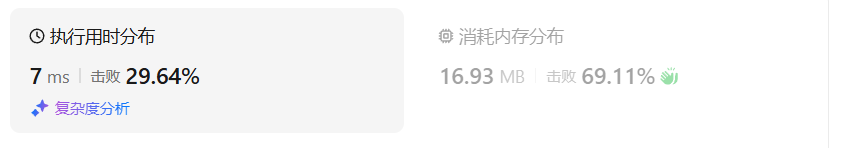
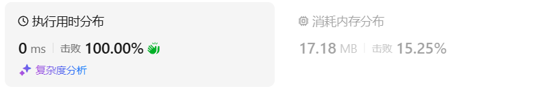

# 101对称二叉树

[101. 对称二叉树 - 力扣（LeetCode）](https://leetcode.cn/problems/symmetric-tree/description/)

## 题目描述

给你一个二叉树的根节点 `root` ， 检查它是否轴对称。

 

**示例 1：**


```
输入：root = [1,2,2,3,4,4,3]
输出：true
```

**示例 2：**


```
输入：root = [1,2,2,null,3,null,3]
输出：false
```

 

**提示：**

- 树中节点数目在范围 `[1, 1000]` 内
- `-100 <= Node.val <= 100`

 

**进阶：**你可以运用递归和迭代两种方法解决这个问题吗？

## 我的C++解法

刚开始的思路是递归，如果左一直等于右则为true

后面发现这个思路是错误的，目标是判断是否轴对称。

再后来想法是直接反转二叉树，如果反转前后不变，则说明是对称二叉树

不得不说这个题是真的有难度

```cpp
/**
 * Definition for a binary tree node.
 * struct TreeNode {
 *     int val;
 *     TreeNode *left;
 *     TreeNode *right;
 *     TreeNode() : val(0), left(nullptr), right(nullptr) {}
 *     TreeNode(int x) : val(x), left(nullptr), right(nullptr) {}
 *     TreeNode(int x, TreeNode *left, TreeNode *right) : val(x), left(left), right(right) {}
 * };
 */
class Solution {
public:
    TreeNode* reverse_tree(TreeNode* node){
        if(!node)   return node;
        swap(node->left,node->right);
        if(node->left)  reverse_tree(node->left);
        if(node->right) reverse_tree(node->right);
        return node;
    }
    // void dfs(TreeNode* node){
    //     if(!node)   return;
    //     if(node->left)  dfs(node->left);
    //     if(node->right) dfs(node->right);
    // }
    bool isSymmetric(TreeNode* root) {
        // 反转之后和本身相等
        if(!root)   return true;
        TreeNode* before = root;
        root = reverse_tree(root);
        // 下面比较两棵树是否相等即可
        queue<TreeNode*> a;
        queue<TreeNode*> b;
        a.push(before);
        b.push(root);
        while(a.size()==b.size() && !a.empty()){
            TreeNode* top1 = a.front();
            TreeNode* top2 = b.front();
            a.pop();
            b.pop();
            if(top1 != top2)    return false;
            else{
                if(top1->left){
                    a.push(top1->left);
                    b.push(top2->left);
                }
                if(top1->right){
                    a.push(top1->right);
                    b.push(top2->right);
                }
            }
        }
        if(a.size()==0 && b.size()==0)   return true;
        // cout<<"1"<<endl;
        return false;
    }
};
```

结果错误

在融合了第100题的判断两棵树是否一致后，在原本的基础上，把返回方向改变一下。

```cpp
/**
 * Definition for a binary tree node.
 * struct TreeNode {
 *     int val;
 *     TreeNode *left;
 *     TreeNode *right;
 *     TreeNode() : val(0), left(nullptr), right(nullptr) {}
 *     TreeNode(int x) : val(x), left(nullptr), right(nullptr) {}
 *     TreeNode(int x, TreeNode *left, TreeNode *right) : val(x), left(left), right(right) {}
 * };
 */
class Solution {
public:
    bool isSameTree(TreeNode* p, TreeNode* q) {
        if(p==nullptr && q==nullptr)    return  true;
        else if(p==nullptr || q==nullptr)   return false;
        //只剩下两个节点都是非空节点的情况
        if(p->val!=q->val)    return false;
        return isSameTree(p->left,q->right) && isSameTree(p->right,q->left);
    }
    bool isSymmetric(TreeNode* root) {
        if(!root)   return true;
        TreeNode* l = root->left;
        TreeNode* r = root->right;
        return isSameTree(l,r);
    }
};
```

结果：



改递归为迭代后：

```cpp
class Solution {
public:
    bool isSameTree(TreeNode* p, TreeNode* q) {
        if(p==nullptr && q==nullptr)    return  true;
        else if(p==nullptr || q==nullptr)   return false;
        stack<TreeNode*> s;
        s.push(p);
        s.push(q);
        while(!s.empty()){
            TreeNode* b = s.top();s.pop();
            TreeNode* a = s.top();s.pop();
            if(a->val!=b->val)  return false;
            if(a->left!=nullptr && b->right!=nullptr){
                s.push(a->left);
                s.push(b->right);
            }
            else if(a->left!=nullptr || b->right!=nullptr)   return false;
           
            if(a->right!=nullptr && b->left!=nullptr){
                s.push(a->right);
                s.push(b->left);
            }
            else if(a->right!=nullptr || b->left!=nullptr)   return false;            
        }
        return true;
    }
    bool isSymmetric(TreeNode* root) {
        if(!root)   return true;
        TreeNode* l = root->left;
        TreeNode* r = root->right;
        return isSameTree(l,r);
    }
};
```

结果：



## C++参考答案

### 递归

如果同时满足下面的条件，两个树互为镜像：

- 它们的两个根结点具有相同的值
- 每个树的右子树都与另一个树的左子树镜像对称

我们可以实现这样一个递归函数，通过「同步移动」两个指针的方法来遍历这棵树，p指针和 q 指针一开始都指向这棵树的根，随后 p右移时，q 左移，p 左移时，q右移。每次检查当前 p 和 q节点的值是否相等，如果相等再判断左右子树是否对称。

```cpp
class Solution {
public:
    bool check(TreeNode *p, TreeNode *q) {
        if (!p && !q) return true;
        //两个节点均为空则为true
        if (!p || !q) return false;
        //一个空一个不空则为false
        return p->val == q->val && check(p->left, q->right) && check(p->right, q->left);
    }

    bool isSymmetric(TreeNode* root) {
        return check(root, root);
    }
};
```

```python
class Solution {
public:
    bool compare(TreeNode* left, TreeNode* right) {
        // 首先排除空节点的情况
        if (left == NULL && right != NULL) return false;
        else if (left != NULL && right == NULL) return false;
        else if (left == NULL && right == NULL) return true;
        // 排除了空节点，再排除数值不相同的情况
        else if (left->val != right->val) return false;

        // 此时就是：左右节点都不为空，且数值相同的情况
        // 此时才做递归，做下一层的判断
        bool outside = compare(left->left, right->right);   // 左子树：左、 右子树：右
        bool inside = compare(left->right, right->left);    // 左子树：右、 右子树：左
        bool isSame = outside && inside;                    // 左子树：中、 右子树：中 （逻辑处理）
        return isSame;

    }
    bool isSymmetric(TreeNode* root) {
        if (root == NULL) return true;
        return compare(root->left, root->right);
    }
};
```


### 迭代

引入一个队列，这是把递归程序改写成迭代程序的常用方法。初始化时我们把根节点入队两次。每次提取两个结点并比较它们的值（队列中每两个连续的结点应该是相等的，而且它们的子树互为镜像），然后将两个结点的左右子结点按相反的顺序插入队列中。当队列为空时，或者我们检测到树不对称（即从队列中取出两个不相等的连续结点）时，该算法结束。

```cpp
class Solution {
public:
    bool check(TreeNode *u, TreeNode *v) {
        queue <TreeNode*> q;
        q.push(u); q.push(v);
        while (!q.empty()) {
            u = q.front(); q.pop();
            v = q.front(); q.pop();
            if (!u && !v) continue;
            if ((!u || !v) || (u->val != v->val)) return false;

            q.push(u->left); 
            q.push(v->right);

            q.push(u->right); 
            q.push(v->left);
        }
        return true;
    }

    bool isSymmetric(TreeNode* root) {
        return check(root, root);
    }
};
```

通过队列来判断根节点的左子树和右子树的内侧和外侧是否相等，如动画所示


```cpp
class Solution {
public:
    bool isSymmetric(TreeNode* root) {
        if (root == NULL) return true;
        queue<TreeNode*> que;
        que.push(root->left);   // 将左子树头结点加入队列
        que.push(root->right);  // 将右子树头结点加入队列
        
        while (!que.empty()) {  // 接下来就要判断这两个树是否相互翻转
            TreeNode* leftNode = que.front(); que.pop();
            TreeNode* rightNode = que.front(); que.pop();
            if (!leftNode && !rightNode) {  // 左节点为空、右节点为空，此时说明是对称的
                continue;
            }

            // 左右一个节点不为空，或者都不为空但数值不相同，返回false
            if ((!leftNode || !rightNode || (leftNode->val != rightNode->val))) {
                return false;
            }
            que.push(leftNode->left);   // 加入左节点左孩子
            que.push(rightNode->right); // 加入右节点右孩子
            que.push(leftNode->right);  // 加入左节点右孩子
            que.push(rightNode->left);  // 加入右节点左孩子
        }
        return true;
    }
};
```

细心的话，其实可以发现，这个迭代法，其实是把左右两个子树要比较的元素顺序放进一个容器，然后成对成对的取出来进行比较，那么其实使用栈也是可以的。

```cpp
class Solution {
public:
    bool isSymmetric(TreeNode* root) {
        if (root == NULL) return true;
        stack<TreeNode*> st; // 这里改成了栈
        st.push(root->left);
        st.push(root->right);
        while (!st.empty()) {
            TreeNode* leftNode = st.top(); st.pop();
            TreeNode* rightNode = st.top(); st.pop();
            if (!leftNode && !rightNode) {
                continue;
            }
            if ((!leftNode || !rightNode || (leftNode->val != rightNode->val))) {
                return false;
            }
            st.push(leftNode->left);
            st.push(rightNode->right);
            st.push(leftNode->right);
            st.push(rightNode->left);
        }
        return true;
    }
};
```

## C++收获

### C++深拷贝

<center>关键词：深拷贝<center>

在C++中，深拷贝（deep copy）意味着创建一个对象的副本，包括所有它包含的子对象的副本，以及任何它所拥有资源的副本。这确保了原始对象和副本对象完全独立，互不影响。

实现深拷贝通常有以下几种方法：

#### 1. 复制构造函数
为自定义类型提供自定义的复制构造函数，以实现深拷贝。

```cpp
class MyClass {
public:
    int* data;
    size_t size;

    // 默认构造函数
    MyClass(size_t sz) : size(sz), data(new int[sz]) {}

    // 复制构造函数
    MyClass(const MyClass& other) : size(other.size), data(new int[other.size]) {
        std::copy(other.data, other.data + size, data);
    }

    // 析构函数
    ~MyClass() {
        delete[] data;
    }

    // 赋值运算符
    MyClass& operator=(const MyClass& other) {
        if (this != &other) {
            int* newData = new int[other.size];
            std::copy(other.data, other.data + other.size, newData);
            delete[] data;
            data = newData;
            size = other.size;
        }
        return *this;
    }
};
```

#### 2. 赋值运算符
重载赋值运算符以确保深拷贝。

#### 3. 智能指针
使用智能指针（如 `std::unique_ptr` 或 `std::shared_ptr`）来自动管理资源的深拷贝。

```cpp
class MyClass {
public:
    std::unique_ptr<int[]> data;
    size_t size;

    // 构造函数
    MyClass(size_t sz) : size(sz), data(std::make_unique<int[]>(sz)) {}

    // 复制构造函数和赋值运算符由智能指针管理
};
```

#### 4. 序列化和反序列化
通过将对象序列化为字节流，然后将字节流反序列化回新对象，可以实现深拷贝。

#### 注意事项
- **内存管理**：确保为所有新分配的内存提供相应的析构逻辑，以避免内存泄漏。
- **拷贝性能**：深拷贝可能会因为复制大量数据而相对较慢，需要考虑性能影响。
- **对象类型**：深拷贝适用于自定义类型和包含指针或动态分配内存的对象。对于内置类型，深拷贝和浅拷贝没有区别。
- **自定义类型**：对于自定义类型，明确定义何时进行深拷贝、何时进行浅拷贝是很重要的。

深拷贝是C++中管理复杂对象和资源所有权的重要概念，正确实现深拷贝可以防止很多常见的内存和资源管理错误。

在C++中，深拷贝通常是指创建一个对象的完全独立的副本，包括所有子对象和资源。对于自定义类型，这意味着你需要确保所有动态分配的内存或资源在拷贝时都被复制，而不是共享。C++11标准库中的智能指针（如 `std::unique_ptr`）提供了一种自动管理深拷贝和浅拷贝的方式。

以下是一些可以直接调用或实现深拷贝的方法：

#### 使用智能指针（C++11及以上）
通过使用智能指针，如 `std::unique_ptr`，可以自动处理深拷贝。

```cpp
#include <memory>

class MyClass {
public:
    std::unique_ptr<int[]> data;
    size_t size;

    // 构造函数
    MyClass(size_t sz) : size(sz), data(std::make_unique<int[]>(sz)) {}

    // 复制构造函数和赋值运算符由智能指针自动处理深拷贝
};

MyClass obj1(10); // 创建一个对象
MyClass obj2 = obj1; // 直接拷贝，智能指针管理深拷贝
```

#### 手动实现深拷贝
对于不支持自动深拷贝的类型，你需要手动实现复制构造函数和赋值运算符。

```cpp
class MyClass {
public:
    int* data;
    size_t size;

    // 构造函数
    MyClass(size_t sz) : size(sz), data(new int[sz]) {}

    // 复制构造函数
    MyClass(const MyClass& other) : size(other.size), data(new int[other.size]) {
        std::copy(other.data, other.data + size, data);
    }

    // 赋值运算符
    MyClass& operator=(const MyClass& other) {
        if (this != &other) {
            int* newData = new int[other.size];
            std::copy(other.data, other.data + other.size, newData);
            delete[] data;
            data = newData;
            size = other.size;
        }
        return *this;
    }

    // 析构函数
    ~MyClass() {
        delete[] data;
    }
};

MyClass obj1(10); // 创建一个对象
MyClass obj2 = obj1; // 直接拷贝，调用复制构造函数实现深拷贝
```

#### 使用 `std::copy` 或其他标准库函数
对于容器和数组，可以使用 `std::copy` 或其他标准库函数来帮助实现深拷贝。

```cpp
#include <algorithm> // For std::copy
#include <vector>

class MyClass {
public:
    std::vector<int> data;

    // 复制构造函数
    MyClass(const MyClass& other) : data(other.data) {}
};

MyClass obj1{1, 2, 3};
MyClass obj2 = obj1; // 直接拷贝，std::vector 管理深拷贝
```

#### 注意事项
- 自动深拷贝通常由对象的复制构造函数和赋值运算符处理。
- 对于包含指针的类，确保在复制构造函数和赋值运算符中正确复制指针指向的数据。
- 对于大型数据结构，深拷贝可能会涉及大量的内存分配和数据复制，这可能影响性能。
- 确保正确实现析构函数，以避免内存泄漏。

在C++中，深拷贝的正确实现对于防止内存泄漏和其他资源管理错误至关重要。使用智能指针可以简化资源管理，但有时手动实现深拷贝是必要的。

## 我的python解答

```python
# Definition for a binary tree node.
# class TreeNode:
#     def __init__(self, val=0, left=None, right=None):
#         self.val = val
#         self.left = left
#         self.right = right
class Solution:
    def isSymmetric(self, root: Optional[TreeNode]) -> bool:
        def reverse_tree(node:'TreeNode'):
            if not node:    return node
            node.left, node.right = node.right, node.left
            # print("当前交换左右子树的节点信息",node)
            reverse_tree(node.left)
            reverse_tree(node.right)
            return node
        tmp = deepcopy(root)
        # print("交换前：",root)
        # print("反转树：",reverse_tree(root))
        # print("交换后：",root)
        root = reverse_tree(root)
        a = [tmp]
        b = [root]
        while len(a)==len(b) and len(a)!=0:
            top1 = a[0]
            top2 = b[0]
            del a[0]
            del b[0]
            print("top1:",top1)
            print("top2:",top2)
            if top1!=top2:  return False
            if top1.left:
                a.append(top1.left)
                b.append(top2.left)
            if top1.right:
                a.append(top1.right)
                b.append(top2.right)
        if len(a)==0 and len(b)==0: return True
        return False
```

去他妈的。错了

做完100判断两棵树是否一致后：

```python
# Definition for a binary tree node.
# class TreeNode:
#     def __init__(self, val=0, left=None, right=None):
#         self.val = val
#         self.left = left
#         self.right = right
class Solution:
    def isSameTree(self, p: Optional[TreeNode], q: Optional[TreeNode]) -> bool:
        if p == None and q == None: return True
        elif p==None or q==None:    return False
        s = [p,q]
        while len(s):
            b = s[-1]
            s.pop()
            a = s[-1]
            s.pop()
            if a.val != b.val:  return False
            if a.left!=None and b.left!=None:   s.append(a.left),s.append(b.left)
            elif a.left!=None or b.left!=None:  return False
            if a.right!=None and b.right!=None: s.append(a.right),s.append(b.right)
            elif a.right!=None or b.right!=None:    return False
        return True
    def isSymmetric(self, root: Optional[TreeNode]) -> bool:
        def reverse_tree(node:'TreeNode'):
            if not node:    return node
            node.left, node.right = node.right, node.left
            # print("当前交换左右子树的节点信息",node)
            reverse_tree(node.left)
            reverse_tree(node.right)
            return node
        tmp = deepcopy(root)
        # print("交换前：",root)
        # print("反转树：",reverse_tree(root))
        # print("交换后：",root)
        root = reverse_tree(root)
        return self.isSameTree(tmp,root)
```

结果：


```python
class Solution:
    def isSameTree(self, p: Optional[TreeNode], q: Optional[TreeNode]) -> bool:
        if p == None and q == None: return True
        elif p==None or q==None:    return False
        if p.val != q.val:  return False
        return self.isSameTree(p.left,q.left) and self.isSameTree(p.right,q.right)
    def isSymmetric(self, root: Optional[TreeNode]) -> bool:
        def reverse_tree(node:'TreeNode'):
            if not node:    return node
            node.left, node.right = node.right, node.left
            # print("当前交换左右子树的节点信息",node)
            reverse_tree(node.left)
            reverse_tree(node.right)
            return node
        tmp = deepcopy(root)
        # print("交换前：",root)
        # print("反转树：",reverse_tree(root))
        # print("交换后：",root)
        root = reverse_tree(root)
        return self.isSameTree(tmp,root)
```

结果：


## python参考答案

### 递归

```python
class Solution:
    def isSymmetric(self, root: Optional[TreeNode]) -> bool:
        def recur(L, R):
            if not L and not R: return True
            if not L or not R or L.val != R.val: return False
            return recur(L.left, R.right) and recur(L.right, R.left)

        return not root or recur(root.left, root.right)
```

```python
class Solution:
    # 在【100. 相同的树】的基础上稍加改动
    def isSameTree(self, p: Optional[TreeNode], q: Optional[TreeNode]) -> bool:
        if p is None or q is None:
            return p is q
        return p.val == q.val and self.isSameTree(p.left, q.right) and self.isSameTree(p.right, q.left)

    def isSymmetric(self, root: Optional[TreeNode]) -> bool:
        return self.isSameTree(root.left, root.right)
```

### 迭代

```python
import collections
class Solution:
    def isSymmetric(self, root: TreeNode) -> bool:
        if not root:
            return True
        queue = collections.deque()
        queue.append(root.left) #将左子树头结点加入队列
        queue.append(root.right) #将右子树头结点加入队列
        while queue: #接下来就要判断这这两个树是否相互翻转
            leftNode = queue.popleft()
            rightNode = queue.popleft()
            if not leftNode and not rightNode: #左节点为空、右节点为空，此时说明是对称的
                continue
            
            #左右一个节点不为空，或者都不为空但数值不相同，返回false
            if not leftNode or not rightNode or leftNode.val != rightNode.val:
                return False
            queue.append(leftNode.left) #加入左节点左孩子
            queue.append(rightNode.right) #加入右节点右孩子
            queue.append(leftNode.right) #加入左节点右孩子
            queue.append(rightNode.left) #加入右节点左孩子
        return True
```

```python
class Solution:
    def isSymmetric(self, root: TreeNode) -> bool:
        if not root:
            return True
        st = [] #这里改成了栈
        st.append(root.left)
        st.append(root.right)
        while st:
            rightNode = st.pop()
            leftNode = st.pop()
            if not leftNode and not rightNode:
                continue
            if not leftNode or not rightNode or leftNode.val != rightNode.val:
                return False
            st.append(leftNode.left)
            st.append(rightNode.right)
            st.append(leftNode.right)
            st.append(rightNode.left)
        return True
```

```python
# 层次遍历
class Solution:
    def isSymmetric(self, root: TreeNode) -> bool:
        if not root:
            return True
        
        queue = collections.deque([root.left, root.right])
        
        while queue:
            level_size = len(queue)
            
            if level_size % 2 != 0:
                return False
            
            level_vals = []
            for i in range(level_size):
                node = queue.popleft()
                if node:
                    level_vals.append(node.val)
                    queue.append(node.left)
                    queue.append(node.right)
                else:
                    level_vals.append(None)
                    
            if level_vals != level_vals[::-1]:
                return False
            
        return True
```

## python收获

### 深拷贝

<center>关键词：深拷贝<center>

在Python中，深拷贝（Deep Copy）意味着创建一个对象的全新副本，这个副本与原始对象完全独立，包括对象所引用的所有子对象。如果对象中含有其他对象的引用，深拷贝会递归地复制这些引用的对象，确保副本对象与原始对象在内存中是两个完全不同的实体。

#### 如何实现深拷贝

在Python中，实现深拷贝的最常用方法是使用`copy`模块中的`deepcopy()`函数。

```python
import copy

original_list = [[1, 2, 3], [4, 5, 6]]
copied_list = copy.deepcopy(original_list)
```

在这个例子中，`original_list` 是一个包含列表的列表。使用`deepcopy()`函数后，`copied_list` 将成为一个全新的列表，它包含与原始列表相同的元素，但是它们在内存中是独立的。对`copied_list`的修改不会影响到`original_list`。

#### 深拷贝的应用场景

- **独立性**：当你需要修改对象而又不想影响原始对象时，使用深拷贝可以保证两者的独立性。
- **复杂对象**：对于包含复杂嵌套结构的对象，深拷贝可以确保所有嵌套的对象都被复制。
- **避免副作用**：在函数或方法中使用深拷贝可以避免对调用者传递的对象产生副作用。

#### 注意事项

- **性能**：深拷贝可能会消耗更多的内存和时间，特别是当对象很大或包含大量嵌套对象时。
- **递归问题**：深拷贝过程中可能会遇到递归对象（即对象直接或间接引用自己），这可能导致无限递归。
- **特殊对象**：有些对象可能不支持深拷贝，比如文件句柄或数据库连接。对于这些特殊对象，`deepcopy()` 会抛出异常。

深拷贝在Python中是通过`copy`模块的`deepcopy()`函数来实现的。它递归地复制对象及其所有子对象，创建一个完全独立的副本。这在需要独立操作对象而又不影响原始对象时非常有用。然而，深拷贝可能会因为复制大量数据而影响性能，并且在处理特殊对象或递归对象时需要特别注意。