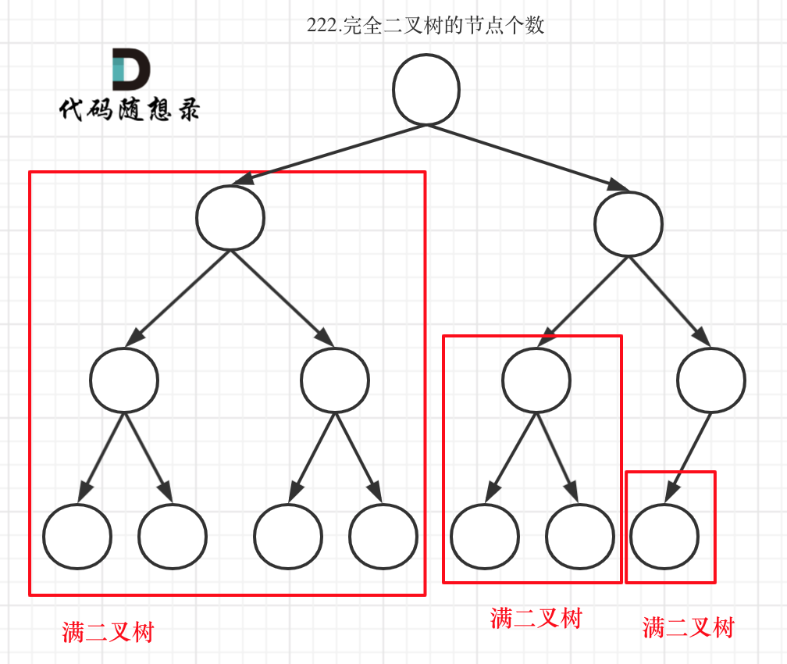

# 222完全二叉树的节点个数

[222. 完全二叉树的节点个数 - 力扣（LeetCode）](https://leetcode.cn/problems/count-complete-tree-nodes/description/)

## 题目描述

给你一棵 **完全二叉树** 的根节点 `root` ，求出该树的节点个数。

[完全二叉树](https://baike.baidu.com/item/完全二叉树/7773232?fr=aladdin) 的定义如下：在完全二叉树中，除了最底层节点可能没填满外，其余每层节点数都达到最大值，并且最下面一层的节点都集中在该层最左边的若干位置。若最底层为第 `h` 层，则该层包含 `1~ 2h` 个节点。

 

**示例 1：**


```
输入：root = [1,2,3,4,5,6]
输出：6
```

**示例 2：**

```
输入：root = []
输出：0
```

**示例 3：**

```
输入：root = [1]
输出：1
```

 

**提示：**

- 树中节点的数目范围是`[0, 5 * 104]`
- `0 <= Node.val <= 5 * 104`
- 题目数据保证输入的树是 **完全二叉树**

 

**进阶：**遍历树来统计节点是一种时间复杂度为 `O(n)` 的简单解决方案。你可以设计一个更快的算法吗？

## 我的C++解法

### 层序遍历

```cpp
/**
 * Definition for a binary tree node.
 * struct TreeNode {
 *     int val;
 *     TreeNode *left;
 *     TreeNode *right;
 *     TreeNode() : val(0), left(nullptr), right(nullptr) {}
 *     TreeNode(int x) : val(x), left(nullptr), right(nullptr) {}
 *     TreeNode(int x, TreeNode *left, TreeNode *right) : val(x), left(left), right(right) {}
 * };
 */
class Solution {
public:
    int countNodes(TreeNode* root) {
        int ans = 0;
        if(!root)   return ans;
        // 还是层序遍历
        queue<TreeNode*> q;
        q.push(root);
        while(!q.empty()){
            TreeNode* top = q.front();
            q.pop();
            ans++;
            if(top->left) q.push(top->left);
            if(top->right)  q.push(top->right);
        }
        return ans;
    }
};
```

结果：


## C++参考答案

### 递归

```cpp
// 版本一
class Solution {
private:
    int getNodesNum(TreeNode* cur) {
        if (cur == NULL) return 0;
        int leftNum = getNodesNum(cur->left);      // 左
        int rightNum = getNodesNum(cur->right);    // 右
        int treeNum = leftNum + rightNum + 1;      // 中
        return treeNum;
    }
public:
    int countNodes(TreeNode* root) {
        return getNodesNum(root);
    }
};
```

```cpp
// 版本二
class Solution {
public:
    int countNodes(TreeNode* root) {
        if (root == NULL) return 0;
        return 1 + countNodes(root->left) + countNodes(root->right);
    }
};
```

### 迭代

```cpp
class Solution {
public:
    int countNodes(TreeNode* root) {
        queue<TreeNode*> que;
        if (root != NULL) que.push(root);
        int result = 0;
        while (!que.empty()) {
            int size = que.size();
            for (int i = 0; i < size; i++) {
                TreeNode* node = que.front();
                que.pop();
                result++;   // 记录节点数量
                if (node->left) que.push(node->left);
                if (node->right) que.push(node->right);
            }
        }
        return result;
    }
};
```

### 从完全二叉树的性质入手

完全二叉树只有两种情况，情况一：就是满二叉树，情况二：最后一层叶子节点没有满。

对于情况一，可以直接用 2^树深度 - 1 来计算，注意这里根节点深度为1。

对于情况二，分别递归左孩子，和右孩子，递归到某一深度一定会有左孩子或者右孩子为满二叉树，然后依然可以按照情况1来计算。




可以看出如果整个树不是满二叉树，就递归其左右孩子，直到遇到满二叉树为止，用公式计算这个子树（满二叉树）的节点数量。这里关键在于如何去判断一个左子树或者右子树是不是满二叉树呢？在完全二叉树中，如果递归向左遍历的深度等于递归向右遍历的深度，那说明就是满二叉树。如图：


在完全二叉树中，如果递归向左遍历的深度不等于递归向右遍历的深度，则说明不是满二叉树，如图：


```cpp
class Solution {
public:
    int countNodes(TreeNode* root) {
        if (root == nullptr) return 0;
        TreeNode* left = root->left;
        TreeNode* right = root->right;
        int leftDepth = 0, rightDepth = 0; // 这里初始为0是有目的的，为了下面求指数方便
        while (left) {  // 求左子树深度
            left = left->left;
            leftDepth++;
        }
        while (right) { // 求右子树深度
            right = right->right;
            rightDepth++;
        }
        if (leftDepth == rightDepth) {
            return (2 << leftDepth) - 1; // 注意(2<<1) 相当于2^2，所以leftDepth初始为0
        }
        return countNodes(root->left) + countNodes(root->right) + 1;
    }
};
```

### 二分查找

https://leetcode.cn/problems/count-complete-tree-nodes/solutions/2456908/javapython3cer-fen-cha-zhao-wei-yun-suan-idof

## C++收获


## 我的python解答

### 层序遍历

```python
# Definition for a binary tree node.
# class TreeNode:
#     def __init__(self, val=0, left=None, right=None):
#         self.val = val
#         self.left = left
#         self.right = right
class Solution:
    def countNodes(self, root: Optional[TreeNode]) -> int:
        # 层序遍历
        ans = 0
        if not root:    return ans
        q = [root]
        ans +=1
        while len(q):
            top = q[0]
            del q[0]
            if top.left!=None:
                q.append(top.left)
                ans+=1
            if top.right:
                q.append(top.right)
                ans+=1
        return ans
```

结果：


## python参考答案

### 递归

```python
class Solution:
    def countNodes(self, root: TreeNode) -> int:
        return self.getNodesNum(root)
        
    def getNodesNum(self, cur):
        if not cur:
            return 0
        leftNum = self.getNodesNum(cur.left) #左
        rightNum = self.getNodesNum(cur.right) #右
        treeNum = leftNum + rightNum + 1 #中
        return treeNum
```

```python
class Solution:
    def countNodes(self, root: TreeNode) -> int:
        if not root:
            return 0
        return 1 + self.countNodes(root.left) + self.countNodes(root.right)
```

### 迭代

```python
import collections
class Solution:
    def countNodes(self, root: TreeNode) -> int:
        queue = collections.deque()
        if root:
            queue.append(root)
        result = 0
        while queue:
            size = len(queue)
            for i in range(size):
                node = queue.popleft()
                result += 1 #记录节点数量
                if node.left:
                    queue.append(node.left)
                if node.right:
                    queue.append(node.right)
        return result
```

### 完全二叉树

```python
class Solution:
    def countNodes(self, root: TreeNode) -> int:
        if not root:
            return 0
        left = root.left
        right = root.right
        leftDepth = 0 #这里初始为0是有目的的，为了下面求指数方便
        rightDepth = 0
        while left: #求左子树深度
            left = left.left
            leftDepth += 1
        while right: #求右子树深度
            right = right.right
            rightDepth += 1
        if leftDepth == rightDepth:
            return (2 << leftDepth) - 1 #注意(2<<1) 相当于2^2，所以leftDepth初始为0
        return self.countNodes(root.left) + self.countNodes(root.right) + 1
```

```python
class Solution: # 利用完全二叉树特性
    def countNodes(self, root: TreeNode) -> int:
        if not root: return 0
        count = 1
        left = root.left; right = root.right
        while left and right:
            count+=1
            left = left.left; right = right.right
        if not left and not right: # 如果同时到底说明是满二叉树，反之则不是
            return 2**count-1
        return 1+self.countNodes(root.left)+self.countNodes(root.right)  
```

```python
class Solution: # 利用完全二叉树特性
    def countNodes(self, root: TreeNode) -> int:
        if not root: return 0
        count = 0
        left = root.left; right = root.right
        while left and right:
            count+=1
            left = left.left; right = right.right
        if not left and not right: # 如果同时到底说明是满二叉树，反之则不是
            return (2<<count)-1
        return 1+self.countNodes(root.left)+self.countNodes(root.right)  
```

### 二分查找

https://leetcode.cn/problems/count-complete-tree-nodes/solutions/2456908/javapython3cer-fen-cha-zhao-wei-yun-suan-idof

## python收获