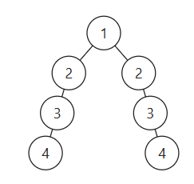

# 110平衡二叉树

[110. 平衡二叉树 - 力扣（LeetCode）](https://leetcode.cn/problems/balanced-binary-tree/description/)

## 题目描述

给定一个二叉树，判断它是否是 平衡二叉树

**示例 1：**


```
输入：root = [3,9,20,null,null,15,7]
输出：true
```

**示例 2：**


```
输入：root = [1,2,2,3,3,null,null,4,4]
输出：false
```

**示例 3：**

```
输入：root = []
输出：true
```

**提示：**

- 树中的节点数在范围 `[0, 5000]` 内
- `-104 <= Node.val <= 104`

## 我的C++解法

### 迭代

思路是计算每一个节点的左右子树大小。

最开始的做法：

```cpp
class Solution {
public:
    pair<int,int> get_depth(TreeNode* node){
        if(!node)   return make_pair(0,0);
        // cout<<"当前节点值："<<node->val<<endl;
        int l = 0;
        int r = 0;
        if(node->left){
            l+=get_depth(node->left).first;
            l++;
        }
        if(node->right){
            // r++;
            // get_depth(node->right);
            r+=get_depth(node->right).second;
            r++;
        }
        // cout<<"左子树："<<l<<"右子树"<<r<<endl;
        return make_pair(l,r);
    }
    bool isBalanced(TreeNode* root) {
        //平衡二叉树的定义就是左右子树深度差小于等于1
        if(!root)   return true;
        auto p =get_depth(root);
        if(abs(p.first - p.second)<=1) return true;
        return false;
    }
};
```

错在l和r不应该只加对应的数，应该返回的是当前节点的子树的最大深度，即max值。

修改后发现对于一些实例还是错误，比如这个图：



因为返回的一直是max，这就导致根节点得到的左深度4 ，右深度也是4，返回了true

应该在递归的时候遇见不满足题意的就返回false

但是我采用了另一个办法，对不合适的节点返回-1，-1数值对。最后使得根节点也是-1,-1键值对。再进行判断。

```cpp
/**
 * Definition for a binary tree node.
 * struct TreeNode {
 *     int val;
 *     TreeNode *left;
 *     TreeNode *right;
 *     TreeNode() : val(0), left(nullptr), right(nullptr) {}
 *     TreeNode(int x) : val(x), left(nullptr), right(nullptr) {}
 *     TreeNode(int x, TreeNode *left, TreeNode *right) : val(x), left(left), right(right) {}
 * };
 */
class Solution {
public:
    pair<int,int> get_depth(TreeNode* node){
        if(!node)   return make_pair(0,0);
        
        int l = 0;
        int r = 0;
        if(node->left){
            auto tmp_l = get_depth(node->left);
            int max_l = max(tmp_l.first,tmp_l.second);
            if(max_l==-1)   l=-1;
            else    l+=(max_l+1);
        }
        if(node->right){
            // r++;
            auto tmp_r = get_depth(node->right);
            int max_r=max(tmp_r.second,tmp_r.first);
            if(max_r==-1)   r = -1;
            else    r+=(max_r+1);
        }
        if(abs(l-r)>1 || l==-1 || r==-1){
            // cout<<"当前节点值："<<node->val<<endl;
            // cout<<"左子树："<<-1<<"右子树"<<-1<<endl;
            return make_pair(-1,-1);
        }
        // cout<<"当前节点值："<<node->val<<endl;
        // cout<<"左子树："<<l<<"右子树"<<r<<endl;
        return make_pair(l,r);
    }
    bool isBalanced(TreeNode* root) {
        //平衡二叉树的定义就是左右子树深度差小于等于1
        if(!root)   return true;
        auto p =get_depth(root);
        if(p.first==-1) return false;
        if(abs(p.first - p.second)<=1) return true;
        return false;
    }
};
```

结果：


## C++参考答案

### 递归

要求比较高度，必然是要后序遍历。递归三步曲分析：

1.明确递归函数的参数和返回值

参数：当前传入节点。 返回值：以当前传入节点为根节点的树的高度。

那么如何标记左右子树是否差值大于1呢？

如果当前传入节点为根节点的二叉树已经不是二叉平衡树了，还返回高度的话就没有意义了。

所以如果已经不是二叉平衡树了，可以返回-1 来标记已经不符合平衡树的规则了。

代码如下：

```cpp
// -1 表示已经不是平衡二叉树了，否则返回值是以该节点为根节点树的高度
int getHeight(TreeNode* node)
```

2.明确终止条件

递归的过程中依然是遇到空节点了为终止，返回0，表示当前节点为根节点的树高度为0

代码如下：

```cpp
if (node == NULL) {
    return 0;
}
```

3.明确单层递归的逻辑

如何判断以当前传入节点为根节点的二叉树是否是平衡二叉树呢？当然是其左子树高度和其右子树高度的差值。

分别求出其左右子树的高度，然后如果差值小于等于1，则返回当前二叉树的高度，否则返回-1，表示已经不是二叉平衡树了。

代码如下：

```cpp
int leftHeight = getHeight(node->left); // 左
if (leftHeight == -1) return -1;
int rightHeight = getHeight(node->right); // 右
if (rightHeight == -1) return -1;

int result;
if (abs(leftHeight - rightHeight) > 1) {  // 中
    result = -1;
} else {
    result = 1 + max(leftHeight, rightHeight); // 以当前节点为根节点的树的最大高度
}

return result;
```

代码精简之后如下：

```cpp
int leftHeight = getHeight(node->left);
if (leftHeight == -1) return -1;
int rightHeight = getHeight(node->right);
if (rightHeight == -1) return -1;
return abs(leftHeight - rightHeight) > 1 ? -1 : 1 + max(leftHeight, rightHeight);
```

此时递归的函数就已经写出来了，这个递归的函数传入节点指针，返回以该节点为根节点的二叉树的高度，如果不是二叉平衡树，则返回-1。

getHeight整体代码如下：

```cpp
int getHeight(TreeNode* node) {
    if (node == NULL) {
        return 0;
    }
    int leftHeight = getHeight(node->left);
    if (leftHeight == -1) return -1;
    int rightHeight = getHeight(node->right);
    if (rightHeight == -1) return -1;
    return abs(leftHeight - rightHeight) > 1 ? -1 : 1 + max(leftHeight, rightHeight);
}
```

最后本题整体递归代码如下：

```cpp
class Solution {
public:
    // 返回以该节点为根节点的二叉树的高度，如果不是平衡二叉树了则返回-1
    int getHeight(TreeNode* node) {
        if (node == NULL) {
            return 0;
        }
        int leftHeight = getHeight(node->left);
        if (leftHeight == -1) return -1;
        int rightHeight = getHeight(node->right);
        if (rightHeight == -1) return -1;
        return abs(leftHeight - rightHeight) > 1 ? -1 : 1 + max(leftHeight, rightHeight);
    }
    bool isBalanced(TreeNode* root) {
        return getHeight(root) == -1 ? false : true;
    }
};
```

```cpp
class Solution {
public:
    int height(TreeNode* root) {
        if (root == NULL) {
            return 0;
        } else {
            return max(height(root->left), height(root->right)) + 1;
        }
    }

    bool isBalanced(TreeNode* root) {
        if (root == NULL) {
            return true;
        } else {
            return abs(height(root->left) - height(root->right)) <= 1 && isBalanced(root->left) && isBalanced(root->right);
        }
    }
};
```

```cpp
class Solution {
public:
    int height(TreeNode* root) {
        if (root == NULL) {
            return 0;
        }
        int leftHeight = height(root->left);
        int rightHeight = height(root->right);
        if (leftHeight == -1 || rightHeight == -1 || abs(leftHeight - rightHeight) > 1) {
            return -1;
        } else {
            return max(leftHeight, rightHeight) + 1;
        }
    }

    bool isBalanced(TreeNode* root) {
        return height(root) >= 0;
    }
};
```


### 迭代

本题的迭代方式可以先定义一个函数，专门用来求高度。这个函数通过栈模拟的后序遍历找每一个节点的高度（其实是通过求传入节点为根节点的最大深度来求的高度）

```cpp
// cur节点的最大深度，就是cur的高度
int getDepth(TreeNode* cur) {
    stack<TreeNode*> st;
    if (cur != NULL) st.push(cur);
    int depth = 0; // 记录深度
    int result = 0;
    while (!st.empty()) {
        TreeNode* node = st.top();
        if (node != NULL) {
            st.pop();
            st.push(node);                          // 中
            st.push(NULL);
            depth++;
            if (node->right) st.push(node->right);  // 右
            if (node->left) st.push(node->left);    // 左

        } else {
            st.pop();
            node = st.top();
            st.pop();
            depth--;
        }
        result = result > depth ? result : depth;
    }
    return result;
}
```

然后再用栈来模拟后序遍历，遍历每一个节点的时候，再去判断左右孩子的高度是否符合，代码如下：

```cpp
bool isBalanced(TreeNode* root) {
    stack<TreeNode*> st;
    if (root == NULL) return true;
    st.push(root);
    while (!st.empty()) {
        TreeNode* node = st.top();                       // 中
        st.pop();
        if (abs(getDepth(node->left) - getDepth(node->right)) > 1) { // 判断左右孩子高度是否符合
            return false;
        }
        if (node->right) st.push(node->right);           // 右（空节点不入栈）
        if (node->left) st.push(node->left);             // 左（空节点不入栈）
    }
    return true;
}
```

整体代码如下

```cpp
class Solution {
private:
    int getDepth(TreeNode* cur) {
        stack<TreeNode*> st;
        if (cur != NULL) st.push(cur);
        int depth = 0; // 记录深度
        int result = 0;
        while (!st.empty()) {
            TreeNode* node = st.top();
            if (node != NULL) {
                st.pop();
                st.push(node);                          // 中
                st.push(NULL);
                depth++;
                if (node->right) st.push(node->right);  // 右
                if (node->left) st.push(node->left);    // 左

            } else {
                st.pop();
                node = st.top();
                st.pop();
                depth--;
            }
            result = result > depth ? result : depth;
        }
        return result;
    }

public:
    bool isBalanced(TreeNode* root) {
        stack<TreeNode*> st;
        if (root == NULL) return true;
        st.push(root);
        while (!st.empty()) {
            TreeNode* node = st.top();                       // 中
            st.pop();
            if (abs(getDepth(node->left) - getDepth(node->right)) > 1) {
                return false;
            }
            if (node->right) st.push(node->right);           // 右（空节点不入栈）
            if (node->left) st.push(node->left);             // 左（空节点不入栈）
        }
        return true;
    }
};
```

```cpp
class Solution {
    int get_height(TreeNode *node) {
        if (node == nullptr) return 0;
        int leftH = get_height(node->left);
        if (leftH == -1) return -1; // 提前退出，不再递归
        int rightH = get_height(node->right);
        if (rightH == -1 || abs(leftH - rightH) > 1) return -1;
        return max(leftH, rightH) + 1;
    }

public:
    bool isBalanced(TreeNode *root) {
        return get_height(root) != -1;
    }
};
```


## C++收获

通过本题可以了解求二叉树深度 和 二叉树高度的差异，求深度适合用前序遍历，而求高度适合用后序遍历。

## 我的python解答

```python
# Definition for a binary tree node.
# class TreeNode:
#     def __init__(self, val=0, left=None, right=None):
#         self.val = val
#         self.left = left
#         self.right = right
class Solution:
    def get_depth(self,node:'TreeNode'):
        if not node:
            return [0,0]
        l = 0
        r = 0
        if node.left:
            tmp_l = self.get_depth(node.left)
            max_l = max(tmp_l[0],tmp_l[1])
            if max_l==-1:   l-=1
            else:   l+=(max_l+1)
        if node.right:
            tmp_r = self.get_depth(node.right)
            max_r = max(tmp_r[0],tmp_r[1])
            if max_r==-1:   r-=1
            else:   r+=(max_r+1)
        if abs(l-r)>1 or l==-1 or r==-1:
            return [-1,-1]
        return [l,r]

    def isBalanced(self, root: Optional[TreeNode]) -> bool:
        # 应该按后序遍历
        if not root:    return True
        p = self.get_depth(root)
        if p[0]==-1:    return False
        if abs(p[0]-p[1])<=1:   return True
        return False
```

结果：


## python参考答案

### 递归

```python
# Definition for a binary tree node.
# class TreeNode:
#     def __init__(self, val=0, left=None, right=None):
#         self.val = val
#         self.left = left
#         self.right = right
class Solution:
    def isBalanced(self, root: TreeNode) -> bool:
        if self.get_height(root) != -1:
            return True
        else:
            return False

    def get_height(self, root: TreeNode) -> int:
        # Base Case
        if not root:
            return 0
        # 左
        if (left_height := self.get_height(root.left)) == -1:
            return -1
        # 右
        if (right_height := self.get_height(root.right)) == -1:
            return -1
        # 中
        if abs(left_height - right_height) > 1:
            return -1
        else:
            return 1 + max(left_height, right_height)
```

递归法精简版：

```python
class Solution:
    def isBalanced(self, root: Optional[TreeNode]) -> bool:
        return self.get_hight(root) != -1
    def get_hight(self, node):
        if not node:
            return 0
        left = self.get_hight(node.left)
        right = self.get_hight(node.right)
        if left == -1 or right == -1 or abs(left - right) > 1:
            return -1
        return max(left, right) + 1
```

```python
class Solution:
    def isBalanced(self, root: TreeNode) -> bool:
        def height(root: TreeNode) -> int:
            if not root:
                return 0
            return max(height(root.left), height(root.right)) + 1

        if not root:
            return True
        return abs(height(root.left) - height(root.right)) <= 1 and self.isBalanced(root.left) and self.isBalanced(root.right)
```

```python
class Solution:
    def isBalanced(self, root: TreeNode) -> bool:
        def height(root: TreeNode) -> int:
            if not root:
                return 0
            leftHeight = height(root.left)
            rightHeight = height(root.right)
            if leftHeight == -1 or rightHeight == -1 or abs(leftHeight - rightHeight) > 1:
                return -1
            else:
                return max(leftHeight, rightHeight) + 1

        return height(root) >= 0
```

```python
class Solution:
    def isBalanced(self, root: Optional[TreeNode]) -> bool:
        def get_height(node: Optional[TreeNode]) -> int:
            if node is None: return 0
            left_h = get_height(node.left)
            if left_h == -1: return -1  # 提前退出，不再递归
            right_h = get_height(node.right)
            if right_h == -1 or abs(left_h - right_h) > 1: return -1
            return max(left_h, right_h) + 1
        return get_height(root) != -1
```


### 迭代

```python
class Solution:
    def getDepth(self, cur):
        st = []
        if cur is not None:
            st.append(cur)
        depth = 0
        result = 0
        while st:
            node = st[-1]
            if node is not None:
                st.pop()
                st.append(node)                           # 中
                st.append(None)
                depth += 1
                if node.right:
                    st.append(node.right)                 # 右
                if node.left:
                    st.append(node.left)                   # 左

            else:               
                node = st.pop()
                st.pop()
                depth -= 1
            result = max(result, depth)
        return result

    def isBalanced(self, root):
        st = []
        if root is None:
            return True
        st.append(root)
        while st:
            node = st.pop()                                 # 中
            if abs(self.getDepth(node.left) - self.getDepth(node.right)) > 1:
                return False
            if node.right:
                st.append(node.right)                       # 右（空节点不入栈）
            if node.left:
                st.append(node.left)                         # 左（空节点不入栈）
        return True
```

迭代法精简版：

```python
class Solution:
    def isBalanced(self, root: Optional[TreeNode]) -> bool:
        if not root:
            return True

        height_map = {}
        stack = [root]
        while stack:
            node = stack.pop()
            if node:
                stack.append(node)
                stack.append(None)
                if node.left: stack.append(node.left)
                if node.right: stack.append(node.right)
            else:
                real_node = stack.pop()
                left, right = height_map.get(real_node.left, 0), height_map.get(real_node.right, 0)
                if abs(left - right) > 1:
                    return False
                height_map[real_node] = 1 + max(left, right)
        return True
```

## python收获