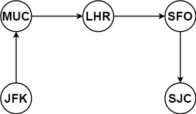

# 332重新安排行程（困难）

[332. 重新安排行程 - 力扣（LeetCode）](https://leetcode.cn/problems/reconstruct-itinerary/description/)

## 题目描述

给你一份航线列表 `tickets` ，其中 `tickets[i] = [fromi, toi]` 表示飞机出发和降落的机场地点。请你对该行程进行重新规划排序。

所有这些机票都属于一个从 `JFK`（肯尼迪国际机场）出发的先生，所以该行程必须从 `JFK` 开始。如果存在多种有效的行程，请你按字典排序返回最小的行程组合。

- 例如，行程 `["JFK", "LGA"]` 与 `["JFK", "LGB"]` 相比就更小，排序更靠前。

假定所有机票至少存在一种合理的行程。且所有的机票 必须都用一次 且 只能用一次。

 

**示例 1：**



```
输入：tickets = [["MUC","LHR"],["JFK","MUC"],["SFO","SJC"],["LHR","SFO"]]
输出：["JFK","MUC","LHR","SFO","SJC"]
```

**示例 2：**


```
输入：tickets = [["JFK","SFO"],["JFK","ATL"],["SFO","ATL"],["ATL","JFK"],["ATL","SFO"]]
输出：["JFK","ATL","JFK","SFO","ATL","SFO"]
解释：另一种有效的行程是 ["JFK","SFO","ATL","JFK","ATL","SFO"] ，但是它字典排序更大更靠后。
```

 

**提示：**

- `1 <= tickets.length <= 300`
- `tickets[i].length == 2`
- `fromi.length == 3`
- `toi.length == 3`
- `fromi` 和 `toi` 由大写英文字母组成
- `fromi != toi`

## 我的C++解法

现在的问题是读不懂题意

意思是说有n张机票，返回的结果就要有n+1个元素，然后找所有元素排列消耗最小的。

消耗可以把字母映射到数字（cost），比如字母A消耗1，这样子，寻找消耗最小的结果。

```cpp
class Solution {
private:
    // unordered_map<char,int> cost={{'A':1},{'B':2},{'C':3},{'D':4},{'E':5},{'F':6},{'G':7},{'H':8},{'I':9},{'J':10},{'K':11},{'L':12},{'M':13},{'N':14},{'O':15},{'P':16},{'Q':17},{'R':18},{'S':19},{'T':20},{'U':21},{'V':22},{'W':23},{'X':24},{'Y':25},{'Z':26}};
    std::unordered_map<char, int> cost = {
        {'A', 1}, {'B', 2}, {'C', 3}, {'D', 4}, {'E', 5},
        {'F', 6}, {'G', 7}, {'H', 8}, {'I', 9}, {'J', 10},
        {'K', 11}, {'L', 12}, {'M', 13}, {'N', 14}, {'O', 15},
        {'P', 16}, {'Q', 17}, {'R', 18}, {'S', 19}, {'T', 20},
        {'U', 21}, {'V', 22}, {'W', 23}, {'X', 24}, {'Y', 25},
        {'Z', 26}
    };
    vector<string> ans;
    vector<string> real_ans;
    int total_cost;// 记录当前总和的花费
    int cur_cost;// 记录当前ans的花费
    vector<int> used;
    vector<vector<int>> cost_of_tickets;
    void backtrack(vector<vector<string>>& tickets,string start){
        if(ans.size()==tickets.size()+1 && cur_cost>total_cost){
            real_ans = ans;
            cur_cost = total_cost;
            return;
        }
        for(int i = 0;i<tickets.size();++i){
            if(used[i]==1 || tickets[i][0]!=start)  continue;
            // 已经找到start开头的tickets组合了
            used[i] = 1;
            ans.push_back(tickets[i][0]);
            total_cost += cost_of_tickets[i][0];
            ans.push_back(tickets[i][1]);
            total_cost += cost_of_tickets[i][1];
            backtrack(tickets,tickets[i][1]);
            ans.pop_back();
            total_cost -= cost_of_tickets[i][1];
            ans.pop_back();
            total_cost -= cost_of_tickets[i][0];
            used[i] = 0;
        }
        return;
    }
    void get_cost(vector<vector<string>>& tickets,vector<vector<int>>& cost_of_tickets){
        for(int i=0;i<tickets.size();++i){
            auto iter = tickets[i];
            int cost1=0;
            int cost2=0;
            for(int j=0;j<3;j++){
                cost1 += cost[iter[0][i]];
                cost2 += cost[iter[1][i]];
            }
            vector<int> tmp;
            tmp.push_back(cost1);
            tmp.push_back(cost2);
            cost_of_tickets.push_back(tmp);
            tmp.clear();
        }
        return;
    }


public:
    vector<string> findItinerary(vector<vector<string>>& tickets) {
        total_cost = 0;
        ans.clear();
        real_ans.clear();
        used.resize(tickets.size());
        string start = "JFK";
        cost_of_tickets.clear();
        get_cost(tickets,cost_of_tickets); // 得到了花费数组
        cur_cost = INT_MAX;
        backtrack(tickets,start);
        return real_ans;
    }
};
```

这是第一次的代码，错在了重复把元素加入进去，start应该不加入ans中的

修改后：

```cpp
class Solution {
private:
    std::unordered_map<char, int> cost = {
        {'A', 1}, {'B', 2}, {'C', 3}, {'D', 4}, {'E', 5},
        {'F', 6}, {'G', 7}, {'H', 8}, {'I', 9}, {'J', 10},
        {'K', 11}, {'L', 12}, {'M', 13}, {'N', 14}, {'O', 15},
        {'P', 16}, {'Q', 17}, {'R', 18}, {'S', 19}, {'T', 20},
        {'U', 21}, {'V', 22}, {'W', 23}, {'X', 24}, {'Y', 25},
        {'Z', 26}
    };
    vector<string> ans;
    vector<string> real_ans;
    int total_cost;// 记录当前总和的花费
    int cur_cost;// 记录当前ans的花费
    vector<int> used;
    vector<vector<int>> cost_of_tickets;
    void backtrack(vector<vector<string>>& tickets,string start){
        if(ans.size()==tickets.size()+1 && cur_cost>total_cost){
            real_ans = ans;
            cur_cost = total_cost;
            return;
        }
        for(int i = 0;i<tickets.size();++i){
            if(used[i]==1 || tickets[i][0]!=start)  continue;
            // 已经找到start开头的tickets组合了
            used[i] = 1;
            ans.push_back(tickets[i][1]);
            total_cost += cost_of_tickets[i][1];
            backtrack(tickets,tickets[i][1]);
            ans.pop_back();
            total_cost -= cost_of_tickets[i][1];
            used[i] = 0;
        }
        return;
    }
    void get_cost(vector<vector<string>>& tickets,vector<vector<int>>& cost_of_tickets){
        for(int i=0;i<tickets.size();++i){
            auto iter = tickets[i];
            int cost1=0;
            int cost2=0;
            for(int j=0;j<3;j++){
                cost1 += cost[iter[0][i]];
                cost2 += cost[iter[1][i]];
            }
            vector<int> tmp;
            tmp.push_back(cost1);
            tmp.push_back(cost2);
            cost_of_tickets.push_back(tmp);
            tmp.clear();
        }
        return;
    }


public:
    vector<string> findItinerary(vector<vector<string>>& tickets) {
        total_cost = 0;
        ans.clear();
        real_ans.clear();
        used.resize(tickets.size());
        string start = "JFK";
        ans.push_back(start);
        cost_of_tickets.clear();
        get_cost(tickets,cost_of_tickets); // 得到了花费数组
        cur_cost = INT_MAX;
        backtrack(tickets,start);
        return real_ans;
    }
};
```

结果：


错在了不管哪种结果，最终的total_cost都是定值！修改思路：如何使得real_ans能够更新？

我的第一想法：加一个flag，遇见花费更少的则进行标记，需要更新

绷不住了，可以直接判断real_ans和ans的大小，方法就是比较字典，那么所有的求cost都可以删了

```cpp
class Solution {
private:
    vector<string> ans;
    vector<string> real_ans;
    vector<int> used;
    void backtrack(vector<vector<string>>& tickets,string start){
        if(ans.size()==tickets.size()+1){
            if(real_ans.size()==0)  real_ans = ans;
            else if(real_ans>ans)   real_ans = ans;
            return;
        }
        for(int i = 0;i<tickets.size();++i){
            if(used[i]==1 || tickets[i][0]!=start)  continue;
            // 已经找到start开头的tickets组合了
            used[i] = 1;
            ans.push_back(tickets[i][1]);
            backtrack(tickets,tickets[i][1]);
            ans.pop_back();
            used[i] = 0;
        }
        return;
    }

public:
    vector<string> findItinerary(vector<vector<string>>& tickets) {
        ans.clear();
        real_ans.clear();
        used.resize(tickets.size());
        string start = "JFK";
        ans.push_back(start);
        backtrack(tickets,start);
        return real_ans;
    }
};
```

呃呃了，这个方法超时了，因为每一次都要判断，花费太高了


优化方法就是每次循环的目的是检索出下一个组合，使用了统计花费

```cpp
class Solution {
private:
    vector<string> ans;
    vector<string> real_ans;
    vector<int> used;
    vector<int> cost_of_tickets;//只用记录每一组的最后的花销即可
    unordered_map<char, int> cost = {
        {'A', 1}, {'B', 2}, {'C', 3}, {'D', 4}, {'E', 5},
        {'F', 6}, {'G', 7}, {'H', 8}, {'I', 9}, {'J', 10},
        {'K', 11}, {'L', 12}, {'M', 13}, {'N', 14}, {'O', 15},
        {'P', 16}, {'Q', 17}, {'R', 18}, {'S', 19}, {'T', 20},
        {'U', 21}, {'V', 22}, {'W', 23}, {'X', 24}, {'Y', 25},
        {'Z', 26}
    };
    void backtrack(vector<vector<string>>& tickets,string start){
        if(ans.size()==tickets.size()+1){
            if(real_ans.size()==0)  real_ans = ans;
            else if(real_ans>ans)   real_ans = ans;
            return;
        }
        vector<string> cur;
        cur.push_back(start);
        cur.push_back("ZZZ");
        int choice=0;
        for(int i = 0;i<tickets.size();i++){
            if(used[i]==1 || tickets[i][0]!=start)  continue;
            // 如果每一步都选择的是最小开销的路径就好了 看样子还是要计算cost
            int cur_cost = cost[cur[1][0]]+cost[cur[1][1]]+cost[cur[1][2]];
            if(cur_cost>=cost_of_tickets[i]){
                cur[1] = tickets[i][1];
                choice = i;
            }
        }
        used[choice] = 1;
        ans.push_back(cur[1]);
        backtrack(tickets,cur[1]);      
        return;
    }
    void get_cost(vector<vector<string>>& tickets,vector<int>& cost_of_tickets){
        for(int i=0;i<tickets.size();++i){
            int cost2=0;
            for(int j=0;j<3;j++){
                cost2 += cost[tickets[i][1][j]];
            }
            cost_of_tickets.push_back(cost2);
        }
        return;
    }

public:
    vector<string> findItinerary(vector<vector<string>>& tickets) {
        ans.clear();
        real_ans.clear();
        cost_of_tickets.clear();
        used.resize(tickets.size());
        string start = "JFK";
        ans.push_back(start);
        get_cost(tickets,cost_of_tickets);
        backtrack(tickets,start);
        return real_ans;
    }
};
```

结果：


无能为力了，耗时太久了，今天看看参考答案的思路，明天再战

## C++参考答案

图论中的深度优先搜索，但这是深搜中使用了回溯的例子，在查找路径的时候，如果不回溯，怎么能查到目标路径呢。

**这道题目有几个难点：**

1. 一个行程中，如果航班处理不好容易变成一个圈，成为死循环
2. 有多种解法，字母序靠前排在前面，让很多同学望而退步，如何该记录映射关系呢 ？
3. 使用回溯法（也可以说深搜） 的话，那么终止条件是什么呢？
4. 搜索的过程中，如何遍历一个机场所对应的所有机场。

一个机场映射多个机场，机场之间要靠字母序排列，一个机场映射多个机场，可以使用std::unordered_map，如果让多个机场之间再有顺序的话，就是用std::map 或者std::multimap 或者 std::multiset。这样存放映射关系可以定义为 `unordered_map<string, multiset<string>> targets` 或者 `unordered_map<string, map<string, int>> targets`。

含义如下：

unordered_map<string, multiset> targets：unordered_map<出发机场, 到达机场的集合> targets

unordered_map<string, map<string, int>> targets：unordered_map<出发机场, map<到达机场, 航班次数>> targets

这两个结构，选择后者，因为如果使用`unordered_map<string, multiset<string>> targets` 遍历multiset的时候，不能删除元素，一旦删除元素，迭代器就失效了。

**为什么一定要增删元素呢，正如开篇我给出的图中所示，出发机场和到达机场是会重复的，搜索的过程没及时删除目的机场就会死循环。**所以搜索的过程中就是要不断的删multiset里的元素，那么推荐使用`unordered_map<string, map<string, int>> targets`。

在遍历 `unordered_map<出发机场, map<到达机场, 航班次数>> targets`的过程中，**可以使用"航班次数"这个字段的数字做相应的增减，来标记到达机场是否使用过了。**

如果“航班次数”大于零，说明目的地还可以飞，如果“航班次数”等于零说明目的地不能飞了，而不用对集合做删除元素或者增加元素的操作。

**相当于说我不删，我就做一个标记！**

本题以输入：[["JFK", "KUL"], ["JFK", "NRT"], ["NRT", "JFK"]为例，抽象为树形结构如下：


- 递归函数参数

```cpp
// unordered_map<出发机场, map<到达机场, 航班次数>> targets
unordered_map<string, map<string, int>> targets;
bool backtracking(int ticketNum, vector<string>& result) {
```

**注意函数返回值我用的是bool！**

我们之前讲解回溯算法的时候，一般函数返回值都是void，这次为什么是bool呢？

因为我们只需要找到一个行程，就是在树形结构中唯一的一条通向叶子节点的路线，如图：


所以找到了这个叶子节点了直接返回，需要一个返回值

targets和result都需要初始化

```cpp
for (const vector<string>& vec : tickets) {
    targets[vec[0]][vec[1]]++; // 记录映射关系
}
result.push_back("JFK"); // 起始机场
```

- 递归终止条件

终止条件是：我们回溯遍历的过程中，遇到的机场个数，如果达到了（航班数量+1），那么我们就找到了一个行程，把所有航班串在一起了

- 单层搜索的逻辑

如何遍历一个机场所对应的所有机场呢？

在选择映射函数的时候，不能选择`unordered_map<string, multiset<string>> targets`， 因为一旦有元素增删multiset的迭代器就会失效

**可以说本题既要找到一个对数据进行排序的容器，而且还要容易增删元素，迭代器还不能失效**。

所以选择了`unordered_map<string, map<string, int>> targets` 来做机场之间的映射。

```cpp
for (pair<const string, int>& target : targets[result[result.size() - 1]]) {
    if (target.second > 0 ) { // 记录到达机场是否飞过了
        result.push_back(target.first);
        target.second--;
        if (backtracking(ticketNum, result)) return true;
        result.pop_back();
        target.second++;
    }
}
```

可以看出 通过`unordered_map<string, map<string, int>> targets`里的int字段来判断 这个集合里的机场是否使用过，这样避免了直接去删元素。

```cpp
class Solution {
private:
// unordered_map<出发机场, map<到达机场, 航班次数>> targets
unordered_map<string, map<string, int>> targets;
bool backtracking(int ticketNum, vector<string>& result) {
    if (result.size() == ticketNum + 1) {
        return true;
    }
    for (pair<const string, int>& target : targets[result[result.size() - 1]]) {
        if (target.second > 0 ) { // 记录到达机场是否飞过了
            result.push_back(target.first);
            target.second--;
            if (backtracking(ticketNum, result)) return true;
            result.pop_back();
            target.second++;
        }
    }
    return false;
}
public:
    vector<string> findItinerary(vector<vector<string>>& tickets) {
        targets.clear();
        vector<string> result;
        for (const vector<string>& vec : tickets) {
            targets[vec[0]][vec[1]]++; // 记录映射关系
        }
        result.push_back("JFK"); // 起始机场
        backtracking(tickets.size(), result);
        return result;
    }
};
```


## C++收获


## 我的python解答


## python参考答案

```python
class Solution:
    def findItinerary(self, tickets: List[List[str]]) -> List[str]:
        self.adj = {}

        # sort by the destination alphabetically
        # 根据航班每一站的重点字母顺序排序
        tickets.sort(key=lambda x:x[1])

        # get all possible connection for each destination
        # 罗列每一站的下一个可选项
        for u,v in tickets:
            if u in self.adj: self.adj[u].append(v)
            else: self.adj[u] = [v]

        # 从JFK出发
        self.result = []
        self.dfs("JFK")  # start with JFK

        return self.result[::-1]  # reverse to get the result

    def dfs(self, s):
        # if depart city has flight and the flight can go to another city
        while s in self.adj and len(self.adj[s]) > 0:
            # 找到s能到哪里，选能到的第一个机场
            v = self.adj[s][0]  # we go to the 1 choice of the city
            # 在之后的可选项机场中去掉这个机场
            self.adj[s].pop(0)  # get rid of this choice since we used it
            # 从当前的新出发点开始
            self.dfs(v)  # we start from the new airport

        self.result.append(s)  # after append, it will back track to last node, thus the result list is in reversed order
```


```python
from collections import defaultdict

class Solution:
    def findItinerary(self, tickets):
        targets = defaultdict(list)  # 创建默认字典，用于存储机场映射关系
        for ticket in tickets:
            targets[ticket[0]].append(ticket[1])  # 将机票输入到字典中
        
        for key in targets:
            targets[key].sort(reverse=True)  # 对到达机场列表进行字母逆序排序
        
        result = []
        self.backtracking("JFK", targets, result)  # 调用回溯函数开始搜索路径
        return result[::-1]  # 返回逆序的行程路径
    
    def backtracking(self, airport, targets, result):
        while targets[airport]:  # 当机场还有可到达的机场时
            next_airport = targets[airport].pop()  # 弹出下一个机场
            self.backtracking(next_airport, targets, result)  # 递归调用回溯函数进行深度优先搜索
        result.append(airport)  # 将当前机场添加到行程路径中
```


## python收获