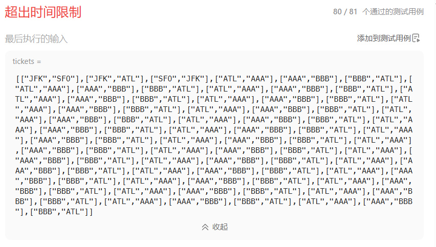
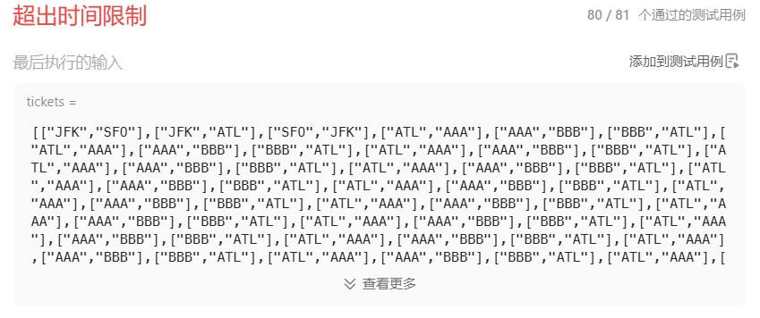

# 332重新安排行程（困难）

[332. 重新安排行程 - 力扣（LeetCode）](https://leetcode.cn/problems/reconstruct-itinerary/description/)

## 题目描述

给你一份航线列表 `tickets` ，其中 `tickets[i] = [fromi, toi]` 表示飞机出发和降落的机场地点。请你对该行程进行重新规划排序。

所有这些机票都属于一个从 `JFK`（肯尼迪国际机场）出发的先生，所以该行程必须从 `JFK` 开始。如果存在多种有效的行程，请你按字典排序返回最小的行程组合。

- 例如，行程 `["JFK", "LGA"]` 与 `["JFK", "LGB"]` 相比就更小，排序更靠前。

假定所有机票至少存在一种合理的行程。且所有的机票 必须都用一次 且 只能用一次。

 

**示例 1：**


```
输入：tickets = [["MUC","LHR"],["JFK","MUC"],["SFO","SJC"],["LHR","SFO"]]
输出：["JFK","MUC","LHR","SFO","SJC"]
```

**示例 2：**


```
输入：tickets = [["JFK","SFO"],["JFK","ATL"],["SFO","ATL"],["ATL","JFK"],["ATL","SFO"]]
输出：["JFK","ATL","JFK","SFO","ATL","SFO"]
解释：另一种有效的行程是 ["JFK","SFO","ATL","JFK","ATL","SFO"] ，但是它字典排序更大更靠后。
```

 

**提示：**

- `1 <= tickets.length <= 300`
- `tickets[i].length == 2`
- `fromi.length == 3`
- `toi.length == 3`
- `fromi` 和 `toi` 由大写英文字母组成
- `fromi != toi`

## 我的C++解法

在昨天的基础上，学到了这种唯一路径和唯一返回值的回溯，需要一个bool类型的返回，这样在遇到有效路径的时候就可以直接返回，不用再pop之后继续遍历了，剪去了大量的枝叶

```cpp
class Solution {
private:
    vector<string> ans;
    vector<string> real_ans;
    vector<int> used;
    bool backtrack(vector<vector<string>>& tickets,string start){
        if(ans.size()==tickets.size()+1){
            if(real_ans.size()==0)  real_ans = ans;
            // else if(real_ans>ans)   real_ans = ans;
            return true;
        }
        for(int i = 0;i<tickets.size();++i){
            if(used[i]==1 || tickets[i][0]!=start)  continue;
            // 已经找到start开头的tickets组合了
            used[i] = 1;
            ans.push_back(tickets[i][1]);
            if(backtrack(tickets,tickets[i][1]))    return true;
            ans.pop_back();
            used[i] = 0;
        }
        return false;
    }

public:
    vector<string> findItinerary(vector<vector<string>>& tickets) {
        ans.clear();
        real_ans.clear();
        used.resize(tickets.size());
        string start = "JFK";
        ans.push_back(start);
        sort(tickets.begin(),tickets.end());
        backtrack(tickets,start);
        return real_ans;
    }
};
```

这样子倒是昨天卡超时的例子通过了，最后一个逆天测试例子没有通过，超时了

能想出这种测试例的也真是人才



 滚他妈的吧，回溯只能到这一步超时了吧

和参考答案的区别在于参考答案使用了哈希表完成映射，使得寻找以start为0号元素的数组更加快捷，而常规的for循环则需要o(n)

## C++参考答案

```cpp
class Solution {
private:
// unordered_map<出发机场, map<到达机场, 航班次数>> targets
unordered_map<string, map<string, int>> targets;
bool backtracking(int ticketNum, vector<string>& result) {
    if (result.size() == ticketNum + 1) {
        return true;
    }
    for (pair<const string, int>& target : targets[result[result.size() - 1]]) {
        if (target.second > 0 ) { // 记录到达机场是否飞过了
            result.push_back(target.first);
            target.second--;
            if (backtracking(ticketNum, result)) return true;
            result.pop_back();
            target.second++;
        }
    }
    return false;
}
public:
    vector<string> findItinerary(vector<vector<string>>& tickets) {
        targets.clear();
        vector<string> result;
        for (const vector<string>& vec : tickets) {
            targets[vec[0]][vec[1]]++; // 记录映射关系
        }
        result.push_back("JFK"); // 起始机场
        backtracking(tickets.size(), result);
        return result;
    }
};
```

结果：


## C++收获


## 我的python解答

```python
class Solution:
    def findItinerary(self, tickets: List[List[str]]) -> List[str]:
        ans = ["JFK"]
        tickets.sort()
        used = [0]*len(tickets)
        start = "JFK"
        def dfs(start:string):
            if len(ans)==len(tickets)+1:
                return True
            for i in range(0,len(tickets)):
                if used[i]==0 and tickets[i][0]==start:
                    ans.append(tickets[i][1])
                    used[i] = 1
                    if dfs(tickets[i][1]):   return True
                    ans.pop()
                    used[i] = 0
            return False
        dfs(start)
        return ans
```

典中典的最后一个例子超时



## python参考答案

```python
class Solution:
    def findItinerary(self, tickets: List[List[str]]) -> List[str]:
        self.adj = {}

        # sort by the destination alphabetically
        # 根据航班每一站的重点字母顺序排序
        tickets.sort(key=lambda x:x[1])

        # get all possible connection for each destination
        # 罗列每一站的下一个可选项
        for u,v in tickets:
            if u in self.adj: self.adj[u].append(v)
            else: self.adj[u] = [v]

        # 从JFK出发
        self.result = []
        self.dfs("JFK")  # start with JFK

        return self.result[::-1]  # reverse to get the result

    def dfs(self, s):
        # if depart city has flight and the flight can go to another city
        while s in self.adj and len(self.adj[s]) > 0:
            # 找到s能到哪里，选能到的第一个机场
            v = self.adj[s][0]  # we go to the 1 choice of the city
            # 在之后的可选项机场中去掉这个机场
            self.adj[s].pop(0)  # get rid of this choice since we used it
            # 从当前的新出发点开始
            self.dfs(v)  # we start from the new airport

        self.result.append(s)  # after append, it will back track to last node, thus the result list is in reversed order
```

结果：


## python收获