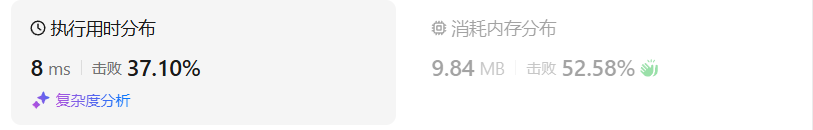
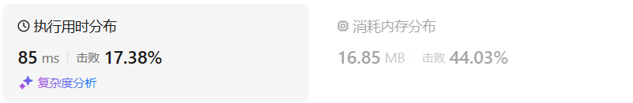

# 51N皇后（困难）

[51. N 皇后 - 力扣（LeetCode）](https://leetcode.cn/problems/n-queens/description/)

## 题目描述

按照国际象棋的规则，皇后可以攻击与之处在同一行或同一列或同一斜线上的棋子。

**n 皇后问题** 研究的是如何将 `n` 个皇后放置在 `n×n` 的棋盘上，并且使皇后彼此之间不能相互攻击。

给你一个整数 `n` ，返回所有不同的 **n 皇后问题** 的解决方案。

每一种解法包含一个不同的 **n 皇后问题** 的棋子放置方案，该方案中 `'Q'` 和 `'.'` 分别代表了皇后和空位。

 

**示例 1：**


```
输入：n = 4
输出：[[".Q..","...Q","Q...","..Q."],["..Q.","Q...","...Q",".Q.."]]
解释：如上图所示，4 皇后问题存在两个不同的解法。
```

**示例 2：**

```
输入：n = 1
输出：[["Q"]]
```

 

**提示：**

- `1 <= n <= 9`

## 我的C++解法

使用used数组，对used数组的操作不是不能访问置为1，而是不能访问则自增1，如果不这样，回溯之后，明明有些位置不可以访问，却因为回溯置0后可以访问了。使用了数字来计数，可以使得回溯操作更加简便。

按照我这个思路的话，这个题的难点就在于对used数组的操作了，就是如何记录横竖和斜线都被标记为不可被使用。

```cpp
class Solution {
private:
    vector<vector<string>> ans;
    int count=0;
    void backtrack(vector<string>& tmp,int& count,int& n,int row,vector<vector<int>>& used){
        if(count==n){
            ans.emplace_back(tmp);
            return;
        }
        for(int i=0;i<n;i++){
            if(used[row][i]!=0)  continue;
            // 得到可以放置Q的位置坐标(row,i)
            fill_used(used,n,row,i);// Q已确认
            tmp[row].replace(i,1,"Q");// 把第row个字符串从索引i开始的1个字符替换为Q
            count++;
            backtrack(tmp,count,n,row+1,used);
            count--;
            tmp[row].replace(i,1,".");
            defill_used(used,n,row,i);
        }
        return;
    }
    void fill_used(vector<vector<int>>& used,int n,int row,int col){
        // 传入选中位置的坐标，填充used数组
        for(int i=0;i<n;i++){
            // 填充所在的行和列
            used[row][i] += 1;
            used[i][col] += 1;
        }
        int left_row = row;
        int left_col = col;
        while(left_col>0 && left_col<n-1 && left_row>0 && left_row<n-1){
            left_col -= 1;
            left_row -= 1;
        }
        for(int i=left_row,j=left_col;i<n && j<n;i++,j++){
            // 填充所在的右下列
            used[i][j] += 1;
        }
        left_row = row;
        left_col = col;
        while(left_col>0 && left_col<n-1 && left_row>0 && left_row<n-1){
            left_col += 1;
            left_row -= 1;
        }
        for(int i=left_row,j=left_col;i<n && j>=0;i++,j--){
            // 填充所在的左下列
            used[i][j] += 1;
        }
        used[row][col] = 1;// Q所在位置置为1
        return;
    }
    void defill_used(vector<vector<int>>& used,int n,int row,int col){
        // 传入选中位置的坐标，填充used数组
        for(int i=0;i<n;i++){
            // 减去所在的行和列
            used[row][i] -= 1;
            used[i][col] -= 1;
        }
        int left_row = row;
        int left_col = col;
        while(left_col>0 && left_col<n-1 && left_row>0 && left_row<n-1){
            left_col -= 1;
            left_row -= 1;
        }
        for(int i=left_row,j=left_col;i<n && j<n;i++,j++){
            // 减去所在的右下列
            used[i][j] -= 1;
        }
        left_row = row;
        left_col = col;
        while(left_col>0 && left_col<n-1 && left_row>0 && left_row<n-1){
            left_col += 1;
            left_row -= 1;
        }
        for(int i=left_row,j=left_col;i<n && j>=0;i++,j--){
            // 减去所在的左下列
            used[i][j] -= 1;
        }
        used[row][col] = 0;// Q所在位置置为0
        return;
    }


public:
    vector<vector<string>> solveNQueens(int n) {
        count = 0;
        string a;
        vector<int> inner_used(n,0);
        vector<vector<int>> used;
        for(int i=0;i<n;i++){
            a+='.';
            used.push_back(inner_used);
        }
        vector<string> tmp(n,a);
        ans.clear();
        backtrack(tmp,count,n,0,used);
        return ans;
    }
};
```

编写出框架之后，顺了一遍，思路是没有问题的，但是报错了，原因就在于while循环找数组左上或者右上的时候用条件`<n`会导致越界，改为小于n-1就可以了，这样跳出while循环的时候最大值是n-1，而不是越界的n了

其次就是填充和减去函数中的最后一个for循环，里面对j的判断第一次错写为`j<n`，这就导致对j来说可以没有限制地自减下去，使得数组越界，改为`j>=0`即可。

结果：



## C++参考答案

```cpp
class Solution {
private:
vector<vector<string>> result;
// n 为输入的棋盘大小
// row 是当前递归到棋盘的第几行了
void backtracking(int n, int row, vector<string>& chessboard) {
    if (row == n) {
        result.push_back(chessboard);
        return;
    }
    for (int col = 0; col < n; col++) {
        if (isValid(row, col, chessboard, n)) { // 验证合法就可以放
            chessboard[row][col] = 'Q'; // 放置皇后
            backtracking(n, row + 1, chessboard);
            chessboard[row][col] = '.'; // 回溯，撤销皇后
        }
    }
}
bool isValid(int row, int col, vector<string>& chessboard, int n) {
    // 检查列
    for (int i = 0; i < row; i++) { // 这是一个剪枝
        if (chessboard[i][col] == 'Q') {
            return false;
        }
    }
    // 检查 45度角是否有皇后
    for (int i = row - 1, j = col - 1; i >=0 && j >= 0; i--, j--) {
        if (chessboard[i][j] == 'Q') {
            return false;
        }
    }
    // 检查 135度角是否有皇后
    for(int i = row - 1, j = col + 1; i >= 0 && j < n; i--, j++) {
        if (chessboard[i][j] == 'Q') {
            return false;
        }
    }
    return true;
}
public:
    vector<vector<string>> solveNQueens(int n) {
        result.clear();
        std::vector<std::string> chessboard(n, std::string(n, '.'));
        backtracking(n, 0, chessboard);
        return result;
    }
};
```

确实啊，used数组倒是显得不必要了，因为我们是逐层进行选择Q位置的，对于想要写入新的Q，只需要同列、左上角和右上角没有Q就可以了，不需要像我那样完全重构used数组。

```cpp
class Solution {
public:
    vector<vector<string>> solveNQueens(int n) {
        vector<vector<string>> ans;
        vector<int> col(n), on_path(n), diag1(n * 2 - 1), diag2(n * 2 - 1);
        function<void(int)> dfs = [&](int r) {
            if (r == n) {
                vector<string> board(n);
                for (int i = 0; i < n; i++) {
                    board[i] = string(col[i], '.') + 'Q' + string(n - 1 - col[i], '.');
                }
                ans.emplace_back(board);
                return;
            }
            for (int c = 0; c < n; c++) {
                int rc = r - c + n - 1;
                if (!on_path[c] && !diag1[r + c] && !diag2[rc]) {
                    col[r] = c;
                    on_path[c] = diag1[r + c] = diag2[rc] = true;
                    dfs(r + 1);
                    on_path[c] = diag1[r + c] = diag2[rc] = false; // 恢复现场
                }
            }
        };
        dfs(0);
        return ans;
    }
};

作者：灵茶山艾府
链接：https://leetcode.cn/problems/n-queens/solutions/2079586/hui-su-tao-lu-miao-sha-nhuang-hou-shi-pi-mljv/
来源：力扣（LeetCode）
著作权归作者所有。商业转载请联系作者获得授权，非商业转载请注明出处。
```

评论区又看见一个想法，就是说如果两Q在一个斜边上，那么考虑到对于两个皇后（r1,c1）和（r2,c2），其在同一条对角线上必定满足|r1-r2|==|c1-c2|

```cpp
class Solution {
public:
    void backtrack(vector<vector<string>>& ans, vector<int>& queens, int l, int n){
        if (l == n) {
            vector<string> res;
            for (int num : queens){
                string s(n, '.');
                s[num] = 'Q';
                res.push_back(s);
            }
            ans.push_back(res);
            return;
        }
        for (int i = 0; i < n; i++){
            bool valid = true;
            for (int j = 0; j < l; j++){
                if (queens[j] == i || abs(queens[j] - i) == abs(l - j)){
                    valid = false;
                    break;
                }
            }
            if (valid){
                queens.push_back(i);
                backtrack(ans, queens, l + 1, n);
                queens.pop_back();
            }            
        }
    }
    vector<vector<string>> solveNQueens(int n) {
        vector<vector<string>> ans;
        vector<int> queens;
        backtrack(ans, queens, 0, n);
        return ans;
    }
};
```


## C++收获


## 我的python解答

py主要在于不知道如何传递参数进去，使得对数据元素进行原地修改

初始化used数组和tmp的时候，我最开始的想法是：

```python
tmp = [['.']*n]*n
used = [[0]*n]*n
```

但这样得到的数组，每一行的元素是有相同的引用的，也就是说，改变第一行的某个元素，其他行也进行了改变。因此要用循环来构建。

```python
class Solution:
    def __init__(self):
        self.ans = []
        self.count = 0

    def backtrack(self, tmp, count, n, row, used):
        if count == n:
            self.ans.append(tmp[:])
            return
        for i in range(n):
            if used[row][i] != 0:
                continue

            # 得到可以放置Q的位置坐标(row,i)
            self.fill_used(used, n, row, i)  # Q已确认
            tmp[row] = tmp[row][:i] + "Q" + tmp[row][i + 1:]
            count += 1
            self.backtrack(tmp, count, n, row + 1, used)
            count -= 1
            tmp[row] = tmp[row][:i] + "." + tmp[row][i + 1:]
            self.defill_used(used, n, row, i)

    def fill_used(self, used, n, row, col):
        for i in range(n): # 行和列
            used[i][col] += 1
            used[row][i] += 1
        init_row,init_col = row, col
        while 0<init_row<n-1 and 0<init_col<n-1:
            # 找右上角元素，向左下改变
            init_row -= 1
            init_col += 1
        while 0<=init_row<n and 0<=init_col<n:
            used[init_row][init_col] += 1
            init_row += 1
            init_col -= 1
        init_row,init_col = row, col
        while 0<init_row<n-1 and 0<init_col<n-1:
            # 找左上角元素，向右下改变
            init_row -= 1
            init_col -= 1
        while 0<=init_row<n and 0<=init_col<n:
            used[init_row][init_col] += 1
            init_row += 1
            init_col += 1
        used[row][col] = 1
        return


    def defill_used(self, used, n, row, col):
        for i in range(n): # 行和列
            used[i][col] -= 1
            used[row][i] -= 1
        init_row,init_col = row, col
        while 0<init_row<n-1 and 0<init_col<n-1:
            # 找右上角元素，向左下改变
            init_row -= 1
            init_col += 1
        while 0<=init_row<n and 0<=init_col<n:
            used[init_row][init_col] -= 1
            init_row += 1
            init_col -= 1
        init_row,init_col = row, col
        while 0<init_row<n-1 and 0<init_col<n-1:
            # 找左上角元素，向右下改变
            init_row -= 1
            init_col -= 1
        while 0<=init_row<n and 0<=init_col<n:
            used[init_row][init_col] -= 1
            init_row += 1
            init_col += 1
        used[row][col] = 0
        return

    def solveNQueens(self, n):
        self.count = 0
        a = "." * n
        used = [[0] * n for _ in range(n)]
        tmp = [a for _ in range(n)]
        self.ans.clear()
        self.backtrack(tmp, self.count, n, 0, used)
        return self.ans
```

结果：



## python参考答案

```python
class Solution:
    def solveNQueens(self, n: int) -> List[List[str]]:
        result = []  # 存储最终结果的二维字符串数组

        chessboard = ['.' * n for _ in range(n)]  # 初始化棋盘
        self.backtracking(n, 0, chessboard, result)  # 回溯求解
        return [[''.join(row) for row in solution] for solution in result]  # 返回结果集

    def backtracking(self, n: int, row: int, chessboard: List[str], result: List[List[str]]) -> None:
        if row == n:
            result.append(chessboard[:])  # 棋盘填满，将当前解加入结果集
            return

        for col in range(n):
            if self.isValid(row, col, chessboard):
                chessboard[row] = chessboard[row][:col] + 'Q' + chessboard[row][col+1:]  # 放置皇后
                self.backtracking(n, row + 1, chessboard, result)  # 递归到下一行
                chessboard[row] = chessboard[row][:col] + '.' + chessboard[row][col+1:]  # 回溯，撤销当前位置的皇后

    def isValid(self, row: int, col: int, chessboard: List[str]) -> bool:
        # 检查列
        for i in range(row):
            if chessboard[i][col] == 'Q':
                return False  # 当前列已经存在皇后，不合法

        # 检查 45 度角是否有皇后
        i, j = row - 1, col - 1
        while i >= 0 and j >= 0:
            if chessboard[i][j] == 'Q':
                return False  # 左上方向已经存在皇后，不合法
            i -= 1
            j -= 1

        # 检查 135 度角是否有皇后
        i, j = row - 1, col + 1
        while i >= 0 and j < len(chessboard):
            if chessboard[i][j] == 'Q':
                return False  # 右上方向已经存在皇后，不合法
            i -= 1
            j += 1

        return True  # 当前位置合法
```

```python
class Solution:
    def solveNQueens(self, n: int) -> List[List[str]]:
        m = n * 2 - 1
        ans = []
        col = [0] * n
        on_path, diag1, diag2 = [False] * n, [False] * m, [False] * m
        def dfs(r: int) -> None:
            if r == n:
                ans.append(['.' * c + 'Q' + '.' * (n - 1 - c) for c in col])
                return
            for c, on in enumerate(on_path):
                if not on and not diag1[r + c] and not diag2[r - c]:
                    col[r] = c
                    on_path[c] = diag1[r + c] = diag2[r - c] = True
                    dfs(r + 1)
                    on_path[c] = diag1[r + c] = diag2[r - c] = False  # 恢复现场
        dfs(0)
        return ans

作者：灵茶山艾府
链接：https://leetcode.cn/problems/n-queens/solutions/2079586/hui-su-tao-lu-miao-sha-nhuang-hou-shi-pi-mljv/
来源：力扣（LeetCode）
著作权归作者所有。商业转载请联系作者获得授权，非商业转载请注明出处。
```


## python收获