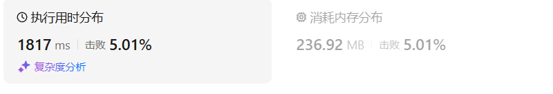

# 37解数独（困难）

[37. 解数独 - 力扣（LeetCode）](https://leetcode.cn/problems/sudoku-solver/description/)

## 题目描述

编写一个程序，通过填充空格来解决数独问题。

数独的解法需 **遵循如下规则**：

1. 数字 `1-9` 在每一行只能出现一次。
2. 数字 `1-9` 在每一列只能出现一次。
3. 数字 `1-9` 在每一个以粗实线分隔的 `3x3` 宫内只能出现一次。（请参考示例图）

数独部分空格内已填入了数字，空白格用 `'.'` 表示。

 

**示例 1：**


```
输入：board = [["5","3",".",".","7",".",".",".","."],["6",".",".","1","9","5",".",".","."],[".","9","8",".",".",".",".","6","."],["8",".",".",".","6",".",".",".","3"],["4",".",".","8",".","3",".",".","1"],["7",".",".",".","2",".",".",".","6"],[".","6",".",".",".",".","2","8","."],[".",".",".","4","1","9",".",".","5"],[".",".",".",".","8",".",".","7","9"]]
输出：[["5","3","4","6","7","8","9","1","2"],["6","7","2","1","9","5","3","4","8"],["1","9","8","3","4","2","5","6","7"],["8","5","9","7","6","1","4","2","3"],["4","2","6","8","5","3","7","9","1"],["7","1","3","9","2","4","8","5","6"],["9","6","1","5","3","7","2","8","4"],["2","8","7","4","1","9","6","3","5"],["3","4","5","2","8","6","1","7","9"]]
解释：输入的数独如上图所示，唯一有效的解决方案如下所示：
```

 

**提示：**

- `board.length == 9`
- `board[i].length == 9`
- `board[i][j]` 是一位数字或者 `'.'`
- 题目数据 **保证** 输入数独仅有一个解

## 我的C++解法

主要在于删除重复元素

```cpp
class Solution {
private:
    bool backtrack(vector<vector<char>>& board, int row,int exact_col){
        vector<char> last = board[8];
        if(row==8 && find(last.begin(),last.end(),'.')==last.end()){
            return true;
        }
        for(int col=exact_col;col<9;col++){
            if(board[row][col]!='.')  continue;
            // 找到了需要填写数字的位置
            vector<int> cur_valid = isValid(board,row,col);
            if(cur_valid.size()==0){
            //     if(find(board[row].begin(),board[row].end(),'.')==board[row].end()){
            //         board[row][col] = +'0'
            //         // row行已经正确填写完毕
            //         return backtrack(board,row+1);
            //     }
                return false;
            }
            for(int x:cur_valid){
                board[row][col] = x+'0';
                if(backtrack(board,row,col+1))    return true;
                board[row][col] = '.';
            }
        }
        if(find(board[row].begin(),board[row].end(),'.')==board[row].end()){
            return backtrack(board,row+1,0);
        }
        return false;
    }
    vector<int> isValid(vector<vector<char>>& board,int row,int col){
        // 返回第row行col列的可填入数字组合
        vector<int> cur_valid;
        vector<char> cur_row = board[row];
        vector<char> cur_col;
        for(int i=0;i<9;i++){
            cur_col.push_back(board[i][col]);
        }
        vector<char> cur_squ;
        // 行数除以3得到的商相同表示在一个square中
        // 列数除以3得到的商相同表示在一个square中
        int square_row = row/3;
        int square_col = col/3;
        for(int i=0;i<3;i++){
            for(int j=0;j<3;j++){
                cur_squ.push_back(board[i+square_row*3][j+square_col*3]);
            }
        }
        for(int i=1;i<10;i++){
            // 1到9，逐个判断
            // 先判断同行元素
            if(find(cur_row.begin(),cur_row.end(),i+'0')!=cur_row.end()) continue;
            // 判断同列元素
            if(find(cur_col.begin(),cur_col.end(),i+'0')!=cur_col.end()) continue;
            // 判断同正方形
            if(find(cur_squ.begin(),cur_squ.end(),i+'0')!=cur_squ.end()) continue;
            cur_valid.push_back(i);
        }
        return cur_valid;
    }

public:
    void solveSudoku(vector<vector<char>>& board) {
        backtrack(board,0,0);
        return;
    }
};
```

在编写的时候，求cur_squ数组弄错了，push_back的时候参数里面都忘记了乘以3，这就导致数组求错了，导致运行不出来

结果：



## C++参考答案

这次要做的是**二维递归**。

- 递归函数以及参数

**递归函数的返回值需要是bool类型**因为解数独找到一个符合的条件（就在树的叶子节点上）立刻就返回，相当于找从根节点到叶子节点一条唯一路径，所以需要使用bool返回值。

- 递归终止条件

本题递归不用终止条件，解数独是要遍历整个树形结构寻找可能的叶子节点就立刻返回。

**不用终止条件会不会死循环？**

递归的下一层的棋盘一定比上一层的棋盘多一个数，等数填满了棋盘自然就终止（填满当然好了，说明找到结果了），所以不需要终止条件！

- 递归单层搜索逻辑


在树形图中可以看出我们需要的是一个二维的递归 （一行一列）**一个for循环遍历棋盘的行，一个for循环遍历棋盘的列，一行一列确定下来之后，递归遍历这个位置放9个数字的可能性！**

```cpp
bool backtracking(vector<vector<char>>& board) {
    for (int i = 0; i < board.size(); i++) {        // 遍历行
        for (int j = 0; j < board[0].size(); j++) { // 遍历列
            if (board[i][j] != '.') continue;
            for (char k = '1'; k <= '9'; k++) {     // (i, j) 这个位置放k是否合适
                if (isValid(i, j, k, board)) {
                    board[i][j] = k;                // 放置k
                    if (backtracking(board)) return true; // 如果找到合适一组立刻返回
                    board[i][j] = '.';              // 回溯，撤销k
                }
            }
            return false;                           // 9个数都试完了，都不行，那么就返回false
        }
    }
    return true; // 遍历完没有返回false，说明找到了合适棋盘位置了
}
```

**注意这里return false的地方，这里放return false 是有讲究的**。

因为如果一行一列确定下来了，这里尝试了9个数都不行，说明这个棋盘找不到解决数独问题的解！

那么会直接返回， **这也就是为什么没有终止条件也不会永远填不满棋盘而无限递归下去**


判断棋盘是否合法有如下三个维度：

- 同行是否重复
- 同列是否重复
- 9宫格里是否重复

```cpp
bool isValid(int row, int col, char val, vector<vector<char>>& board) {
    for (int i = 0; i < 9; i++) { // 判断行里是否重复
        if (board[row][i] == val) {
            return false;
        }
    }
    for (int j = 0; j < 9; j++) { // 判断列里是否重复
        if (board[j][col] == val) {
            return false;
        }
    }
    int startRow = (row / 3) * 3;
    int startCol = (col / 3) * 3;
    for (int i = startRow; i < startRow + 3; i++) { // 判断9方格里是否重复
        for (int j = startCol; j < startCol + 3; j++) {
            if (board[i][j] == val ) {
                return false;
            }
        }
    }
    return true;
}
```

整体C++代码如下：

```cpp
class Solution {
private:
bool backtracking(vector<vector<char>>& board) {
    for (int i = 0; i < board.size(); i++) {        // 遍历行
        for (int j = 0; j < board[0].size(); j++) { // 遍历列
            if (board[i][j] == '.') {
                for (char k = '1'; k <= '9'; k++) {     // (i, j) 这个位置放k是否合适
                    if (isValid(i, j, k, board)) {
                        board[i][j] = k;                // 放置k
                        if (backtracking(board)) return true; // 如果找到合适一组立刻返回
                        board[i][j] = '.';              // 回溯，撤销k
                    }
                }
                return false;  // 9个数都试完了，都不行，那么就返回false
            }
        }
    }
    return true; // 遍历完没有返回false，说明找到了合适棋盘位置了
}
bool isValid(int row, int col, char val, vector<vector<char>>& board) {
    for (int i = 0; i < 9; i++) { // 判断行里是否重复
        if (board[row][i] == val) {
            return false;
        }
    }
    for (int j = 0; j < 9; j++) { // 判断列里是否重复
        if (board[j][col] == val) {
            return false;
        }
    }
    int startRow = (row / 3) * 3;
    int startCol = (col / 3) * 3;
    for (int i = startRow; i < startRow + 3; i++) { // 判断9方格里是否重复
        for (int j = startCol; j < startCol + 3; j++) {
            if (board[i][j] == val ) {
                return false;
            }
        }
    }
    return true;
}
public:
    void solveSudoku(vector<vector<char>>& board) {
        backtracking(board);
    }
};
```


## C++收获

二维回溯的一般过程，zhen'd
