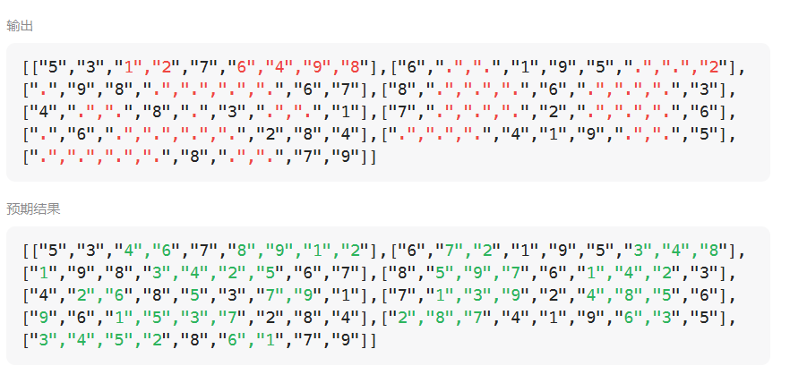

# 37解数独（困难）

[37. 解数独 - 力扣（LeetCode）](https://leetcode.cn/problems/sudoku-solver/description/)

## 题目描述

编写一个程序，通过填充空格来解决数独问题。

数独的解法需 **遵循如下规则**：

1. 数字 `1-9` 在每一行只能出现一次。
2. 数字 `1-9` 在每一列只能出现一次。
3. 数字 `1-9` 在每一个以粗实线分隔的 `3x3` 宫内只能出现一次。（请参考示例图）

数独部分空格内已填入了数字，空白格用 `'.'` 表示。

 

**示例 1：**


```
输入：board = [["5","3",".",".","7",".",".",".","."],["6",".",".","1","9","5",".",".","."],[".","9","8",".",".",".",".","6","."],["8",".",".",".","6",".",".",".","3"],["4",".",".","8",".","3",".",".","1"],["7",".",".",".","2",".",".",".","6"],[".","6",".",".",".",".","2","8","."],[".",".",".","4","1","9",".",".","5"],[".",".",".",".","8",".",".","7","9"]]
输出：[["5","3","4","6","7","8","9","1","2"],["6","7","2","1","9","5","3","4","8"],["1","9","8","3","4","2","5","6","7"],["8","5","9","7","6","1","4","2","3"],["4","2","6","8","5","3","7","9","1"],["7","1","3","9","2","4","8","5","6"],["9","6","1","5","3","7","2","8","4"],["2","8","7","4","1","9","6","3","5"],["3","4","5","2","8","6","1","7","9"]]
解释：输入的数独如上图所示，唯一有效的解决方案如下所示：
```

 

**提示：**

- `board.length == 9`
- `board[i].length == 9`
- `board[i][j]` 是一位数字或者 `'.'`
- 题目数据 **保证** 输入数独仅有一个解

## 我的C++解法

```cpp
class Solution {
private:
    bool backtrack(vector<vector<char>>& board,int startrow,int startcol){
        // 不用终止条件
        for(int row = startrow;row<9;row++){
            // 行循环
            for(int col = startcol;col<9;col++){
                // 列循环
                if(board[row][col]=='.'){
                    for(int fill=1;fill<10;fill++){
                        // 填入数字
                        if(isValid(board,fill,row,col)){
                            // 填入数字有效
                            board[row][col] = fill+'0';
                            if(backtrack(board,row,col))    return true;
                            board[row][col] = '.';
                        }
                    }
                    return false;
                }
            }
        }
        return true;
    }
    bool isValid(vector<vector<char>>& board,int num,int row,int col){
        for(int i=0;i<9;i++){
            if(board[i][col]==num+'0')  return false;
        }
        for(int i=0;i<9;i++){
            if(board[row][i]==num+'0')  return false;
        }
        int startrow = (row/3) *3;
        int startcol = (col/3) *3;
        for(int i=startrow;i<startrow+3;i++){
            for(int j=startcol;j<startcol+3;j++){
                if(board[i][j]==num+'0')    return false;
            }
        }
        return true;
    }


public:
    void solveSudoku(vector<vector<char>>& board) {
        backtrack(board,0,0);
        return;
    }
};
```

结果：



递归弄的有误，应该删去参数startrow和col

```cpp
class Solution {
private:
    bool backtrack(vector<vector<char>>& board){
        // 不用终止条件
        for(int row = 0;row<9;row++){
            // 行循环
            for(int col = 0;col<9;col++){
                // 列循环
                if(board[row][col]=='.'){
                    for(int fill=1;fill<10;fill++){
                        // 填入数字
                        if(isValid(board,fill,row,col)){
                            // 填入数字有效
                            board[row][col] = fill+'0';
                            if(backtrack(board))    return true;
                            board[row][col] = '.';
                        }
                    }
                    return false;
                }
            }
        }
        return true;
    }
    bool isValid(vector<vector<char>>& board,int num,int row,int col){
        for(int i=0;i<9;i++){
            if(board[i][col]==num+'0')  return false;
        }
        for(int i=0;i<9;i++){
            if(board[row][i]==num+'0')  return false;
        }
        int startrow = (row/3) *3;
        int startcol = (col/3) *3;
        for(int i=startrow;i<startrow+3;i++){
            for(int j=startcol;j<startcol+3;j++){
                if(board[i][j]==num+'0')    return false;
            }
        }
        return true;
    }


public:
    void solveSudoku(vector<vector<char>>& board) {
        backtrack(board);
        return;
    }
};
```

结果：


## C++参考答案


## C++收获


## 我的python解答

```python
class Solution:
    def solveSudoku(self, board: List[List[str]]) -> None:
        """
        Do not return anything, modify board in-place instead.
        """
        def isValid(k,row,col):
            for i in range(9):
                if board[i][col]==k or board[row][i]==k:
                    return False
            startrow = row//3 * 3
            startcol = col//3 *3
            for i in range(startrow,startrow+3):
                for j in range(startcol,startcol+3):
                    if board[i][j]==k:
                        return False
            return True

        def backtrack():
            for row in range(9):
                for col in range(9):
                    if board[row][col]=='.':
                        for k in ['1','2','3','4','5','6','7','8','9']:
                            if isValid(k,row,col):
                                board[row][col] = k
                                if backtrack(): return True
                                board[row][col] = '.'
                        return False
            return True
        
        backtrack()
```

结果：


## python参考答案

```python
class Solution:
    def solveSudoku(self, board: List[List[str]]) -> None:
        """
        Do not return anything, modify board in-place instead.
        """
        self.backtracking(board)

    def backtracking(self, board: List[List[str]]) -> bool:
        # 若有解，返回True；若无解，返回False
        for i in range(len(board)): # 遍历行
            for j in range(len(board[0])):  # 遍历列
                # 若空格内已有数字，跳过
                if board[i][j] != '.': continue
                for k in range(1, 10):
                    if self.is_valid(i, j, k, board):
                        board[i][j] = str(k)
                        if self.backtracking(board): return True
                        board[i][j] = '.'
                # 若数字1-9都不能成功填入空格，返回False无解
                return False
        return True # 有解

    def is_valid(self, row: int, col: int, val: int, board: List[List[str]]) -> bool:
        # 判断同一行是否冲突
        for i in range(9):
            if board[row][i] == str(val):
                return False
        # 判断同一列是否冲突
        for j in range(9):
            if board[j][col] == str(val):
                return False
        # 判断同一九宫格是否有冲突
        start_row = (row // 3) * 3
        start_col = (col // 3) * 3
        for i in range(start_row, start_row + 3):
            for j in range(start_col, start_col + 3):
                if board[i][j] == str(val):
                    return False
        return True
```


数据结构采用set则可以大大加快效率

```python
    def solveSudoku(self, board: List[List[str]]) -> None:
        row = [set(range(1, 10)) for _ in range(9)]  # 行剩余可用数字
        col = [set(range(1, 10)) for _ in range(9)]  # 列剩余可用数字
        block = [set(range(1, 10)) for _ in range(9)]  # 块剩余可用数字

        empty = []  # 收集需填数位置
        for i in range(9):
            for j in range(9):
                if board[i][j] != '.':  # 更新可用数字
                    val = int(board[i][j])
                    row[i].remove(val)
                    col[j].remove(val)
                    block[(i // 3)*3 + j // 3].remove(val)
                else:
                    empty.append((i, j))

        def backtrack(iter=0):
            if iter == len(empty):  # 处理完empty代表找到了答案
                return True
            i, j = empty[iter]
            b = (i // 3)*3 + j // 3
            for val in row[i] & col[j] & block[b]:
                row[i].remove(val)
                col[j].remove(val)
                block[b].remove(val)
                board[i][j] = str(val)
                if backtrack(iter+1):
                    return True
                row[i].add(val)  # 回溯
                col[j].add(val)
                block[b].add(val)
            return False
        backtrack()
```


## python收获