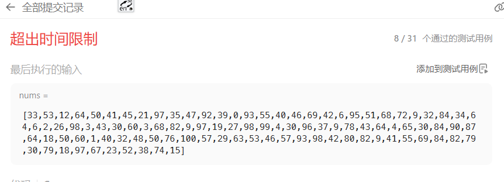
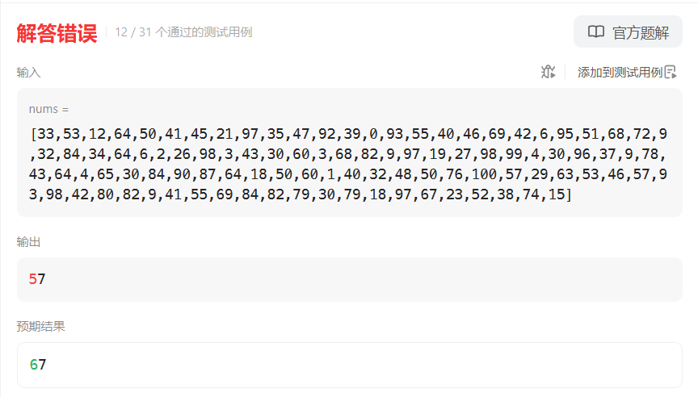
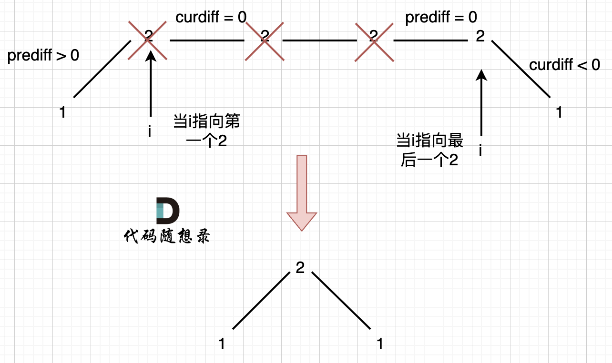

# 376摆动序列（中等）

[376. 摆动序列 - 力扣（LeetCode）](https://leetcode.cn/problems/wiggle-subsequence/description/)

## 题目描述

如果连续数字之间的差严格地在正数和负数之间交替，则数字序列称为 **摆动序列 。**第一个差（如果存在的话）可能是正数或负数。仅有一个元素或者含两个不等元素的序列也视作摆动序列。

- 例如， `[1, 7, 4, 9, 2, 5]` 是一个 **摆动序列** ，因为差值 `(6, -3, 5, -7, 3)` 是正负交替出现的。
- 相反，`[1, 4, 7, 2, 5]` 和 `[1, 7, 4, 5, 5]` 不是摆动序列，第一个序列是因为它的前两个差值都是正数，第二个序列是因为它的最后一个差值为零。

**子序列** 可以通过从原始序列中删除一些（也可以不删除）元素来获得，剩下的元素保持其原始顺序。

给你一个整数数组 `nums` ，返回 `nums` 中作为 **摆动序列** 的 **最长子序列的长度** 。

 

**示例 1：**

```
输入：nums = [1,7,4,9,2,5]
输出：6
解释：整个序列均为摆动序列，各元素之间的差值为 (6, -3, 5, -7, 3) 。
```

**示例 2：**

```
输入：nums = [1,17,5,10,13,15,10,5,16,8]
输出：7
解释：这个序列包含几个长度为 7 摆动序列。
其中一个是 [1, 17, 10, 13, 10, 16, 8] ，各元素之间的差值为 (16, -7, 3, -3, 6, -8) 。
```

**示例 3：**

```
输入：nums = [1,2,3,4,5,6,7,8,9]
输出：2
```

 

**提示：**

- `1 <= nums.length <= 1000`
- `0 <= nums[i] <= 1000`

 

**进阶：**你能否用 `O(n)` 时间复杂度完成此题?

## 我的C++解法

第一想法就是暴力遍历，使用回溯算法

```cpp
class Solution {
private:
    int ans;
    int count;
    void backtrack(vector<int>& nums,int startIndex,bool judge){
        // judge为1 表示下一个需要更大的数
        ans = max(ans,count);
        for(int i=startIndex;i<nums.size();i++){
            for(int j=i+1;j<nums.size();j++){
                if(judge){
                    if(nums[i]<nums[j]){
                        count += 1;
                        backtrack(nums,j,false);
                        count -= 1;
                    }
                }
                else{
                    if(nums[i]>nums[j]){
                        count += 1;
                        backtrack(nums,j,true);
                        count -= 1;
                    }
                }

            }
        }
        return;
    }

public:
    int wiggleMaxLength(vector<int>& nums) {
        //交替就是要求先看初始数字，如果第二个大于第一个，那么第三个应该小于第二个
        // 感觉用回溯可做，但是时间花费有点高了 o(n^2)
        // 能否进行拆分？
        ans=1;
        count=1;
        backtrack(nums,0,true);
        backtrack(nums,0,false);
        return ans;
    }
};
```

结果超时了：



想到了这东西肯定是从0号元素开始的

```cpp
class Solution {
public:
    int wiggleMaxLength(vector<int>& nums) {
        int ans = 1;
        int count = 1;
        int pre = nums[0];
        bool flag = true;// 下一个要更大
        for(int i=1;i<nums.size();i++){
            if(flag && nums[i]>pre){
                count++;
                flag = false;
                pre = nums[i];
            }
            else if(!flag && nums[i]<pre){
                count++;
                flag = true;
                pre = nums[i];
            }
        }
        ans = max(ans,count);
        pre = nums[0];
        count = 1;
        flag = false;
        for(int i=1;i<nums.size();i++){
            if(flag && nums[i]>pre){
                count++;
                flag = false;
            }
            else if(!flag && nums[i]<pre){
                count++;
                flag = true;
            }
        }
        ans = max(ans,count);
        return ans;
    }
};
```

结果错误：



现在又想到一个思路就是：把连续降的数合并为一个最小的数，连续增的数合并为最大的数，最后计算nums的长度

```cpp
class Solution {
public:
    int wiggleMaxLength(vector<int>& nums) {
        if(nums.size()<=1)  return nums.size();
        vector<int> del;
        del.push_back(nums[0]);
        int start=1;
        for(int i=1;i<nums.size();i++){
            if(nums[i]!=nums[0]){
                start = i;
                break;
            }
        }
        if(nums[start]!=nums[0])    del.push_back(nums[start]);
        bool cur_flag = nums[start]-nums[0]>0;// true表示当前是递增，需要下一个小元素进来
        bool want_flag = !cur_flag;
        for(int i=start+1;i<nums.size();i++){
            int last = del.back();// 末尾元素
            if(nums[i]-last>0){
                cur_flag = true;
            }
            else if(nums[i]-last<0) cur_flag=false;
            if(cur_flag == want_flag){
                del.push_back(nums[i]);
                want_flag = !want_flag;
            }
            else{
                del.pop_back();
                del.push_back(nums[i]);
            }
        }
        return del.size();
    }
};
```

结果：


## C++参考答案

来分析一下，要求删除元素使其达到最大摆动序列，应该删除什么元素呢？

用示例二来举例，如图所示：


**局部最优：删除单调坡度上的节点（不包括单调坡度两端的节点），那么这个坡度就可以有两个局部峰值**。

**整体最优：整个序列有最多的局部峰值，从而达到最长摆动序列**。

局部最优推出全局最优，并举不出反例，那么试试贪心！

（为方便表述，以下说的峰值都是指局部峰值）

**实际操作上，其实连删除的操作都不用做，因为题目要求的是最长摆动子序列的长度，所以只需要统计数组的峰值数量就可以了（相当于是删除单一坡度上的节点，然后统计长度）**

**这就是贪心所贪的地方，让峰值尽可能的保持峰值，然后删除单一坡度上的节点**

在计算是否有峰值的时候，大家知道遍历的下标 i ，计算 prediff（nums[i] - nums[i-1]） 和 curdiff（nums[i+1] - nums[i]），如果`prediff < 0 && curdiff > 0` 或者 `prediff > 0 && curdiff < 0` 此时就有波动就需要统计。

这是我们思考本题的一个大体思路，但本题要考虑三种情况：

1. 情况一：上下坡中有平坡
2. 情况二：数组首尾两端
3. 情况三：单调坡中有平坡




```cpp
class Solution {
public:
    int wiggleMaxLength(vector<int>& nums) {
        if (nums.size() <= 1) return nums.size();
        int curDiff = 0; // 当前一对差值
        int preDiff = 0; // 前一对差值
        int result = 1;  // 记录峰值个数，序列默认序列最右边有一个峰值
        for (int i = 0; i < nums.size() - 1; i++) {
            curDiff = nums[i + 1] - nums[i];
            // 出现峰值
            if ((preDiff <= 0 && curDiff > 0) || (preDiff >= 0 && curDiff < 0)) {
                result++;
                preDiff = curDiff; // 注意这里，只在摆动变化的时候更新prediff
            }
        }
        return result;
    }
};
```

其实本题看起来好像简单，但需要考虑的情况还是很复杂的，而且很难一次性想到位。**本题异常情况的本质，就是要考虑平坡**， 平坡分两种，一个是 上下中间有平坡，一个是单调有平坡


## C++收获


