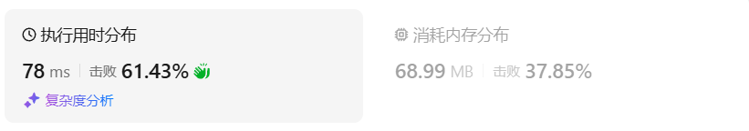
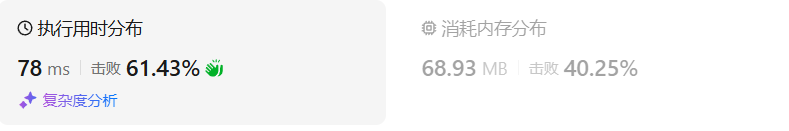
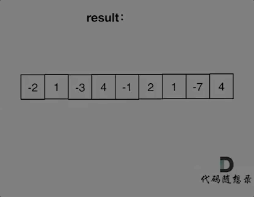
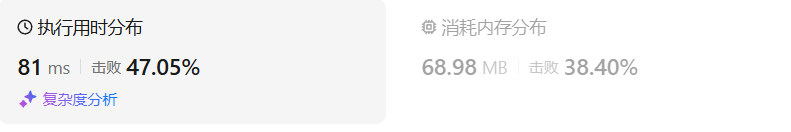
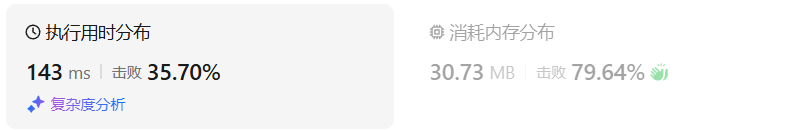
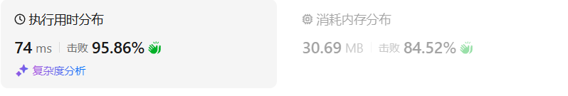

# 53最大子数组和（中等）

[53. 最大子数组和 - 力扣（LeetCode）](https://leetcode.cn/problems/maximum-subarray/description/)

## 题目描述

给你一个整数数组 `nums` ，请你找出一个具有最大和的连续子数组（子数组最少包含一个元素），返回其最大和。


**子数组**

是数组中的一个连续部分。


 

**示例 1：**

```
输入：nums = [-2,1,-3,4,-1,2,1,-5,4]
输出：6
解释：连续子数组 [4,-1,2,1] 的和最大，为 6 。
```

**示例 2：**

```
输入：nums = [1]
输出：1
```

**示例 3：**

```
输入：nums = [5,4,-1,7,8]
输出：23
```

 

**提示：**

- `1 <= nums.length <= 105`
- `-104 <= nums[i] <= 104`

 

**进阶：**如果你已经实现复杂度为 `O(n)` 的解法，尝试使用更为精妙的 **分治法** 求解。

## 我的C++解法

必须是非负数打头阵（A出来后想到：其实正数打头阵才对），起始位置定义为当前元素。然后维护一个sum和一个cur_sum，cur_sum用来记录从起始位置开始的逐个求和，如果cur_sum直接小于0（A出来后想到：其实小于等于0也可以，因为并不是要返回最大的子串个数），则从当前位置之后的元素中寻找第一个非负数，重复上述过程，期间sum一直取max(sum,nums[i],cur_sum)即可，最后返回sum

```cpp
class Solution {
public:
    int maxSubArray(vector<int>& nums) {
        // 肯定是非负数打头阵
        if(nums.size()==1)  return nums[0];
        int start=1;
        int max = INT_MIN;
        for(int i=0;i<nums.size();i++){
            max>nums[i]? max=max:max=nums[i];
            if(nums[i]>=0){
                start = i;
                break;
            }
        }
        if(max<0)   return max;
        // 找到了第一个非负数
        int sum = nums[start];
        int cur_sum = sum;
        for(int i=start+1;i<nums.size();++i){
            cur_sum += nums[i];
            sum>cur_sum?sum=sum:sum=cur_sum;
            if(cur_sum<0){
                max = INT_MIN;
                for(int j=i+1;j<nums.size();j++){
                    // 找新的非负数
                    max>nums[j]?max = max:max = nums[j];
                    if(nums[j]>=0){
                        start = j;
                        cur_sum = nums[j];
                        break;
                    }
                }
                max>=0? i = start:i=nums.size();
                sum>max? sum=sum:sum=max;
            }
        }
        return sum;
    }
};
```

结果：



```cpp
class Solution {
public:
    int maxSubArray(vector<int>& nums) {
        // 正数打头阵
        if(nums.size()==1)  return nums[0];
        int start=1;
        int max = INT_MIN;
        for(int i=0;i<nums.size();i++){
            max>nums[i]? max=max:max=nums[i];
            if(nums[i]>0){
                start = i;
                break;
            }
        }
        if(max<=0)   return max;
        // 找到了第一个正数
        int sum = nums[start];
        int cur_sum = sum;
        for(int i=start+1;i<nums.size();++i){
            cur_sum += nums[i];
            sum>cur_sum?sum=sum:sum=cur_sum;
            if(cur_sum<0){
                max = INT_MIN;
                for(int j=i+1;j<nums.size();j++){
                    // 找新的非负数
                    max>nums[j]?max = max:max = nums[j];
                    if(nums[j]>0){
                        start = j;
                        cur_sum = nums[j];
                        break;
                    }
                }
                max>0? i = start:i=nums.size();
                sum>max? sum=sum:sum=max;
            }
        }
        return sum;
    }
};
```

结果：



## C++参考答案



红色的起始位置就是贪心每次取 count 为正数的时候，开始一个区间的统计。

```cpp
class Solution {
public:
    int maxSubArray(vector<int>& nums) {
        int result = INT32_MIN;
        int count = 0;
        for (int i = 0; i < nums.size(); i++) {
            count += nums[i];
            if (count > result) { // 取区间累计的最大值（相当于不断确定最大子序终止位置）
                result = count;
            }
            if (count <= 0) count = 0; // 相当于重置最大子序起始位置，因为遇到负数一定是拉低总和
        }
        return result;
    }
};
```

结果：



## C++收获


## 我的python解答

py不能再for循环中改变i的值，因此需要把for循环改为while循环

```python
class Solution:
    def maxSubArray(self, nums: List[int]) -> int:
        if len(nums)==1:    return nums[0]
        max_int = nums[0]
        positive = 0
        for i in range(len(nums)):
            max_int = max(max_int,nums[i])
            if nums[i]<=0:
                continue
            positive = i
            break
        if max_int<=0:  return max_int
        # 找到第一个正数了
        max_sum = nums[positive]
        cur_sum = max_sum
        i = positive+1
        while i<len(nums):
            cur_sum += nums[i]
            max_sum = max(max_sum,cur_sum,nums[i])
            if cur_sum<=0:
                # 需要寻找新的起点
                max_int = nums[i]
                for j in range(i+1,len(nums)):
                    max_int = max(max_int,nums[j])
                    if nums[j]>0:
                        i=j
                        cur_sum = nums[j]
                        max_sum = max(max_sum,cur_sum)
                        break
                if max_int<=0:  i=len(nums)
            i+=1
        return max_sum
```

结果：



## python参考答案

```python
class Solution:
    def maxSubArray(self, nums):
        result = float('-inf')  # 初始化结果为负无穷大
        count = 0
        for i in range(len(nums)):
            count += nums[i]
            if count > result:  # 取区间累计的最大值（相当于不断确定最大子序终止位置）
                result = count
            if count <= 0:  # 相当于重置最大子序起始位置，因为遇到负数一定是拉低总和
                count = 0
        return result
```

结果：



## python收获